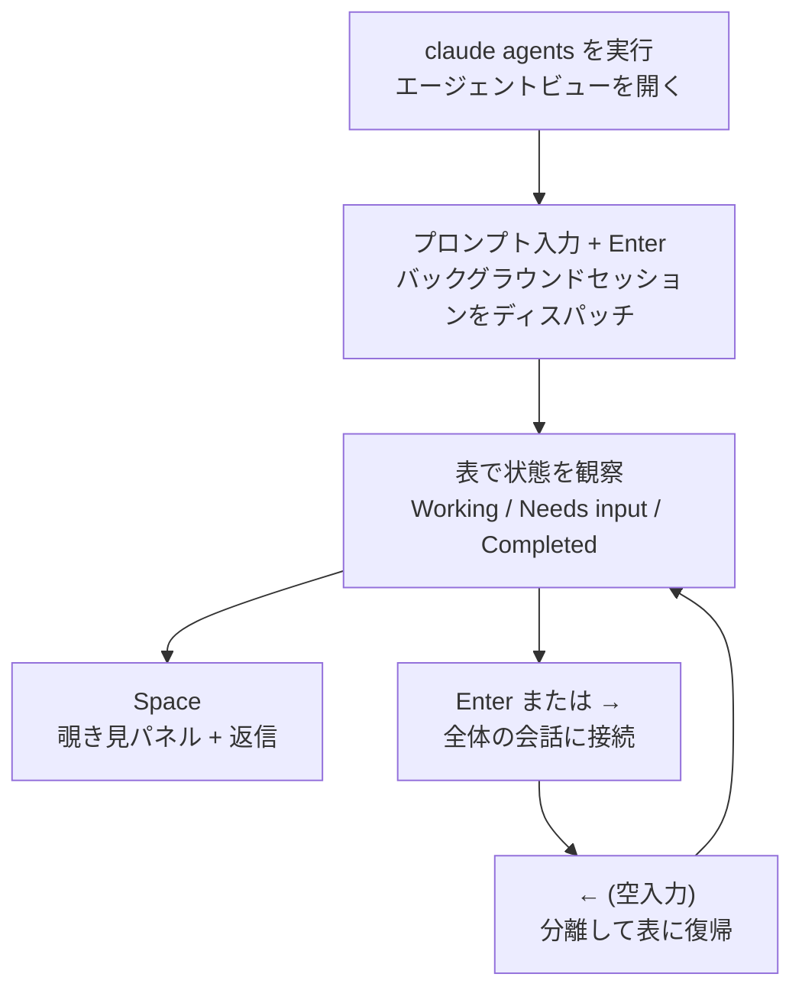

`claude agents` コマンドで開くエージェントビュー (agent view) は、複数の Claude Code セッションを 1 つの画面からディスパッチして観察し、手が必要なセッションにだけ介入できる単一の管制画面です。


**ひとことで言うと**: トランスクリプトを 1 つずつスクロールする代わりに、実行中・待機中・完了したすべてのバックグラウンドセッションを 1 つの表で見て、必要な瞬間にだけ介入します。


## エージェントビューとは

エージェントビューは、ターミナルに縛られず動き続ける **バックグラウンドセッション (background session)** を 1 つの画面で管理するインターフェースです。各バックグラウンドセッションはそれ自体が完全な Claude Code の会話であり、ターミナルを閉じても別の監督プロセスが実行を続けてくれます。そのため、バグ修正・PR レビュー・フレーキーテストの調査をそれぞれ 1 行 (row) として投げておき、別の作業をしながら、ある行が入力を待っていたり結果を出したりしたときに戻ってくればよいのです。

> エージェントビューはリサーチプレビュー (research preview) 段階で、Claude Code v2.1.139 以上で動作します。`claude --version` でバージョンを確認してください。インターフェースとショートカットは機能の進化に伴って変わる可能性があります。

並列実行の手段との位置づけを整理すると、次のとおりです。

| 手段 | 特徴 | 適した状況 |
| :--- | :--- | :--- |
| エージェントビュー | 独立した複数のフルセッションを 1 つの表でディスパッチ・観察 | 互いに無関係な複数の作業を並列で回し、結果だけ回収する |
| サブエージェント | 1 つのセッション内で呼び出される補助作業者 | 単一の作業を下位ステップに分解する |
| エージェントチーム | 互いにメッセージをやり取りする複数セッションの協働 | 調整が必要な協働作業 |
| ワークツリー | ファイル編集を隔離する git 作業空間 | 同じチェックアウトで衝突なく並列編集する |

## 何を表示するか

エージェントビューを開くと、ターミナル全体を占有しながらすべてのセッションを状態別のグループで列挙します。入力を待っているセッションと固定 (pin) したセッションが最上部に上がり、各行はセッション名、現在のアクティビティ、最後の変更からの経過時間を表示します。

```text
Needs input
  ✻ power-up design     needs input: double jump or wall climb?     1m

Working
  ✽ collision detection Edit src/physics/CollisionSystem.ts          2m
  ✢ playtest level 3    run 12 · all checkpoints cleared          in 4m

Completed
  ✻ title screen        result: menu, options, and credits done      9m
  ∙ sound effects       result: 14 SFX exported to assets/audio       4h
```

### 進行状況とセッション状態

各行の先頭のアイコンは、色とアニメーションでセッションの状態を表します。

| 状態 | アイコン表示 | 意味 |
| :--- | :--- | :--- |
| Working | アニメーション | Claude がツールを実行中、または応答を生成中 |
| Needs input | 黄色 | 特定の質問や権限の判断をユーザーに待っている |
| Idle | 薄い表示 | やることがなく、次のプロンプトを待っている |
| Completed | 緑色 | 作業が正常に終了した |
| Failed | 赤色 | 作業がエラーで終了した |
| Stopped | グレー | `Ctrl+X` または `claude stop` で停止された |

別途、アイコンの **形** は内部プロセスが生きているかどうかを表します。`✻`（またはアニメーションの `✽`）はプロセスが生きていて即座に応答し、`∙` はプロセスが終了した状態（依然として覗いたり返信・接続したりでき、Claude が中断地点から再開）、`✢` は `/loop` セッションが反復の合間に待機中であることを意味します。

各行の一行要約は Haiku 系列のモデルが生成するため、トランスクリプトを開かなくてもセッションが何をしているか・何を求めているか・何を作ったかが分かります。作業中のセッションは最大 15 秒に 1 回、そしてターンが終わるたびに要約を更新します。

### バックグラウンド作業と PR 状態

セッションが PR を開くと行の右端に `PR #1234` のようなラベルが付き、ハイパーリンクをサポートするターミナルではリンクになります。PR 番号は状態に応じて色が異なります。

| 色 | PR 状態 |
| :--- | :--- |
| 黄色 | チェック/レビュー待ち、またはチェック失敗 |
| 緑色 | チェック通過 + ブロックするレビューなし |
| 紫色 | マージ済み |
| グレー | ドラフトまたはクローズ |

ほとんどの作業では、この列が結果を回収する地点になります。PR 番号が緑色に変われば、レビューしてマージすればよいのです。また `! pytest -x` のように入力の前に `!` を付けてシェルコマンドをバックグラウンド作業としてディスパッチすることもでき、この場合はモデルを呼び出さずにコマンドだけが 1 行で実行され、最近の出力行が状態として表示されます。

### サブエージェント出力

セッションが立ち上げた **サブエージェント** や **エージェントチーム** のメンバーは、別々の行として列挙されません。その成果物と進行は親セッションの行の要約と出力に統合されて表示されます。詳細を見るには、該当のセッションを覗くか接続して全体の会話で確認します。

## 利用シナリオ

エージェントビューは、ユーザーが各ステップを見守らなくても Claude が進められる、互いに独立した作業が複数あるときに役立ちます。

- **長時間作業のモニタリング**: フレーキーテストの調査のように時間のかかる作業を投げておき、別のウィンドウで作業しながら、行が入力必要や結果の状態に変わったら戻ってきます。バックグラウンドセッションはターミナルやシェルを閉じても監督プロセスのおかげで動き続けます。
- **並列作業の追跡**: バグ修正・PR レビュー・テスト調査を 3 行で同時にディスパッチし、状態を一目で比較します。ファイル編集はセッションごとに `.claude/worktrees/` 配下の隔離された **ワークツリー** に分離され、同じチェックアウトを読みつつそれぞれ別に書き込みます。
- **複数プロジェクトの一画面管理**: デフォルトでは、すべてのプロジェクトのバックグラウンドセッションが 1 つの表に表示されます。1 つのプロジェクトに絞るには `claude agents --cwd ~/projects/my-app` のようにディレクトリを指定します。

各セッションはサブスクリプションの使用量を独立して消費します。つまりエージェント 10 個を並列で回すと割り当てがおよそ 10 倍速く減るため、一度に多くディスパッチする前に使用量の上限を念頭に置いてください。

## アクセスと操作方法

基本の流れはディスパッチ → 観察 → 覗いて返信 → 接続の循環です。



### ディスパッチする方法

新しいバックグラウンドセッションは 3 つの経路で開始します。

```bash
# 1) エージェントビューを開き、下部の入力欄にプロンプトを入力してから Enter
claude agents

# 2) シェルからそのままバックグラウンドで開始
claude --bg "investigate the flaky SettingsChangeDetector test"

# 3) 特定のサブエージェントをメインエージェントとして指定
claude --agent code-reviewer --bg "address review comments on PR 1234"
```

エージェントビューの入力欄に入れるプロンプトは毎回新しいセッションを開始します（既存のセッションに続けて送るのではありません）。進行中の会話をバックグラウンドに送るには、セッション内で `/background` または別名 `/bg` を実行するか、空入力で `←` を押します。

### 覗き見と接続

| 動作 | キー | 効果 |
| :--- | :--- | :--- |
| 覗き見 | `Space` | 選択した行の最近の出力や待機中の質問をパネルで表示。パネルで返信を入力後 `Enter` で送信 |
| 接続 | `Enter` または `→` | 全体の会話に入る。`claude` を直接実行したのと同じように動作 |
| 分離 | `←` (空入力) | セッションをそのまま残して表に復帰。ダイアログが妨げる場合は `Ctrl+Z` |

接続は決してセッションを止めません。セッションを中から完全に終了するには `/stop` を実行します。

### 主なショートカット

`?` を押すと全ショートカットを画面で確認できます。よく使う項目だけ整理すると次のとおりです。

| ショートカット | 動作 |
| :--- | :--- |
| `↑` / `↓` | 行の移動 |
| `Enter` | 選択セッションに接続（入力にテキストがあればディスパッチ） |
| `Space` | 覗き見パネルを開く/閉じる |
| `Shift+Enter` | ディスパッチして即座に接続 |
| `Ctrl+S` | グループ基準を状態/ディレクトリの間で切り替え |
| `Ctrl+T` | 選択セッションを固定/解除（アイドル時もプロセスを維持） |
| `Ctrl+R` | セッション名を変更 |
| `Ctrl+X` | セッション停止。2 秒以内にもう一度押すと削除 |
| `Esc` | パネルを閉じる、入力をクリア、または終了 |

> Claude がセッションのために作成したワークツリーは、`Ctrl+X` 2 回で削除するときに一緒に除去され、コミットしていない変更も消えます。保存するには先にプッシュまたはコミットしてください。

### シェルから管理

エージェントビューを開かずに短い ID で直接扱うこともできます。

```bash
claude agents --json        # ライブセッションを JSON 配列で出力
claude attach <id>          # このターミナルでセッションに接続
claude logs <id>            # セッションの最近の出力を表示
claude stop <id>            # セッションを停止
claude respawn <id>         # 会話を維持したままセッションを再起動
```

### オフにする方法

エージェントビューとバックグラウンドエージェントを完全に無効化するには、`disableAgentView` 設定を `true` にするか、`CLAUDE_CODE_DISABLE_AGENT_VIEW` 環境変数を設定します。設定は `settings.json` に入れることができます。

```json
{
  "worktree": {
    "bgIsolation": "none"
  }
}
```

上記の `worktree.bgIsolation` を `"none"` にすると、バックグラウンドセッションがワークツリーに移動せず作業コピーを直接編集します（v2.1.143 以上）。

## 関連ドキュメント

- [サブエージェント](/claude-code/agentic/sub-agents)
- [エージェントチーム](/claude-code/agentic/agent-teams)

## 参考資料

- [Manage multiple agents with agent view (Claude Code Docs)](https://code.claude.com/docs/en/agent-view)


時間のかかるセッションを応答性のある状態に保つには、`Ctrl+T` で固定してください。固定していないセッションは終了後およそ 1 時間手を付けないと、監督プロセスがリソース確保のためにプロセスを停止し、再接続するときにワンテンポ遅れて起き上がります。

