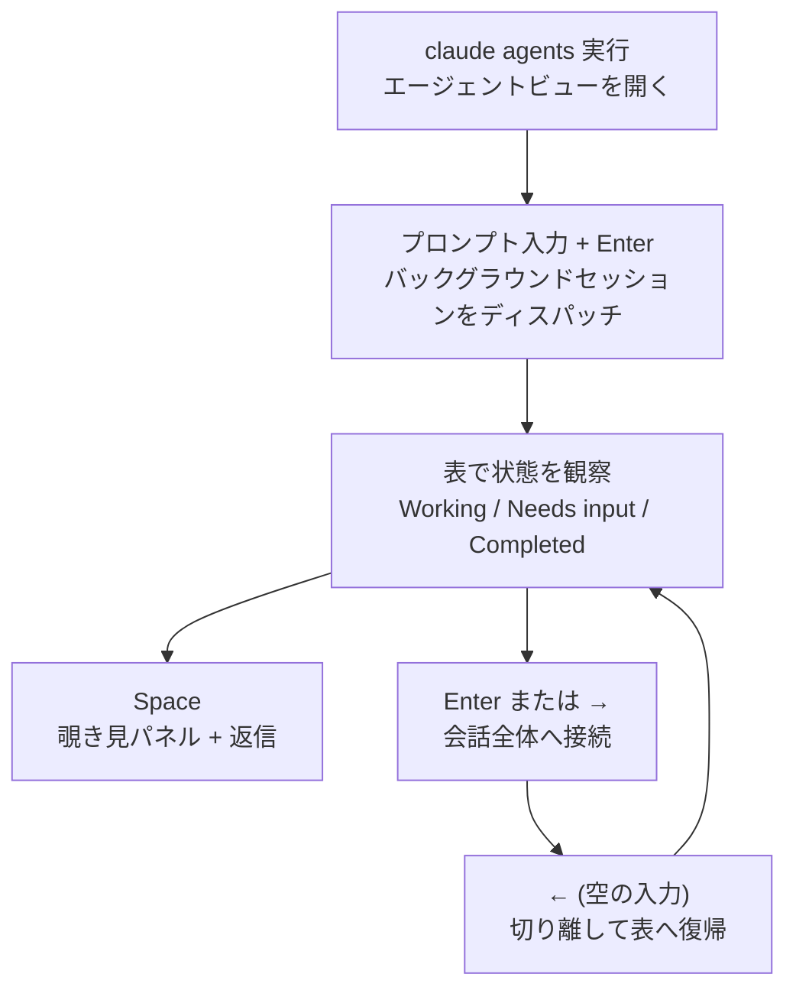

`claude agents` コマンドで開くエージェントビュー (agent view) は、複数の Claude Code セッションを 1 画面でディスパッチ・観察し、手が必要なセッションにだけ介入できる単一の管制画面です。


**ひとことで言うと**: トランスクリプトをいちいちスクロールする代わりに、実行中・待機中・完了済みのすべてのバックグラウンドセッションを 1 つの表で見て、必要な瞬間にだけ割り込みます。


## エージェントビューとは

エージェントビューは、ターミナルに縛られず回り続ける **バックグラウンドセッション** (background session) 群を 1 画面で管理するインターフェースです。各バックグラウンドセッションはそれ自体が完全な Claude Code の会話であり、ターミナルを閉じても別の監督プロセスが実行を続けてくれます。したがってバグ修正、PR レビュー、フレーキーテストの調査をそれぞれ 1 行 (row) として投げておき、他の作業をしながら、どれかの行が入力を待っていたり結果を出したりしたときに戻ればよいのです。

> エージェントビューはリサーチプレビュー (research preview) 段階で、Claude Code v2.1.139 以上で動作します。`claude --version` でバージョンを確認してください。インターフェースとショートカットは機能の進化に伴い変わる可能性があります。

並列実行の手段との位置づけを整理すると次のとおりです。

| 手段 | 特徴 | 適した状況 |
| :--- | :--- | :--- |
| エージェントビュー | 独立した複数のフルセッションを 1 つの表でディスパッチ・観察 | 互いに無関係な複数の作業を並行させ結果だけ回収 |
| サブエージェント | 1 セッション内で呼び出される補助ワーカー | 単一の作業を下位段階へ分解 |
| エージェントチーム | 互いにメッセージをやり取りする多セッション協働 | 調律が必要な協働作業 |
| ワークツリー | ファイル編集を分離する git 作業空間 | 同じチェックアウトで衝突なく並行編集 |

## 何を見せてくれるか

エージェントビューを開くと、ターミナル全体を占めながらすべてのセッションを状態別グループで一覧表示します。入力を待つセッションとピン留め (pin) したセッションが最上部に上がり、各行はセッション名、現在のアクティビティ、最終変更からの経過時間を表示します。

```text
Needs input
  ✻ power-up design     needs input: double jump or wall climb?     1m

Working
  ✽ collision detection Edit src/physics/CollisionSystem.ts          2m
  ✢ playtest level 3    run 12 · all checkpoints cleared          in 4m

Completed
  ✻ title screen        result: menu, options, and credits done      9m
  ∙ sound effects       result: 14 SFX exported to assets/audio       4h
```

### 進行状況とセッション状態

各行の先頭アイコンは、色とアニメーションでセッション状態を表します。

| 状態 | アイコン表示 | 意味 |
| :--- | :--- | :--- |
| Working | アニメーション | Claude がツールを実行中、または応答を生成中 |
| Needs input | 黄色 | 特定の質問や権限の決定をユーザーに待っている |
| Idle | 薄く表示 | やることがなく次のプロンプトを待っている |
| Completed | 緑色 | 作業が正常に終了 |
| Failed | 赤色 | 作業がエラーで終了 |
| Stopped | 灰色 | `Ctrl+X` または `claude stop` で停止 |
| Needs attention | オレンジ色 | 停滞して確認が必要なセッション（例: しばらくストリームイベントなし）。上部に表示される (CC 2.1.196) |

別途、アイコンの **形** は内部プロセスが生きているかを表します。`✻` (またはアニメーションの `✽`) はプロセスが生きていて即座に応答し、`∙` はプロセスが終了した状態 (それでも覗いたり、返信・接続が可能で、Claude は中断地点から再開)、`✢` は `/loop` セッションが反復の合間に待機中であることを意味します。

各行の一行要約は Haiku 系のモデルが生成するため、トランスクリプトを開かなくてもセッションが何をしているか・何を求めているか・何を作ったかがわかります。作業中のセッションは最大 15 秒に 1 回、そしてターンが終わるたびに要約を更新します。

### バックグラウンドタスクと PR 状態

セッションが PR を開くと行の右端に `PR #1234` のようなラベルが付き、ハイパーリンク対応のターミナルではリンクになります。PR 番号は状態によって色が異なります。

| 色 | PR の状態 |
| :--- | :--- |
| 黄色 | チェック/レビュー待ち、またはチェック失敗 |
| 緑色 | チェック通過 + ブロックするレビューなし |
| 紫色 | マージ済み |
| 灰色 | ドラフトまたはクローズ |

大半の作業では、この列が結果を回収する地点になります。PR 番号が緑色に変わったら、レビューしてマージすればよいのです。また `! pytest -x` のように入力の先頭に `!` を付けてシェルコマンドをバックグラウンドタスクとしてディスパッチすることもでき、この場合はモデルを呼び出さずコマンドだけが 1 行で実行され、直近の出力行が状態として表示されます。

### サブエージェントの出力

セッションが立ち上げた **サブエージェント** や **エージェントチーム** のチームメイトは、別の行としては一覧に出ません。その成果物と進行は親セッションの行の要約と出力に統合されて見えます。詳細を見るには、そのセッションを覗くか接続して、会話全体で確認します。

## 使用シナリオ

エージェントビューは、ユーザーが各段階を見守らなくても Claude が進行できる、互いに独立した作業が複数あるときに役立ちます。

- **長時間作業のモニタリング**: フレーキーテストの調査のように時間のかかる作業を投げておき、別のウィンドウで働きながら、行が入力要求や結果の状態に変わったら戻ります。バックグラウンドセッションは、ターミナルやシェルを閉じても監督プロセスのおかげで回り続けます。
- **並行作業の追跡**: バグ修正・PR レビュー・テスト調査を 3 行として同時にディスパッチし、一目で状態を比較します。ファイル編集はセッションごとに `.claude/worktrees/` 配下の分離された **ワークツリー** で分けられ、同じチェックアウトを読みつつ各自別々に書き込みます。
- **複数プロジェクトの 1 画面管理**: デフォルトではすべてのプロジェクトのバックグラウンドセッションが 1 つの表に現れます。1 つのプロジェクトに絞るには `claude agents --cwd ~/projects/my-app` のようにディレクトリを指定します。

各セッションはサブスクリプションの使用量を独立して消費します。つまりエージェントを 10 個並行で回すと割り当てが約 10 倍速く減るため、一度に多くをディスパッチする前に使用量の上限を念頭に置いてください。並列化は、時間を買う代わりにトークンを支払う取引です — MoAI-ADK が並列ファンアウトを読み取り専用の調査・レビューに優先して使い、書き込み作業は逐次で回すのも、安全とともにこのコスト構造を踏まえた選択です。

## アクセスと操作方法

基本の流れは、ディスパッチ → 観察 → 覗いて返信 → 接続の循環です。


```mermaid
flowchart TD
    A["claude agents 実行<br/>エージェントビューを開く"] --> B["プロンプト入力 + Enter<br/>バックグラウンドセッションをディスパッチ"]
    B --> C["表で状態を観察<br/>Working / Needs input / Completed"]
    C --> D["Space<br/>覗き見パネル + 返信"]
    C --> E["Enter または →<br/>会話全体へ接続"]
    E --> F["← (空の入力)<br/>切り離して表へ復帰"]
    F --> C
```

### ディスパッチの方法

新しいバックグラウンドセッションは 3 つの経路で始められます。

```bash
# 1) エージェントビューを開き、下部の入力欄にプロンプトを入力して Enter
claude agents

# 2) シェルからそのままバックグラウンドで開始
claude --bg "investigate the flaky SettingsChangeDetector test"

# 3) 特定のサブエージェントをメインエージェントに指定
claude --agent code-reviewer --bg "address review comments on PR 1234"
```

エージェントビューの入力欄に入れるプロンプトは、毎回新しいセッションを開始します (既存のセッションへ続けて送るのではありません)。進行中の会話をバックグラウンドへ送るには、セッション内で `/background` または別名 `/bg` を実行するか、空の入力で `←` を押します。

### 覗き見と接続

| 動作 | キー | 効果 |
| :--- | :--- | :--- |
| 覗き見 | `Space` | 選択した行の直近の出力や待機中の質問をパネル表示。パネルで返信を入力し `Enter` で送信 |
| 接続 | `Enter` または `→` | 会話全体へ入る。`claude` を直接実行したのと同じように動作 |
| 切り離し | `←` (空の入力) | セッションはそのままに表へ復帰。ダイアログが妨げるときは `Ctrl+Z` |

接続は決してセッションを止めません。セッションを中から完全に終わらせるには `/stop` を実行します。

### 主なショートカット

`?` を押すと全ショートカットを画面で確認できます。よく使う項目だけ整理すると次のとおりです。

| ショートカット | 動作 |
| :--- | :--- |
| `↑` / `↓` | 行の移動 |
| `Enter` | 選択セッションへ接続 (入力にテキストがあればディスパッチ) |
| `Space` | 覗き見パネルの開閉 |
| `Shift+Enter` | ディスパッチして即座に接続 |
| `Ctrl+S` | グループ基準を状態/ディレクトリで切り替え |
| `Ctrl+T` | 選択セッションのピン留め/解除 (アイドル時もプロセスを維持) |
| `Ctrl+R` | セッション名の変更 |
| `Ctrl+X` | セッション停止。2 秒以内にもう一度押すと削除 |
| `Esc` | パネルを閉じる、入力をクリア、または終了 |

> Claude がセッションのために作ったワークツリーは、`Ctrl+X` 2 回で削除するときに一緒に取り除かれ、未コミットの変更も消えます。保存したければ先にプッシュまたはコミットしてください。

### シェルから管理

エージェントビューを開かずに、短い ID で直接扱うこともできます。

```bash
claude agents --json        # ライブセッションを JSON 配列で出力
claude attach <id>          # このターミナルでセッションに接続
claude logs <id>            # セッションの最近の出力を表示
claude stop <id>            # セッションを停止
claude respawn <id>         # 会話を維持したままセッションを再起動
```

### 無効化の方法

エージェントビューとバックグラウンドエージェントを完全に無効化するには、`disableAgentView` 設定を `true` にするか、`CLAUDE_CODE_DISABLE_AGENT_VIEW` 環境変数を設定します。`settings.json` に設定を入れられます。

```json
{
  "worktree": {
    "bgIsolation": "none"
  }
}
```

上の `worktree.bgIsolation` を `"none"` にすると、バックグラウンドセッションはワークツリーへ移動せず、作業コピーを直接編集します (v2.1.143 以上)。

## 関連ドキュメント

- [サブエージェント](/ja/claude-code/agentic/sub-agents)
- [エージェントチーム](/ja/claude-code/agentic/agent-teams)

## 参考資料

- [Manage multiple agents with agent view (Claude Code Docs)](https://code.claude.com/docs/en/agent-view)


時間のかかるセッションを応答性よく保つには、`Ctrl+T` でピン留めしてください。ピン留めしていないセッションは、終了後およそ 1 時間触られないと監督プロセスがリソース確保のためプロセスを停止し、再接続時にワンテンポ遅れて起き上がります。

