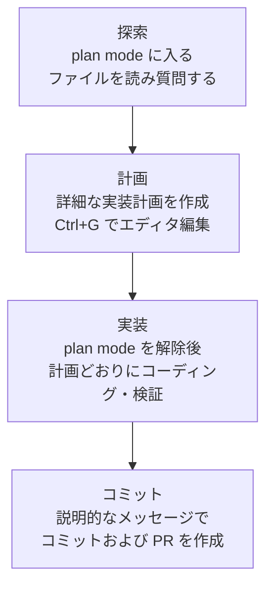

Claude Code はコードを直接読み、コマンドを実行し、変更を加えて問題を自律的に解決していくエージェント型のツールです。そのため、どう指示し、どう検証させるかが結果の品質を左右します。


**ひとことで言うと**: 明確に指示し、まず計画を立て、検証手段を手渡せば、Claude Code は見張るツールではなく、任せられる同僚になります。


## なぜベストプラクティスが必要か

Anthropic の公式ガイドが強調するほぼすべての推奨事項は、ひとつの制約から出発しています。**コンテキストウィンドウ はすぐに埋まり、埋まるほど性能が落ちる** という点です。会話のすべてのメッセージ、Claude が読んだすべてのファイル、すべてのコマンド出力がコンテキストウィンドウ に蓄積され、いっぱいになると Claude は先の指示を「忘れたり」、ミスが増えたりします。したがってベストプラクティスの本質は、**コンテキストを節約しつつ正確なシグナルを与えること** にあります。

## 明確で直接的な指示 + 文脈の提供

Claude は意図を推測できますが、心を読むことはできません。具体的なファイルを指し示し、制約を明示し、従うべき既存パターンを示すほど、修正の回数は減ります。

| 戦略 | あいまいな指示 | 推奨する指示 |
|------|------------|----------|
| **作業範囲を限定する** | 「`foo.py` にテストを追加して」 | 「ログアウト状態のエッジケースを扱う `foo.py` のテストを書いて。ただしモックは避けて」 |
| **出所を指し示す** | 「この API はなぜこんなに変なの?」 | 「`ExecutionFactory` の git 履歴を調べて、API がどう作られたのかを要約して」 |
| **既存パターンを参照する** | 「カレンダーウィジェットを追加して」 | 「ホーム画面の既存ウィジェット実装を見てパターンを把握して。`HotDogWidget.php` が良い例です。そのパターンに従って新しいカレンダーウィジェットを作って」 |
| **症状を説明する** | 「ログインのバグを直して」 | 「セッション期限切れ後にログインが失敗するという報告があります。`src/auth/` のトークン更新フローを確認し、まずバグを再現する失敗テストを書いてから直して」 |

### 豊富な文脈を与える方法

- `@` 参照: コードの場所を説明する代わりに `@パス/ファイル` で直接参照すれば、Claude は応答前にファイルを読みます。
- 画像の貼り付け: スクリーンショットやデザイン案をプロンプトに直接貼り付けます。
- URL の提供: ドキュメントや API リファレンスの URL を渡し、`/permissions` でよく使うドメインを許可リストに追加します。
- パイプ入力: `cat error.log | claude` のようにファイル内容を直接渡します。


**ひとことで言うと**: 同じ作業でも「何を、どのファイルで、どんな基準で」を明示すれば、修正ループが半分に減ります。


## 探索が先、計画が次、コードは最後

すぐにコーディングに飛び込むと、**見当違いの問題を解くコード** ができてしまうことがあります。plan mode を活用して探索と実行を分離する 4 段階の流れが推奨されます。

| 段階 | モード | 中心となる行動 |
|------|------|----------|
| 探索 (Explore) | plan mode | 変更を加えずにファイルを読み、コード構造を把握する |
| 計画 (Plan) | plan mode | 変更するファイルと流れをまとめた計画を作成、`Ctrl+G` で直接編集する |
| 実装 (Implement) | 既定モード | 計画に沿ってコードを書き、テストを実行・修正する |
| コミット (Commit) | 既定モード | 説明的なコミットメッセージを書いてから PR を作成する |

plan mode は有用ですが、オーバーヘッドもあります。**タイプミスの修正、ログ 1 行の追加、変数名の変更のように範囲が明確で小さな作業は、計画なしで** 直接指示するほうが良いです。アプローチが不確かな場合、複数のファイルが変わる場合、慣れていないコードを触る場合に、計画は最大の価値を発揮します。変更内容を一文で説明できるなら、計画は飛ばします。

## 検証手段を手渡す

Claude は作業が「終わったように見えれば」止まります。検証手段がなければ、人間自身が検証ループになり、すべてのミスをひとつずつ見つけなければなりません。**合格／不合格を返す検査** を与えれば、Claude は自分で実行して結果を読み、通過するまで繰り返します。

検査は、会話から読み取れるシグナルを出すものなら何でも構いません。テストスイート、ビルドの終了コード、リンター、フィクスチャと出力を比較するスクリプト、デザインと照合するブラウザのスクリーンショットなどが該当します。

検査をどれだけ強く課すかによって段階が分かれます。

| 方式 | 動作 | 適した状況 |
|------|------|------------|
| ひとつのプロンプト内で | 同じメッセージで検査の実行と繰り返しを依頼する | すぐに処理できる一般的な作業 |
| `/goal` 条件 | 別の評価者が毎ターン条件を再確認し、充足まで進める | セッション全体にわたる自動検証 |
| Stop hook | 検査をスクリプトで実行し、通過するまでターン終了を阻止する | 決定論的なゲートが必要な場合 |
| 検証サブエージェント | 新鮮なコンテキストのモデルが結果に反論を試みる | 作成者と採点者を分離したい場合 |

肝心なのは、**成功を主張させるのではなく証拠を示させる** ことです。テスト出力、実行したコマンドと戻り値、結果のスクリーンショットを一緒に受け取れば、自分で再検証するよりも速く、見張っていないセッションでも機能します。


**ひとことで言うと**: 検査ひとつがすなわち自律性です――「見張るセッション」と「任せるセッション」の違いは、Claude が自分で回せる検査があるかどうかにかかっています。


## 権限と安全性

既定では、Claude Code はシステムを変えうる動作(ファイル書き込み、Bash コマンド、MCP ツールなど)に権限を求めます。安全ですが煩わしいので、次の 3 つで妨げを減らしつつ統制権は保ちます。

- **auto mode**: 別の分類器モデルがコマンドを審査し、権限昇格、未知のインフラ、敵対的コンテンツに基づく動作といった危険なものだけを遮断します。`claude --permission-mode auto -p "fix all lint errors"` のように使います。
- **権限許可リスト**: `/permissions` で `npm run lint`、`git commit` のように安全だとわかっているツールだけを許可します。
- **サンドボックス化**: `/sandbox` でファイルシステムとネットワークへのアクセスを制限する OS レベルの隔離を適用します。

### 取り消せる行動と取り消せない行動

安全性の核心となる原則は、**可逆性で行動を分けること** です。

- ファイル編集、テスト実行のように **局所的で取り消せる行動は自由に** 行います。間違えても `Esc` で止めたり、`/rewind`(または `Esc` 二度押し)で以前の状態を復元できます。
- **取り消しにくい、あるいは共有システムに影響を与える行動**(強制プッシュ、`rm -rf`、テーブル削除、外部公開など)は、実行前に必ずユーザー確認を取ります。
- **破壊的なショートカットは禁止です。** 障害を回避するために `--no-verify` のような検証スキップフラグを使ってはいけません。検査を飛ばすのは問題を隠すだけで、解決にはなりません。

## アンチパターン: よくある失敗パターン

公式ガイドや一般的なエージェント利用の経験で繰り返される失敗パターンです。早く知っておけば時間を節約できます。

| アンチパターン | 症状 | 処方 |
|----------|------|------|
| ごった煮セッション (kitchen sink) | ひとつの作業 → 無関係な質問 → また最初の作業へ、コンテキストがノイズで満たされる | 無関係な作業の間に `/clear` |
| 繰り返しの修正 (correcting over and over) | 同じ問題を二度を超えて修正、失敗したアプローチがコンテキストを汚染する | 二度失敗したら `/clear` 後、学んだ点を盛り込んでより具体的なプロンプトで再開する |
| 過剰設計 (over-engineering) | 依頼していない抽象化レイヤー、防御的コード、起こり得ないケースのテスト | 検討用サブエージェントには「正確性・要件に影響する欠陥のみ報告」するよう指示する |
| 信頼と検証の空白 (trust-then-verify gap) | もっともらしいがエッジケースを見落とした実装 | 常に検証手段(テスト・スクリプト・スクリーンショット)を提供、検証できないならデプロイ禁止 |
| 無限探索 (infinite exploration) | 範囲のない「調査」指示で数百のファイルを読み、コンテキストを使い果たす | 調査範囲を狭めるか、サブエージェントに委任する |

3 つの核心的なアンチパターンを別途挙げるとこうなります。

- **過剰設計**: 検討者は欠陥を見つけろと頼まれると、作業がまともでも何かを報告します。あらゆる指摘を追えば不要な複雑さが積み上がります。必要最小限の複雑さだけを保ちます。
- **推測ではなく明確化**: あいまいなら推測せず尋ねるべきです。大きな機能は `AskUserQuestion` ツールで Claude にまずインタビューさせてから仕様を作成する方式が推奨されます。
- **証拠のない主張は禁止**: 「直しました」ではなく、通過したテスト出力と実行したコマンドを示すべきです。

## MoAI-ADK ワークフローとの整合

MoAI-ADK は上記のベストプラクティスをワークフローの次元で制度化します。Claude Code の推奨事項が一回限りのプロンプト技法であるのに対し、MoAI-ADK はそれを **SPEC ベースの Plan-Run-Sync パイプライン** として固定します。

| Claude Code ベストプラクティス | MoAI-ADK の対応 |
|----------------------|---------------|
| 探索が先、計画が次 (plan mode) | `/moai plan` が SPEC 文書(要件・計画・受け入れ基準)をまず作成 |
| 検証手段の提供 (テスト・自己点検) | TRUST 5 品質ゲートと SPEC 受け入れ基準が合格／不合格を強制 |
| サブエージェントへの隔離作業の委任 | manager-spec / manager-develop / manager-docs など段階別の専任サブエージェント |
| 新鮮なコンテキストでの敵対的レビュー | plan-auditor(計画監査)+ evaluator-active(4 次元品質評価) |
| 取り消しにくい作業は確認 | Implementation Kickoff Approval(計画→実装のユーザー承認ゲート)と Tier ベースの PR ルーティング |

詳しくは以下のリンク文書を参照してください。MoAI-ADK 固有の SPEC 作成ルールと品質基準は当該文書に定義されているため、ここでは整合ポイントのみを要約します。

## 関連ドキュメント

- [動作の仕組み](/claude-code/foundations/how-claude-code-works)
- [クイックスタート](/getting-started/quickstart)
- [TRUST 5 品質フレームワーク](/core-concepts/trust-5)

## 参考資料

- [Best practices for Claude Code(公式ドキュメント)](https://code.claude.com/docs/en/best-practices)


同じ問題を二度を超えて修正したなら、コンテキストはすでに失敗したアプローチで汚染された状態です。未練なく `/clear` で初期化し、その間に学んだ点を盛り込んでより具体的なプロンプトで新たに始めるほうが、ほぼ常に速いです。

