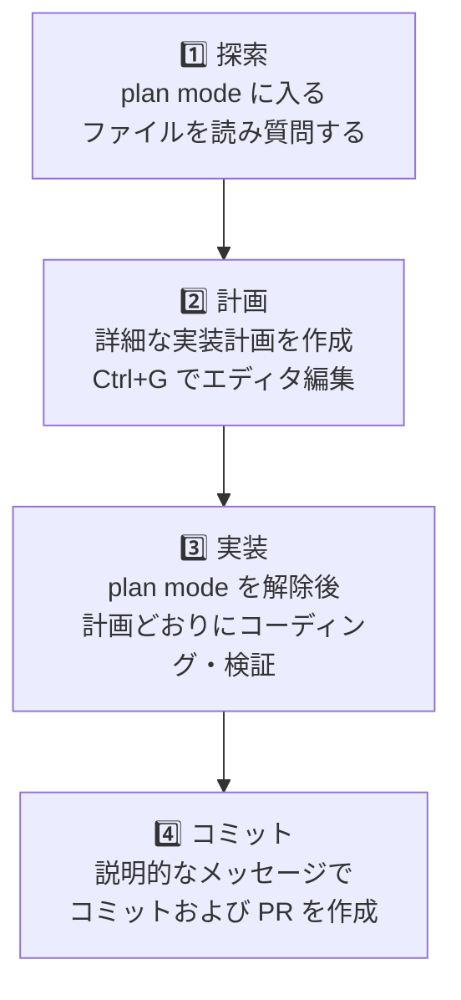

# ベストプラクティス

Claude Code はコードを直接読み、コマンドを実行し、変更を加えて問題を自律的に解決していくエージェント型のツールです。そのため、どう指示し、どう検証させるかが結果の品質を左右します。


**ひとことで言うと**: 明確に指示し、まず計画を立て、検証手段を手渡せば、Claude Code は見張るツールではなく、任せられる同僚になります。


## 1. Claude に検証方法を手渡す

Claude は作業が「終わったように見えれば」止まります。検証手段がなければ、人間自身が検証ループになり、すべてのミスをひとつずつ見つけなければなりません。

Claude に実行可能な検証を提供しましょう。テストスイート、ビルドコマンド、リンター、またはスクリーンショットとの差分を比較するスクリプト — Claude が読み反応できるシグナルなら何でも構いません。

| 戦略 | あいまいな指示 | 推奨する指示 |
|------|------------|----------|
| **検証基準の提供** | `validateEmail 関数を実装して` | `validateEmail 関数を作成。テストケース: user@example.com は true、invalid は false、user@.com は false。実装後、テストを実行して合格を確認すること` |
| **UI 変更の視覚的検証** | `ダッシュボードをもっと良く見えるように` | `[スクリーンショット貼付] このデザインのように実装。結果のスクリーンショットを撮って、オリジナルと比較し、差分を列挙すること` |
| **根本原因の解決** | `ビルドが失敗してる` | `ビルド失敗: [エラーテキスト]。根本原因を見つけて直して。エラーを隠さず解決すること` |

検証を提供すれば、Claude は:
1. 作業を実行
2. 検証を実行
3. 結果を読んで
4. 合格するまで繰り返す

あなたが見ていないセッションでも正確に完了できます。証拠を見せてくださいと言いましょう — テスト出力、実行したコマンドと戻り値、スクリーンショット。手で再実行するより速いです。

## 2. 探索 → 計画 → 実装の 4 段階

いきなりコーディングに飛び込むと **見当違いの問題を解くコード** ができてしまう可能性があります。まず探索と計画を実行してください。



**各段階の詳細**:

1. **探索** (plan mode): ファイルを読んで質問する。変更禁止。
2. **計画**: 詳細な実装計画を作成。`Ctrl+G` でエディタから直接編集。
3. **実装**: plan mode を解除後、テストを実行しながら計画と照らし合わせてコーディング。
4. **コミット**: 説明的なメッセージで PR を作成。

**ティップ**: 範囲が明確で簡単な作業(タイプミス修正、1 行追加、変数名変更)なら計画段階をスキップしても構いません。計画は **範囲が不確かなとき、または複数ファイルを修正するとき** に最も効果的です。

## 3. 具体的なコンテキストを提供する

Claude は意図を推測できますが、心を読むことはできません。**具体的なほど修正の回数が減ります。**

| 戦略 | モホウなな指示 | 推奨する指示 |
|------|------------|----------|
| **範囲を限定する** | `foo.py にテストを追加して` | `ログアウト状態のエッジケースを扱う foo.py のテストを書いて。ただしモックは避けて` |
| **出所を指し示す** | `この API ってなぜこんなに変な形?` | `ExecutionFactory の git 履歴を調べて、API がどのように進化したかを要約して` |
| **既存パターンを参照する** | `カレンダーウィジェットを追加して` | `ホーム画面の既存ウィジェット実装を見てパターンを把握して。HotDogWidget.php が良い例です。そのパターンに従って新しいカレンダーウィジェットを作って` |
| **症状を説明する** | `ログインのバグを直して` | `セッション期限切れ後にログインが失敗するという報告があります。src/auth/ のトークン更新フローを確認し、まずバグを再現する失敗テストを書いてから直して` |

### 豊富なコンテキストを与える方法

- **@ 参照**: コードの場所を説明する代わりに `@パス/ファイル` で直接参照すれば、Claude は応答前にファイルを読みます。
- **画像の貼り付け**: スクリーンショットやデザイン案をプロンプトに直接貼り付けます。
- **URL の提供**: ドキュメントや API リファレンスの URL を渡し、`/permissions` でよく使うドメインを許可リストに追加します。
- **パイプ入力**: `cat error.log | claude` のようにファイル内容を直接渡します。

## 4. 環境設定する

小さな設定変更がすべてのセッションをより効率的にします。

### CLAUDE.md 作成 — 核心的なガイド

毎セッション開始時に Claude が読む特別なファイルです。コードスタイル、ワークフロー、プロジェクト設定を記述してください。

開始: `/init` コマンドで自動生成した後に精緻化してください。

**含めるもの**:
- Bash コマンド (Claude が推測できないもの)
- コードスタイル規則 (デフォルトと異なるもの)
- テストフレームワークと実行方法
- リポジトリエチケット (ブランチ名、PR 規則)
- アーキテクチャ決定 (プロジェクト固有のもの)

**除外するもの**:
- コードで読めるもの (API ドキュメントはリンクで)
- 頻繁に変わる情報

### 権限モード設定

デフォルト: Claude がファイル書き込みなどの作業ごとに権限承認を求めます。安全ですが煩わしいです。

**Auto mode** (`Shift+Tab`): 分類モデルが危険度を判断し自動承認。
**権限許可リスト**: `npm run lint`、`git commit` のような安全なコマンドを事前に許可。
**サンドボックス**: OS レベル隔離で境界を保ちながらより自由に。

### `/init` で CLAUDE.md を生成

プロジェクトを自動分析して:
- ビルドシステムを検出
- テストフレームワークを発見
- コードパターンを学習
- 下書き生成

その後、編集して完成させてください。

## 5. CLI ツール を使用

`gh` (GitHub CLI)、`aws`、`gcloud` のような CLI は文脈効率がとても良いです。

インストール済みの CLI があれば Claude は自動的に活用します。なければ API を使いますが、API は速度が遅く制限が多い可能性があります。

## 6. MCP サーバーを接続


MCP (Model Context Protocol) — 外部ツールを Claude と直接つなぐ。


```bash
claude mcp add --transport http <server-name>
```

イシュートラッカー、データベース、モニタリングダッシュボードを Claude に接続できます。

## 7. Skills と Subagents で拡張

### Skills — ドメイン知識

`.claude/skills/` に `SKILL.md` ファイルを作成してドメイン特化ガイドを自動ロードします。

```markdown
---
name: api-conventions
description: わたしたちのサービスの REST API 設計規則
---

- URL パス: kebab-case
- JSON プロパティ: camelCase
- バージョン: URL パスに含む (/v1/, /v2/)
```

必要なときだけロードされるため、毎セッションのコンテキストを汚しません。

### Subagents — 隔離された専門家

大量のファイルを読んだり深い分析が必要なら subagent に委任します。独立したコンテキストで作業した後、要約を受け取ります。

## 8. セッション管理

### /clear でコンテキストを分離

大きなプロジェクトで多様な作業をするとき、`/clear` で過去のコンテキストを整理し新しい作業を始めるとパフォーマンスが保たれます。

- ステップごとの作業完了後
- コンテキスト使用量が 150K を超えたとき
- 無関係な作業に切り替えるとき

### Rewind で実験する

`Esc` キーまたは `/rewind` コマンドで過去の状態に戻れます。コンテキストを保ちながら別のアプローチを試せます。

### Subagents で調査を委任

大規模な探索が必要なら subagent に送ってください。読んだファイルたちがメインセッションのコンテキストを汚しません。

## 9. 多数のエージェント並列実行

読み取り専用の分析やレビューは複数セッションで並列実行できます。

**ライター/レビュアーパターン**:
- A セッション (ライター): コード実装
- B セッション (レビュアー): コードレビュー (独立した観点)
- A セッション: フィードバック反映

または **テスト/コード分離**:
- A セッション: テスト作成 (TDD)
- B セッション: テストを合格させるコード実装

## 10. 自動化とスケール

### 非対話型モード

```bash
claude -p "プロンプト" --output-format json
```

CI パイプライン、pre-commit フック、スクリプトに Claude を統合します。

### 複数セッション並列実行

複数の SPEC を同時実行するか、大量のファイルを並列変換します。

### /goal で自律完了

```
/goal "テストがすべて合格し、coverage が 85% 以上になったとき"
```

Claude が自動的に繰り返し、目標達成時に止まります。

## 11. よくある失敗パターンを避ける

| パターン | 問題 | 解決法 |
|------|------|------|
| **ごった煮セッション** | 無関係な作業が混ざってコンテキスト汚染 | 無関係な作業の間に `/clear` |
| **繰り返しの修正** | 同じ問題を 2 度以上直した、でも反復 | `/clear` 後、より詳細な指示で新たに開始 |
| **過剰設計** | もっともらしい実装がエッジケース見落とし | 常に検証方法を提供 (テスト、スクリーンショット、リンター) |
| **無限探索** | 範囲なしの「調査」指示で数百ファイル読む | 調査範囲を明示するか subagent に委任 |

## 参考資料

このガイドは Anthropic の公式 [Best practices for Claude Code](https://code.claude.com/docs/en/best-practices) ドキュメントを基に作成されています。


同じ問題を二度を超えて修正したなら、コンテキストはすでに失敗したアプローチで汚染された状態です。未練なく `/clear` で初期化し、その間に学んだ点を盛り込んでより具体的なプロンプトで新たに始めるほうが、ほぼ常に速いです。

