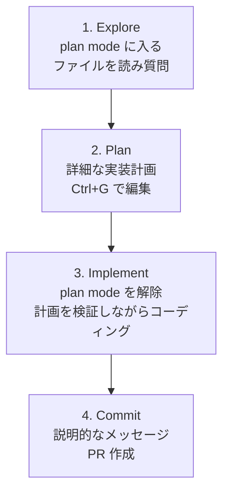

# ベストプラクティス

Claude Code は自律的にファイルを読み、コマンドを実行し、変更を加えるエージェント型ツールです。単にコードをレビューしてもらうのとは違い、**どう指示し、どう検証させるか** が結果の品質を大きく左右します。このページのパターンは、結局 1 つの考え方に収束します — 毎ターン手で操縦する代わりに、エージェントが自らうまく回れるループと環境を設計することです。


**ひとことで言うと**: 大半の問題の根源は 1 つです。**コンテキストウィンドウは速く埋まり、埋まるほど応答品質が落ちてコストが上がります。** すべてのベストプラクティスは、この制約を中心に設計されています。


## 検証方法を手渡す

Claude は「作業が完了したようだ」というシグナルを受け取ると止まります。検証できるツールがなければ、**ユーザーがすべてのミスを発見する検証ループ** になってしまいます。

Claude が自ら実行できる検証を提供しましょう。テストスイート、ビルドコマンド、リンター、スクリーンショット比較スクリプト — Claude が読んで反応できるシグナルなら何でも構いません。

| 戦略 | 弱い指示 | 推奨する指示 |
|------|---------|-----------|
| **検証基準の提供** | `validateEmail 関数を実装` | `validateEmail 関数を作成。テストケース: user@example.com は true、invalid は false、user@.com は false。実装後にテストを実行して通過を確認すること` |
| **UI 変更の視覚的検証** | `ダッシュボードをもっと良く見せて` | `[スクリーンショット添付] このデザインのとおり実装。結果のスクリーンショットを撮り、元と比較して差分を列挙すること` |
| **根本原因の解決** | `ビルドが失敗する` | `ビルド失敗: [エラーテキスト]。根本原因を見つけて直すこと。エラーを隠さず解決すること` |

検証を提供すると、Claude は次のサイクルを自ら回します。

1. 作業を実行し
2. 検証を実行し
3. 結果を読み
4. 通過するまで繰り返します

見守っていないセッションでも正しく完了できる理由がこれです。完了報告には証拠を要求しましょう — テスト出力、実行したコマンドと結果、スクリーンショット。自分で再実行するより速いのです。「検証可能な完了条件 + 証拠ベースの判定」は、MoAI-ADK が SPEC の受け入れ基準 (AC) と TRUST 5 ゲートとして体系化した原則でもあります。

## 探索 → 計画 → 実装 → コミットの 4 段階

いきなりコーディングに飛び込むと、**見当違いの問題を解くコード** ができることがあります。探索と計画を先に行いましょう。読み取り専用のターンは安く、実装のターンは高いため、この順序は品質だけでなくトークン経済の問題でもあります。


```mermaid
flowchart TD
    A["1. Explore<br/>plan mode に入る<br/>ファイルを読み質問"] --> B["2. Plan<br/>詳細な実装計画<br/>Ctrl+G で編集"]
    B --> C["3. Implement<br/>plan mode を解除<br/>計画を検証しながらコーディング"]
    C --> D["4. Commit<br/>説明的なメッセージ<br/>PR 作成"]
```

段階ごとに見ると次のとおりです。

1. **探索** (plan mode): ファイルを読み、質問します。変更は禁止。
   ```text
   plan mode で:
   /src/auth を読んでセッション・ログインの流れを理解する。
   環境変数でシークレットをどう管理しているかも確認する。
   ```
2. **計画**: 詳細な実装計画を作成します。`Ctrl+G` でエディタから直接修正できます。
3. **実装**: plan mode を解除してコーディングします。テストを回しながら計画と合っているかを検証します。
4. **コミット**: 説明的なメッセージでコミットし、PR を作ります。

範囲が明確でシンプルな作業 (タイポ修正、1 行追加、変数名の変更) なら計画段階を飛ばしても構いません。計画は **範囲が不確実なときや複数ファイルを修正するとき** に最も効果的です。MoAI-ADK の plan→run→sync ライフサイクルと実装着手承認ゲートは、この 4 段階を SPEC ワークフローとして制度化したものです。

## 具体的なコンテキストを提供する

Claude は意図を推論できますが、心は読めません。**具体的であるほど修正の回数が減り**、修正の回数が減るぶんトークンも節約できます。

| 戦略 | 曖昧な指示 | 推奨する指示 |
|------|---------|-----------|
| **範囲の限定** | `foo.py にテストを追加` | `ログアウト状態のエッジケースを扱う foo.py のテストを作成。mock は使用禁止` |
| **出典の指定** | `ExecutionFactory の API はなぜ変なの?` | `ExecutionFactory の git 履歴を調べ、API がどう進化したかを要約すること` |
| **パターンの参照** | `カレンダーウィジェットを追加` | `ホーム画面の既存ウィジェット実装パターンを学習。HotDogWidget.php が良い例。そのパターンでカレンダーウィジェットを実装` |
| **症状の描写** | `ログインバグを直すこと` | `セッション期限切れ後にログイン失敗。src/auth のトークン更新フローを確認。バグを再現する失敗テストを先に書いてから直すこと` |

### 豊富なコンテキストの提供方法

- **@ でファイル参照**: 説明の代わりに `@パス/ファイル` で直接指させば Claude が先に読みます
- **画像の貼り付け**: スクリーンショットやデザイン案を直接貼ります
- **URL の提供**: ドキュメント/API リファレンスの URL を渡し、`/permissions` でドメインを許可リストに登録します
- **パイプ入力**: `cat error.log | claude` でデータを直接渡します

## 環境を設定する

小さな設定変更が、すべてのセッションをより効率的にします。セッションごとに繰り返される訂正を環境へ移すこと — これがハーネスエンジニアリングの始まりです。

### CLAUDE.md の作成

毎セッション開始時に Claude が読む特別なファイルです。コードスタイル、ワークフロー、プロジェクト設定を書きましょう。`/init` コマンドでドラフトを自動生成してから磨くのが速い方法です。`/init` はプロジェクトを分析してビルドシステムを検出し、テストフレームワークを見つけ、コードパターンを学習してドラフトを作ってくれます。

**含めるもの**:

- Bash コマンド (Claude が推測できないもの)
- コードスタイルのルール (デフォルトと異なるもの)
- テストフレームワークと実行方法
- リポジトリのエチケット (ブランチ名、PR のルール)
- アーキテクチャの決定 (プロジェクトならではの特殊性)

**除外するもの**:

- コードから読み取れるもの (API ドキュメントはリンクで)
- 頻繁に変わる情報

CLAUDE.md は毎セッション全文がロードされトークンを消費するため、増えるほどダイエットが必要です。

### 権限モードの設定

デフォルトは、Claude が操作のたびに承認を求める設定です。安全ですが手間がかかります。

- **Auto mode** (`Shift+Tab`): 分類モデルがリスクを判断して自動承認します。
- **権限の許可リスト**: `npm run lint`、`git commit` のような安全なコマンドを事前に許可します。
- **サンドボックス**: OS レベルの分離でより自由に作業しつつ、境界を維持します。

### CLI ツールの活用

`gh` (GitHub CLI)、`aws`、`gcloud` のような CLI はコンテキスト効率が非常に良いのです。インストールされていれば Claude が自動的に活用し、なければ API を使いますが、API 経路はより遅く制約が多いことがあります。

### MCP サーバーの接続

イシュートラッカー、データベース、モニタリングダッシュボードを MCP (Model Context Protocol) で Claude に直接接続できます。

```bash
claude mcp add --transport http <server-name>
```

## スキルとサブエージェントで拡張

### スキル — ドメイン知識

`.claude/skills/` に `SKILL.md` ファイルを書き、ドメイン特化のガイドを自動ロードします。

```markdown
---
name: api-conventions
description: 私たちのサービスの REST API 設計規則
---

- URL パス: kebab-case
- JSON プロパティ: camelCase
- バージョン: URL パスに含める (/v1/, /v2/)
```

必要なときだけロードされるため、毎セッションのコンテキストを汚染しません。

### サブエージェント — 分離された専門家

大量のファイルを読んだり深い分析が必要なら、サブエージェントに委譲しましょう。独立したコンテキストで作業した後、要約だけを受け取るため、調査過程のファイル読み取りがメインセッションのコンテキストを占めません。

## セッション管理

### /clear でコンテキストを分離

大きなプロジェクトで複数の作業を行き来するとき、`/clear` で以前のコンテキストを片付けてから新しい作業を始めると、パフォーマンスが維持されます。

- 段階的な作業を完了した後
- コンテキスト使用量が 150K を超えたとき
- 無関係な作業へ切り替えるとき

### 巻き戻しで実験する

`Esc` キーや `/rewind` コマンドで以前の状態へ戻れます。コンテキストを維持しながら別のアプローチを試せるため、失敗を恐れない実験が可能になります。

### 調査はサブエージェントへ委譲

大規模な探索が必要ならサブエージェントを送りましょう。読んだファイルがメインセッションのコンテキストを汚染しません。

## 複数エージェントの並列実行

読み取り専用の分析やレビューは、複数のセッションで並行して進められます。

- **Writer/Reviewer パターン**: A セッション (Writer) がコードを実装し、B セッション (Reviewer) が独立した観点でレビューした後、A セッションがフィードバックを反映します。作る側と検査する側を分離するこのパターンは、MoAI-ADK が plan-auditor / sync-auditor という独立監査エージェントとして制度化した原則と同じです。
- **Test/Code の分離**: A セッションがテストを書き (TDD)、B セッションがそのテストを通過するコードを実装します。

## 自動化とスケール

### 非対話モード

```bash
claude -p "プロンプト" --output-format json
```

CI パイプライン、pre-commit フック、スクリプトに Claude を統合します。

### 複数セッションの並列実行

複数の SPEC を同時に進めたり、大量のファイルを並行変換したりします。ファイル編集が重ならないよう、[ワークツリー](/ja/claude-code/agentic/worktrees) で分離するのが安全です。

### /goal で自律完了

```text
/goal "テストがすべて通過し、coverage が 85% 以上のとき"
```

完了条件を宣言すれば Claude が自動的に繰り返し、目標達成時に止まります。ここまで来ると、「毎ターン指示する」から「ループを設計する」へ役割が移ったことになります — MoAI-ADK の `/moai goal` と `/moai loop` は、このループをプロジェクトの品質ツール・SPEC ライフサイクルと結合した拡張です。

## よくある失敗パターンを避ける

| パターン | 問題 | 解決 |
|------|------|------|
| **キッチンシンクセッション** | 無関係な作業が混ざりコンテキストが汚染 | 無関係な作業の間に `/clear` |
| **繰り返される訂正** | 同じ問題を 2 回以上直したのに繰り返す | `/clear` 後により良い指示文で新規開始 |
| **肥大化した CLAUDE.md** | 指示文が長すぎて Claude が半分以上を無視 | 容赦なく整理。「このルールがなければミスするか?」を基準に |
| **信頼と検証のギャップ** | もっともらしく見える実装がエッジケースを見逃す | 常に検証を提供 (テスト、スクリーンショット、リンター) |
| **無限探索** | 範囲のない「調べて」が数百のファイルを読む | 範囲を明示するか、サブエージェントへ委譲 |

## 関連ドキュメント

- [コンテキストウィンドウ](/ja/claude-code/context-memory/context-window)
- [サブエージェント](/ja/claude-code/agentic/sub-agents)
- [ゴール指向実行 (/goal)](/ja/claude-code/agentic/goal)
- [大規模コードベース](/ja/claude-code/agentic/large-codebases)

## 参考資料

- [Best practices for Claude Code (公式ドキュメント)](https://code.claude.com/docs/en/best-practices)


このページから 1 つだけ持ち帰るなら「検証方法を手渡す」です。検証可能な完了条件があってこそループが自ら回り、ループが自ら回ってこそ、残りのベストプラクティスすべてが力を発揮します。

