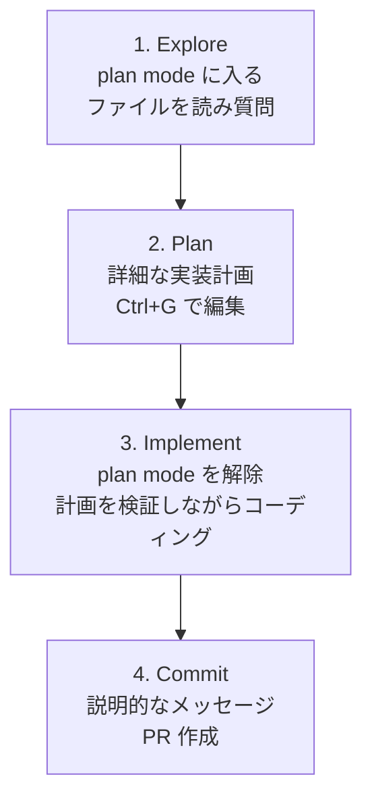

# ベストプラクティス

Claude Code は、ファイルを読み、コマンドを実行し、コードを直接直す仕事を自らこなすエージェントです。だから成果の品質は、モデルがどれだけ賢いかではなく、**どう指示し、どう検証させるか**にかかっています。

このページのパターンは、結局ひとつの場所に集まります。毎ターン手で操縦する代わりに、エージェントが自らうまく回るループと環境を設計することです。


**ひとことで**: 大半の問題の根源は 1 つです。**コンテキストウィンドウは速く埋まり、埋まるほど応答品質は下がり、コストは上がります。** このページのベストプラクティスは、この制約を中心に置いて設計されています。


## 検証方法を手渡す

Claude は「作業が完了したようだ」というシグナルを受け取ると止まります。検証できるツールがなければ、**ユーザーがすべてのミスを発見する検証ループ**になってしまいます。

だから、Claude が自ら実行できる検証をいっしょに手渡してください。テストスイート、ビルドコマンド、リンター、スクリーンショット比較スクリプト — Claude が読んで反応できるシグナルなら何でもかまいません。

| 戦略 | 弱い指示 | 推奨する指示 |
|------|---------|-----------|
| **検証基準の提供** | `validateEmail 関数を実装` | `validateEmail 関数を作成。テストケース: user@example.com は true、invalid は false、user@.com は false。実装後にテストを実行して通過を確認すること` |
| **UI 変更の視覚的検証** | `ダッシュボードをもっと良く見せて` | `[スクリーンショット添付] このデザインのとおり実装。結果のスクリーンショットを撮り、元と比較して差分を列挙すること` |
| **根本原因の解決** | `ビルドが失敗する` | `ビルド失敗: [エラーテキスト]。根本原因を見つけて直すこと。エラーを隠さず解決すること` |

検証を提供すると、Claude は次のサイクルを自ら回します。

1. 作業を実行し
2. 検証を実行し
3. 結果を読み
4. 通過するまで繰り返します

見守っていないセッションでも正しく最後まで行ける理由がこれです。完了報告には証拠を要求しましょう。テスト出力、実行したコマンドと結果、スクリーンショットがその証拠で、自分で再実行するより速いのです。**「完了した」という主張 (claim) ではなく、観察された結果 (evidence) で判定すること** — この原則は、MoAI-ADK が SPEC の受け入れ基準 (AC) と TRUST 5 ゲートとして体系化した基準でもあります。

### 検証は 1 ターンにまとめて回す

検証コマンドが複数あるなら — テスト、リント、ビルド、型検査 — これらを 1 ターンにまとめて渡してください。1 つ回して結果報告、次を 1 つ回すという直列の往復は、毎回待ち時間と権限確認を繰り返します。1 回の応答に複数の読み取り専用検証を束ねて渡せば、その往復 N 回が 1 回に減ります。

このパターンは、Claude 自身が検証するときもそのまま当てはまります。Claude Code の最新バージョンは、独立した読み取り専用コマンドを 1 つの応答の中で並列にまとめて実行するため、検証を「1 つずつ順番に」ではなく「1 まとめに」設計するほど wall-time が短くなります。より大きな教訓は、検証を順序ではなく**まとまり (batch)** で設計せよ、ということです。

## 探索 → 計画 → 実装 → コミットの 4 段階

いきなりコーディングに飛び込むと、**見当違いの問題を解くコード**が出ることがあります。探索と計画を先に行ってください。読み取り専用のターンは安く、実装のターンは高いので、この順序は品質だけでなくトークン経済の問題でもあります。


```mermaid
flowchart TD
    A["1. Explore<br/>plan mode に入る<br/>ファイルを読み質問"] --> B["2. Plan<br/>詳細な実装計画<br/>Ctrl+G で編集"]
    B --> C["3. Implement<br/>plan mode を解除<br/>計画を検証しながらコーディング"]
    C --> D["4. Commit<br/>説明的なメッセージ<br/>PR 作成"]
```

段階ごとに見ると次のとおりです。

1. **探索** (plan mode): ファイルを読み、質問します。変更は禁止。
   ```text
   plan mode で:
   /src/auth を読んでセッション・ログインの流れを理解する。
   環境変数でシークレットをどう管理しているかも確認する。
   ```
2. **計画**: 詳細な実装計画を作成します。`Ctrl+G` でエディタから直接修正できます。
3. **実装**: plan mode を解除してコーディングします。テストを回しながら計画と合っているかを検証します。
4. **コミット**: 説明的なメッセージでコミットし、PR を作ります。

範囲が明確で単純な作業 (タイポ修正、1 行追加、変数名の変更) なら計画段階を飛ばしてかまいません。計画は**範囲が不確実なときや複数ファイルを修正するとき**に最も効果を発揮します。MoAI-ADK の plan→run→sync ライフサイクルと実装着手承認ゲートは、この 4 段階を SPEC ワークフローとして制度したものです。

## 具体的なコンテキストを提供する

Claude は意図を推論できますが、心は読めません。**具体的であるほど修正の回数は減り**、修正が減るぶんトークンも節約できます。

| 戦略 | 曖昧な指示 | 推奨する指示 |
|------|---------|-----------|
| **範囲の限定** | `foo.py にテストを追加` | `ログアウト状態のエッジケースを扱う foo.py のテストを作成。mock は使用禁止` |
| **出典の指定** | `ExecutionFactory の API はなぜ変なの?` | `ExecutionFactory の git 履歴を調べ、API がどう進化したかを要約すること` |
| **パターンの参照** | `カレンダーウィジェットを追加` | `ホーム画面の既存ウィジェット実装パターンを学習。HotDogWidget.php が良い例。そのパターンでカレンダーウィジェットを実装` |
| **症状の描写** | `ログインバグを直すこと` | `セッション期限切れ後にログイン失敗。src/auth のトークン更新フローを確認。バグを再現する失敗テストを先に書いてから直すこと` |

### 1 ターンにすべて載せる

最新の Opus 級モデル (Opus 4.7+、4.8、5) は、**1 ターンに fully-loaded** で働くことを好みます。意図と制約、完了基準、関連ファイルの場所を 1 つのプロンプトに全部載せて渡してください。小出しに複数ターンへ分けて投げるピンポンはトークンを浪費するだけでなく、成果の品質まで下げます — モデルが毎ターン不完全な絵から理解を作り直さなければならないためです。関係するものは最初から全部伝え、あとは働かせるのです。

同じ文脈で、**完了が何かも、課題を説明する同じターンに**明かしてください。モデルが尋ねてくるのを待つより、完了条件を先に手渡すこと — それが「1 ターンに fully-loaded」の実践です。

### 豊富なコンテキストを載せる方法

- **@ でファイル参照**: 説明の代わりに `@パス/ファイル` で直接指せば、Claude が先に読みます
- **画像の貼り付け**: スクリーンショットやデザイン案をそのまま貼ります
- **URL の提供**: ドキュメント/API リファレンスの URL を渡し、`/permissions` でドメインを許可リストに登録します
- **パイプ入力**: `cat error.log | claude` でデータを直接渡します

## 環境を設定する

小さな設定変更が、すべてのセッションをより効率的にします。セッションごとに繰り返される訂正を環境へ移すこと — これがハーネスエンジニアリングの始まりです。

### CLAUDE.md — 不変ルールの家

`CLAUDE.md` は、毎セッション開始時に Claude が読む特別なファイルです。ここに書くべきは、**「言わなければ間違えてしまう不変ルール」**です。コードから読み取れる事実ではなく、プロジェクトだけの約束と好みを書く場所です。`/init` コマンドでドラフトを自動生成してから仕上げるのが速い方法です。`/init` はプロジェクトを分析してビルドシステムを検出し、テストフレームワークを見つけ、コードパターンを学習してドラフトを作ってくれます。

**含めるもの**:

- Bash コマンド (Claude が推測できないもの)
- コードスタイルのルール (デフォルトと異なるもの)
- テストフレームワークと実行方法
- リポジトリのエチケット (ブランチ名、PR のルール)
- アーキテクチャの決定 (プロジェクトならではの特殊性)

**除外するもの**:

- コードから読み取れるもの (API ドキュメントはリンクで)
- 頻繁に変わる情報

`CLAUDE.md` は毎セッション全文がロードされてトークンを消費するので、増えるほどダイエットが必要です。「このルールがなければミスするか?」を基準に、容赦なく整理してください。

### 権限モードの設定

デフォルトでは、Claude が毎操作の承認を求めます。安全ですが手間がかかります。

- **Auto mode** (`Shift+Tab`): 分類モデルがリスクを判断して自動承認します。
- **権限の許可リスト**: `npm run lint`、`git commit` のような安全なコマンドを事前に許可します。
- **サンドボックス**: OS レベルの隔離でより自由に作業しつつ、境界を保ちます。

サブエージェントは v2.1.198 からバックグラウンドがデフォルトで、権限が必要なツールに遭うとそのプロンプトがメインセッションに表示されます (v2.1.186 からは、どのサブエージェントが尋ねたのか名前まで出ます)。だから長い作業を始める前に、必要なツールを `settings.json` の許可リストに先に追加しておくと、プロンプトの頻度を大きく減らせます。

### CLI ツールと MCP サーバー

`gh` (GitHub CLI)、`aws`、`gcloud` のような CLI はコンテキスト効率が非常に良いです。インストールされていれば Claude が自動で活用し、なければ API を使いますが、API 経路はより遅く制約が多いことがあります。

イシュートラッカー、データベース、モニタリングダッシュボードは MCP (Model Context Protocol) で Claude に直接接続できます。

```bash
claude mcp add --transport http <server-name>
```

## スキルとサブエージェントで拡張

### スキル — ドメイン知識

`.claude/skills/` に `SKILL.md` ファイルを書き、ドメイン特化のガイドを自動ロードします。

```markdown
---
name: api-conventions
description: 私たちのサービスの REST API 設計規則
---

- URL パス: kebab-case
- JSON プロパティ: camelCase
- バージョン: URL パスに含める (/v1/, /v2/)
```

必要なときだけロードされるため、毎セッションのコンテキストを汚しません。

### サブエージェント — 隔離された専門家

大量のファイルを読んだり深い分析が必要なら、サブエージェントに委譲してください。独立したコンテキストで作業した後、要約だけを受け取るため、調査過程のファイル読み取りがメインセッションのコンテキストを占有しません。サブエージェントの定義は次第に絞らなければなりません — 定義の全文が毎 spawn でコンテキストに入るため、無駄話は毎回の呼び出しコストになります。

サブエージェントのネストは v2.1.219 からデフォルトで有効 (深さ 3) ですが、階層を平らに保ちたいなら、サブエージェント定義から `Agent` ツールを外すことで確実に保証できます。詳しい構造と設定は[サブエージェント](/ja/claude-code/agentic/sub-agents)の文書を参照してください。

## セッション管理

### /clear で文脈を分離

大きなプロジェクトで複数の作業を行き来するとき、`/clear` で前の文脈を片付けてから新しい作業を始めると、性能が保たれます。

- 段階的な作業を完了した後
- コンテキスト使用量が高くなったとき
- 無関係な作業へ切り替えるとき

### 巻き戻しで実験する

`Esc` キーや `/rewind` コマンドで、前の状態に戻れます。文脈を保ったまま別のアプローチを試せるため、失敗を恐れない実験が可能になります。

### 調査はサブエージェントに委譲

大規模な探索が必要なら、サブエージェントを送ってください。読んだファイルがメインセッションのコンテキストを汚しません。

## エージェントチームと並列実行

複数のエージェントを同時に回す機能は強力ですが、**何を並列で回すかを見極めること**が鍵です。

### 並列はリサーチに、順次はコーディングに

公式ガイドの観察に、心に刻むべきものがあります: **大半のコーディング作業は、リサーチより本当に並列化できる部分が少ない。** コードは互いに依存し、1 つのファイルの変更が別のファイルに絡みます。だからコーディング中心の作業のデフォルトは順次サブエージェントです。

逆に、リサーチとレビューは並列化が非常にうまくいきます。複数のエージェントがそれぞれ別の角度から調査し、発見を交差検証する構造が自然に作れます。

- **並列が輝く作業**: PR レビュー、ライブラリリサーチ、バグ原因の仮説検証、コードベースの全数スキャン
- **順次が安全な作業**: 同じファイルを直す必要がある実装、段階ごとに依存がある変更、単一ファイルの日常的な編集

### 3-5 人で始めよ

エージェントチームを使うとき、公式ガイドは **3-5 人**で始めるよう勧めています。それ以上簡単に増やすな、という意味です。理由は単純です。

- トークンコストはチームメイトの数に比例して線形に増えます。チームメイトごとに独立したコンテキストで別々に消費します。
- チームメイトが増えるほど通信と調整の負担が大きくなり、同じファイルに触れる衝突の可能性も上がります。
- 一定の数を超えると収穫逓減が来ます。追加のチームメイトが作業速度を比例して引き上げません。

チームメイトごとに 5-6 個の作業を割り当てれば、コンテキストの切り替えを過剰に起こさずに全員を忙しく保てます。集中した 3 人が散らばった 5 人より優ることは多いのです。

### チーム、サブエージェント、ワークフロー — 何をいつ

3 つのオーケストレーションの原始があり、「計画を誰が握っているか」で区別します。

| 原始 | いつ | 詳細な文書 |
|------|------|------------|
| **サブエージェント** | 結果だけが必要な集中作業、コーディングのデフォルト | [サブエージェント](/ja/claude-code/agentic/sub-agents) |
| **エージェントチーム** | 発見を共有し互いを検証する必要がある並列リサーチ · レビュー | [エージェントチーム](/ja/claude-code/agentic/agent-teams) |
| **ダイナミックワークフロー** | 1 つの対話では調整しきれない数十~数百エージェント規模のファンアウト | [ダイナミックワークフロー](/ja/claude-code/agentic/workflows) |

### 平らな階層が安全

サブエージェントのネストは v2.1.219 からデフォルトで有効になり、深さ 3 まで spawn できます (`CLAUDE_CODE_MAX_SUBAGENT_SPAWN_DEPTH=1` で止められます)。しかし、ネストが可能だからといってネストが良いわけではありません。階層が深くなるほど、何がどこで起きているか追跡が難しくなります。平らな階層を保ちたいなら、サブエージェント定義の `tools:` リストから `Agent` ツールを外せばよい — それが今日、唯一の平らな階層の保証です。MoAI-ADK が平らなオーケストレーションを基本原則にするのも同じ文脈です。

### バックグラウンドがデフォルト、権限プロンプトはメインセッションへ

サブエージェントは v2.1.198 からバックグラウンドがデフォルトです。Claude が結果をすぐ必要とするときだけフォアグラウンドで回します。バックグラウンドのサブエージェントが権限の要るツールに遭うと、プロンプトがメインセッションに表示され (v2.1.186+ はどのサブエージェントが尋ねたのか名前まで表示)、`Esc` でその呼び出しだけを拒否できます。だから長い作業の前に、安全なコマンドを許可リストに先に追加することが推奨されます。

もう 1 つ: spawn 時の `mode` パラメータは v2.1.213 から**無視**されます。サブエージェントは親セッションの権限モードを引き継ぐため、読み取り専用のスコーピングを保証したいなら、権限モードではなく**ツール制限** (`tools:` リストから書き込みツールを外すこと) で押さえます。

### モデルは spawn ごとに明示

サブエージェントを spawn するときは、`model` を明示的に渡すことが推奨されます。サブエージェント定義の `model:` デフォルトが `inherit` (メインセッションのモデルを継承) なので、明示しなければ意図と異なるモデルで静かに動きかねないためです。各 spawn で、どのモデルがどの effort で動くべきかを明かすことは、トークノミクスの「計画は深く、実装は安く、検証は独立に」という原則の実践でもあります。


最新の Opus 級モデル (Opus 4.7+、4.8、5) は、**サブエージェントを自動で spawn しません**。ツール呼び出しより推論を好む傾向があるため、ファンアウトが役立つときは「これらのファイルを並列で調べよ」のように明示的に指示する必要があります。1 回の応答で終えられる仕事にサブエージェントを spawn しないのがデフォルトです。


## 自動化とスケール

### 非対話モード

```bash
claude -p "プロンプト" --output-format json
```

CI パイプライン、pre-commit フック、スクリプトに Claude を統合します。

### 複数セッションの並列実行

複数の作業を同時に進めたり、大量のファイルを並列で変換したりします。ファイル編集が重ならないよう、[ワークツリー](/ja/claude-code/agentic/worktrees)で隔離するのが安全です。ダイナミックワークフローを無効にするには、環境変数 `CLAUDE_CODE_DISABLE_WORKFLOWS=1` を設定します。

### /goal で自律完了

```text
/goal "テストがすべて通り、coverage が 85% 以上のとき"
```

完了条件を宣言すると、Claude が自動で繰り返し、目標達成時に止まります。ここまでくると、「毎ターン指示する」から「ループを設計する」へ役割が移ったことです。MoAI-ADK の `/moai goal` と `/moai loop` は、このループをプロジェクトの品質ツール · SPEC ライフサイクルと結合した拡張です。

## よくある失敗パターンを避ける

| パターン | 問題 | 解決 |
|------|------|------|
| **雑多なセッション** | 無関係な作業が混ざりコンテキストが汚染 | 無関係な作業の間に `/clear` |
| **繰り返される訂正** | 同じ問題を 2 回以上直したのに繰り返す | `/clear` 後により良い指示文で新規開始 |
| **肥大化した CLAUDE.md** | 指示文が長すぎて Claude が半分以上を無視 | 容赦なく整理。「このルールがなければミスするか?」を基準に |
| **主張だけの報告** | もっともらしく見える実装がエッジケースを見逃す | 常に検証を提供。完了報告には証拠を要求 |
| **無限探索** | 範囲のない「調べて」が数百のファイルを読む | 範囲を明示するか、サブエージェントに委譲 |
| **コーディングへの並列滥用** | 本当は並列化できないコーディングをチームで回して衝突 | コーディングは順次サブエージェントがデフォルト。チーム · ワークフローはリサーチ · スキャンに |

## 関連ドキュメント

- [コンテキストウィンドウ](/ja/claude-code/context-memory/context-window)
- [サブエージェント](/ja/claude-code/agentic/sub-agents)
- [エージェントチーム](/ja/claude-code/agentic/agent-teams)
- [ダイナミックワークフロー](/ja/claude-code/agentic/workflows)
- [ゴール指向実行 (/goal)](/ja/claude-code/agentic/goal)
- [大規模コードベース](/ja/claude-code/agentic/large-codebases)

## 参考資料

- [Best practices for Claude Code (公式ドキュメント)](https://code.claude.com/docs/en/best-practices)


このページから 1 つだけ持ち帰るなら「検証方法を手渡す」です。検証可能な完了条件があってこそループが自ら回り、ループが自ら回ってこそ、残りのベストプラクティスすべてが力を発揮します。

