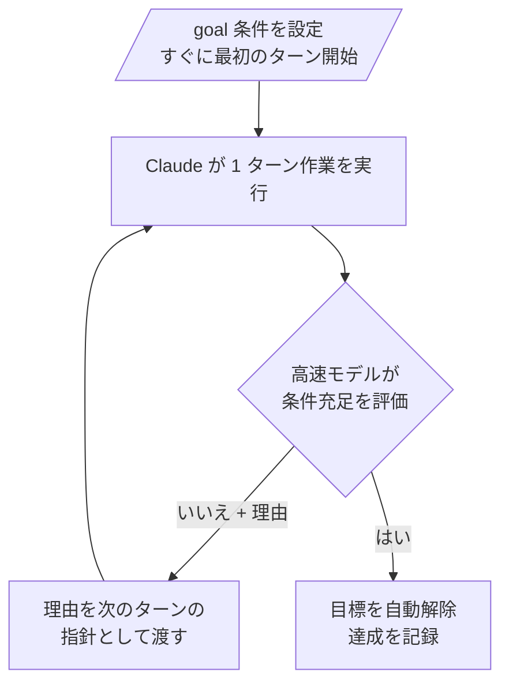

`/goal` コマンドは、検証可能な完了条件を一度設定しておくと、その条件が満たされるまで Claude Code が毎ターン自分で作業を続けてくれる自律連続実行の仕組みです。


**ひとことで言うと**: 毎ターンの最後に高速モデルが「条件は満たされたか？」を判定し、満たされていなければ次のターンを自動的に開始するため、ユーザーは作業が終わるまで再度プロンプトを入力する必要がありません。


## /goal とは

`/goal` は **完了条件** (completion condition) を設定し、その条件が満たされるまで Claude Code がユーザーの追加入力なしで作業を続けるようにします。各ターンが終わると小さな高速モデルが条件が成立しているか確認し、まだであれば制御をユーザーに返す代わりに次のターンを自動的に開始します。条件が満たされると、目標は自動的に解除されます。

検証可能な終了状態を持つ大きな作業に適しています。

- モジュールを新しい API に移行し、すべての呼び出し箇所がコンパイルされてテストが通るまで
- 設計ドキュメントを実装し、すべての受け入れ基準が成立するまで
- 大きなファイルを分割し、各ファイルがサイズ予算を下回るまで
- ラベルが付いたイシューのバックログを、キューが空になるまで処理

1 つのセッションでは目標を 1 つだけ有効化できます。同じ `/goal` コマンドが引数に応じて、設定・状態確認・解除のすべてを担います。

## 動作の仕組み

`/goal` は、セッションスコープの **プロンプトベースの Stop hook** (prompt-based Stop hook) をラップしたものです。Claude が 1 ターンを終えるたびに、条件とそれまでの会話内容が設定済みの小さな高速モデル（デフォルトは Haiku）に渡されます。モデルは yes/no の判定と短い理由を返します。



評価者はツールを呼び出したりファイルを直接読んだりしません。Claude が会話にすでに **示した内容** (surfaced output) だけで判断します。そのため「`test/auth` のすべてのテストが通る」といった条件は、Claude がテストを実行してその結果が会話記録に残るため、うまく機能します。

評価者はセッションが使用しているのと同じプロバイダーで実行され、評価にかかるトークンは小さな高速モデルに課金されるため、本ターンのコストに比べると通常は無視できる程度です。

## 効果的な条件の書き方

評価者は会話に示された内容だけで判定するため、Claude の出力が **証明できる** 形で条件を書く必要があります。長く続く目標でうまく持ちこたえる条件は、たいてい次の 3 つの要素を備えています。

| 要素 | 説明 | 例 |
| --- | --- | --- |
| 測定可能な終了状態 | テスト結果、ビルド終了コード、ファイル数、空のキューなど | "すべての認証テストが通る" |
| 明示された検証方法 | Claude がどう証明するか | "`npm test` exits 0" または "`git status` is clean" |
| 守るべき制約 | 途中で変えてはいけないこと | "no other test file is modified" |

条件は最大 **4,000 文字** (characters) まで書けます。

目標が無限に回るのを防ぐには、条件にターンまたは時間の上限を表す節を含めてください。たとえば `or stop after 20 turns` のように書くと、Claude が毎ターンその上限に対する進捗を報告し、評価者が会話記録を見て一緒に判定します。

```text
/goal test/auth のすべてのテストが通り、lint ステップがクリーンである、or stop after 20 turns
```

目標を設定すると、別途プロンプトを送る必要なく、条件そのものを指針としてすぐに最初のターンが開始されます。目標が有効な間は `◎ /goal active` の表示が現れ、目標がどれくらい実行されているかを示します。

## 状態確認と解除

### 状態確認

引数なしで `/goal` を実行すると、現在の状態を確認できます。

```text
/goal
```

目標が有効な場合は、条件、実行時間、評価されたターン数、現在のトークン使用量、評価者の最新の理由が表示されます。有効な目標がなくても、今回のセッションで先に達成した目標があれば、その条件と所要時間、ターン数、トークン使用量を表示します。

### 目標の解除

条件が満たされる前に有効な目標を取り除くには、`/goal clear` を実行します。

```text
/goal clear
```

`stop`、`off`、`reset`、`none`、`cancel` が `clear` の別名として使えます。新しい会話を始める `/clear` を実行しても、有効な目標は一緒に取り除かれます。

### セッション再開時の動作

セッションが終わったときにまだ有効だった目標は、`--resume` または `--continue` でそのセッションを再開すると復元されます。条件はそのまま引き継がれますが、ターン数、タイマー、トークン使用量の基準値は再開時にすべて初期化されます。すでに達成された目標や解除された目標は復元されません。

### 非対話的な実行

`/goal` は **ヘッドレスモード** (headless mode)、デスクトップアプリ、リモート制御でも動作します。`-p` フラグで目標を設定すると、1 回の呼び出しでループを完了まで実行します。

```bash
claude -p "/goal CHANGELOG.md has an entry for every PR merged this week"
```

非対話的な目標を条件充足の前に中断するには、プロセスを `Ctrl+C` で終了してください。

## /moai loop との比較

`/goal` と `/moai loop` は競合関係ではなく補完関係です。**次のターンを何が開始させるか** で区別すると明確になります。

| 区分 | 次のターンが始まる時点 | 終了する時点 |
| --- | --- | --- |
| `/goal` | 直前のターンが終わったとき | 高速モデルが条件充足を確認したとき |
| `/moai loop` (Ralph Engine) | 診断サイクル（LSP・AST-grep・テスト・カバレッジ）が残りの作業を発見したとき | すべての問題が解決、または最大反復回数に到達 |
| Stop hook | 直前のターンが終わったとき | ユーザーのスクリプトやプロンプトが決定 |

主な違いは次のとおりです。

- **`/moai loop`** は決定論的で、診断ツールが主導する修正ループです。プロジェクトの品質ツールと SPEC ライフサイクルをすでに把握しているため、「ツールが指摘するすべてを直せ」に適しています。
- **`/goal`** は会話記録を対象としたモデル評価ループです。コマンドを実行したりファイルを読んだりせず、Claude がすでに示した内容を判定するため、「この状態が会話で明確に真になるまで続けろ」に適しています。

## MoAI-ADK 運用時の注意

- `/goal` は毎ターンの STOP プロンプトを取り除くだけで、ユーザーに向かう実際の決定を `AskUserQuestion` で尋ねるオーケストレーターの義務を免除するものではありません。
- 有効な目標があっても、plan 段階から run 段階へ移る GATE-2（ユーザー承認ゲート）を自動的に回避することはできません。run 段階への移行にユーザー承認が必要なら、依然として先に尋ねなければなりません。
- 目標は連続して進めるかどうかを決めるだけで、強制プッシュやテーブル削除のような取り消しの難しい作業を事前承認することはありません。

## 要件

- Claude Code **v2.1.139** 以上が必要です。
- 信頼ダイアログを承認したワークスペースでのみ動作します。評価者が hooks システムの一部であるためです。
- いずれかの設定レベルで `disableAllHooks` が有効になっているか、管理設定で `allowManagedHooksOnly` が有効になっていると使用できません。この場合、コマンドは黙って無視されるのではなく理由を知らせてくれます。

## 関連ドキュメント

- [ダイナミックワークフロー](/claude-code/agentic/workflows)
- [/moai loop](/utility-commands/moai-loop)

## 参考資料

- [Keep Claude working toward a goal (`/goal`)](https://code.claude.com/docs/en/goal)


条件は Claude の出力が証明できる形で書き、`or stop after N turns` のような上限の節を常に一緒に入れてください。評価者はファイルを直接読まないため、「テストが通る」よりも「`go test ./...` が 0 で終了する」のように、結果が会話記録に残る検証方法を明示するほうがはるかに安定します。

