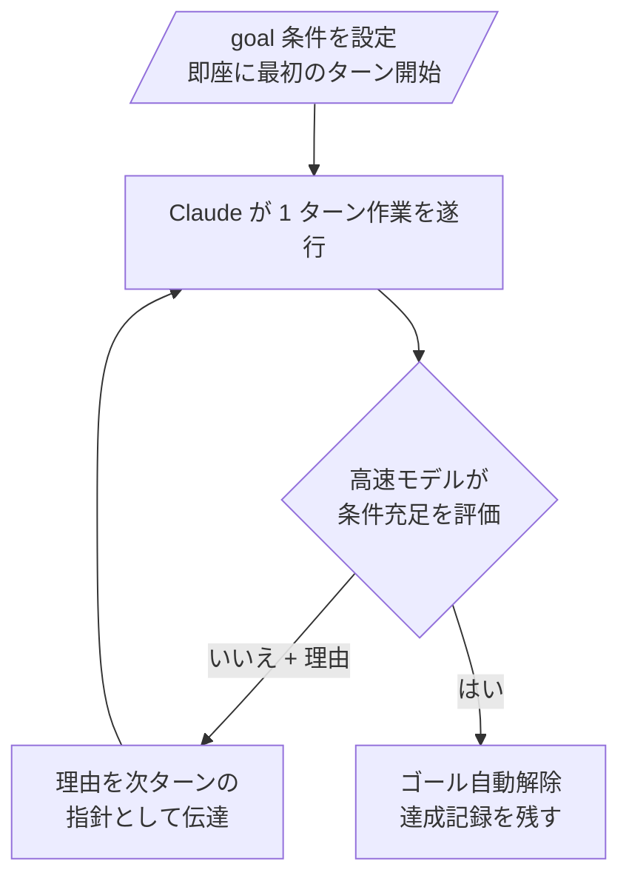

# ゴール指向実行 (/goal)

`/goal` コマンドは、検証可能な完了条件を一度定めておけば、その条件が満たされるまで Claude Code が毎ターン自ら作業を続けるようにする、自律連続実行の仕組みです。



**ひとことで言うと**: 毎ターンの終わりに高速モデルが「条件は満たされたか?」を判定し、まだなら次のターンを勝手に始めるため、ユーザーは終わる瞬間まで再度プロンプトを入力する必要がありません。


## /goal とは

`/goal` は **完了条件** (completion condition) を設定し、その条件が満たされるまで、Claude Code がユーザーの追加入力なしに作業を継続するようにします。各ターンが終わると小さな高速モデルが条件が成立するかを確認し、まだなら制御をユーザーへ返す代わりに次のターンを自動的に開始します。条件が満たされるとゴールは自動的に解除されます。

検証可能な終了状態がある大きな作業に適しています。

- モジュールを新しい API へマイグレーションし、すべての呼び出し箇所がコンパイルされテストが通るまで
- 設計ドキュメントを実装し、すべての受け入れ基準が成立するまで
- 大きなファイルを分割し、各ファイルがサイズ予算を下回るまで
- ラベル付きのイシューバックログをキューが空になるまで処理

1 つのセッションで有効化できるゴールは 1 つだけです。同じ `/goal` コマンドが引数に応じて設定、状態確認、解除のすべてを担います。

## 動作方式

`/goal` は、セッションスコープの **プロンプトベース Stop hook** (prompt-based Stop hook) をラップしたものです。Claude が 1 ターンを終えるたびに、条件とこれまでの会話内容が設定された小さな高速モデル (デフォルト **Haiku**) へ渡されます。モデルは条件が満たされたかを会話に現れた内容だけで判定し、はい/いいえと短い理由を返します。評価者はツールを呼んだりファイルを直接読んだりしないため、Claude がすでに会話へ表した内容だけを根拠に判断します。


```mermaid
flowchart TD
    A[/goal 条件を設定<br>即座に最初のターン開始/] --> B[Claude が 1 ターン作業を遂行]
    B --> C{高速モデルが<br>条件充足を評価}
    C -->|いいえ + 理由| D[理由を次ターンの<br>指針として伝達]
    D --> B
    C -->|はい| E[ゴール自動解除<br>達成記録を残す]
```

評価者はセッションが使うのと同じプロバイダーで実行され、評価にかかるトークンは小さな高速モデルに請求されるため、本体ターンのコストに比べれば通常無視できる水準です。

## 効果的な条件の書き方

評価者は会話に現れた内容だけで判定するため、Claude の出力が **証明できる** 形で条件を書くべきです。長く続くゴールでよく持ちこたえる条件は、たいてい 3 つの要素を備えています。

| 要素 | 説明 | 例 |
| --- | --- | --- |
| 測定可能な終了状態 | テスト結果、ビルドの終了コード、ファイル数、空のキューなど | 「すべての認証テストが通過」 |
| 明示された検証方法 | Claude がどう証明するか | 「`npm test` exits 0」または「`git status` is clean」 |
| 守るべき制約 | 道中で変わってはいけないもの | 「no other test file is modified」 |

条件は最大 **4,000 文字** (characters) まで書けます。

ゴールが無限に回るのを防ぐには、条件にターンまたは時間の上限節を含めてください。たとえば `or stop after 20 turns` と書けば、Claude が毎ターンその上限に対する進捗を報告し、評価者が会話履歴を見て一緒に判定します。

```text
/goal test/auth のすべてのテストが通過し lint 段階がクリーンである, or stop after 20 turns
```

ゴールを設定すると、別途プロンプトを送る必要なく、条件自体を指針として即座に最初のターンが始まります。ゴールが有効な間は `◎ /goal active` の表示が現れ、ゴールがどれだけ長く実行されているかを示します。

## 状態確認と解除

### 状態確認

引数なしで `/goal` を実行すると現在の状態を確認できます。

```text
/goal
```

ゴールが有効なら、条件、実行時間、評価されたターン数、現在のトークン使用量、評価者の直近の理由が表示されます。有効なゴールがなくても、このセッションで先に達成したゴールがあれば、その条件と所要時間、ターン数、トークン使用量を表示します。

### ゴールの解除

条件が満たされる前に有効なゴールを取り除くには、`/goal clear` を実行します。

```text
/goal clear
```

`stop`、`off`、`reset`、`none`、`cancel` が `clear` の別名として使えます。新しい会話を始める `/clear` を実行しても、有効なゴールが一緒に取り除かれます。

### セッション再開時の動作

セッションが終了した時点でまだ有効だったゴールは、`--resume` または `--continue` でそのセッションを再開すると復元されます。条件はそのまま引き継がれますが、ターン数、タイマー、トークン使用量のベースラインは再開時にすべてリセットされます。すでに達成されたか解除されたゴールは復元されません。

### 非対話実行

`/goal` は **非対話モード** (headless mode)、デスクトップアプリ、リモートコントロールでも動作します。`-p` フラグでゴールを設定すると、1 回の呼び出しでループを完了まで実行します。

```bash
claude -p "/goal CHANGELOG.md has an entry for every PR merged this week"
```

非対話のゴールを条件充足の前に中断するには、プロセスを `Ctrl+C` で終了してください。

## /moai loop との比較

`/goal` と `/moai loop` は競合関係ではなく補完関係です。**次のターンを何が始めるのか** で区別すれば明確です。

| 区分 | 次のターンが始まるタイミング | 終了タイミング |
| --- | --- | --- |
| `/goal` | 直前のターンが終わると | 高速モデルが条件充足を確認したとき |
| `/moai loop` (Ralph Engine) | 診断サイクル (LSP・AST-grep・テスト・カバレッジ) が残作業を発見すると | すべてのイシュー解決または最大反復到達 |
| Stop hook | 直前のターンが終わると | ユーザーのスクリプトやプロンプトが決定 |

主な違いは次のとおりです。

- **`/moai loop`** は決定論的で、診断ツールが主導する修正ループです。プロジェクトの品質ツールと SPEC ライフサイクルをすでに知っているため、「ツールが指摘するすべてを直せ」に適しています。
- **`/goal`** は会話履歴を対象としたモデル評価のループです。コマンドを実行したりファイルを読んだりせず、Claude がすでに表した内容を判定するため、「この状態が会話の中で明白に真になるまで続けよ」に適しています。

### /moai goal — プログラマティックな対応物

ネイティブの `/goal` はユーザーだけが入力できる TUI コマンドであり、モデルやワークフローがユーザーの代わりにゴールを設定できません。MoAI-ADK はこのギャップを **`/moai goal`** で埋めます — 同じ「条件宣言 → 毎ターン終了時の Stop-hook 評価 → 充足時に解除」のセマンティクスを、MoAI が所有する goal エンジンで再実装したものです。完了条件を宣言すると、条件が満たされるかターン上限 (デフォルト 30) に達するまでセッションが自ら働き、`/moai goal status` と `/moai goal clear` で状態確認と解除を扱います。`/moai loop` はこの goal エンジンの上のプリセット — 「診断ツールが見つけたイシューのキューが空になるまで」という条件をあらかじめ埋めておいた形 — です。

この条件宣言型ループが、MoAI-ADK の **エージェンティックループエンジニアリング** の柱の実行単位です。ループが回った記録 (何ターン、どんな判定、どんな失敗) が観察として蓄積され、ハーネスがその観察から学習します。

## MoAI-ADK 運用時の注意

- `/goal` は毎ターンの STOP プロンプトを取り除くだけで、ユーザーに向けた実際の決定を `AskUserQuestion` で尋ねるオーケストレーターの義務を免除しません。
- 有効なゴールがあっても、plan フェーズから run フェーズへ移る実装着手承認 (ユーザー承認ゲート) を自動でバイパスすることはできません。run フェーズへの進入にユーザー承認が必要なら、依然として先に尋ねる必要があります。
- ゴールは連続進行の可否を決めるだけであり、強制プッシュやテーブル削除のような取り消しの難しい作業を事前承認するものではありません。

## 要件

- Claude Code **v2.1.139** 以上が必要です。
- 信頼ダイアログを受け入れたワークスペースでのみ動作します。評価者が hooks システムの一部だからです。
- どの設定レベルであれ `disableAllHooks` が有効なら使えません。
- 組織レベルの管理設定で `allowManagedHooksOnly` が有効な場合も使えません。
- 上記の条件が満たされないとき、コマンドは静かに無視されるのではなく、使用不可の理由を知らせてくれます。

## 関連ドキュメント

- [ダイナミックワークフロー](/claude-code/agentic/workflows)
- [/moai loop](/utility-commands/moai-loop)

## 参考資料

- [Goal directive (`/goal`) — Claude Code 公式ドキュメント](https://code.claude.com/docs/en/goal)


条件は Claude の出力が証明できる形で書き、`or stop after N turns` のような上限節を常に一緒に入れてください。評価者はファイルを直接読まないため、「テストが通る」より「`go test ./...` が 0 で終了する」のように、会話履歴に結果が残る検証方法を明示するほうがはるかに安定します。

