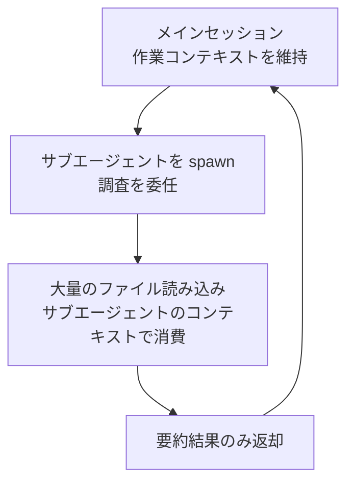

数百万行規模の単一リポジトリや、複数パッケージに分割されたモノレポで Claude Code を効率的に扱う方法をまとめます。


**ひとことで言うと**: 大規模コードベース (large codebase) の要点は「すべてを読ませること」ではなく「今の作業が触れる部分だけをコンテキストに載せること」です。


## なぜ専用の戦略が必要なのか

Claude Code は規模に関係なく動作しますが、コードベースが大きくなるほど、小規模プロジェクト向けに調整された既定動作が問題を引き起こします。作業と無関係な指示やファイル読み込みがコンテキストウィンドウ (context window) を埋めてトークンを浪費し、結果として応答品質を低下させます。

そのため、大規模コードベースにおけるベストプラクティス (best practice) は一点に収束します。それは **作業が実際に触れる領域へ Claude の視野を絞ること** です。

| 問題 | 絞り込む手段 |
| --- | --- |
| ルートの `CLAUDE.md` 一つがすべてのサブシステムのルールを抱える | ディレクトリごとの `CLAUDE.md` 分割 |
| 作業しないパッケージの `CLAUDE.md` まで読み込まれる | `claudeMdExcludes` 設定 |
| 生成コード・ベンダーコードが検索結果に混ざる | `permissions.deny` の `Read` 拒否ルール |
| シンボル定義・呼び出し元を探すために多数のファイルを読む | コードインテリジェンスプラグイン (LSP) |
| ワークツリーがツリー全体をチェックアウトする | `worktree.sparsePaths` スパースチェックアウト |

## どこで Claude を起動するかを決める

`claude` を実行する場所は、ファイルアクセス範囲と、起動時に読み込まれる `CLAUDE.md` の範囲をそのまま決定します。最初に決めるべき項目です。

| 起動位置 | ファイルアクセス | 起動時に読み込まれる CLAUDE.md | 適したケース |
| --- | --- | --- | --- |
| リポジトリルート | すべてのファイル | ルートのみ (下位は読み込み時にオンデマンド) | 作業が複数のパッケージ・サブシステムにまたがる |
| サブディレクトリ | そのサブツリーのみ | そのディレクトリ + すべての上位ディレクトリ | 作業が一つのパッケージ・サブシステムに限定される |

一つのパッケージだけに集中するなら、そのパッケージディレクトリで `claude` を実行するだけで、ほかのパッケージの指示がコンテキストから外れます。なお `.claude/settings.json` のプロジェクト設定は `CLAUDE.md` と異なり、上位ディレクトリから継承されず、起動ディレクトリでのみ読み込まれます。

## コンテキスト管理: 必要な部分だけを読む

大規模コードベースでコンテキストを占有するコストは、大きく二つあります。常に読み込まれる指示と、作業中に発生するファイル読み込みです。どちらも減らす必要があります。

### ディレクトリごとの CLAUDE.md で指示を分割する

ルートの `CLAUDE.md` 一つにすべてのルールを詰め込むと、すべてのサブシステムのルールを抱えて肥大化するか、汎用的すぎて役に立たなくなります。指示をディレクトリごとに分けると、Claude はリポジトリ全体のルールに加えて **今作業しているコードのルールだけ** を読み込みます。

```markdown
# packages/api/CLAUDE.md
This package is the REST API server.

- Run tests: `npm test` (uses Vitest)
- Run dev server: `npm run dev` (port 3001)

API routes are in src/routes/. Database queries use Knex in src/db/.
```

`packages/api/` で起動すると、ルートの `CLAUDE.md` と `packages/api/CLAUDE.md` が一緒に読み込まれ、`packages/web/` の指示はコンテキストに入りません。これらのファイルはリポジトリにコミットして、チームメンバーが共有できるようにします。

### 無関係な CLAUDE.md を除外する

ルートで起動すると、サブディレクトリの `CLAUDE.md` はそこのファイルを読んだ瞬間に読み込まれます。他チームのパッケージやレガシーコードのように決して作業しない領域は、`claudeMdExcludes` で完全に遮断できます。

```json
{
  "claudeMdExcludes": [
    "**/packages/admin-dashboard/**",
    "**/packages/legacy-*/**"
  ]
}
```

パターンは絶対パスに対するグロブ (glob) でマッチするため、ツリーのどこでもマッチさせるには `**/` で始めます。個人用なら `.claude/settings.local.json` に置けば十分です。ただし、このリストは静的なので、「今日はこのパッケージ、明日はあのパッケージ」のように毎回変える必要があるなら、除外リストを直すより、該当パッケージのディレクトリで Claude を起動するほうがよいでしょう。

### 生成コード・ベンダーコードの読み込みを遮断する

Claude のコンテンツ検索は既定で `.gitignore` を尊重するため、`node_modules/`、`dist/`、`build/` は追加設定なしで検索結果から外れます。一方、リポジトリにコミットされたベンダー SDK や生成コードは、`permissions.deny` の `Read` 拒否ルールで遮断します。

```json
{
  "permissions": {
    "deny": [
      "Read(./**/dist/**)",
      "Read(./**/*.generated.*)",
      "Read(./vendor/**)"
    ]
  }
}
```

拒否ルールは、Claude の組み込みファイルツールと、`cat`・`head`・`grep`・`find` のような認識可能な Bash ファイルコマンドの両方をカバーします。ただし、再帰検索の出力からパスをフィルタリングするわけではなく、ファイルを直接開く任意のサブプロセスまでは遮断できません。

## 並列探索: サブエージェントと Explore

作業と無関係なファイルをコンテキストに積み上げないもう一つの方法は、探索そのものを別のコンテキストで実行させることです。サブエージェント (sub-agent) の中で調査を回すと、その過程で発生した多数のファイル読み込みはメイン会話に残らず、要約された結果だけが返ってきます。



Explore エージェントは、読み取り専用のコードベース探索に特化した Anthropic 組み込みサブエージェントです。構造を把握したり、ある機能がどこにあるかを探したりするとき、メインセッションが自ら数十のファイルを読む代わりに Explore に委任すれば、メインコンテキストはクリーンに保たれます。

> MoAI-ADK はこのパターンをもう一段構造化し、読み取り専用の調査は Explore やサブエージェントへ並列分散し、統合だけをメインが担うようにオーケストレーションします。詳しい委任ポリシーは [サブエージェント](/claude-code/agentic/sub-agents) のドキュメントを参照してください。

## 効率的な検索パターン: Glob → Grep → Read

大規模コードベースでは、検索の順序そのものがトークン効率を左右します。広く始めて徐々に絞り込む漸進的な絞り込み (progressive narrowing) が基本です。

| ステップ | ツール | 目的 |
| --- | --- | --- |
| 1 | Glob | 名前・パターンで候補ファイルを絞り込む |
| 2 | Grep | 内容でマッチするファイルを絞り込む (`files_with_matches`) |
| 3 | Grep | コンテキスト行とともに精密に検査する |
| 4 | Read | `offset`/`limit` で必要な範囲だけを読む |

ファイル全体を丸ごと読む前に、必ず検索で位置を先に見つけ、そのうえで該当範囲だけを部分的に読むのが要点です。

### コードインテリジェンスでファイル読み込みを減らす

シンボルの定義や呼び出し元を探す作業は、多数のファイル読み込みと grep 呼び出しに膨らみがちです。コードインテリジェンスプラグイン (LSP ベース) を組み込むと、Claude はツリーをスキャンする代わりに、定義へのジャンプ・参照検索・型エラー確認を言語サーバーへ直接問い合わせます。

```bash
/plugin install typescript-lsp@claude-plugins-official
```

公式マーケットプレイスは、TypeScript、Python、Go、Rust など主要言語のプラグインを提供します。各開発者のマシンに、その言語の言語サーバーバイナリがインストールされている必要があります。この機能は `claudeMdExcludes`・`Read` 拒否ルールと相性が良いです。前者二つが無関係なコンテンツをコンテキストの外へ押し出し、コードインテリジェンスは残った領域で定義を探すためにファイルを読まないようにします。

## ワークツリーの範囲を絞る

`--worktree` フラグは、変更をメインのチェックアウトから隔離するために、新しいワークツリー (worktree) でセッションを開始します。既定値はリポジトリ全体のチェックアウトですが、大規模リポジトリでは `worktree.sparsePaths` で git スパースチェックアウトを適用し、必要なディレクトリだけをディスクに書き出せます。

```json
{
  "worktree": {
    "sparsePaths": [".claude", "packages/api", "packages/shared"],
    "symlinkDirectories": ["node_modules"]
  }
}
```

パスは起動ディレクトリに関係なく、リポジトリルート基準です。ディレクトリ単位で列挙し、`package.json` のようなルートレベルのファイルは常に一緒にチェックアウトされます。サブエージェントごとのワークツリー隔離に特に有用で、並列のサブエージェントごとにツリー全体ではなく軽量なチェックアウトを受け取れます。`symlinkDirectories` を併せれば、`node_modules` のような大きなディレクトリを複製せず、シンボリックリンクで共有します。

## 漸進的な理解とメモリでプロジェクト知識を固定する

大規模コードベースは一度に理解できません。探索で分かった構造やルールを `CLAUDE.md` に書いておけば、その知識は毎セッション再発見されることなくコンテキストに固定されます。

- **ルートの `CLAUDE.md`**: コーディング標準、コミット規約、リポジトリレイアウトなど、どこでも適用されるルール
- **ディレクトリごとの `CLAUDE.md`**: その領域のスタックに特化したルール (モノレポならパッケージごとに、単一ツリーなら `src/db/`・`src/api/` のようなサブシステムごとに)

`CLAUDE.md` を最新に保つための実践方法もあります。プルリクエストでほかのドキュメント変更と同じように一緒にレビューし、主要なモデルリリースの後には、旧モデルの限界を回避するために入れていたルールを再点検します。`Stop` hook を置いて、セッションが終わるときに `CLAUDE.md` の更新案を提案させることもできます。

### パッケージをまたぐ変更を扱う

共有型とそのすべての呼び出し元を一緒に直すように、変更が複数パッケージにまたがるときは、二つのことが役立ちます。

1. **一つのセッションに変更全体を渡す**: 共有の編集と呼び出し元を一緒に扱えば、各編集の判断根拠がパッケージごとに再導出されることなく、一貫して保たれます。
2. **編集前に計画をファイルに保存する**: まず計画を立て、その計画をマークダウンファイルとして保存します。長いセッションは途中でコンテキストを圧縮 (compaction) するため、保存された計画は会話履歴が失われても生き残ります。

## 関連ドキュメント

- [サブエージェント](/claude-code/agentic/sub-agents)
- [コンテキストウィンドウ](/claude-code/context-memory/context-window)

## 参考資料

- [Set up Claude Code in a monorepo or large codebase](https://code.claude.com/docs/en/large-codebases)


実践的なヒント: 新しい作業を始めるときは「この作業が触れるディレクトリはどこか」をまず決め、可能ならそのディレクトリで `claude` を実行しましょう。起動位置を一つうまく定めるだけで、無関係な `CLAUDE.md` やファイル読み込みが自動的にコンテキストから外れます。

