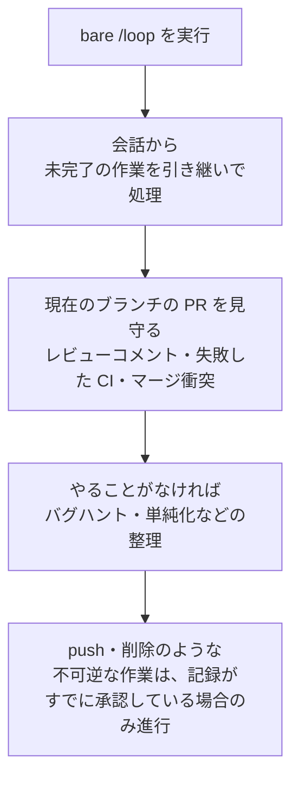

# 予約タスク

Claude Code の予約タスク (scheduled tasks) は、同じセッションが開いている間、プロンプトを決まった周期で再実行してくれる機能です。


**ひとことで言うと**: デプロイのポーリング、PR の見守り、定期点検を毎回手で入力せず、`/loop` と cron ツールに任せる、セッションに紐づいた軽量な自動化です。


予約タスクは Claude Code v2.1.72 以上で利用できます。`claude --version` でバージョンを確認してください。

## 予約タスクとは

予約タスクは、1 つのプロンプトを一定周期で自動的に再実行する仕組みです。デプロイが終わったかをポーリングしたり、PR を見守ったり、長時間かかるビルドを再確認したり、あとでやることを知らせる用途で使います。

最も重要な性質は **セッションスコープ (session-scoped)** であることです。タスクは現在の会話の中だけで生きており、新しい会話を始めるとすべて消えます。`--resume` や `--continue` でセッションを引き継いで開いた場合、まだ期限切れになっていないタスクは復元されます。

| 性質 | 動作 |
| --- | --- |
| 実行場所 | 自分のマシン (開いているセッション内) |
| 動作タイミング | Claude のターンとターンの間、アイドル状態のとき |
| ライフサイクル | 現在の会話に紐づき、新しい会話を始めると消滅 |
| 復元 | `--resume` / `--continue` 時、期限切れでないタスクのみ |
| 最小間隔 | 1 分 (cron の 1 分単位) |

この機能はポーリングを代替するツールです。イベントが発生した瞬間に反応する必要がある場合は、ポーリングの代わりに Channels で CI に失敗をセッションへ直接プッシュさせ、条件が満たされるまでターンごとに作業を続けさせたい場合は、周期実行の代わりに `/goal` を使います。

## ユースケース

予約タスクは、セッションが開いている間に短く繰り返す作業に最も適しています。

| ケース | 例のプロンプト | 効果 |
| --- | --- | --- |
| 定期点検 | `/loop 5m check if the deployment finished` | デプロイ完了の有無を 5 分ごとに確認 |
| リリース追跡 | `/loop check whether CI passed and address any review comments` | CI とレビューコメントを適応的な間隔で追跡 |
| レポート生成 | `/loop 1h summarize new commits on main` | 一定周期で要約レポートを作成 |
| 一度きりの通知 | `remind me at 3pm to push the release branch` | 指定時刻に一度だけ通知し、その後自動削除 |

パッケージ化されたワークフローを反復のたびに再実行することもできます。たとえば `/loop 20m /review-pr 1234` のように、プロンプトの位置に別のコマンドを渡せばよいだけです。

## 作成・管理の概要

### /loop で反復実行する

`/loop` は、セッションを開いたままプロンプトを反復実行する最速の方法であるバンドル **スキル (bundled skill)** です。間隔とプロンプトはどちらも任意で、何を渡すかによって動作が変わります。

| 渡す値 | 例 | 動作 |
| --- | --- | --- |
| 間隔 + プロンプト | `/loop 5m check the deploy` | 固定周期で実行 |
| プロンプトのみ | `/loop check the deploy` | Claude が反復のたびに間隔を自分で選ぶ |
| 間隔のみ、または何も渡さない | `/loop` | 内蔵のメンテナンスプロンプトまたは `loop.md` を実行 |

間隔を渡すと、Claude はその値を cron 式に変換してタスクを登録し、周期とタスク ID を確認してくれます。間隔は `30m` のように前に置くことも、`every 2 hours` のように後ろに置くこともできます。サポートする単位は `s`（秒）、`m`（分）、`h`（時間）、`d`（日）です。cron は 1 分単位なので、秒単位は切り上げられ、`7m` や `90m` のようにきれいに割り切れない間隔は最も近い単位に丸められたうえで、何に決めたかを知らせてくれます。

間隔を省略すると、Claude は固定の cron ではなく、反復のたびに 1 分から 1 時間の間の遅延を動的に選びます。ビルドが終わりかけていたり PR が活発だったりすれば短く、何も待機していなければ長く待ちます。

```text
/loop check whether CI passed and address any review comments
```

### 内蔵のメンテナンスプロンプト

プロンプトを省略すると、Claude は内蔵のメンテナンスプロンプトを使います。反復のたびに次の順序で作業を処理します。



`bare /loop` はこのプロンプトを動的な間隔で実行し、`/loop 15m` のように間隔を加えると固定周期で実行します。

### loop.md でデフォルトプロンプトを差し替える

`loop.md` ファイルを置くと、内蔵のメンテナンスプロンプトを自分の指示文で置き換えます。このファイルは `bare /loop` のための単一のデフォルトプロンプトを定義し、コマンドラインにプロンプトを直接渡すと無視されます。

| パス | 範囲 |
| --- | --- |
| `.claude/loop.md` | プロジェクトレベル。両方のファイルがある場合は優先 |
| `~/.claude/loop.md` | ユーザーレベル。プロジェクトファイルがない場合に適用 |

ファイルは決まった構造のない通常の Markdown です。`/loop` プロンプトを直接入力するように書きます。

```markdown
Check the `release/next` PR. If CI is red, pull the failing job log,
diagnose, and push a minimal fix. If new review comments have arrived,
address each one and resolve the thread. If everything is green and
quiet, say so in one line.
```

`loop.md` の修正は次の反復から反映されるため、ループが回っている最中でも指示文を調整できます。25,000 バイトを超える内容は切り捨てられます。

### 一度きりの通知

一度だけ実行する通知は、`/loop` の代わりに自然言語で説明します。Claude は一度実行したあとに自分自身を削除する単発タスクを登録し、実行時刻を特定の分・時に固定して知らせます。

```text
in 45 minutes, check whether the integration tests passed
```

### タスク一覧の表示・キャンセル

タスクの照会とキャンセルも自然言語で依頼すればよいです。内部的に Claude は次の cron ツールを使います。

| ツール | 用途 |
| --- | --- |
| `CronCreate` | 新しいタスクを登録。5 フィールドの cron 式、実行プロンプト、繰り返し／単発の別を受け取る |
| `CronList` | すべての予約タスクを ID・スケジュール・プロンプトとともに列挙 |
| `CronDelete` | ID でタスクをキャンセル |

各タスクには `CronDelete` に渡せる 8 文字の ID があり、1 つのセッションは最大 50 個のタスクを保持できます。待機中の `/loop` を止めるには `Esc` を押します。自然言語で予約したタスクは `Esc` の影響を受けず、削除するまで残ります。

### 動作の仕組みと制約

スケジューラは毎秒、期限の来たタスクを確認して低い優先度でキューに入れ、予約されたプロンプトは応答の途中ではなくターンとターンの間に実行されます。すべての時刻はローカルタイムゾーンで解釈されるため、`0 9 * * *` は UTC ではなく Claude Code を実行している場所の午前 9 時を意味します。

- **ジッター (jitter)**: 複数のセッションが同じ瞬間に API を叩かないように、タスク ID から派生した決定的なオフセットを加えます。繰り返しタスクは予約時刻以降、最大 30 分、正時・半時の単発タスクは最大 90 秒早く発動することがあります。正確なタイミングが必要なら、`:00` や `:30` でない分を選びます。
- **7 日の有効期限 (seven-day expiry)**: 繰り返しタスクは作成から 7 日後に最後にもう一度発動したあと、自分自身を削除します。
- **取りこぼしの追いつきなし**: Claude が長いリクエストで忙しい間に予約時刻が過ぎた場合、アイドル状態になったときに一度だけ発動し、流れた回数の分だけ追いつくことはしません。

スケジューラ全体をオフにするには、環境変数 `CLAUDE_CODE_DISABLE_CRON=1` を設定します。すると cron ツールと `/loop` が使えなくなり、すでに予約済みのタスクも発動を止めます。

## 非対話 (headless) 実行との連携

予約タスクは、セッションが開いていてアイドル状態のときだけ発動します。したがって、マシンがオフになっていたり、セッションがなくても動作する必要がある無人自動化には適していません。こうした場合は、別の永続的なスケジューリングオプションを使います。

| オプション | 実行場所 | マシンの起動が必要 | 開いたセッションが必要 |
| --- | --- | --- | --- |
| `/loop` | 自分のマシン | 必要 | 必要 |
| Desktop 予約タスク | 自分のマシン | 必要 | 不要 |
| Routines (cloud) | Anthropic クラウド | 不要 | 不要 |
| GitHub Actions | CI | 不要 | 不要 |

CI パイプラインや GitHub Actions の `schedule` トリガーで `claude -p` を非対話で呼び出せば、セッションに紐づかない cron 自動化を構成できます。まとめると、セッション内の素早いポーリングは `/loop`、ローカルファイル・ツールへのアクセスが必要な無人作業は Desktop 予約タスク、マシンと無関係に確実に動かす必要がある作業は Routines を使います。

MoAI-ADK の観点では、`/loop` を SPEC 実装中の PR 点検や CI ステータス追跡に軽く活用し、定期リリース追跡のような無人作業は GitHub Actions 側のスケジューリングへ分離するのがベストプラクティスです。

## 関連ドキュメント

- [フック (Hooks)](/claude-code/extensibility/hooks)
- [目標指向の実行 (/goal)](/claude-code/agentic/goal)

## 参考資料

- [Run prompts on a schedule (Claude Code Docs)](https://code.claude.com/docs/en/scheduled-tasks)


固定周期の `/loop` は 7 日後に自動で期限切れになるため、もっと長く動かす必要があるなら、期限切れの前に再登録するか、最初から Routines・Desktop 予約タスクのような永続的なスケジューリングを選ぶほうが安全です。

