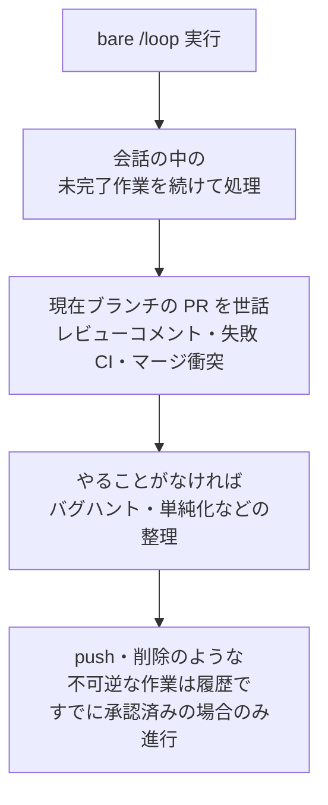

# スケジュールタスク

Claude Code のスケジュールタスク (scheduled tasks) は、同じセッションが開いている間、プロンプトを決まった周期で再実行できるようにする機能です。


**ひとことで言うと**: デプロイのポーリング、PR の世話、定期点検を、人が毎回入力せずに `/loop` と cron ツールへ任せる、セッションに紐づいた軽量な自動化です。


スケジュールタスクは Claude Code **v2.1.72** 以上で使えます。`claude --version` でバージョンを確認します。

## スケジュールタスクとは

スケジュールタスクは、1 つのプロンプトを一定周期で自動的に再実行する仕組みです。デプロイが終わったかをポーリングしたり、PR の面倒を見たり、時間のかかるビルドを再度覗いたり、後でやることを知らせたりする用途に使います。

最も重要な性質は **セッションスコープ** (session-scoped) だという点です。タスクは現在の会話の中でのみ生きており、新しい会話を始めるとすべて消えます。`--resume` や `--continue` でセッションを続けて開けば、まだ期限切れでないタスクは復元されます。

| 性質 | 動作 |
| --- | --- |
| 実行場所 | 自分のマシン (開いているセッション内) |
| 動作タイミング | Claude のターンとターンの間、アイドル状態のとき |
| ライフサイクル | 現在の会話に紐づき、新しい会話の開始で消滅 |
| 復元 | `--resume` / `--continue` 時に未期限切れのタスクのみ |
| 最小間隔 | **1 分** (cron の 1 分単位) |
| 最大タスク数 | セッションあたり 50 個 |

この機能は、セッションスコープの軽量ポーリングを代替するツールです。他のスケジューリングオプションと比較すると:

| オプション | 実行場所 | 最小間隔 | セッション必要 | マシン稼働必須 |
| --- | --- | --- | --- | --- |
| `/loop` | 自分のマシン | **1 分** | 必要 | 必要 |
| Cloud Routines | Anthropic クラウド | 1 時間 | 不要 | 不要 |
| Desktop スケジュールタスク | 自分のマシン | 1 分 | 不要 | 必要 |

イベントの発生と同時に反応する必要があるならポーリングの代わりに Channels で CI が失敗をセッションへ直接プッシュするようにし、条件が満たされるまでターンごとに働き続けさせたいなら、周期実行の代わりに `/goal` を使います。

## ユースケース

スケジュールタスクは、セッションが開いている間に短く繰り返す作業に最も適しています。

| ケース | 例のプロンプト | 効果 |
| --- | --- | --- |
| 定期点検 | `/loop 5m check if the deployment finished` | デプロイ完了を 5 分ごとに確認 |
| リリース追跡 | `/loop check whether CI passed and address any review comments` | CI とレビューコメントを適応的な間隔で追跡 |
| レポート生成 | `/loop 1h summarize new commits on main` | 一定周期で要約レポートを作成 |
| 単発リマインダー | `remind me at 3pm to push the release branch` | 指定時刻に 1 回だけ通知して自動削除 |

パッケージ化されたワークフローを毎回の反復で再実行することもできます。たとえば `/loop 20m /review-pr 1234` のように、プロンプトの位置に別のコマンドを渡せばよいのです。

## 作成・管理の概要

### /loop で繰り返し実行する

`/loop` は、セッションを開いたままプロンプトを繰り返し実行する最速の方法である、バンドル **スキル** (bundled skill) です。間隔とプロンプトはどちらも任意で、何を渡すかによって動作が変わります。

| 渡す値 | 例 | 動作 |
| --- | --- | --- |
| 間隔 + プロンプト | `/loop 5m check the deploy` | 固定周期で実行 |
| プロンプトのみ | `/loop check the deploy` | Claude が毎回の反復で間隔を自ら選ぶ |
| 間隔のみ、または何も渡さない | `/loop` | 組み込みのメンテナンスプロンプトまたは `loop.md` を実行 |

間隔を渡すと Claude がその値を cron 式に変換してタスクを登録し、周期とタスク ID を確認してくれます。間隔は `30m` のように前に置いても、`every 2 hours` のように後ろに置いても構いません。対応する単位は `s` (秒)、`m` (分)、`h` (時間)、`d` (日) です。cron は 1 分単位なので秒は切り上げられ、`7m` や `90m` のようにきれいに割り切れない間隔は最も近い単位へ丸めたうえで、何に決めたかを知らせてくれます。

間隔を省略すると、Claude は固定 cron の代わりに毎回の反復で 1 分から 1 時間の間の遅延を動的に選びます。ビルドが終わりかけていたり PR が活発なら短く、何も待っていなければ長く待ちます。

```text
/loop check whether CI passed and address any review comments
```

### 組み込みのメンテナンスプロンプト

プロンプトを省略すると、Claude は組み込みのメンテナンスプロンプトを使います。毎回の反復で次の順に仕事を処理します。


```mermaid
flowchart TD
    A["bare /loop 実行"] --> B["会話の中の<br>未完了作業を続けて処理"]
    B --> C["現在ブランチの PR を世話<br>レビューコメント・失敗 CI・マージ衝突"]
    C --> D["やることがなければ<br>バグハント・単純化などの整理"]
    D --> E["push・削除のような<br>不可逆な作業は履歴で<br>すでに承認済みの場合のみ進行"]
```

`bare /loop` はこのプロンプトを動的な間隔で実行し、`/loop 15m` のように間隔を加えると固定周期で実行します。

### loop.md でデフォルトプロンプトを変える

`loop.md` ファイルを置くと、組み込みのメンテナンスプロンプトを自分の指示文に置き換えます。このファイルは `bare /loop` 用の単一のデフォルトプロンプトを定義し、コマンドラインでプロンプトを直接渡した場合は無視されます。

| パス | 範囲 |
| --- | --- |
| `.claude/loop.md` | プロジェクトレベル。両方のファイルがあればこちらが優先 |
| `~/.claude/loop.md` | ユーザーレベル。プロジェクトのファイルがないとき適用 |

ファイルは決まった構造のない通常の Markdown です。`/loop` のプロンプトを直接入力するように書きます。

```markdown
Check the `release/next` PR. If CI is red, pull the failing job log,
diagnose, and push a minimal fix. If new review comments have arrived,
address each one and resolve the thread. If everything is green and
quiet, say so in one line.
```

`loop.md` の修正は次の反復から反映されるため、ループが回っている最中でも指示文を磨けます。25,000 バイトを超える内容は切り詰められます。

### 単発リマインダー

一度だけ実行するリマインダーは、`/loop` の代わりに自然言語で説明します。Claude は 1 回実行した後に自分自身を削除する単発タスクを登録し、実行時刻を特定の分・時に固定して知らせてくれます。

```text
in 45 minutes, check whether the integration tests passed
```

### タスク一覧の確認・キャンセル

タスクの照会とキャンセルも自然言語で依頼すればよいのです。内部的に Claude は次の cron ツールを使います。

| ツール | 用途 |
| --- | --- |
| `CronCreate` | 新規タスク登録。5 フィールドの cron 式、実行プロンプト、繰り返し/単発の別を受け取る |
| `CronList` | すべてのスケジュールタスクを ID・スケジュール・プロンプトとともに一覧表示 |
| `CronDelete` | ID でタスクをキャンセル |

各タスクには `CronDelete` に渡せる 8 文字の ID があり、1 セッションは最大 50 個のタスクを保有できます。待機中の `/loop` を止めるには `Esc` を押します。自然言語で予約したタスクは `Esc` の影響を受けず、削除するまで残ります。

### 動作方式と制約

スケジューラーは毎秒、期限を迎えたタスクを確認して低い優先度でキューに入れ、予約されたプロンプトは応答の途中ではなくターンとターンの間に実行されます。すべての時刻はローカルタイムゾーンで解釈されるため、`0 9 * * *` は UTC ではなく、Claude Code を実行している場所の午前 9 時を意味します。

- **ジッター (jitter)**: 複数のセッションが同じ瞬間に API を叩かないよう、タスク ID から導出した決定論的なオフセットを加えます。繰り返しタスクは予約時刻から最大 **30 分** 遅れて発動することがあり、単発タスクは最大 **90 秒** 早く発動することがあります。正確なタイミングが必要なら `:00` や `:30` ではない分を選びます。
- **7 日で期限切れ**: 繰り返しタスクは作成から 7 日後に最後に一度発動した後、**自動的に削除** されます。
- **取りこぼしの追い付きなし**: Claude が長いリクエストで忙しい間に予約時刻が過ぎた場合、アイドルになったとき 1 回だけ発動し、逃した回数分を取り戻すことはしません。

スケジューラー全体をオフにするには、環境変数 `CLAUDE_CODE_DISABLE_CRON=1` を設定します。すると cron ツールと `/loop` が使えなくなり、すでに予約されたタスクも発動を止めます。

## 非対話 (headless) 実行との連携

スケジュールタスクは、セッションが開いていてアイドル状態のときにのみ発動します。したがってマシンがオフだったり、セッションなしでも動くべき無人自動化には適しません。そうした場合は別の永続スケジューリングオプションを使います。

| オプション | 実行場所 | マシン稼働必要 | 開いたセッション必要 |
| --- | --- | --- | --- |
| `/loop` | 自分のマシン | 必要 | 必要 |
| Desktop スケジュールタスク | 自分のマシン | 必要 | 不要 |
| Routines (cloud) | Anthropic クラウド | 不要 | 不要 |
| GitHub Actions | CI | 不要 | 不要 |

CI パイプラインや GitHub Actions の `schedule` トリガーで `claude -p` を非対話で呼び出せば、セッションに縛られない cron 自動化を構成できます。まとめると、セッション内の素早いポーリングは `/loop`、ローカルのファイル・ツールへのアクセスが必要な無人作業は Desktop スケジュールタスク、マシンと無関係に確実に回すべき作業は Routines を使います。

MoAI-ADK の観点では、スケジュールタスクは自律実行スペクトラムの 1 つの軸です — 条件が満たされるまで毎ターン働くのは `/goal` (そして MoAI の `/moai goal`)、決まった周期で再度覗くのは `/loop` の役割です。実践では `/loop` を SPEC 実装中の PR 点検や CI 状態の追跡に軽く活用し、定期リリース追跡のような無人作業は GitHub Actions 側のスケジューリングへ分離するのがベストプラクティスです。周期実行は毎回の反復がトークンを消費する点も忘れないでください — ポーリング間隔がそのままコストのダイヤルです。

## 関連ドキュメント

- [フック (Hooks)](/ja/claude-code/extensibility/hooks)
- [ゴール指向実行 (/goal)](/ja/claude-code/agentic/goal)

## 参考資料

- [Scheduled tasks — Claude Code 公式ドキュメント](https://code.claude.com/docs/en/scheduled-tasks)


固定周期の `/loop` は 7 日後に自動で期限切れになるため、より長く回す必要があるなら期限前に再登録するか、最初から Routines・Desktop スケジュールタスクのような永続スケジューリングを選ぶほうが安全です。

