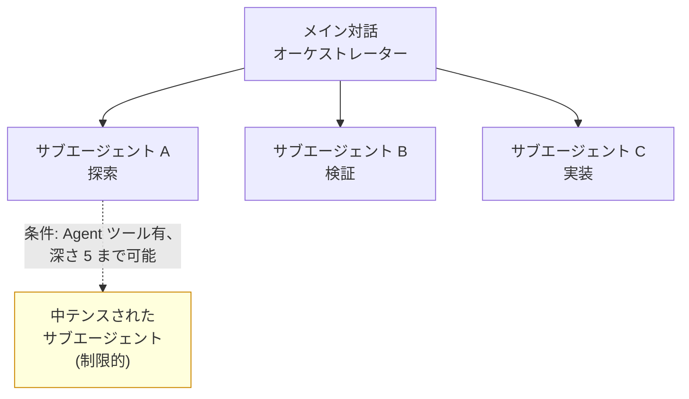

# サブエージェント

Claude Code のサブエージェントは、付随的な作業を別個のコンテキストウィンドウで処理し、結果の要約だけをメイン対話に返す委任ワーカーです。


**ひとことで言うと**: サブエージェントは、探索・検証といった付随的な仕事を自分専用のコンテキストで処理し、要約だけを返すことで、メイン対話をクリーンに保つ委任ワーカーです。



このページは Claude Code レベルの概念概要です。MoAI-ADK が 8 個のエージェントカタログをどのように構成・委任するか、自分でエージェントを作る実践的な方法は [エージェントガイド](/advanced/agent-guide) と [ビルダーエージェントガイド](/advanced/builder-agents) で詳しく扱います。


## サブエージェントとは

サブエージェントは、特定の種類の作業を専門に担う特化型 AI ワーカーです。検索結果、ログ、ファイル内容でメイン対話が溢れかえりそうな付随的な作業が発生したとき、その仕事をサブエージェントが **自分専用のコンテキストウィンドウ** (own context window) で処理し、結果の要約だけを返します。

各サブエージェントは次のものを独立して持ちます。

| 構成要素 | 説明 |
|-----------|------|
| システムプロンプト | サブエージェントファイルの本文がそのまま役割の指示文になります |
| ツールアクセス権限 | 利用可能なツールを許可/ブロックリストで制限できます |
| 独立した権限 | メイン対話の権限を継承しつつ、追加の制限を設けられます |
| モデル選択 | `haiku` のような高速で安価なモデルでコストを下げられます |

Claude は各サブエージェントの `description` を見て、いつ委任するかを判断します。そのため、説明を明確に書くことがよい委任の出発点になります。

Claude Code には `Explore` (読み取り専用のコードベース探索)、`Plan` (プランモードのリサーチ)、`general-purpose` (探索＋修正の複合作業) といった組み込みサブエージェントが含まれています。

Explore と Plan はメインセッションの CLAUDE.md と git status をスキップし、より高速かつ軽量に動作します。Explore は `thoroughness` オプションで探索の深さを `quick`/`medium`/`very-thorough` から選択できます。

## 核心的な制約: サブエージェントはサブエージェントを spawn できない

最も重要な構造的制約です。**サブエージェントは別のサブエージェントを spawn できません** (subagents cannot spawn other subagents)。つまり委任はメイン対話から一段だけ下がり、無限のネストは発生しません。

### v2.1.172 以降: 制限的 中テンス (深さ 5 ハード制限)

Claude Code v2.1.172 からは **条件付きサブエージェント中テンス**が可能になりました。ただし設定オプションがあります。

| 設定 | 動作 | 用途 |
|------|------|------|
| サブエージェント定義に `Agent` 含む (frontmatter `tools:` リスト) | 中テンス許可 | 深さ 5 まで (ハード制限) |
| `Agent` ツール省略 | 中テンス禁止 | フラットなオーケストレーションのみ |

この制約は MoAI-ADK オーケストレーション設計の基盤でもあります。**オーケストレーター(メインセッション)だけがサブエージェントを呼び出す**ことができ、呼び出されたエージェントは深さ制限に達しなければ再び誰かに委任できます。したがって階層型のエージェントチェーンではなく、**オーケストレーターが各ステップを直接呼び出す** フラットな構造に従います (MoAI の基本原則)。



組み込みの `Plan` サブエージェントが別途存在する理由もここにあります。プランモードでコンテキストが必要なときに、この制約を回避せずにリサーチを実行するためです。

## バックグラウンド権限プロンプト (v2.1.186)

サブエージェントをバックグラウンドで実行するとき (`background: true`)、権限が必要なツール (例: Bash、WebFetch) を使おうとしたら:

- **v2.1.186 以前**: 自動拒否 (権限プロンプトなし)
- **v2.1.186 以降**: **メインセッションにプロンプトが表示される** (Esc で該当する呼び出しだけ拒否可能)

したがって長いバックグラウンド作業を始める前に、必要なツールを `settings.json` の許可リストに事前に追加するのが良い習慣です。

## いつ使うか

サブエージェントは次のような状況で効果が大きくなります。

| 状況 | 効果 |
|------|------|
| 並列探索 | 複数のファイル・ディレクトリを同時に調査し、要約だけを集めます |
| 独立検証 | メイン対話のバイアスなしに、別個のコンテキストで結果を点検します |
| コンテキスト分離 | 大量のログ・検索結果をメイン対話から隔離します |
| コスト制御 | 単純な作業を `haiku` のような高速モデルにルーティングします |

逆に一度の応答で完結する作業や、複数のステップにまたがって **共有コンテキストが必要な作業** であれば、委任せずにメイン対話で直接処理するほうが適しています。

## 定義方法の概要

サブエージェントは YAML フロントマターを持つマークダウンファイルで定義します。`/agents` コマンドで対話的に生成することも、ファイルを直接書くこともできます。

```markdown
---
name: code-reviewer
description: コード品質とベストプラクティスを検査します
tools: Read, Glob, Grep
model: sonnet
---

あなたはコードリーヴューアーです。呼び出されたときは、コードを分析し、
品質・セキュリティ・ベストプラクティスについて、具体的で実行可能なフィードバックを提供します。
```

### 必須フィールド

- `name` — サブエージェント名 (委任するときに参照)
- `description` — いつ委任すべきか説明 (Claude はこれだけを見て判断)

### オプションフィールド

| フィールド | 機能 |
|-------|------|
| `tools` | 許可するツール (カンマ区切りリスト) |
| `disallowedTools` | ブロックするツール (許可リストの代わりに使用可能) |
| `model` | モデル選択: `sonnet`, `opus`, `haiku`, `fable`, または特定のモデル ID; デフォルト `inherit` (メインセッションのモデル) |
| `permissionMode` | ツール権限デフォルト (default, plan, acceptEdits, bypass) |
| `maxTurns` | 最大ターン数制限 |
| `skills` | ロードするデフォルトスキルたち |
| `mcpServers` | 接続する MCP サーバー |
| `hooks` | 呼び出す Hook イベント |
| `memory` | メモリスコープ (user, project, local) |
| `background` | `true` ならバックグラウンド実行 |
| `effort` | 推論強度 (low, medium, high, xhigh, max) |
| `isolation: worktree` | 隔離されたリポジトリのコピー上で作業 |
| `color` | エージェントビューに表示する色 |
| `initialPrompt` | サブエージェントをスポーンするときの初期プロンプト |

保存場所によって適用範囲が変わります。

| 場所 | 範囲 |
|------|------|
| `.claude/agents/` | 現在のプロジェクト (バージョン管理に含めてチームと共有) |
| `~/.claude/agents/` | 自分のすべてのプロジェクト |
| プラグインの `agents/` | プラグインが有効化された場所 |

### AskUserQuestion 使用不可

`AskUserQuestion` のようなユーザー対話ツールはサブエージェントでは使用できません (asymmetric boundary)。これが MoAI-ADK においてサブエージェントがユーザーに直接質問できず、オーケストレーターにブロッカーレポートを返す理由です。

## `/fork` — セッションフォーク

`/fork <directive>` コマンドで現在のセッションをフォークできます。フォークされたサブエージェントは:

- 現在の対話内容を継承
- 親のプロンプトキャッシュを活用
- 新しい方向で探索

## 深掘りは MoAI エージェントガイドで

ここまでが Claude Code レベルのサブエージェントの概念です。MoAI-ADK がこのメカニズムの上でどのようなエージェントカタログを運用し、Plan-Run-Sync ワークフローの各ステップをどのように委任し、プロジェクトごとのドメイン専門家エージェントをどのように生成するかは、以下の応用ガイドで扱います。

## 関連ドキュメント

- [エージェントガイド](/advanced/agent-guide)
- [ビルダーエージェントガイド](/advanced/builder-agents)

## 参考資料

- [Create custom subagents (Claude Code 公式ドキュメント)](https://code.claude.com/docs/en/sub-agents)


サブエージェントを作るときは、`description` を「いつ委任すべきか」という観点から具体的に書きましょう。Claude はこの説明だけを見て委任の可否を判断するため、説明が曖昧だとよいツールがあっても呼び出されません。

