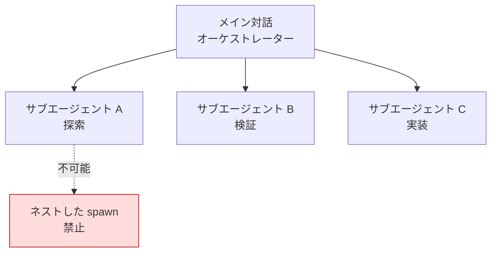

Claude Code のサブエージェントは、付随的な作業を別個のコンテキストウィンドウで処理し、結果の要約だけをメイン対話に返す委任ワーカーです。


**ひとことで言うと**: サブエージェントは、探索・検証といった付随的な仕事を自分専用のコンテキストで処理し、要約だけを返すことで、メイン対話をクリーンに保つ委任ワーカーです。



このページは Claude Code レベルの概念概要です。MoAI-ADK が 8 個のエージェントカタログをどのように構成・委任するか、自分でエージェントを作る実践的な方法は [エージェントガイド](/advanced/agent-guide) と [ビルダーエージェントガイド](/advanced/builder-agents) で詳しく扱います。


## サブエージェントとは

サブエージェントは、特定の種類の作業を専門に担う特化型 AI ワーカーです。検索結果、ログ、ファイル内容でメイン対話が溢れかえりそうな付随的な作業が発生したとき、その仕事をサブエージェントが **自分専用のコンテキストウィンドウ** (own context window) で処理し、結果の要約だけを返します。

各サブエージェントは次のものを独立して持ちます。

| 構成要素 | 説明 |
|-----------|------|
| システムプロンプト | サブエージェントファイルの本文がそのまま役割の指示文になります |
| ツールアクセス権限 | 利用可能なツールを許可/ブロックリストで制限できます |
| 独立した権限 | メイン対話の権限を継承しつつ、追加の制限を設けられます |
| モデル選択 | `haiku` のような高速で安価なモデルでコストを下げられます |

Claude は各サブエージェントの `description` を見て、いつ委任するかを判断します。そのため、説明を明確に書くことがよい委任の出発点になります。

Claude Code には `Explore` (読み取り専用のコードベース探索)、`Plan` (プランモードのリサーチ)、`general-purpose` (探索＋修正の複合作業) といった組み込みサブエージェントが含まれています。

## 核心的な制約: サブエージェントはサブエージェントを spawn できない

最も重要な構造的制約です。**サブエージェントは別のサブエージェントを spawn できません** (subagents cannot spawn other subagents)。つまり委任はメイン対話から一段だけ下がり、無限のネストは発生しません。

この制約は MoAI-ADK のオーケストレーション設計の基盤でもあります。オーケストレーター (メインセッション) だけがサブエージェントを呼び出すことができ、呼び出されたエージェントは再び誰かに委任することはできません。したがって階層型のエージェントチェーンではなく、**オーケストレーターが各ステップを直接呼び出す** フラットな構造に従います。



組み込みの `Plan` サブエージェントが別途存在する理由もここにあります。プランモードでコンテキストが必要なときに、この制約を回避せずにリサーチを実行するためです。

## いつ使うか

サブエージェントは次のような状況で効果が大きくなります。

| 状況 | 効果 |
|------|------|
| 並列探索 | 複数のファイル・ディレクトリを同時に調査し、要約だけを集めます |
| 独立検証 | メイン対話のバイアスなしに、別個のコンテキストで結果を点検します |
| コンテキスト分離 | 大量のログ・検索結果をメイン対話から隔離します |
| コスト制御 | 単純な作業を `haiku` のような高速モデルにルーティングします |

逆に一度の応答で完結する作業や、複数のステップにまたがって **共有コンテキストが必要な作業** であれば、委任せずにメイン対話で直接処理するほうが適しています。

## 定義方法の概要

サブエージェントは YAML フロントマターを持つマークダウンファイルで定義します。`/agents` コマンドで対話的に生成することも、ファイルを直接書くこともできます。

```markdown
---
name: code-reviewer
description: 코드 품질과 모범 사례를 검토합니다
tools: Read, Glob, Grep
model: sonnet
---

당신은 코드 리뷰어입니다. 호출되면 코드를 분석하고
품질·보안·모범 사례에 대해 구체적이고 실행 가능한 피드백을 제공합니다.
```

必須フィールドは `name` と `description` の 2 つだけで、本文がそのままシステムプロンプトになります。保存場所によって適用範囲が変わります。

| 場所 | 範囲 |
|------|------|
| `.claude/agents/` | 現在のプロジェクト (バージョン管理に含めてチームと共有) |
| `~/.claude/agents/` | 自分のすべてのプロジェクト |
| プラグインの `agents/` | プラグインが有効化された場所 |

`tools` (許可リスト) または `disallowedTools` (ブロックリスト) でツールアクセスを制限し、`model` で使用するモデルを、`isolation: worktree` で隔離されたリポジトリのコピー上で作業するように指定できます。ただし `AskUserQuestion` のようなユーザー対話ツールはサブエージェントでは使用できません。これが MoAI-ADK においてサブエージェントがユーザーに直接質問できず、オーケストレーターにブロッカーレポートを返す理由です。

## 深掘りは MoAI エージェントガイドで

ここまでが Claude Code レベルのサブエージェントの概念です。MoAI-ADK がこのメカニズムの上でどのようなエージェントカタログを運用し、Plan-Run-Sync ワークフローの各ステップをどのように委任し、プロジェクトごとのドメイン専門家エージェントをどのように生成するかは、以下の応用ガイドで扱います。

## 関連ドキュメント

- [エージェントガイド](/advanced/agent-guide)
- [ビルダーエージェントガイド](/advanced/builder-agents)

## 参考資料

- [Create custom subagents (Claude Code 公式ドキュメント)](https://code.claude.com/docs/en/sub-agents)


サブエージェントを作るときは、`description` を「いつ委任すべきか」という観点から具体的に書きましょう。Claude はこの説明だけを見て委任の可否を判断するため、説明が曖昧だとよいツールがあっても呼び出されません。

