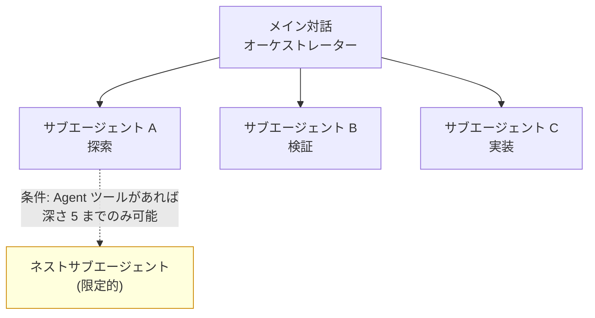

# サブエージェント

Claude Code のサブエージェントは、脇道の作業を別のコンテキストウィンドウで処理し、結果の要約だけをメイン対話に返す委任ワーカーです。



**一行要約**: サブエージェントは探索・検証のような脇道の仕事を自分だけのコンテキストで処理し、要約だけを返して、メイン対話をきれいに保つ委任ワーカーです。



サブエージェントは **自分専用のデスクを持つ同僚**です。自分のデスク (メイン対話のコンテキスト) を散らかす大量の調査・ログ・検索結果は同僚に任せれば、彼は自分のデスクの上でその仕事を処理し、こちらには **結果の要約 1 枚だけ**を渡してくれます。おかげで自分のデスクはきれいに保たれ、こちらは核心の流れだけに集中できます。



このページは Claude Code 次元の概念概要です。MoAI-ADK が 11 個のエージェントカタログ (10 MoAI-custom + 1 Anthropic 内蔵 `Explore`) をどう構成し委任するか、自分でエージェントを作る実践的な方法は [エージェントガイド](/ja/advanced/agent-guide) と [ビルダーエージェントガイド](/ja/advanced/builder-agents) で深く扱います。


## サブエージェントとは

サブエージェントは特定の種類の作業を専任する特化した AI ワーカーです。メイン対話が検索結果、ログ、ファイル内容であふれそうな脇道の作業が生じると、その仕事をサブエージェントが **自分だけのコンテキストウィンドウ** (own context window) で処理し、結果の要約だけを返します。

各サブエージェントは次を独立して持ちます。

| 構成要素 | 説明 |
|-----------|------|
| システムプロンプト | サブエージェントファイル本文がそのまま役割指示文になります |
| ツールアクセス権限 | 利用可能なツールを許可/ブロックリストで制限できます |
| 独立した権限 | メイン対話の権限を継承しつつ追加の制限を設けられます |
| モデル選択 | `haiku` のような速くて安価なモデルでコストを下げられます |

Claude は各サブエージェントの `description` を見ていつ委任するかを判断します。だから説明を明確に書くことがそのまま良い委任の出発点です。

Claude Code には次のような内蔵サブエージェントが含まれています。

| エージェント | 特徴 |
|---------|------|
| **Explore** | 読み取り専用のコードベース探索; v2.1.198 からメインセッションモデルを継承 (Claude API では Opus まで、以前のバージョンは Haiku 固定)。thoroughness オプションで quick/medium/very-thorough を選択可能 |
| **Plan** | プランモードのリサーチ (読み取り専用) |
| **general-purpose** | すべてのツールにアクセス可能、探索と修正の両方が可能 |

Explore と Plan はメインセッションの CLAUDE.md と git status をスキップし、より速く軽く動作します。

## 核心的な制約: サブエージェントはサブエージェントを spawn できない

最も重要な構造的制約です。**サブエージェントは他のサブエージェントを spawn できません** (subagents cannot spawn other subagents)。つまり委任はメイン対話から一段階だけ降り、無限のネストは発生しません。

### v2.1.172 以降: 限定的なネスト (深さ 5 の限界)

Claude Code v2.1.172 からは **条件付きのサブエージェントネスト** が可能になりました。ただし設定オプションがあります。

| 設定 | 動作 | 使用 |
|------|------|------|
| サブエージェント定義に `Agent` を含む (frontmatter `tools:` リスト) | ネスト許可 | 深さ 5 まで (ハード限界) |
| `Agent` ツールを省略 | ネスト禁止 | 平坦なオーケストレーションのみ可能 |

この制約は MoAI-ADK オーケストレーション設計の根幹でもあります。**オーケストレーター (メインセッション) だけがサブエージェントを呼び出せ**、呼び出されたエージェントは深さ制限に引っかからなければ再び誰かに委任できます。したがって階層型エージェントチェーンの代わりに **オーケストレーターが直接各ステップを呼び出す** 平坦な構造に従います (MoAI の基本原則)。


```mermaid
flowchart TD
    M[メイン対話<br/>オーケストレーター] --> A[サブエージェント A<br/>探索]
    M --> B[サブエージェント B<br/>検証]
    M --> C[サブエージェント C<br/>実装]
    A -.->|条件: Agent ツールがあれば<br/>深さ 5 までのみ可能| X["ネストサブエージェント<br/>(限定的)"]
    style X fill:#ffd,stroke:#c80
```

内蔵 `Plan` サブエージェントが別途存在する理由もここにあります。プランモードでコンテキストが必要なとき、この制約を回避せずにリサーチを行うためです。

## バックグラウンド実行 (v2.1.186 / v2.1.198)

サブエージェントはバックグラウンドで実行でき、v2.1.198 からは **バックグラウンドがデフォルト** です — Claude が結果を即座に必要とするときだけフォアグラウンドで実行し、それ以外はバックグラウンドで回します。

バックグラウンドのサブエージェントが権限を必要とするツールに出会うと (例: Bash、WebFetch):

- **v2.1.186 以前**: 自動拒否 (権限プロンプトなし)
- **v2.1.186 以降**: **メインセッションにプロンプトが表示** される (Esc で該当の呼び出しのみ拒否可能; v2.1.186 からプロンプトにスポーンしたサブエージェント名を表示)

長いバックグラウンド作業を開始する前に必要なツールを `settings.json` の許可リストにあらかじめ追加すると、プロンプトの頻度を減らせます。

## いつ使うか

サブエージェントは次のような状況で効果が大きいです。

| 状況 | 効果 |
|------|------|
| 並列探索 | 複数のファイル・ディレクトリを同時に調査し、要約だけを集めます |
| 独立した検証 | メイン対話のバイアスなしに別のコンテキストで結果を点検します |
| コンテキスト分離 | 大量のログ・検索結果をメイン対話から隔離します |
| コスト制御 | 単純な作業を `haiku` のような速いモデルにルーティングします |

逆に一度の応答で終わる作業だったり、複数のステップにまたがって **共有コンテキストが必要な作業** なら、委任せずメイン対話で直接処理する方が良いです。

## 定義方法の概要

サブエージェントは YAML フロントマターを持つマークダウンファイルで定義します。Claude に生成を依頼するか、ファイルを直接作成できます。v2.1.198 から `/agents` コマンドはもはや対話型の生成ウィザードを開かず、Claude に依頼するか `.claude/agents/` ディレクトリを直接編集するよう案内するだけを出力します (ファイル形式と保存場所は変更なし)。

```markdown
---
name: code-reviewer
description: コード品質とベストプラクティスをレビューします
tools: Read, Glob, Grep
model: sonnet
---

あなたはコードレビュアーです。呼び出されたらコードを分析し、
品質・セキュリティ・ベストプラクティスについて具体的で実行可能なフィードバックを提供します。
```

### 必須フィールド

- `name` — サブエージェント名 (委任するときに参照)
- `description` — いつ委任すべきか説明 (Claude はこれだけを見て判断)

### オプションフィールド

| フィールド | 機能 |
|------|------|
| `tools` | 許可するツール (カンマ区切りリスト) |
| `disallowedTools` | ブロックするツール (許可リストの代わりに使用可能) |
| `model` | モデル選択: `sonnet`、`opus`、`haiku`、`fable`、または特定のモデル ID; デフォルト値 `inherit` (メインセッションモデル) |
| `permissionMode` | ツール権限のデフォルト値 (`default`、`acceptEdits`、`plan`、`bypassPermissions`、`auto`、`dontAsk`); プラグインサブエージェントは無視される |
| `maxTurns` | 最大ターン数制限 |
| `skills` | ロードする基本スキル |
| `mcpServers` | 接続する MCP サーバー |
| `hooks` | 呼び出す Hook イベント |
| `memory` | メモリ範囲 (user, project, local) |
| `background` | `true` なら常にバックグラウンド実行 (結果を即座に必要としても); 未指定時は Claude が選択し、v2.1.198 からデフォルトでバックグラウンド |
| `effort` | 推論強度 (low, medium, high, xhigh, max) |
| `isolation: worktree` | 隔離されたリポジトリのコピーで作業 |
| `color` | エージェントビューに表示する色 |
| `initialPrompt` | サブエージェントを最初に spawn するときのプロンプト |

保存場所によって適用範囲が変わります。

| 場所 | 範囲 |
|------|------|
| `.claude/agents/` | 現在のプロジェクト (バージョン管理に含めてチームと共有) |
| `~/.claude/agents/` | 自分のすべてのプロジェクト |
| プラグインの `agents/` | プラグインが有効化された場所 |

### AskUserQuestion 使用不可

`AskUserQuestion` のようなユーザー相互作用ツールはサブエージェントでは使えません (asymmetric boundary)。これが MoAI-ADK でサブエージェントがユーザーに直接質問できず、オーケストレーターに blocker report を返す理由です。

## `/fork` — セッションフォーク

`/fork <directive>` コマンドで現在のセッションをフォークできます。フォークされたサブエージェントは:

- 現在の対話内容を継承
- 親のプロンプトキャッシュを活用
- 新しい方向へ探索

## 深掘りは MoAI エージェントガイドへ

ここまでが Claude Code 次元のサブエージェント概念です。MoAI-ADK はこのメカニズムの上に **11 個のエージェントカタログ** を運用します — Manager 系列 (manager-spec / manager-develop / manager-docs / manager-git / manager-design) が plan→run→sync ライフサイクルを、Evaluator 系列 (plan-auditor / sync-auditor) が独立監査を、builder-harness がハーネススキャフォールド生成を、super-advisor が高推論の助言を、e2e-tester が Web/モバイル/デスクトップの E2E テスト実行を、そして Anthropic 内蔵 `Explore` が読み取り専用の探索を担当します。計画と監査が分離されているという点 — 作ったエージェントが自分で検査しないこと — がこのカタログの核心的な設計です。各エージェントに作業の性質に合ったモデルと推論深度 (effort) を宣言的に割り当てることがトークノミクスの「計画は深く、実装は安く、検証は独立して」原則です。詳しい内容は下記の応用ガイドで扱います。

## 関連ドキュメント

- [エージェントガイド](/ja/advanced/agent-guide)
- [ビルダーエージェントガイド](/ja/advanced/builder-agents)

## 参考資料

- [Create custom subagents (Claude Code 公式ドキュメント)](https://code.claude.com/docs/en/sub-agents)


サブエージェントを作るときは `description` を「いつ委任すべきか」の観点から具体的に書いてください。Claude はこの説明だけを見て委任の可否を判断するので、説明が曖昧だと良いツールがあっても呼び出されません。

