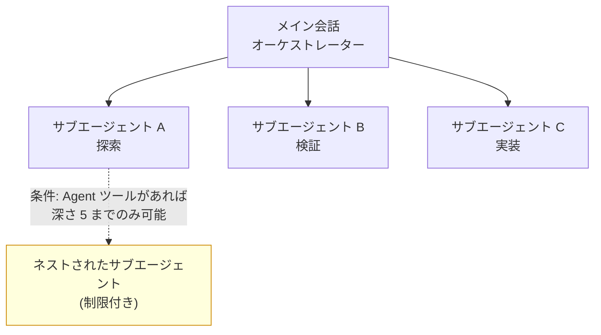

# サブエージェント

Claude Code のサブエージェントは、脇道の作業を別のコンテキストウィンドウで処理し、結果の要約だけをメイン会話へ返す委譲ワーカーです。


**ひとことで言うと**: サブエージェントは、探索・検証のような脇道の仕事を自分専用のコンテキストで処理し、要約だけを返して、メイン会話をきれいに保つ委譲ワーカーです。



このページは Claude Code レベルの概念概要です。MoAI-ADK が 11 エージェントカタログ (10 MoAI カスタム + 1 Anthropic 組み込み `Explore`) をどう構成・委譲するのか、自分でエージェントを作る実践方法は、[エージェントガイド](/advanced/agent-guide) と [ビルダーエージェントガイド](/advanced/builder-agents) で深く扱います。


## サブエージェントとは

サブエージェントは、特定の種類の作業を専任する特化型 AI ワーカーです。メイン会話が検索結果、ログ、ファイル内容であふれそうな脇道の作業が生じたら、その仕事をサブエージェントが **自分専用のコンテキストウィンドウ** (own context window) で処理し、結果の要約だけを返します。

各サブエージェントは、次のものを独立して持ちます。

| 構成要素 | 説明 |
|-----------|------|
| システムプロンプト | サブエージェントファイルの本文がそのまま役割の指示文になります |
| ツールアクセス権限 | 使用可能なツールを許可/ブロックリストで制限できます |
| 独立した権限 | メイン会話の権限を継承しつつ追加の制限を置けます |
| モデル選択 | `haiku` のような速く安価なモデルでコストを下げられます |

Claude は各サブエージェントの `description` を見て、いつ委譲するかを判断します。だからこそ説明を明確に書くことが、良い委譲の出発点です。

Claude Code には次のような組み込みサブエージェントが含まれています。

| エージェント | 特徴 |
|---------|------|
| **Explore** | 読み取り専用のコードベース探索 (Haiku、迅速); thoroughness オプションで quick/medium/very-thorough を選択可能 |
| **Plan** | プランモードのリサーチ (読み取り専用) |
| **general-purpose** | すべてのツールにアクセス可能、探索と修正の両方が可能 |

Explore と Plan はメインセッションの CLAUDE.md と git status をスキップし、より速く軽量に動作します。

## 中核の制約: サブエージェントはサブエージェントを spawn できない

最も重要な構造的制約です。**サブエージェントは他のサブエージェントを spawn できません** (subagents cannot spawn other subagents)。つまり委譲はメイン会話から 1 段だけ下がり、無限のネストは発生しません。

### v2.1.172 以降: 制限付きネスト (深さ 5 の上限)

Claude Code v2.1.172 からは **条件付きのサブエージェントネスト** が可能になりました。ただし設定オプションがあります。

| 設定 | 動作 | 使用 |
|------|------|------|
| サブエージェント定義に `Agent` を含める (frontmatter の `tools:` リスト) | ネスト許可 | 深さ 5 まで (ハード上限) |
| `Agent` ツールを省略 | ネスト禁止 | フラットなオーケストレーションのみ可能 |

この制約は MoAI-ADK オーケストレーション設計の根幹でもあります。**オーケストレーター (メインセッション) だけがサブエージェントを呼び出せ**、呼び出されたエージェントは深さ制限にかからなければさらに誰かに委譲できます。したがって階層型エージェントチェーンの代わりに、**オーケストレーターが直接各段階を呼び出す** フラットな構造に従います (MoAI の基本原則)。


```mermaid
flowchart TD
    M[メイン会話<br/>オーケストレーター] --> A[サブエージェント A<br/>探索]
    M --> B[サブエージェント B<br/>検証]
    M --> C[サブエージェント C<br/>実装]
    A -.->|条件: Agent ツールがあれば<br/>深さ 5 までのみ可能| X["ネストされたサブエージェント<br/>(制限付き)"]
    style X fill:#ffd,stroke:#c80
```

組み込みの `Plan` サブエージェントが別に存在する理由もここにあります。プランモードでコンテキストが必要なとき、この制約を回避せずにリサーチを実行するためです。

## バックグラウンドの権限プロンプト (v2.1.186)

サブエージェントをバックグラウンドで実行するとき (`background: true`)、権限が必要なツールに出会うと (例: Bash、WebFetch):

- **v2.1.186 以前**: 自動拒否 (権限プロンプトなし)
- **v2.1.186 以降**: **メインセッションにプロンプトが表示** される (Esc でその呼び出しのみ拒否可能)

したがって長いバックグラウンド作業を始める前に、必要なツールを `settings.json` の許可リストへ事前に追加しておくのがよいでしょう。

## いつ使うか

サブエージェントは、次のような状況で効果を発揮します。

| 状況 | 効果 |
|------|------|
| 並列探索 | 複数のファイル・ディレクトリを同時に調査し、要約だけを集めます |
| 独立検証 | メイン会話のバイアスなしに、別のコンテキストで結果を点検します |
| コンテキスト分離 | 大量のログ・検索結果をメイン会話から隔離します |
| コスト制御 | 単純な作業を `haiku` のような高速モデルへルーティングします |

逆に、1 回の応答で終わる作業や、複数段階にわたって **共有コンテキストが必要な作業** なら、委譲せずメイン会話で直接処理するほうがよいでしょう。

## 定義方法の概要

サブエージェントは YAML フロントマターを持つマークダウンファイルで定義します。`/agents` コマンドで対話的に生成することも、ファイルを直接書くこともできます。

```markdown
---
name: code-reviewer
description: 코드 품질과 모범 사례를 검토합니다
tools: Read, Glob, Grep
model: sonnet
---

당신은 코드 리뷰어입니다. 호출되면 코드를 분석하고
품질·보안·모범 사례에 대해 구체적이고 실행 가능한 피드백을 제공합니다.
```

### 必須フィールド

- `name` — サブエージェント名 (委譲時に参照)
- `description` — いつ委譲すべきかの説明 (Claude はこれだけを見て判断)

### 任意フィールド

| フィールド | 機能 |
|------|------|
| `tools` | 許可するツール (カンマ区切りリスト) |
| `disallowedTools` | ブロックするツール (許可リストの代わりに使用可能) |
| `model` | モデル選択: `sonnet`、`opus`、`haiku`、`fable`、または特定のモデル ID; デフォルト `inherit` (メインセッションのモデル) |
| `permissionMode` | ツール権限のデフォルト (default, plan, acceptEdits, bypass) |
| `maxTurns` | 最大ターン数の制限 |
| `skills` | ロードするデフォルトのスキル |
| `mcpServers` | 接続する MCP サーバー |
| `hooks` | 呼び出す Hook イベント |
| `memory` | メモリ範囲 (user, project, local) |
| `background` | `true` ならバックグラウンド実行 |
| `effort` | 推論強度 (low, medium, high, xhigh, max) |
| `isolation: worktree` | 分離されたリポジトリのコピーで作業 |
| `color` | エージェントビューに表示する色 |
| `initialPrompt` | サブエージェントを最初にスポーンするときのプロンプト |

保存場所によって適用範囲が変わります。

| 場所 | 範囲 |
|------|------|
| `.claude/agents/` | 現在のプロジェクト (バージョン管理に含めてチームと共有) |
| `~/.claude/agents/` | 自分のすべてのプロジェクト |
| プラグインの `agents/` | プラグインが有効な場所 |

### AskUserQuestion は使用不可

`AskUserQuestion` のようなユーザー対話ツールは、サブエージェントでは使えません (asymmetric boundary)。これが MoAI-ADK でサブエージェントがユーザーへ直接質問できず、オーケストレーターへ blocker report を返す理由です。

## `/fork` — セッションのフォーク

`/fork <directive>` コマンドで現在のセッションをフォークできます。フォークされたサブエージェントは:

- 現在の会話内容を継承
- 親のプロンプトキャッシュを活用
- 新しい方向へ探索

## 深掘りは MoAI エージェントガイドへ

ここまでが Claude Code レベルのサブエージェントの概念です。MoAI-ADK はこのメカニズムの上に **11 エージェントカタログ** を運用します — Manager 系 (manager-spec / manager-develop / manager-docs / manager-git / manager-design) が plan→run→sync のライフサイクルを、Evaluator 系 (plan-auditor / sync-auditor) が独立監査を、builder-harness がハーネススキャフォールドの生成を、super-advisor が高推論のアドバイスを、e2e-tester がウェブ/モバイル/デスクトップの E2E テスト実行を、そして Anthropic 組み込みの `Explore` が読み取り専用の探索を担います。計画と監査が分離されている点 — 作ったエージェントが自ら検査しないこと — がこのカタログの中核設計です。各エージェントに作業の性質に合ったモデルと推論の深さ (effort) を宣言的に割り当てることが、トークノミクスの「計画は深く、実装は安く、検証は独立に」という原則です。詳細は以下の応用ガイドで扱います。

## 関連ドキュメント

- [エージェントガイド](/advanced/agent-guide)
- [ビルダーエージェントガイド](/advanced/builder-agents)

## 参考資料

- [Create custom subagents (Claude Code 公式ドキュメント)](https://code.claude.com/docs/en/sub-agents)


サブエージェントを作るときは、`description` を「いつ委譲すべきか」の観点で具体的に書いてください。Claude はこの説明だけを見て委譲の可否を判断するため、説明が曖昧だと、良いツールがあっても呼び出されません。

