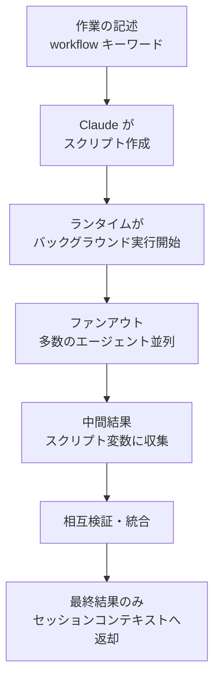

ダイナミックワークフロー (dynamic workflow) とは、Claude が自ら作成した JavaScript スクリプトが、1 回の会話では調整しきれない数十～数百個のサブエージェントをバックグラウンドでオーケストレーションする、Claude Code の実行プリミティブ (primitive) です。


**ひとことで言うと**: サブエージェントやエージェントチームが「計画を Claude の頭の中」に置くのに対し、ダイナミックワークフローは「計画をスクリプトコードの中」へ移し、大規模なファンアウトを一度に回します。


## ダイナミックワークフローとは

ダイナミックワークフローは、**作業を記述すると Claude が直接作成する** (JavaScript スクリプト) であり、ランタイムがこのスクリプトを会話とは分離されたバックグラウンドで実行します。スクリプトがループ・分岐・中間結果をすべて保持するため、セッションのコンテキストウィンドウには最終的な回答だけが返ってきます。

要点は単に「エージェントをより多く回すこと」ではなく、**計画をコードへ移すこと** (moving the plan into code) です。その結果、次のことが可能になります。

- 独立したエージェント同士が互いの結果を敵対的に (adversarial) 相互検証してから報告する
- 1 つの計画を複数の角度から同時に下書きしたうえで比較・評価する
- 1 回の単一パスよりも信頼できる結果を産出する

> ダイナミックワークフローはリサーチプレビュー (research preview) 段階であり、Claude Code v2.1.154 以上が必要です。すべての有料プランで利用でき、Pro プランでは `/config` の Dynamic workflows 項目で有効化する必要があります。

## 3 つのオーケストレーションプリミティブの比較

サブエージェント、スキル、ワークフローはいずれも複数ステップの作業を実行できます。違いは **計画を誰が握っているか** です。

| 区分 | サブエージェント | エージェントチーム / スキル | ワークフロー |
|------|-------------|-------------------|-----------|
| 正体 | Claude が生成するワーカー | Claude が従う指示 | ランタイムが実行するスクリプト |
| 次のステップの決定者 | Claude、ターン単位 | Claude、プロンプトに従って | スクリプト |
| 中間結果の場所 | Claude のコンテキストウィンドウ | Claude のコンテキストウィンドウ | スクリプト変数 |
| 反復可能な単位 | ワーカー定義 | 指示内容 | オーケストレーション自体 |
| 規模 | ターンあたり少数の委任 | サブエージェントと同じ | 実行あたり数十～数百エージェント |
| 中断時 | ターン再開始 | ターン再開始 | 同一セッション内で再開可能 |

サブエージェントとスキルでは、Claude がオーケストレーターとして毎ターン何を生成するかを決定し、すべての結果が Claude のコンテキストに入ります。一方、ワークフロースクリプトはそのロジックを自ら保持するため、Claude のコンテキストには最終的な回答だけが返ってきます。

## いつ使うか

1 つの会話が調整できる量より **多くのエージェントが必要な場合**、あるいはオーケストレーション自体を読んで再実行できるスクリプトとして **コード化したい場合** に、ワークフローを選びます。

| 用途 | 説明 |
|------|------|
| 大規模コードベースの全数スキャン | 例: `src/routes/` 配下のすべての API エンドポイントの認証漏れチェック |
| 大規模マイグレーション | 例: 500 個のファイルを独立して変換するマイグレーション |
| 相互検証リサーチ | 複数の出典を互いに照合する必要があるリサーチの質問 |
| 多角的な計画下書き | コミット前に複数の独立した観点から 1 つの難しい計画を下書きする |

逆に **使わない場合** も明確です。

- 1 つの会話で調整可能な少数の作業 → サブエージェントを直接使用
- ステップごとにユーザー承認が必要な対話的作業 → ワークフローは実行中に入力を受け取れない
- 単一ファイルの日常的な編集 → 直接実行

## 動作の仕組み

ワークフローランタイムは、スクリプトを会話とは **分離された隔離環境** (isolated environment) で実行します。中間結果は Claude のコンテキストではなくスクリプト変数にとどまります。ランタイムが各エージェントの結果を追跡するため、同一セッション内での再開が可能です。



`/deep-research` のようなバンドルワークフローを実行する、あるいはプロンプトのどこかに `workflow` という単語を入れると、Claude がその作業用のスクリプトを作成します。気に入った実行結果は `/workflows` 画面で `s` キーを押して `/<名前>` コマンドとして保存し、再利用できます。

```text
# 1 つの作業をワークフローとして実行
Run a workflow to audit every API endpoint under src/routes/ for missing auth checks
```

## 制約と限界

ランタイムは次の制約を適用します。

| 制約 | 理由 |
|------|------|
| 実行中のユーザー入力は不可 | エージェントの権限プロンプトだけが実行を止められる。ステップごとの承認が必要なら各ステップを別々のワークフローに |
| ワークフロー自体のファイルシステム・シェルへの直接アクセス不可 | 読み取り・書き込み・コマンド実行はエージェントが行い、スクリプトは調整のみを担う |
| 同時実行エージェントは最大 16 個 (CPU コアが少ないとさらに少なく) | ローカルリソースの使用制限 |
| 実行あたり合計 1,000 個のエージェント | 無限ループの防止 |

さらに把握しておくべき動作です。

- **権限モード** (permission mode): ワークフローが生成するサブエージェントは、セッションのモードに関係なく常に `acceptEdits` で実行され、ファイル編集は自動承認されます。ただし許可リストにないシェルコマンド・ウェブフェッチ・MCP ツールは実行中にプロンプトが表示されることがあるため、長い作業の前に必要なコマンドを `settings.json` の許可リストに追加しておくとよいでしょう。
- **再開** (resume): 実行を止めてから再開すると、すでに終わったエージェントはキャッシュされた結果を返し、残りだけがライブで回ります。ただし同一の Claude Code セッション内でのみ有効で、セッションを終了すると次のセッションでは最初からやり直しになります。
- **コスト** (cost): 1 回の実行が、同じ作業を会話で処理するときよりはるかに多くのトークンを使うことがあるため、大きな実行の前に `/model` を確認するのが安全です。

### /deep-research と ultracode

| 項目 | 説明 |
|------|------|
| `/deep-research <質問>` | バンドルワークフロー。複数の角度からウェブ検索をファンアウトし、出典を相互検証・投票したうえで、検証で脱落した主張を除いた引用付きレポートを返す。WebSearch ツールが必要 |
| `/effort ultracode` | `xhigh` の推論強度と自動ワークフローオーケストレーションの組み合わせ。有効にしておくと Claude がすべての実質的な作業についてワークフローを計画する。現在のセッションにのみ適用され、新しいセッションで初期化される。`/effort high` で日常作業に復帰 |

### 無効化する方法

ワークフローは次のいずれかで無効化でき、無効にするとバンドルワークフローのコマンド・`workflow` キーワード・`/effort` メニューの `ultracode` がすべて消えます。

```json
{
  "disableWorkflows": true
}
```

- `/config` の Dynamic workflows トグルをオフにする (セッション間で維持)
- `~/.claude/settings.json` に `"disableWorkflows": true` を設定
- 環境変数 `CLAUDE_CODE_DISABLE_WORKFLOWS=1` を設定
- 組織全体には管理設定 (managed settings) の `"disableWorkflows": true` で一括適用

## MoAI-ADK との関係

MoAI-ADK は、ダイナミックワークフローを SPEC ベースの plan/run/sync ライフサイクルとは区別される **3 つ目のオーケストレーションプリミティブ** として認識します。ワークフローエージェントもユーザーに直接質問できないという同じ非対称の境界に従うため、MoAI オーケストレーターはワークフローを起動する **前に** すべての選好をまず収集します。ベストプラクティスとプリミティブ選択ガイドは、以下の関連ドキュメントを参照してください。

## 関連ドキュメント

- [サブエージェント](/claude-code/agentic/sub-agents)
- [エージェントチーム](/claude-code/agentic/agent-teams)

## 参考資料

- [Orchestrate subagents at scale with dynamic workflows (Claude Code 公式ドキュメント)](https://code.claude.com/docs/en/workflows)


ほとんどのコーディング作業は、リサーチよりも本当に並列化できる部分が少ないものです。コーディング中心の作業のデフォルトは順次実行のサブエージェントに据え、ダイナミックワークフローはコードベースの全数スキャンや大規模マイグレーションのように、実際に大量の並列が必要な作業にだけ節約して使うのがよいでしょう。

