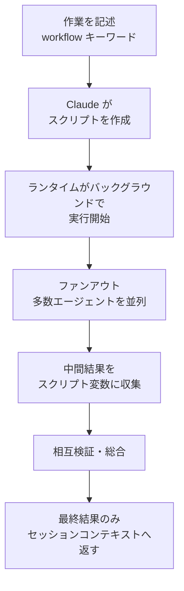

ダイナミックワークフロー (dynamic workflow) は、Claude 自身が書いた JavaScript スクリプトが、1 回の会話では調律しきれない数十~数百のサブエージェントをバックグラウンドでオーケストレーションする、Claude Code の実行基本要素 (primitive) です。


**ひとことで言うと**: サブエージェントとエージェントチームが「計画を Claude の頭の中に」置くなら、ダイナミックワークフローは「計画をスクリプトコードの中に」移し、大規模なファンアウトを一気に回します。


## ダイナミックワークフローとは

ダイナミックワークフローは、**作業を記述すると Claude が直接書く** (JavaScript スクリプト) ものであり、ランタイムがこのスクリプトを会話から分離されたバックグラウンドで実行します。スクリプトがループ、分岐、中間結果をすべて抱えているため、セッションのコンテキストウィンドウには最終的な答えだけが戻ります。

核心は単に「エージェントをもっと多く回すこと」ではなく、**計画をコードへ移すこと** (moving the plan into code) です。その結果、次が可能になります。

- 独立したエージェント同士が互いの結果を敵対的に (adversarial) 相互検証してから報告
- 1 つの計画を複数の角度から同時にドラフトし、比較評価
- 1 回のシングルパスより信頼できる結果の産出

> ダイナミックワークフローはリサーチプレビュー (research preview) 段階で、Claude Code v2.1.154 以上が必要です。すべての有料プランで使え、Pro プランでは `/config` の Dynamic workflows 項目で有効化する必要があります。

## 3 つのオーケストレーション基本要素の比較

サブエージェント、スキル、ワークフローはいずれも多段階の作業を遂行できます。違いは **計画を誰が握っているか** です。

| 区分 | サブエージェント | エージェントチーム / スキル | ワークフロー |
|------|-------------|-------------------|-----------|
| 正体 | Claude が生成するワーカー | Claude が従う指示 | ランタイムが実行するスクリプト |
| 次の段階の決定者 | Claude、ターン単位 | Claude、プロンプトに従い | スクリプト |
| 中間結果の場所 | Claude のコンテキストウィンドウ | Claude のコンテキストウィンドウ | スクリプト変数 |
| 反復可能な単位 | ワーカー定義 | 指示内容 | オーケストレーション自体 |
| 規模 | ターンあたり少数の委譲 | サブエージェントと同じ | 実行あたり数十~数百エージェント |
| 中断時 | ターン再開 | ターン再開 | 同一セッション内で再開可能 |

サブエージェントとスキルでは、Claude がオーケストレーターとして毎ターン何を生成するかを決め、すべての結果が Claude のコンテキストへ入ります。一方、ワークフロースクリプトはそのロジックを自ら保持するため、Claude のコンテキストは最終的な答えだけを受け取ります。

## いつ使うか

1 つの会話が調律できる量より **多くのエージェントが必要なとき**、あるいはオーケストレーション自体を、読めて再実行できるスクリプトとして **コード化したいとき** に、ワークフローを選びます。

| 用途 | 説明 |
|------|------|
| 大規模コードベースの全数スキャン | 例: `src/routes/` 配下の全 API エンドポイントの認証漏れ点検 |
| 大規模マイグレーション | 例: 500 ファイルを独立に変換するマイグレーション |
| 相互検証リサーチ | 複数の出典を突き合わせる必要のあるリサーチ課題 |
| 多角度の計画ドラフト | コミット前に、複数の独立した観点から 1 つの難しい計画をドラフト |

逆に **使わない場合** も明確です。

- 1 つの会話で調律できる少数の作業 → サブエージェントを直接使用
- 段階ごとにユーザー承認が必要な対話的作業 → ワークフローは実行中に入力を受け取れない
- 単一ファイルの日常的な編集 → 直接実行

## 動作方式

ワークフローランタイムは、スクリプトを会話から **分離された隔離環境** (isolated environment) で実行します。中間結果は Claude のコンテキストではなくスクリプト変数にとどまります。ランタイムが各エージェントの結果を追跡するため、同じセッション内での再開が可能です。


```mermaid
flowchart TD
    A[作業を記述<br>workflow キーワード] --> B[Claude が<br>スクリプトを作成]
    B --> C[ランタイムがバックグラウンドで<br>実行開始]
    C --> D[ファンアウト<br>多数エージェントを並列]
    D --> E[中間結果を<br>スクリプト変数に収集]
    E --> F[相互検証・総合]
    F --> G[最終結果のみ<br>セッションコンテキストへ返す]
```

`/deep-research` のようなバンドルワークフローを実行するか、プロンプトのどこかに `workflow` という単語を入れると、Claude がその作業用のスクリプトを書きます。気に入った実行結果は `/workflows` 画面で `s` キーを押して `/<名前>` コマンドとして保存し、再利用できます。

```text
# 한 작업을 워크플로우로 실행
Run a workflow to audit every API endpoint under src/routes/ for missing auth checks
```

## 制約と限界

ランタイムは次の制約を適用します。

| 制約 | 理由 |
|------|------|
| 実行中のユーザー入力は不可 | エージェントの権限プロンプトだけが実行を止められる。段階ごとの承認が必要なら各段階を別のワークフローに |
| ワークフロー自体のファイルシステム・シェルへの直接アクセス不可 | 読み書き・コマンド実行はエージェントが行い、スクリプトは調律だけを担当 |
| 同時実行エージェント最大 16 (CPU コアが少なければさらに少なく) | ローカルリソースの使用制限 |
| 実行あたり合計 1,000 エージェント | 無限ループの防止 |

さらに知っておくべき動作です。

- **権限モード** (permission mode): ワークフローが生成するサブエージェントは、セッションのモードと無関係に常に `acceptEdits` で実行され、ファイル編集は自動承認されます。ただし許可リストにないシェルコマンド・ウェブフェッチ・MCP ツールは実行中にプロンプトが出ることがあるため、長い作業の前に必要なコマンドを `settings.json` の許可リストへ追加しておくとよいでしょう。
- **再開** (resume): 実行を止めてから再開すると、すでに終わったエージェントはキャッシュされた結果を返し、残りだけがライブで回ります。ただし同じ Claude Code セッション内でのみ有効で、セッションを終了すると次のセッションでは最初からやり直しです。
- **コスト** (cost): 1 回の実行が、同じ作業を会話で処理するときよりはるかに多くのトークンを使うことがあるため、大きな実行の前に `/model` を確認するのが安全です。

### /deep-research と ultracode

| 項目 | 説明 |
|------|------|
| `/deep-research <質問>` | バンドルワークフロー。複数の角度からウェブ検索をファンアウトし、出典を相互検証・投票したうえで、検証に落ちた主張を除いた引用レポートを返す。WebSearch ツールが必要 |
| `/effort ultracode` | `xhigh` 推論強度 + 自動ワークフローオーケストレーションの組み合わせ。オンにすると Claude がすべての実質作業についてワークフローを計画。現在のセッションにのみ適用され、新しいセッションでリセット。`/effort high` で日常作業へ復帰 |

### 無効化の方法

ワークフローは次のいずれかで無効化でき、オフにするとバンドルワークフローコマンド・`workflow` キーワード・`/effort` メニューの `ultracode` がすべて消えます。

```json
{
  "disableWorkflows": true
}
```

- `/config` の Dynamic workflows トグルをオフ (セッションをまたいで維持)
- `~/.claude/settings.json` に `"disableWorkflows": true` を設定
- 環境変数 `CLAUDE_CODE_DISABLE_WORKFLOWS=1` を設定
- 組織全体には管理設定 (managed settings) の `"disableWorkflows": true` で一括適用

## MoAI-ADK との関係

MoAI-ADK は、ダイナミックワークフローを SPEC ベースの plan/run/sync ライフサイクルと区別される **第三のオーケストレーション基本要素** として認識し、実際のパイプラインにも投入しています — sync フェーズの 4 次元品質評価 (sync-audit-4dim) と plan フェーズのリサーチ並列ファンアウト (plan-research-fanout) がワークフロースクリプトとして実装されています。「計画をスクリプトコードへ移し、中間結果をスクリプト変数に閉じ込める」というこの基本要素の性質は、トークノミクスの観点でも魅力的です。数十のエージェントの中間成果物が、オーケストレーターのコンテキストをまったく占めないからです。

ワークフローのエージェントもユーザーへ直接質問できないという同じ非対称境界に従うため、MoAI オーケストレーターはワークフローを立ち上げる **前に** すべての選好を先に収集します。ベストプラクティスと基本要素の選択ガイドは、以下の関連ドキュメントを参照してください。

## 関連ドキュメント

- [サブエージェント](/claude-code/agentic/sub-agents)
- [エージェントチーム](/claude-code/agentic/agent-teams)

## 参考資料

- [Orchestrate subagents at scale with dynamic workflows (Claude Code 公式ドキュメント)](https://code.claude.com/docs/en/workflows)


大半のコーディング作業は、リサーチに比べて本当に並列化できる部分が少ないものです。コーディング中心の作業のデフォルトは逐次サブエージェントとし、ダイナミックワークフローは、コードベースの全数スキャン・大規模マイグレーションのように実際に大量並列が必要な作業にだけ、惜しんで使うのがよいでしょう。

