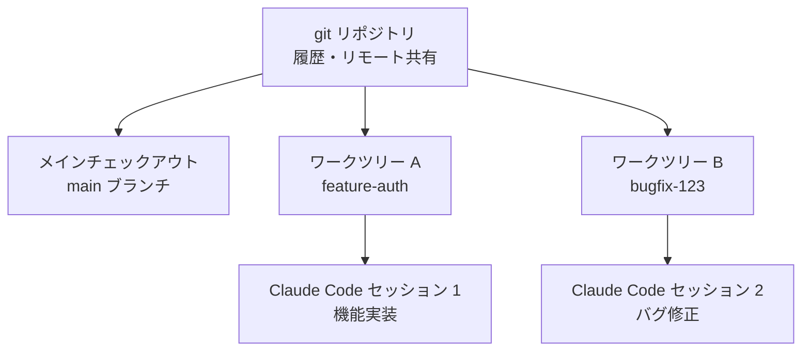

ワークツリー (worktree) は、1 つの git リポジトリから複数の作業ツリーを分離し、Claude Code のセッション同士が互いのファイルに触れずに並列で作業できるようにする機能です。


**ひとことで言うと**: ワークツリーは同じリポジトリを共有しながら作業ディレクトリとブランチを分離し、あるターミナルで機能を作り、別のターミナルでバグを直すといった同時作業を競合なく可能にします。



このページは Claude Code のワークツリーの概念を概観する橋渡しの役割のみを担います。MoAI-ADK で SPEC 単位の並列開発にワークツリーを実際に適用する詳しい方法は、[Git Worktree 概要](/worktree)、[Git Worktree 完全ガイド](/worktree/guide)、[Git Worktree 実際の使用例](/worktree/examples)を参照してください。


## ワークツリーとは

git ワークツリーは **別個の作業ディレクトリ** (separate working directory) であり、独自のファイルとブランチを持ちながら、メインチェックアウトと同一のリポジトリ履歴およびリモートを共有します。つまり、リポジトリをまるごと複製しなくても、独立した作業空間をもう 1 つ手に入れられるということです。

| 区分 | メインチェックアウト | 追加ワークツリー |
|------|--------------------|----------------|
| 作業ディレクトリ | 1 個 | 別個のディレクトリ |
| ブランチ | 現在のブランチ | 独立ブランチ |
| リポジトリ履歴 | 共有 | 共有 |
| リモート (remote) | 共有 | 共有 |
| ファイル編集の分離 | 基準 | 完全分離 |

肝心なのは **共有と分離の切り分け** です。履歴とリモートは 1 か所でまとめて管理しつつ、ファイル編集だけをツリーごとに完全に分けておきます。

## 並列作業と分離

各 Claude Code セッションをそれぞれ専用のワークツリーで実行すると、あるセッションの編集が別のセッションのファイルに決して及びません。そのため、次のような同時作業が安全になります。

- ターミナル A で認証機能を実装し、ターミナル B で別個のバグを修正する
- 異なるブランチを同時に進めても、ビルド/テストが混ざらない
- 一方の実験が失敗しても、もう一方の作業ツリーは影響を受けない



ワークツリーは Claude Code で並列に作業する複数の方法のうちの 1 つです。ワークツリーが **ファイル編集を分離する** (isolate file edits) のに対し、サブエージェントとエージェントチームは **作業そのものを調整します** (coordinate the work)。両者は併用できるため、サブエージェントがそれぞれのワークツリーで並列編集を行うように構成することもできます。

## Claude Code における統合の概要

Claude Code はワークツリーの生成と後始末を直接扱います。概念レベルで肝心な流れだけを押さえると、次のとおりです。

### ワークツリーで開始する

`--worktree` (または `-w`) フラグを与えると、分離されたワークツリーを作成し、その中で Claude を起動します。デフォルトではリポジトリルートの `.claude/worktrees/<名前>/` の下に作成され、`worktree-<名前>` という形式の新しいブランチが作られます。

```bash
# 名前を指定してワークツリーを作成
claude --worktree feature-auth

# 別のターミナルで 2 つ目の分離セッション
claude --worktree bugfix-123
```

名前を省略すると、`bright-running-fox` のような名前を Claude が自動生成します。セッション中に「ワークツリーで作業して」と依頼すると、`EnterWorktree` tool でワークツリーを作成することもできます。

> ディレクトリで `--worktree` を初めて使う前に、まずそのディレクトリで `claude` を一度実行し、ワークスペース信頼 (workspace trust) のダイアログを承認する必要があります。

### 基準ブランチと無視ファイルのコピー

| 項目 | 動作 | 備考 |
|------|------|------|
| 基準ブランチ | デフォルトは `origin/HEAD` から分岐 | リモートがない場合はローカル `HEAD` にフォールバック |
| `worktree.baseRef` | `"fresh"` または `"head"` のみ許可 | `"head"` は未プッシュのコミットまで取り込む |
| PR 基準ブランチ | `claude --worktree "#1234"` | `.claude/worktrees/pr-1234` に作成 |
| `.worktreeinclude` | gitignore 構文で無視ファイルをコピー | `.env` などの追跡されていないファイルを新しいツリーに自動コピー |

`.gitignore` に `.claude/worktrees/` を追加すると、ワークツリーの内容がメインチェックアウトで追跡されていないファイルとして現れなくなります。

### サブエージェントの分離

サブエージェントもそれぞれのワークツリーで実行し、並列編集の競合を防げます。カスタムサブエージェントの frontmatter に `isolation: worktree` を追加すると、常に分離されます。変更なく終わったサブエージェントの一時的なワークツリーは自動的に削除されます。

### 後始末

終了時は変更の有無によって後始末の方法が変わります。

- コミット・変更・未追跡ファイルがなければ、ワークツリーとブランチが自動的に削除されます。
- 変更がある場合は、保存するか削除するかを Claude が尋ねます。
- 非対話型 (`-p`) の実行は自動的に後始末されないため、`git worktree remove` で自分で削除します。

git 以外の SVN・Perforce・Mercurial などでは、`WorktreeCreate` / `WorktreeRemove` の hook で生成・後始末のロジックを自分で定義できます。

## MoAI-ADK における深い活用

MoAI-ADK は、このワークツリーの仕組みを SPEC 単位の並列開発と複数セッションの分離に幅広く活用します。どのような状況でワークツリーを有効にすべきか、セッションのハンドオフとどう連動するかといった実践的な内容は、以下の MoAI-ADK 専用ガイドにまとめられているため、このページでは概念紹介にとどめ、深い内容はリンクで案内します。

## 関連ドキュメント

- [Git Worktree 概要](/worktree)
- [Git Worktree 完全ガイド](/worktree/guide)
- [Git Worktree 実際の使用例](/worktree/examples)

## 参考資料

- [Run parallel sessions with worktrees (Claude Code 公式ドキュメント)](https://code.claude.com/docs/en/worktrees)


初めてワークツリーを導入するなら、まず `.claude/worktrees/` を `.gitignore` に追加しましょう。メインチェックアウトがきれいに保たれ、どの変更がどのツリーに属するのかを一目で把握できます。

