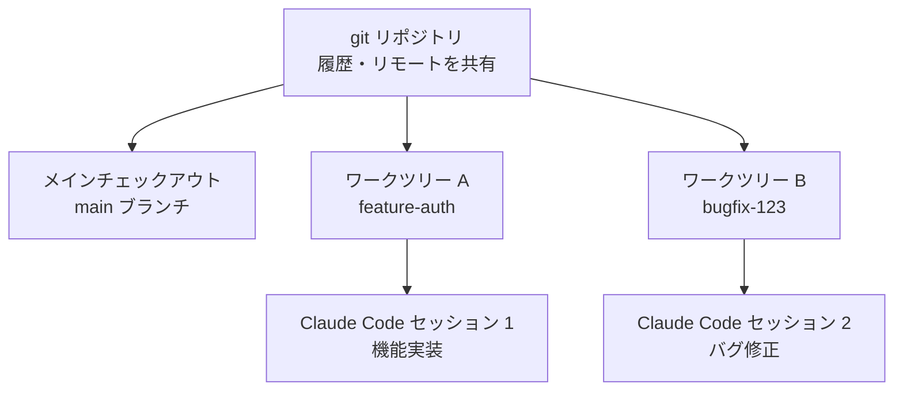

ワークツリー (worktree) は、1 つの git リポジトリで複数の作業ツリーを分離し、Claude Code のセッション同士が互いのファイルに触れずに並行して働けるようにする機能です。


**ひとことで言うと**: ワークツリーは同じリポジトリを共有しながらも作業ディレクトリとブランチを分離し、あるターミナルで機能を作り、別のターミナルでバグを直すという同時作業を、衝突なく可能にします。



このページは Claude Code のワークツリー概念を概観する橋渡し役に徹します。MoAI-ADK で SPEC 単位の並行開発にワークツリーを実際に適用する詳しい方法は、[Git Worktree 概要](/ja/worktree)、[Git Worktree 完全ガイド](/ja/worktree/guide)、[Git Worktree 実践例](/ja/worktree/examples) を参照してください。


## ワークツリーとは

git ワークツリーは **別の作業ディレクトリ** (separate working directory) であり、独自のファイルとブランチを持ちながらも、メインチェックアウトと同じリポジトリ履歴およびリモートを共有します。つまりリポジトリを丸ごとクローンせずに、独立した作業空間をもう 1 つ得られるわけです。

| 区分 | メインチェックアウト | 追加のワークツリー |
|------|--------------|--------------|
| 作業ディレクトリ | 1 つ | 別のディレクトリ |
| ブランチ | 現在のブランチ | 独立したブランチ |
| リポジトリ履歴 | 共有 | 共有 |
| リモート (remote) | 共有 | 共有 |
| ファイル編集の分離 | 基準 | 完全分離 |

核心は **共有と分離の切り分け** です。履歴とリモートは 1 か所で一緒に管理しつつ、ファイル編集だけをツリーごとに完全に分けます。

## 並行作業と分離

各 Claude Code セッションを自分専用のワークツリーで実行すれば、あるセッションの編集が別のセッションのファイルに決して触れません。だから次のような同時作業が安全になります。

- ターミナル A で認証機能を実装し、ターミナル B で別のバグを修正
- 異なるブランチを同時に進めてもビルド/テストが混ざらない
- 片方の実験が失敗しても、もう片方の作業ツリーは影響を受けない


```mermaid
flowchart TD
    Repo[git リポジトリ<br/>履歴・リモートを共有]
    Repo --> Main[メインチェックアウト<br/>main ブランチ]
    Repo --> WT1[ワークツリー A<br/>feature-auth]
    Repo --> WT2[ワークツリー B<br/>bugfix-123]
    WT1 --> S1[Claude Code セッション 1<br/>機能実装]
    WT2 --> S2[Claude Code セッション 2<br/>バグ修正]
```

ワークツリーは、Claude Code で並行して働く複数の方法の 1 つです。ワークツリーが **ファイル編集を分離** (isolate file edits) するなら、サブエージェントとエージェントチームは **作業そのものを調律** (coordinate the work) します。両者は併用でき、サブエージェントがそれぞれのワークツリーで並行編集を行うよう構成することもできます。

## Claude Code での統合の概要

Claude Code はワークツリーの作成と片付けを直接扱います。概念レベルで中核の流れだけ押さえると次のとおりです。

### ワークツリーで始める

`--worktree` (または `-w`) フラグを与えると、分離されたワークツリーを作り、その中で Claude を開始します。デフォルトではリポジトリルートの `.claude/worktrees/<名前>/` 配下に作成され、`worktree-<名前>` 形式の新しいブランチが作られます。

```bash
# 名前を指定してワークツリーを作成
claude --worktree feature-auth

# 別のターミナルで 2 つ目の分離セッション
claude --worktree bugfix-123

# 基準ブランチを origin/HEAD ではなくローカル HEAD から分岐
# (設定で worktree.baseRef: "head" が必要)
claude --worktree experimental
```

名前を省略すると `bright-running-fox` のような名前を Claude が自動生成します。セッション途中で「ワークツリーで作業して」と依頼すれば、`EnterWorktree` ツールでワークツリーを作ることもできます。

基準ブランチはデフォルトで `origin/HEAD` から分岐します。未プッシュのコミットまで含めたければ、`worktree.baseRef: "head"` 設定でローカルの `HEAD` から分岐するよう変更できます。

> あるディレクトリで初めて `--worktree` を使う前には、まずそのディレクトリで `claude` を一度実行してワークスペース信頼 (workspace trust) ダイアログを受け入れる必要があります。`-p` フラグを使えば非対話モードで信頼ダイアログをスキップできます。

### 基準ブランチと無視ファイルのコピー

| 項目 | 動作 | 備考 |
|------|------|------|
| 基準ブランチ | デフォルトは `origin/HEAD` から分岐 | `worktree.baseRef: "head"` 設定でローカル `HEAD` から分岐可能 |
| PR 基準の分岐 | `claude --worktree "#1234"` | `.claude/worktrees/pr-1234` ディレクトリに作成 |
| `.worktreeinclude` | gitignore 文法で無視ファイルをコピー | `.env` などの未追跡ファイルを新しいツリーへ自動コピー |
| ワークスペース信頼 | 初回使用時に信頼ダイアログ | `-p` フラグでダイアログをスキップ可能 |

`.gitignore` に `.claude/worktrees/` を追加すれば、ワークツリーの内容がメインチェックアウトの未追跡ファイルとして現れません。

### サブエージェントの分離

サブエージェントもそれぞれワークツリーで実行し、並行編集の衝突を防げます。カスタムサブエージェント定義の frontmatter に `isolation: worktree` を追加すれば、常にワークツリーで実行されます。

変更なしに終わったサブエージェントの一時ワークツリーは自動的に削除されます。プロンプトが変わった場合、既存のワークツリーも片付けられます。

### 片付け

ワークツリーの片付けは次の基準に従います。

- **クリーンな状態** (コミット・変更・未追跡ファイルなし): ワークツリーとブランチが自動削除されます。
- **変更あり**: Claude が保存するか削除するかを尋ねます。
- **プロンプトの変更**: 以前に作られた一時ワークツリーは自動削除されます。
- **非対話実行** (`-p`): 自動では片付けられないため、`git worktree remove` で直接削除します。
- **`--worktree` フラグで作ったワークツリー**: `git worktree prune` のようなツールでは自動スイープされません。

`.gitignore` に `.claude/worktrees/` を追加すれば、ワークツリーディレクトリ自体が未追跡ファイルとして表示されず、メインチェックアウトがきれいに保たれます。

## MoAI-ADK での深い活用

MoAI-ADK はこのワークツリーメカニズムを、SPEC 単位の並行開発と複数セッションの分離に幅広く活用します (`/moai plan --worktree`、`moai worktree` CLI)。エージェンティックループを複数同時に回すには、各ループのファイル編集が互いを汚染しないことが必要で、ワークツリーがまさにその分離を提供します — ループ並列化の物理的な前提条件というわけです。どんな状況でワークツリーを使うべきか、セッションハンドオフとどうかみ合うのかといった実践的な内容は、以下の MoAI-ADK 専用ガイドに整理されているため、このページでは概念紹介にとどめ、深い内容はリンクで案内します。

## 関連ドキュメント

- [Git Worktree 概要](/ja/worktree)
- [Git Worktree 完全ガイド](/ja/worktree/guide)
- [Git Worktree 実践例](/ja/worktree/examples)

## 参考資料

- [Worktrees — Claude Code 公式ドキュメント](https://code.claude.com/docs/en/worktrees)


初めてワークツリーを導入するなら、まず `.claude/worktrees/` を `.gitignore` に追加してください。メインチェックアウトがきれいに保たれ、どの変更がどのツリーに属するのかを一目で把握できます。

