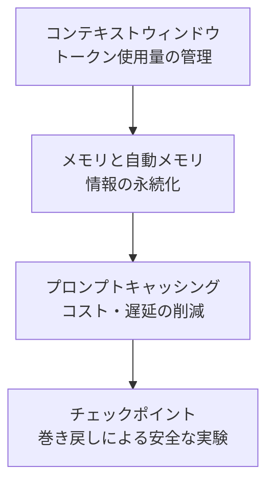

このグループでは、Claude Code が長時間のセッションを安定して継続するために使用するコンテキストウィンドウ、メモリ、プロンプトキャッシング、チェックポイントを扱います。大規模なタスクや複数セッションにまたがる開発において、コンテキストの喪失やコストの増加を減らしたい開発者向けの内容です。


**ひとことで言うと**: トークン使用量を管理し（コンテキストウィンドウ）、情報を永続化し（メモリ）、コストを削減し（プロンプトキャッシング）、安全に巻き戻す（チェックポイント）という4つの軸で、長時間のタスクの安定性を確保します。


## 学習の流れ

まずコンテキストウィンドウの限界と自動圧縮を理解したうえで、メモリで情報を永続化し、プロンプトキャッシングで繰り返しのコストを減らし、最後にチェックポイントで失敗を恐れない実験環境を整える、という順序で読むことをおすすめします。

## 目次

| ドキュメント | 説明 |
|------|------|
| [コンテキストウィンドウ](/claude-code/context-memory/context-window) | トークン・自動圧縮・使用量管理 |
| [メモリと自動メモリ](/claude-code/context-memory/memory) | CLAUDE.md の階層と自動メモリ |
| [プロンプトキャッシング](/claude-code/context-memory/prompt-caching) | キャッシングによるコスト・遅延の削減 |
| [チェックポイント](/claude-code/context-memory/checkpointing) | 巻き戻しによる安全な実験 |

このグループを終えると、次のグループではワークフローと自動化を通じて、これらの基盤を実際の開発プロセスに組み合わせる方法を見ていきます。
