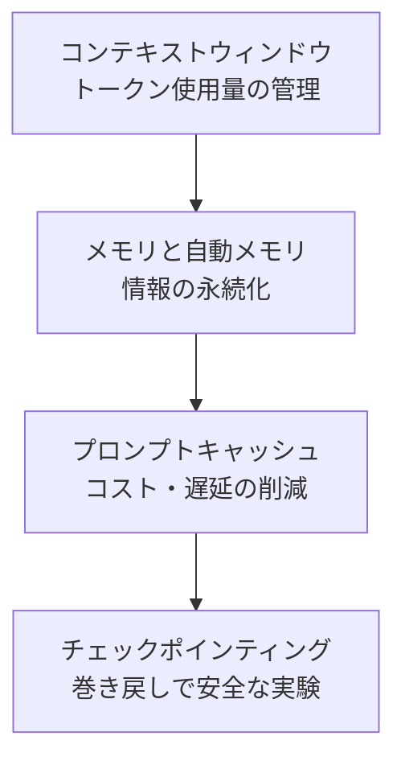

このグループは、Claude Code が長いセッションを安定的に続けるために使うコンテキストウィンドウ、メモリ、プロンプトキャッシュ、チェックポインティングを扱います。大規模な作業や複数セッションにまたがる開発で、コンテキストの損失とコスト増を抑えたい開発者向けの内容です。

エージェンティック開発でコストを決めるのは、モデルの価格表ではなく **トークンの運用方法** です。コンテキストに何をどれだけ載せるか、変わらない部分をキャッシュとして再利用するか、セッションを越えて知識をファイルへ永続化するか — この 4 つのメカニズムが、MoAI-ADK の言う **トークノミクス** (Token Economics) の技術的土台です。


**ひとことで言うと**: トークン使用量を管理し (コンテキストウィンドウ)、情報を永続化し (メモリ)、コストを削減し (プロンプトキャッシュ)、安全に巻き戻す (チェックポインティング) という 4 つの軸で、長い作業の安定性と経済性を同時に確保します。


## 学習の流れ

```mermaid
flowchart TD
    A[コンテキストウィンドウ<br>トークン使用量の管理] --> B[メモリと自動メモリ<br>情報の永続化]
    B --> C[プロンプトキャッシュ<br>コスト・遅延の削減]
    C --> D[チェックポインティング<br>巻き戻しで安全な実験]
```

まずコンテキストウィンドウの限界と自動圧縮を理解し、次にメモリで情報を永続化し、プロンプトキャッシュで繰り返しコストを減らし、最後にチェックポインティングで失敗を恐れない実験環境を整える順で読むことを推奨します。

## 目次

| ドキュメント | 説明 |
|------|------|
| [コンテキストウィンドウ](/claude-code/context-memory/context-window) | トークン・自動圧縮・使用量の管理 |
| [メモリと自動メモリ](/claude-code/context-memory/memory) | CLAUDE.md の階層と自動メモリ |
| [プロンプトキャッシュ](/claude-code/context-memory/prompt-caching) | キャッシュでコスト・遅延を削減 |
| [チェックポインティング](/claude-code/context-memory/checkpointing) | 巻き戻しで安全に実験 |

このグループを終えたら、次のグループ [拡張](/claude-code/extensibility) で、スキル・フック・MCP・プラグイン — ハーネスを組み立てる素材 — へ進みます。
