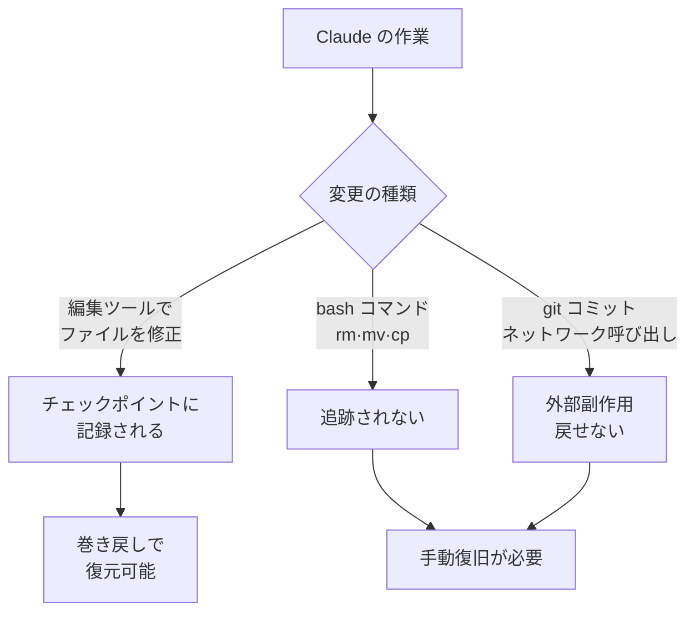

チェックポイント (checkpointing) は、Claude Code が編集を始める前のコード状態を自動でスナップショットとして保持し、いつでも以前の地点へ戻せるようにするセーフティネットです。


**ひとことで言うと**: 作業がこじれても `Esc` を二度押せば、コードと会話をまとめて以前の状態に巻き戻せる、セッション単位の「元に戻す」セーフティネットです。


## チェックポイントの概念

チェックポイントは、作業中に Claude がファイルを編集する直前の状態を自動で捕捉します。そのおかげで、大規模コードベース (large codebase) を対象にした意欲的な作業でも、いつでも直前の状態に戻れるという前提のもとで大胆に試せます。

自動追跡 (automatic tracking) の動作は次のとおりです。

| 項目 | 動作 |
| --- | --- |
| 生成タイミング | ユーザーがプロンプトを送るたびに新しいチェックポイントを生成 |
| 追跡対象 | Claude のファイル編集ツールが行ったすべての変更 |
| セッションをまたいだ保持 | セッションを越えて保存され、再開した会話からもアクセス可能 |
| 整理周期 | セッションとともに 30 日後に自動で整理 (設定で変更可能) |

チェックポイントは **セッション単位の高速な復旧** のための仕組みであり、Git のようなバージョン管理システムを置き換えるものではありません。チェックポイントは「ローカルな元に戻す」、Git は「永続的な記録」と考えると、役割の区別が明確になります。

## 巻き戻し (rewind)

`/rewind` コマンドを実行するか、プロンプト入力欄が空の状態で `Esc` を二度押すと、巻き戻しメニューが開きます。

```text
/rewind
# または入力欄が空のとき
Esc  Esc
```

入力欄にテキストが残っていると、`Esc` の二度押しはメニューを開く代わりに入力内容を消去します。ただし消去されたテキストは入力履歴に保存されるため、巻き戻し作業を終えたあと `Up` キーで呼び戻せます。

巻き戻しメニューは、セッション中に送ったプロンプトの一覧を表示します。戻したい地点を選んだうえで、次の動作のいずれかを選択します。

| 動作 | 効果 |
| --- | --- |
| コードと会話の両方を復元 | 選択した地点へコードと会話履歴をまとめて戻す |
| 会話のみ復元 | 現在のコードは保持し、会話だけをそのメッセージへ戻す |
| コードのみ復元 | 会話は保持し、ファイル変更だけを戻す |
| Summarize from here | 選択したメッセージ以降を要約に圧縮 (コンテキストウィンドウの確保) |
| Summarize up to here | 選択したメッセージ以前を要約に圧縮 (以降のメッセージはそのまま保持) |
| Never mind | 変更を加えずメッセージ一覧へ戻る |

会話を復元するか `Summarize from here` を選ぶと、選択したメッセージの元のプロンプトが入力欄に復元され、そのまま再送信したり、修正して送ったりできます。

### 復元と要約の違い

復元 (restore) 系は状態を **元に戻します** — コード変更、会話履歴、またはその両方を取り消します。一方、要約 (summarize) 系はディスク上のファイルには手を付けず、会話の一部だけを AI 生成の要約に **圧縮します**。

- **Summarize from here**: 選択したメッセージ以前はそのまま残り、選択したメッセージとそれ以降が要約に置き換わります。横道に逸れた議論を捨てつつ、序盤の文脈は詳細に保ちたいときに使います。
- **Summarize up to here**: 選択したメッセージ以前が要約に置き換わり、選択したメッセージとそれ以降はそのまま保持されます。序盤のセットアップ議論は圧縮しつつ、最近の作業は詳細に残したいときに使います。

どちらの場合も元のメッセージはセッショントランスクリプトに保存されるため、必要なら Claude が詳細を改めて参照できます。`/compact` に似ていますが、全体ではなく選択したメッセージを基準にどちら側を圧縮するか選べる点が異なります。

## 何が復元され、何が復元されないか

巻き戻しは **セッション内で Claude のファイル編集ツールが行った変更** のみを追跡します。その境界の外側の変更は復元されません。

| 区分 | 追跡の可否 | 説明 |
| --- | --- | --- |
| Claude による直接のファイル編集 | 追跡される | 編集ツールで行った変更は巻き戻しの対象 |
| bash コマンドによるファイル変更 | 追跡されない | `rm`、`mv`、`cp` などで変わったファイルは戻せない |
| セッション外の手動編集 | 追跡されない | 別のエディタや同時実行セッションの変更は捕捉されない |
| git のコミット・プッシュ | 追跡されない | すでに作成したコミット・プッシュは巻き戻しで取り消せない |
| ネットワーク呼び出し・外部副作用 | 追跡されない | API リクエストやメール送信など、外部で起きたことは戻せない |



要点は、巻き戻しが **ローカルなファイル状態の巻き戻し** であるという点です。外部システムにすでに反映された副作用 (side effect) はチェックポイントの責任範囲外なので、こうした作業には別途気を配る必要があります。

## 安全な実験への活用法

チェックポイントは、次のような状況で特に役立ちます。

- **代替案の探索**: 出発点を失わずに、異なる実装方式を自由に試せます。
- **ミスからの復旧**: バグを作り込んだり機能を壊したりした変更を素早く戻せます。
- **機能の反復**: 動いていた状態へ戻せるという前提のもとで変形を試せます。
- **コンテキスト空間の確保**: 長いデバッグセッションを途中地点から要約し、最初の指示はそのままにコンテキストウィンドウを空けます。

実験的なリファクタリングのように結果が不確実な作業では、まずプロンプトを送ってチェックポイントを作っておき、安心して進めたうえで、気に入らなければ `Esc Esc` でコードと会話をまとめて戻す流れが効率的です。

MoAI-ADK の観点では、SPEC 単位の作業中にコードが大きく揺らいだとき、素早く直前の状態へ復帰するためのセッション内セーフティネットとして活用できます。ただし、永続的な履歴は常に Git コミットとして残すのが原則です。

## 限界と注意点

- **bash コマンドの変更は未追跡**: 編集ツールではなくシェルコマンドで変わったファイルは戻せません。破壊的なシェルコマンドは慎重に扱う必要があります。
- **外部・同時変更は未追跡**: 別のセッションや外部エディタの変更は、たまたま同じファイルに手を付けた場合を除き捕捉されません。
- **バージョン管理の代替にはならない**: チェックポイントはセッション単位の復旧用です。永続的な記録とコラボレーションは、必ず Git のようなバージョン管理システムへ引き継ぐ必要があります。
- **保存期間**: チェックポイントはセッションとともに 30 日後に自動で整理されます (設定で調整可能)。
- **要約とフォーク (fork) の違い**: 要約は同じセッション内でコンテキストを圧縮します。元のセッションをそのまま残して別のアプローチを試したい場合は、`claude --continue --fork-session` でセッションを分岐させるほうが適しています。

## 関連ドキュメント

- [コンテキストウィンドウ](/claude-code/context-memory/context-window)
- [対話モード](/claude-code/foundations/interactive-mode)

## 参考資料

- [Checkpointing — Claude Code Docs](https://code.claude.com/docs/en/checkpointing)


破壊的なリファクタリングを始める前に、短いプロンプト一回でチェックポイントを意図的に作っておけば、実験が失敗しても `Esc Esc` 一回できれいに直前の状態へ戻れます。

