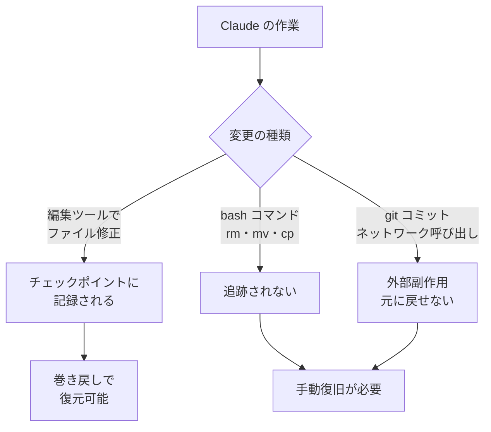

チェックポインティング (checkpointing) は、Claude Code が編集を始める前のコード状態を自動的にスナップショットとして保存しておき、いつでも以前の地点へ戻れるようにする安全網です。


**ひとことで言うと**: 作業がこじれても `Esc` を 2 回押せば、コードと会話を一緒に以前の状態へ巻き戻せる、セッション単位の「元に戻す」安全網です。


## チェックポイントの概念

チェックポインティングは、作業中に Claude がファイルを編集する直前の状態を自動的に捕捉します。おかげで大規模コードベース (large codebase) を対象にした野心的な作業も、いつでも直前の状態へ戻れるという前提の上で大胆に試せます。

自動追跡 (automatic tracking) の動作は次のとおりです。

| 項目 | 動作 |
| --- | --- |
| 作成タイミング | ユーザーがプロンプトを送るたびに新しいチェックポイントを作成 |
| 追跡対象 | Claude のファイル編集ツールが行ったすべての変更 |
| セッション間の維持 | セッションを越えて保存され、再開した会話でもアクセス可能 |
| 整理周期 | セッションとともに 30 日後に自動整理 (設定変更可能) |

チェックポイントは **セッション単位の素早い復旧** のための装置であり、Git のようなバージョン管理システムを置き換えるものではありません。チェックポイントは「ローカルの元に戻す」、Git は「恒久的な記録」と考えれば、役割の区分が明確です。

## 巻き戻し (rewind)

`/rewind` コマンドを実行するか、プロンプト入力欄が空の状態で `Esc` を 2 回押すと、巻き戻しメニューが開きます。

```text
/rewind
# または入力欄が空のとき
Esc  Esc
```

入力欄にテキストが残っていると、`Esc` 2 回はメニューを開く代わりに入力内容を消します。ただし消されたテキストは入力履歴に保存されるため、巻き戻し作業を終えた後に `Up` キーで呼び戻せます。

巻き戻しメニューは、セッション中に送ったプロンプトの一覧を表示します。戻る地点を選んだ後、以下の動作のいずれかを選択します。

| 動作 | 効果 |
| --- | --- |
| コードと会話の両方を復元 | 選択地点へコードと会話履歴を一緒に巻き戻す |
| 会話のみ復元 | 現在のコードは維持し、会話だけそのメッセージへ戻す |
| コードのみ復元 | 会話は維持し、ファイル変更だけを元に戻す |
| Summarize from here | 選択メッセージ以降を要約に圧縮 (コンテキストウィンドウの確保) |
| Summarize up to here | 選択メッセージ以前を要約に圧縮 (以降のメッセージはそのまま維持) |
| Never mind | 変更なしでメッセージ一覧へ戻る |

会話を復元するか `Summarize from here` を選ぶと、選択したメッセージの元のプロンプトが入力欄に復元され、そのまま再送するか修正して送れます。

### 復元と要約の違い

復元 (restore) 系は状態を **巻き戻します** — コード変更、会話履歴、またはその両方を取り消します。一方、要約 (summarize) 系はディスク上のファイルに触れず、会話の一部だけを AI 生成の要約に **圧縮します**。

- **Summarize from here**: 選択メッセージ以前はそのまま残り、選択メッセージとそれ以降が要約に置き換わります。脇道の議論を捨てつつ、序盤のコンテキストは詳細に維持したいときに使います。
- **Summarize up to here**: 選択メッセージ以前が要約に置き換わり、選択メッセージと以降はそのまま維持されます。序盤のセットアップ議論は圧縮しつつ、直近の作業は詳細に残したいときに使います。

どちらの場合も元のメッセージはセッションのトランスクリプトに保存されるため、必要なら Claude が詳細を再参照できます。`/compact` に似ていますが、全体ではなく選択メッセージを基準にどちら側を圧縮するかを選べる点が異なります。

## 何が復元され、何が復元されないか

巻き戻しは **セッション内で Claude のファイル編集ツールが行った変更** のみを追跡します。その境界の外の変更は復元されません。

| 区分 | 追跡の有無 | 説明 |
| --- | --- | --- |
| Claude の直接ファイル編集 | 追跡される | 編集ツールで行った変更は巻き戻しの対象 |
| bash コマンドによるファイル変更 | 追跡されない | `rm`、`mv`、`cp` などで変わったファイルは元に戻せない |
| セッション外部の手動編集 | 追跡されない | 別のエディタや同時実行セッションの変更は捕捉されない |
| git のコミット・プッシュ | 追跡されない | すでに作られたコミット・プッシュは巻き戻しで取り消されない |
| ネットワーク呼び出し・外部副作用 | 追跡されない | API リクエスト、メール送信など外部で起きたことは戻せない |


```mermaid
flowchart TD
    A[Claude の作業] --> B{変更の種類}
    B -->|編集ツールで<br>ファイル修正| C[チェックポイントに<br>記録される]
    B -->|bash コマンド<br>rm・mv・cp| D[追跡されない]
    B -->|git コミット<br>ネットワーク呼び出し| E[外部副作用<br>元に戻せない]
    C --> F[巻き戻しで<br>復元可能]
    D --> G[手動復旧が必要]
    E --> G
```

重要なのは、巻き戻しが **ローカルファイル状態の巻き戻し** だという点です。外部システムにすでに反映された副作用 (side effect) はチェックポイントの責任範囲外なので、こうした操作は別途注意する必要があります。

## 安全な実験への活用法

チェックポイントは、次のような状況で特に役立ちます。

- **代替案の探索**: 出発点を失わずに、異なる実装方式を自由に試します。
- **ミスの復旧**: バグを生んだり機能を壊した変更を素早く元に戻します。
- **機能の反復**: 動いていた状態へ戻れるという前提のもとでバリエーションを実験します。
- **コンテキスト空間の確保**: 長ったらしいデバッグセッションを途中の地点から要約し、初期の指示はそのままにコンテキストウィンドウを空けます。

実験的なリファクタリングのように結果が不確実な作業は、まずプロンプトを送ってチェックポイントを作っておき、安心して進めた後、気に入らなければ `Esc Esc` でコードと会話を一緒に巻き戻す流れが効率的です。

MoAI-ADK の観点では、チェックポインティングはエージェンティックループを大胆に回せるようにする条件です。ループが「行動 → 検証 → 修正」を自律的に繰り返すには、失敗した試行を安価に巻き戻せる必要があり、チェックポイントがその巻き戻しコストをほぼゼロにします。SPEC 単位の作業中にコードが大きく崩れたとき、素早く直前の状態へ復帰するセッション内の安全網として活用しつつ、恒久的な履歴は常に Git コミットで残すのが原則です。

## 制限と注意点

- **bash コマンドの変更は未追跡**: 編集ツールではなくシェルコマンドで変わったファイルは元に戻せません。破壊的なシェルコマンドは慎重に扱う必要があります。
- **外部・同時変更は未追跡**: 別のセッションや外部エディタの変更は、たまたま同じファイルに触れた場合を除き捕捉されません。
- **バージョン管理の代替は不可**: チェックポイントはセッション単位の復旧用です。恒久的な記録と協業は、必ず Git のようなバージョン管理システムで継続すべきです。
- **保存期間**: チェックポイントはセッションとともに 30 日後に自動整理されます (設定で調整可能)。
- **要約とフォーク (fork) の違い**: 要約は同じセッション内でコンテキストを圧縮します。元のセッションをそのままにして別のアプローチを試すなら、`claude --continue --fork-session` でセッションを分岐するほうが適しています。

## 関連ドキュメント

- [コンテキストウィンドウ](/ja/claude-code/context-memory/context-window)
- [対話モード](/ja/claude-code/foundations/interactive-mode)

## 参考資料

- [Checkpointing — Claude Code Docs](https://code.claude.com/docs/en/checkpointing)


破壊的なリファクタリングを始める前に、短いプロンプトを一度送って意図的にチェックポイントを作っておけば、実験が失敗しても `Esc Esc` 一発で直前の状態へきれいに戻れます。

