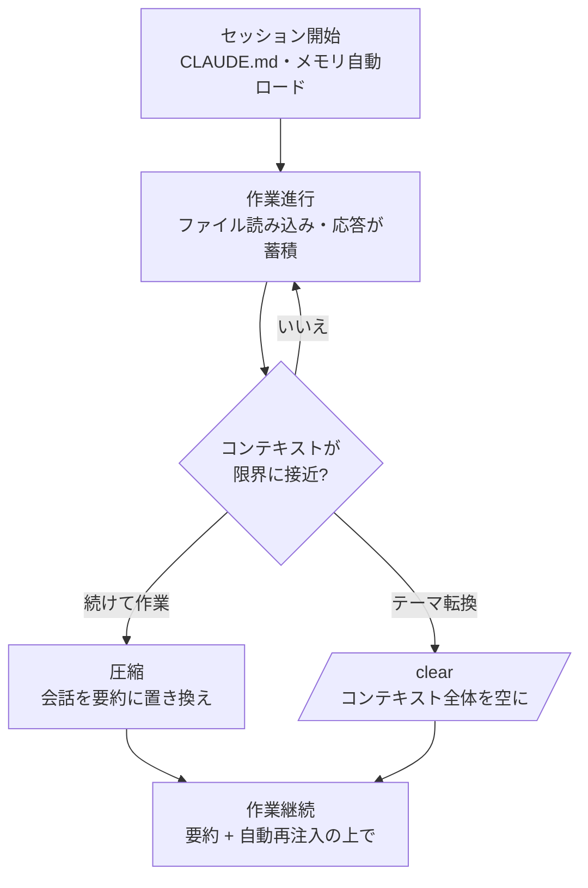

# コンテキストウィンドウ

Claude Code が 1 セッションの間に記憶するすべてが収まる空間であるコンテキストウィンドウ (context window) と、それを効率的に管理する方法を整理します。


**ひとことで言うと**: コンテキストウィンドウは Claude の **作業デスク** であり、デスクがいっぱいになる前に自動圧縮 (compaction) と `/clear` で空間を空けておくことで、長いタスクが最後まで滑らかに進みます。


## コンテキストウィンドウとトークン

コンテキストウィンドウは、Claude が 1 セッションで同時に「見ることができる」情報の総量です。ここにはユーザーが入力したプロンプトだけでなく、ターミナルに表示されない内容まですべて含まれます。

| コンテキストに入るもの | ターミナルに見えるか | 備考 |
|------------------------|-------------------|------|
| システムプロンプト | 見えない | 動作ルール。常に最初にロードされる |
| CLAUDE.md (グローバル + プロジェクト) | 見えない | プロジェクトのルールとビルドコマンド |
| 自動メモリ (`MEMORY.md`) | 見えない | 以前のセッションで残したメモ |
| スキル説明 (1 行) + MCP ツール名 | 見えない | 実際の本文は使用時のみロードされる |
| ユーザープロンプト | 見える | 実際に入力したリクエスト |
| Claude が読んだファイル | 1 行の要約のみ | ファイル本文は Claude だけが見る |
| Claude の分析・修正・応答 | 見える | ターミナルにそのまま出力される |

トークン (token) はこの情報を数える単位です。おおよそ英単語 1 つが 1〜2 トークン、韓国語は 1 文字あたりより多くのトークンを占めます。直感に反する事実の 1 つは、**セッションを開始する前にすでにかなりの量が埋まっている** という点です。CLAUDE.md、メモリ、スキル一覧、MCP ツール名が最初のプロンプトより先にロードされるためです。

### ファイル読み込みがコンテキストを最も消費します

Claude が作業しながら読むファイルがコンテキスト使用量を支配します。そのため、プロンプトを具体的に書いて (「`auth.ts` のバグを直して」) Claude が読むファイル数を減らすことが、トークン節約の鍵です。リサーチのようにファイルを多く調べる必要がある作業は、サブエージェント (subagent) に委任すると、大きなファイルの読み込みが別のコンテキストウィンドウで処理され、結果の要約だけが本セッションに戻ってきます。

## モデル別のサイズ

コンテキストウィンドウのサイズはモデルごとに異なります。正確な数値は使用するモデルによって変わるため、以下は一般論として理解してください。

| サイズ (一般論) | 意味 |
|---------------|------|
| 約 200K トークン | 多くのモデルの標準ウィンドウ。一般的なコード作業に十分 |
| 約 1M トークン | 一部のモデルが提供する拡張ウィンドウ。大規模コードベース (large codebase) に有利 |

サイズが大きいほど一度により多くのファイルと会話を収められますが、ウィンドウは無限ではありません。どのモデルを使っても、結局は限界に近づくと管理が必要になります。核となる原則は、**ウィンドウサイズを増やすよりも、入れる内容を少なく保つこと** のほうが安定するという点です。

## 自動圧縮と /clear

セッションが長くなると、コンテキストが限界に近づきます。Claude Code はこれを 2 つの方法で扱います。

### 圧縮 (compaction)

圧縮は、蓄積された会話履歴を **構造化された 1 つの要約に置き換えて** 空間を確保します。`/compact` を自分で実行することもでき、コンテキストが限界に近づくと自動的に起こることもあります。要約は次のものを保持します。

- ユーザーのリクエストと意図
- 核となる技術概念
- 確認または修正したファイルと重要なコード片
- 発生したエラーと解決方法
- 残りの作業と現在の進捗状況

その代わり、ツール出力の全体と途中の推論過程は失われます。Claude は作業内容を参照できますが、以前に読んだコードの原文をそのまま保持することはなくなります。

圧縮後に各情報がどうなるかは、ロード方式によって異なります。

| メカニズム | 圧縮後の状態 |
|----------|--------------|
| システムプロンプト、出力スタイル | そのまま維持 (メッセージ履歴の一部ではない) |
| プロジェクトルートの CLAUDE.md、範囲なしのルール | ディスクから再注入 |
| 自動メモリ | ディスクから再注入 |
| `paths:` フロントマターが付いたルール | 該当ファイルを再度読むまで消える |
| サブディレクトリのネストした CLAUDE.md | 該当ディレクトリのファイルを再度読むまで消える |
| 呼び出したスキル本文 | 再注入 (スキルあたり 5,000 トークン、全体 25,000 トークン上限、古いものから削除) |
| hook | 該当なし (hook はコードとして実行され、コンテキストに残らない) |

圧縮を生き延びさせたいルールであれば、`paths:` フロントマターを外すか、プロジェクトルートの CLAUDE.md に移してください。スキルは切り詰められるときに前半を残すので、重要な指示は `SKILL.md` の上のほうに置くのが安全です。

### 自動圧縮タイミングの制御

自動圧縮のタイミングを調整する必要がある場合、環境変数 `CLAUDE_AUTOCOMPACT_PCT_OVERRIDE` でしきい値（デフォルト: コンテキスト全体の約 75～80%）を変更できます。たとえば、ゆとりを持たせて圧縮したい場合は、より低い値を指定してください。

```bash
export CLAUDE_AUTOCOMPACT_PCT_OVERRIDE=70  # 70%で圧縮開始
```

MCP ツール定義は必要なときだけ遅延ロード (delayed load) されるため、ツールメタデータはコンテキストに常駐しますが、ツール定義本体はツールを使用する時点でのみロードされます。この遅延ロードメカニズムにより、コンテキストウィンドウを効率的に活用できます。

### /clear — 完全初期化

`/clear` は圧縮とは異なります。要約すら残さずに会話コンテキストをまるごと空にして、**新しいセッションのように** 開始します。直前の作業と無関係な新しい作業に移るときに最もすっきりします。要約 (圧縮) は「続けてさらに作業するとき」、初期化 (`/clear`) は「テーマを変えるとき」に使うと覚えておくとよいでしょう。



## 使用量モニタリング

今コンテキストがどれくらい埋まっているか分からなければ管理できません。Claude Code は実測ツールを提供します。

| コマンド / 場所 | 表示するもの |
|-------------|-------------|
| `/context` | カテゴリ別のリアルタイムコンテキスト使用状況と最適化の提案 |
| `/cost` | 現在のセッションのトークン使用量とコスト |
| `/memory` | 起動時にロードされた CLAUDE.md と自動メモリファイルの一覧 |
| ステータスライン (status line) | セッション進行中の使用量を常に表示 |

長い作業に入る前や途中で `/context` を一度実行し、どの項目がコンテキストを占めているかを確認する習慣が大きな差を生みます。

## 長時間タスクでの管理戦略

大規模な作業ほどコンテキストが第一の制約になります。次の戦略を組み合わせれば、1 つの作業を複数の圧縮境界を越えて安定して続けられます。

- **要約してから継続**: 1 段階を終えたら圧縮で整理し、続く段階は要約の上で進めます。
- **サブエージェントで分離**: ファイルを多く読む必要がある探索・リサーチはサブエージェントに任せ、本セッションのコンテキストを保護します。
- **メモリにチェックポイントを残す**: 重要な決定と進捗状況をメモリに記録し、圧縮や `/clear` を越えて生き延びさせます。これはチェックポインティング (checkpointing) とともに長いセッションの連続性を支えます。
- **CLAUDE.md ダイエット**: プロジェクトの CLAUDE.md は 200 行以下に保ち、参照用の内容はスキルやパス範囲ルールに移して必要なときだけロードされるようにします。
- **プロンプトを具体的に**: 読むファイルを絞って不要なファイル読み込みを減らします。

このうちメモリとチェックポイントは MoAI-ADK の SPEC ワークフローおよびセッションハンドオフと直接かみ合うため、詳しい運用方法は以下の関連ドキュメントで扱います。ここでは「コンテキストが埋まる前にあらかじめ空け、重要な状態はディスクに残す」というベストプラクティス (best practices) だけ覚えておけば十分です。

## 関連ドキュメント

- [メモリと自動メモリ](/claude-code/context-memory/memory)
- [チェックポインティング](/claude-code/context-memory/checkpointing)

## 参考資料

- [Claude Code Docs — Context window](https://code.claude.com/docs/en/context-window)


新しい作業を始める直前に `/clear` を一度実行してください。以前の作業のファイル読み込みと会話が積み上がったまま新しい作業に入ると、無関係なトークンがデスクを占有し、応答品質とコストの両方が悪化します。

