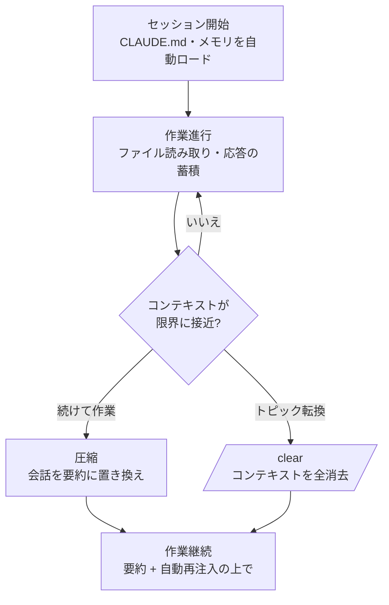

# コンテキストウィンドウ

Claude Code が 1 つのセッションの間に記憶するすべてが収まる空間、コンテキストウィンドウ (context window) と、それを効率的に管理する方法を整理します。


**ひとことで言うと**: コンテキストウィンドウは Claude の **作業デスク** であり、トークンコストが発生する台帳です。デスクが満杯になる前に自動圧縮 (compaction) と `/clear` で空間を空けることで、長い作業が品質とコストの両面で最後まで滑らかに流れます。


## コンテキストウィンドウとトークン

コンテキストウィンドウは、Claude が 1 セッションで同時に「見られる」情報の総量です。ここにはユーザーが入力したプロンプトだけでなく、ターミナルに表示されない内容まですべて含まれます。

| コンテキストに入るもの | ターミナルに見えるか | 備考 |
|------------------------|-------------------|------|
| システムプロンプト | 見えない | 動作ルール。常に最初にロード |
| 自動メモリ (`MEMORY.md`) | 見えない | 以前のセッションで残したメモ。冒頭 200 行または 25KB までのみロード |
| 環境情報 | 見えない | OS、シェル、ワークスペースのパスなど |
| MCP ツール名 (遅延ロード) | 見えない | MCP のツール定義は必要なときだけロードされコンテキストを節約 |
| CLAUDE.md (グローバル + プロジェクト) | 見えない | プロジェクトのルールとビルドコマンド |
| スキルの説明 (1 行) | 見えない | 実際の本文は使うときだけロード |
| ユーザープロンプト | 見える | 実際に入力したリクエスト |
| Claude が読んだファイル | 1 行の要約のみ | ファイル本文は Claude だけが見る |
| Claude の分析・修正・応答 | 見える | ターミナルにそのまま出力 |

トークン (token) はこの情報を数える単位です。おおよそ英単語 1 つが 1~2 トークンで、韓国語や日本語は 1 文字あたりより多くのトークンを占めます。直感に反する事実が 1 つあります。**セッションを始める前からすでにかなりの量が埋まっている** という点です。CLAUDE.md、メモリ、スキル一覧、MCP のツール名が最初のプロンプトより先にロードされるからです。

### ファイル読み取りがコンテキストを最も消費します

Claude が作業しながら読むファイルが、コンテキスト使用量を支配します。だからプロンプトを具体的に書き (「`auth.ts` のバグを直して」)、Claude が読むファイル数を減らすことがトークン節約の核心です。リサーチのようにファイルを大量に漁る作業はサブエージェント (subagent) に委任すると、大きなファイルの読み取りが別のコンテキストウィンドウで処理され、結果の要約だけがメインセッションに戻ります。

## モデルごとのサイズ

コンテキストウィンドウのサイズはモデルによって異なります。正確な数値は使用するモデル次第なので、以下は一般論として理解してください。

| サイズ (一般論) | 意味 |
|---------------|------|
| 約 200K トークン | 多くのモデルの標準ウィンドウ。一般的なコード作業には十分 |
| 約 1M トークン | 一部のモデルが提供する拡張ウィンドウ。大規模コードベース (large codebase) に有利 |

サイズが大きいほど一度により多くのファイルと会話を収められますが、ウィンドウは無限ではありません。どのモデルを使っても限界に近づけば管理が必要です。重要な原則は、**ウィンドウのサイズを増やすことより、入れる内容を少なく保つこと** のほうが安定するという点です。

## 自動圧縮と /clear

セッションが長くなるとコンテキストが限界に近づきます。Claude Code はこれを 2 つの方法で扱います。

### 圧縮 (compaction)

圧縮は蓄積された会話履歴を **1 つの構造化された要約に置き換えて** 空間を確保します。`/compact` を直接実行することも、コンテキストが限界に近づくと自動で起きることもあります。要約は次を保存します。

- ユーザーのリクエストと意図
- 主要な技術概念
- 参照または修正したファイルと重要なコード片
- 発生したエラーと解決方法
- 残りの作業と現在の進行状況

その代わり、全ツール出力と中間の推論過程は消えます。Claude は作業内容を参照できますが、以前に読んだコードの原文をそのまま保持してはいません。

圧縮後に各情報がどうなるかは、ロード方式によって異なります。

| メカニズム | 圧縮後の状態 |
|----------|--------------|
| システムプロンプト、出力スタイル | そのまま維持 (メッセージ履歴の一部ではない) |
| プロジェクトルートの CLAUDE.md、スコープなしのルール | ディスクから再注入 |
| 自動メモリ | ディスクから再注入 |
| `paths:` フロントマター付きのルール | 該当ファイルを再度読むまで消える |
| サブディレクトリのネストされた CLAUDE.md | そのディレクトリのファイルを再度読むまで消える |
| 呼び出したスキル本文 | 再注入 (スキルあたり 5,000 トークン、全体 25,000 トークン上限、古いものから削除) |
| hook | 該当なし (hook はコードとして実行されコンテキストに残らない) |

圧縮を生き延びてほしいルールなら、`paths:` フロントマターを外すか、プロジェクトルートの CLAUDE.md へ移しましょう。スキルは切り詰め時に冒頭が残るため、重要な指示は `SKILL.md` の上部に置くのが安全です。

### 自動圧縮タイミングの制御

自動圧縮のタイミングを調整したい場合は、環境変数 `CLAUDE_AUTOCOMPACT_PCT_OVERRIDE` でしきい値 (デフォルト: 全コンテキスト比で約 75~80%) を変更できます。たとえば余裕を持って圧縮したいなら、より低い値を指定します。

```bash
export CLAUDE_AUTOCOMPACT_PCT_OVERRIDE=70  # 70%で圧縮開始
```

### /clear — 完全な初期化

`/clear` は圧縮とは異なります。要約すら残さず会話コンテキストを丸ごと空にし、**新しいセッションのように** 始めます。直前の作業と無関係な新しい作業へ移るときに最もクリーンです。要約 (圧縮) は「続けてさらに作業するとき」、初期化 (`/clear`) は「トピックを変えるとき」に使うと覚えておけばよいでしょう。


```mermaid
flowchart TD
    A[セッション開始<br>CLAUDE.md・メモリを自動ロード] --> B[作業進行<br>ファイル読み取り・応答の蓄積]
    B --> C{コンテキストが<br>限界に接近?}
    C -->|いいえ| B
    C -->|続けて作業| D[圧縮<br>会話を要約に置き換え]
    C -->|トピック転換| E[/clear<br>コンテキストを全消去/]
    D --> F[作業継続<br>要約 + 自動再注入の上で]
    E --> F
```

## 使用量モニタリング

いまコンテキストがどれだけ埋まっているかを知らなければ管理できません。Claude Code は実測ツールを提供します。

| コマンド / 場所 | 見せてくれるもの |
|-------------|-------------|
| `/context` | カテゴリ別のリアルタイムコンテキスト使用内訳と最適化の提案 |
| `/cost` | 現在のセッションのトークン使用量とコスト |
| `/memory` | 起動時にロードされた CLAUDE.md と自動メモリファイルの一覧 |
| ステータスライン (status line) | セッション進行中の使用量を常時表示 |

長い作業に入る前や途中で `/context` を一度実行し、どの項目がコンテキストを占めているかを確認する習慣が大きな差を生みます。

## 長い作業での管理戦略

大規模な作業ほどコンテキストが第一の制約です。次の戦略を組み合わせれば、1 つの作業を複数の圧縮境界を越えて安定して続けられます。

- **要約してから続ける**: 1 つの段階を終えたら圧縮で整理し、続く段階は要約の上で進めます。
- **サブエージェントで分離**: ファイルを大量に読む必要のある探索・リサーチはサブエージェントに任せ、メインセッションのコンテキストを守ります。
- **メモリにチェックポイントを残す**: 重要な決定と進行状況はメモリに記録し、圧縮や `/clear` を越えて生き残らせます。これはチェックポインティング (checkpointing) とともに長いセッションの連続性を支えます。
- **CLAUDE.md のダイエット**: プロジェクトの CLAUDE.md は 200 行以下に保ち、参照用の内容はスキルやパススコープのルールへ移して、必要なときだけロードされるようにします。
- **プロンプトを具体的に**: 読むファイルを絞り、不要なファイル読み取りを減らします。

このうちメモリとチェックポイントは、MoAI-ADK の SPEC ワークフローおよびセッションハンドオフと直接かみ合います。MoAI-ADK はこのページの原理を **コンテキストダイエット** (context diet) という名の運用規律へ拡張します — 常時ロードされる指針を最小化し、モデル別のしきい値 (1M コンテキストモデルは使用量 50%、200K モデルは 90%) で進行状態をディスクへ保存し、貼り付け 1 回で次のセッションを続けられるセッションハンドオフを提供し、statusline にコンテキスト使用率 (CW%) を常時表示してしきい値への接近を事前に知らせます。ここでは「コンテキストが埋まる前に先に空け、重要な状態はディスクに残す」というベストプラクティス (best practices) だけ覚えておけば十分です。

## 関連ドキュメント

- [メモリと自動メモリ](/claude-code/context-memory/memory)
- [チェックポインティング](/claude-code/context-memory/checkpointing)

## 参考資料

- [Claude Code Docs — Context window](https://code.claude.com/docs/en/context-window)


新しい作業を始める直前に `/clear` を一度実行しましょう。前の作業のファイル読み取りと会話が積み上がったまま新しい作業に入ると、無関係なトークンがデスクを占め、応答品質とコストの両方が悪化します。

