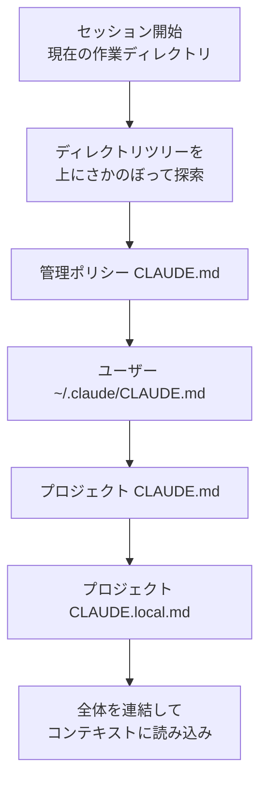
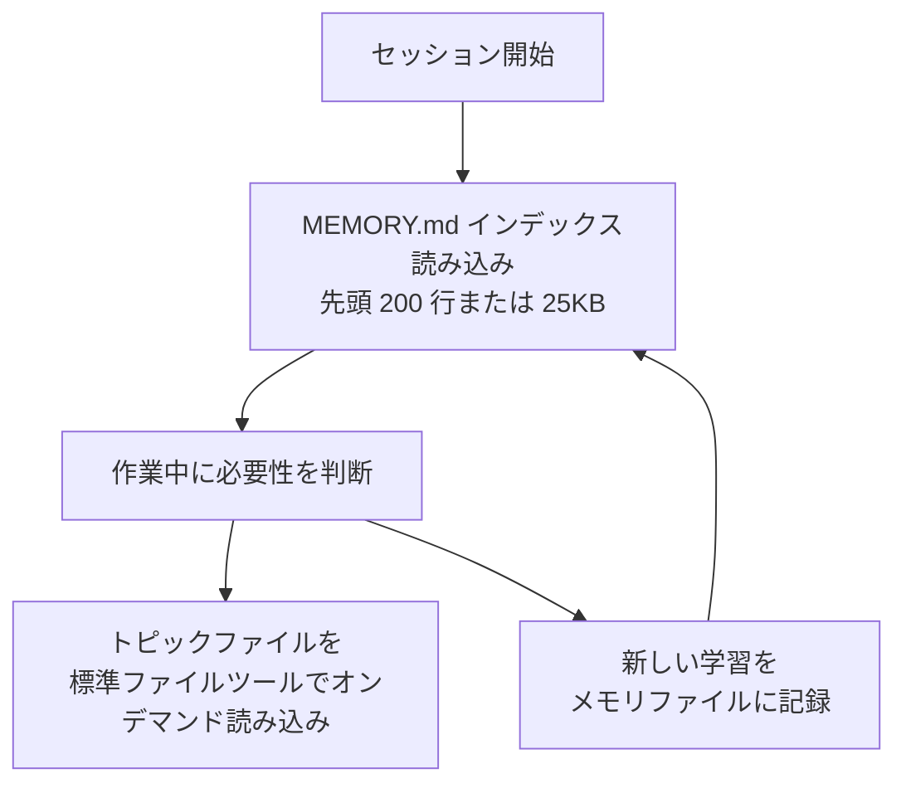

Claude Code が毎回新しいコンテキストウィンドウ (context window) でセッションを開始しながらも、プロジェクトの知識を失わないようにする 2 つのメモリメカニズムを見ていきます。


**ひとことで言うと**: CLAUDE.md は人が書き留める永続的な指示で、自動メモリは Claude が作業しながら自ら書きためる学習ノートであり、どちらも毎セッションの開始時にコンテキストとして読み込まれます。


## 2 つのメモリメカニズム

Claude Code のすべてのセッションは、空のコンテキストウィンドウで始まります。セッションをまたいで知識を引き継ぐ方法は 2 つあります。両者は互いを補完し、毎回の会話開始時にいっしょに読み込まれます。

| 区分 | CLAUDE.md ファイル | 自動メモリ (auto memory) |
| :--- | :--- | :--- |
| **作成主体** | 人 (直接記述) | Claude (自ら記述) |
| **記載する内容** | 指示とルール | 学習とパターン |
| **範囲** | プロジェクト / ユーザー / 組織 | リポジトリ単位、ワークツリー間で共有 |
| **読み込みタイミング** | 毎セッション (全体) | 毎セッション (先頭 200 行または 25KB) |
| **用途** | コーディング標準、ワークフロー、アーキテクチャ | ビルドコマンド、デバッグの知見、発見した好み |

どちらのメモリも **強制設定ではなくコンテキスト** (context, not enforced configuration) です。つまり Claude はこれを読んで従おうとしますが、無条件の遵守を保証するものではありません。特定の動作を必ず遮断したい場合は、メモリではなく `PreToolUse` hook を使う必要があります。

## CLAUDE.md ベースのメモリ

CLAUDE.md は、プロジェクト、個人のワークフロー、組織全体のための永続的な指示を記載する Markdown ファイルです。人がプレーンテキストで記述すると、Claude が毎セッションの開始時に読み込みます。

### CLAUDE.md にいつ追加するか

毎回くり返し説明することになる事実を書き留めておく場所です。次のようなサインが現れたら追加します。

- Claude が同じミスを 2 度目にくり返したとき
- コードレビューが、Claude が知っているべきだったコードベースの事項を指摘したとき
- 前のセッションで入力した訂正を、また入力しているとき
- 新しいチームメンバーに同じように説明する必要があるコンテキストのとき

ビルドコマンド、規約、プロジェクトのレイアウト、「常に X せよ」といったルールのように、毎セッション維持すべき事実に集中します。複数ステップの手順であったり、コードベースの一部だけに該当する場合は、スキルまたはパス限定ルールに移すほうが適しています。

### メモリ階層

CLAUDE.md は複数の場所に置くことができ、場所ごとに範囲が異なります。下の表は読み込み順 (広い範囲から狭い範囲) に並べたもので、より具体的な指示があとからコンテキストに入ります。

| 範囲 | 場所 | 用途 | 共有対象 |
| :--- | :--- | :--- | :--- |
| **管理ポリシー** (managed policy) | macOS: `/Library/Application Support/ClaudeCode/CLAUDE.md`<br>Linux/WSL: `/etc/claude-code/CLAUDE.md`<br>Windows: `C:\Program Files\ClaudeCode\CLAUDE.md` | 組織全体の指示 (IT/DevOps が管理) | 組織内の全ユーザー |
| **ユーザー指示** (user) | `~/.claude/CLAUDE.md` | すべてのプロジェクト共通の個人の好み | 本人 (全プロジェクト) |
| **プロジェクト指示** (project) | `./CLAUDE.md` または `./.claude/CLAUDE.md` | チーム共有のプロジェクト指示 | ソースコントロールでチームメンバーと共有 |
| **ローカル指示** (local) | `./CLAUDE.local.md` | 個人用のプロジェクト別の好み (`.gitignore` 対象) | 本人 (現在のプロジェクト) |

管理ポリシーファイルは個人設定で除外できないため、組織の指示が常に適用されます。別ファイルの代わりに、`managed-settings.json` の `claudeMd` キーで管理 CLAUDE.md の内容を直接埋め込むこともできます。

### CLAUDE.md の読み込み順

Claude Code は現在の作業ディレクトリから上にディレクトリツリーをさかのぼり、各ディレクトリの `CLAUDE.md` と `CLAUDE.local.md` を探します。見つかったファイルは互いに上書きせず、すべて連結 (concatenate) してコンテキストに入れます。ファイルシステムのルートから作業ディレクトリ側へ下りていく順序なので、実行位置に近い指示が最後に読まれます。



作業ディレクトリより上の階層のファイルは起動時にすべて読み込まれますが、サブディレクトリのファイルは Claude がそのディレクトリのファイルを読むときにはじめて含まれます。モノレポで他チームのファイルが拾われる場合は、`claudeMdExcludes` 設定で特定のファイルをスキップできます。

### import 構文で他のファイルを取り込む

CLAUDE.md は `@path/to/import` 構文で他のファイルを取り込めます。import したファイルは、それを参照した CLAUDE.md とともに起動時に展開され、コンテキストに読み込まれます。

```text
See @README for project overview and @package.json for available npm commands.

# Additional Instructions
- git workflow @docs/git-instructions.md
```

- 相対パスと絶対パスのどちらも使えますが、相対パスは作業ディレクトリではなく **import を含むファイル** を基準に解決されます。
- import したファイルがさらに別のファイルを import でき、最大の深さは **4 hop** です。
- 初めて外部 import に遭遇すると承認ダイアログが表示されます。拒否すると、その import は無効のまま残ります。

複数のワークツリー (worktree) にまたがって個人の指示を共有したい場合は、ホームディレクトリのファイルを import する方法が便利です。

```text
# Individual Preferences
- @~/.claude/my-project-instructions.md
```

### 効果的な指示の書き方

CLAUDE.md は毎セッション、コンテキストウィンドウに読み込まれ、会話とともにトークンを消費します。書き方が遵守率に直接影響します。

| 原則 | 推奨 | 避けるべきこと |
| :--- | :--- | :--- |
| **サイズ** | ファイルあたり 200 行以下を目標にする | 長くなるほどコンテキスト消費が増え、遵守率が下がる |
| **構造** | ヘッダーと箇条書きでグループ化する | 詰め込んだ段落 |
| **具体性** | 「2 スペースのインデントを使う」 | 「コードをきれいに」 |
| **一貫性** | 矛盾するルールを定期的に整理する | 衝突時に Claude が任意に選択する |

`.claude/rules/` ディレクトリを使うと、指示をトピック別のファイルに分割でき、frontmatter の `paths` フィールドで特定のファイルパスに限定して、マッチするファイルを扱うときだけ読み込ませることができます。

## 自動メモリ

自動メモリは、人が何も書かなくても Claude がセッションをまたいで知識を積み上げられるようにします。作業しながら、ビルドコマンド、デバッグの知見、アーキテクチャのノート、コードスタイルの好み、ワークフローの習慣などを自ら記録します。毎セッション何かを保存するわけではなく、今後の会話に役立つかどうかを判断し、記録する価値のあるものだけを残します。

自動メモリは Claude Code v2.1.59 以上が必要です。`claude --version` でバージョンを確認できます。

### 何をどこに保存するか

プロジェクトごとに固有のメモリディレクトリを持ちます。

```text
~/.claude/projects/<project>/memory/
├── MEMORY.md          # 簡潔なインデックス、毎セッション読み込み
├── debugging.md       # デバッグパターンの詳細ノート
├── api-conventions.md # API 設計の決定
└── ...                # Claude が作るそのほかのトピックファイル
```

`<project>` パスは git リポジトリから導出されるため、**同じリポジトリのすべてのワークツリーとサブディレクトリが 1 つのメモリディレクトリを共有** します (git リポジトリの外ではプロジェクトルートを使用)。自動メモリは **マシンローカル** (machine-local) であり、他のマシンやクラウド環境とは共有されません。

`autoMemoryDirectory` 設定で保存場所を変更できます。値は絶対パスか `~/` で始まる必要があります。

```json
{
  "autoMemoryDirectory": "~/my-custom-memory-dir"
}
```

### 想起の仕組み

`MEMORY.md` はメモリディレクトリのインデックスの役割を果たします。**先頭 200 行または 25KB のうち先に達する地点まで** が毎回の会話開始時に読み込まれ、それ以上は開始時点では読み込まれません。そのため Claude は詳細なノートを別のトピックファイルに移し、`MEMORY.md` を簡潔に保ちます。



`debugging.md`、`patterns.md` のようなトピックファイルは起動時に読み込まれず、情報が必要になったときに Claude が標準ファイルツールで直接読み込みます。Claude Code の画面に "Writing memory" または "Recalled memory" が見えたら、メモリディレクトリを実際に更新または読み込んでいるところです。

この 200 行/25KB の上限は `MEMORY.md` にのみ適用されます。CLAUDE.md ファイルは長さに関係なく全体が読み込まれます (ただし短いほど遵守率は良くなります)。

### オン・オフ、そして監査

自動メモリはデフォルトでオンです。`/memory` を開いてトグルするか、`autoMemoryEnabled` 設定でオフにでき、環境変数 `CLAUDE_CODE_DISABLE_AUTO_MEMORY=1` でも無効化されます。

```json
{
  "autoMemoryEnabled": false
}
```

`/memory` コマンドは、現在のセッションに読み込まれたすべての CLAUDE.md、`CLAUDE.local.md`、ルールファイルを一覧表示し、自動メモリのトグルとメモリフォルダを開くリンクを提供します。自動メモリファイルはすべてプレーンな Markdown なので、いつでも直接編集したり削除したりできます。「always use pnpm, not npm」のように覚えてほしいと依頼すると自動メモリに保存され、「add this to CLAUDE.md」と言うと CLAUDE.md に追加されます。

## メモリ作成のベストプラクティス

良いメモリは短く検証可能です。次の原則に従うと、遵守率と可読性がともに上がります。

- **簡潔に**: `MEMORY.md` はインデックスとして保ち、詳細はトピックファイルに分離します。CLAUDE.md はファイルあたり 200 行以下を目標にします。
- **1 ファイルに 1 つの事実**: 1 つのトピックは 1 つのファイルにまとめます。`testing.md`、`api-design.md` のように説明的なファイル名を使います。
- **具体的に**: 曖昧な表現の代わりに検証可能な文を書きます (「コミット前に `npm test` を実行」のように)。
- **矛盾を整理**: 互いに衝突する指示は定期的に取り除きます。衝突が残ると、Claude がどちらに従うかを任意に決めます。
- **強制が必要なら hook で**: 毎コミット前のように特定の時点で必ず実行すべきことは、メモリではなく hook で書きます。

## MoAI-ADK メモリシステムとの関係

MoAI-ADK は上記の Claude Code メモリ基盤の上で動作します。プロジェクトルートの CLAUDE.md をオーケストレーターの実行指示として使い、自動メモリの `MEMORY.md` インデックスとトピックファイルを、SPEC 作業のセッションハンドオフと教訓 (lessons) の蓄積に活用します。MoAI 固有のメモリ運用ルールとインデックス管理の方式は、別のドキュメントで詳しく扱います。

## 関連ドキュメント

- [CLAUDE.md ガイド](/advanced/claude-md-guide)

## 参考資料

- [How Claude remembers your project (Claude Code Docs)](https://code.claude.com/docs/en/memory)
- [Auto memory (Claude Code Docs)](https://code.claude.com/docs/en/memory#auto-memory)


今、自動メモリに何が積み上がっているのか気になったら、セッションで `/memory` を実行してフォルダを開いてみてください。すべてプレーンな Markdown なので、その場で読んで整え、削除できます。

