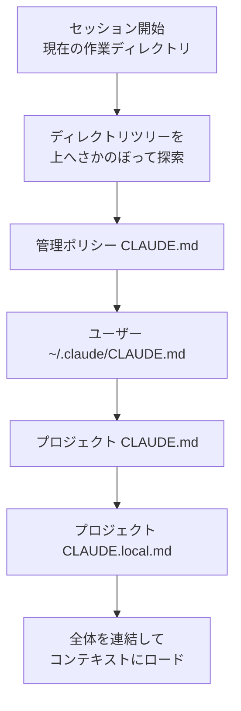
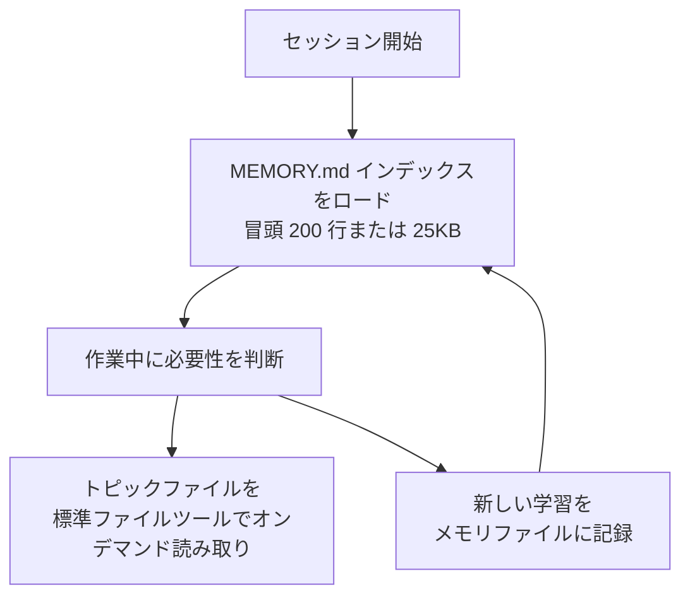

Claude Code が毎セッション新しいコンテキストウィンドウ (context window) で始まりながらも、プロジェクト知識を失わないよう助けてくれる 2 つのメモリメカニズムを見ていきます。


**ひとことで言うと**: CLAUDE.md は人が書き留める恒久的な指針で、自動メモリは Claude が作業しながら自ら書きためる学習ノートです。どちらも毎セッション開始時にコンテキストとしてロードされます。


## 2 つのメモリメカニズム

Claude Code のすべてのセッションは、空のコンテキストウィンドウで始まります。セッションを越えて知識を伝える方法は 2 つあります。両者は互いを補完し、毎回の会話開始時に一緒にロードされます。

| 区分 | CLAUDE.md ファイル | 自動メモリ (auto memory) |
| :--- | :--- | :--- |
| **書き手** | 人 (直接作成) | Claude (自ら作成) |
| **収める内容** | 指針とルール | 学習とパターン |
| **範囲** | プロジェクト / ユーザー / 組織 | リポジトリ単位、ワークツリー共有 |
| **ロード時点** | 毎セッション (全文) | 毎セッション (冒頭 200 行または 25KB) |
| **使いどころ** | コーディング標準、ワークフロー、アーキテクチャ | ビルドコマンド、デバッグの洞察、発見した好み |

どちらのメモリも **強制される設定ではなくコンテキスト** (context, not enforced configuration) です。つまり Claude はこれを読んで従おうとしますが、無条件の遵守を保証するわけではありません。特定の動作を必ずブロックしたいなら、メモリではなく `PreToolUse` hook を使うべきです。

## CLAUDE.md ベースのメモリ

CLAUDE.md は、プロジェクト、個人のワークフロー、組織全体のための恒久的な指針を収めるマークダウンファイルです。人が平文で書けば、Claude が毎セッション開始時に読みます。

### いつ CLAUDE.md に追加するか

毎回説明し直すことになる事実を書き留める場所です。次のようなサインが現れたら追加します。

- Claude が同じミスを 2 回目に繰り返したとき
- コードレビューで、Claude が知っているべきだったコードベースの事項が見つかったとき
- 前のセッションで入力した訂正をまた入力しているとき
- 新しいチームメンバーに同じように説明する必要のあるコンテキストのとき

ビルドコマンド、慣習、プロジェクトレイアウト、「常に X せよ」のようなルールなど、毎セッション維持すべき事実に集中します。複数段階の手順であったり、コードベースの一部にのみ該当する場合は、スキルまたはパス限定のルールへ移すほうがよいでしょう。

### メモリ階層

CLAUDE.md は複数の場所に置くことができ、場所ごとに範囲が異なります。以下の表はロード順 (広い範囲から狭い範囲へ) に並べたもので、より具体的な指針ほど後からコンテキストに入ります。

| 範囲 | 場所 | 用途 | 共有対象 |
| :--- | :--- | :--- | :--- |
| **管理ポリシー** (managed policy) | macOS: `/Library/Application Support/ClaudeCode/CLAUDE.md`<br>Linux/WSL: `/etc/claude-code/CLAUDE.md`<br>Windows: `C:\Program Files\ClaudeCode\CLAUDE.md` | 組織全体の指針 (IT/DevOps が管理) | 組織内の全ユーザー |
| **ユーザー指針** (user) | `~/.claude/CLAUDE.md` | 全プロジェクト共通の個人的な好み | 本人 (全プロジェクト) |
| **プロジェクト指針** (project) | `./CLAUDE.md` または `./.claude/CLAUDE.md` | チーム共有のプロジェクト指針 | ソースコントロールでチームと共有 |
| **ローカル指針** (local) | `./CLAUDE.local.md` | 個人用のプロジェクト別の好み (`.gitignore` 対象) | 本人 (現在のプロジェクト) |

管理ポリシーファイルは個人設定で除外できず、組織の指針が常に適用されます。別ファイルの代わりに `managed-settings.json` の `claudeMd` キーで管理対象の CLAUDE.md 内容を直接入れることもできます。

### CLAUDE.md のロード順

Claude Code は現在の作業ディレクトリから上へディレクトリツリーをさかのぼり、各ディレクトリの `CLAUDE.md` と `CLAUDE.local.md` を探します。見つかったファイルは互いに上書きせず、すべて連結して (concatenate) コンテキストに入れます。ファイルシステムのルートから作業ディレクトリへ下る順なので、実行位置に近い指針が最後に読まれます。


```mermaid
flowchart TD
    A["セッション開始<br>現在の作業ディレクトリ"] --> B["ディレクトリツリーを<br>上へさかのぼって探索"]
    B --> C["管理ポリシー CLAUDE.md"]
    C --> D["ユーザー ~/.claude/CLAUDE.md"]
    D --> E["プロジェクト CLAUDE.md"]
    E --> F["プロジェクト CLAUDE.local.md"]
    F --> G["全体を連結して<br>コンテキストにロード"]
```

作業ディレクトリより上の階層のファイルは起動時にすべてロードされますが、サブディレクトリのファイルは Claude がそのディレクトリのファイルを読むときに初めて含まれます。モノレポで他チームのファイルが拾われる場合は、`claudeMdExcludes` 設定で特定ファイルをスキップできます。

### import 構文で他のファイルを含める

CLAUDE.md は `@path/to/import` 構文で他のファイルを取り込めます。import されたファイルは、それを参照した CLAUDE.md とともに起動時に展開されコンテキストへロードされます。

```text
See @README for project overview and @package.json for available npm commands.

# Additional Instructions
- git workflow @docs/git-instructions.md
```

- 相対パスと絶対パスの両方が使え、相対パスは作業ディレクトリではなく **import を含むファイル** 基準で解釈されます。
- import されたファイルがさらに別のファイルを import でき、最大の深さは **4 hop** です。
- 初めて外部の import に遭遇すると承認ダイアログが表示されます。拒否すると import は無効のまま残ります。

複数のワークツリー (worktree) にまたがって個人の指針を共有するには、ホームディレクトリのファイルを import する方式が便利です。

```text
# Individual Preferences
- @~/.claude/my-project-instructions.md
```

### 効果的な指針の書き方

CLAUDE.md は毎セッションのコンテキストウィンドウにロードされ、会話とともにトークンを消費します。書き方が遵守率に直接影響します。

| 原則 | 推奨 | 回避 |
| :--- | :--- | :--- |
| **サイズ** | ファイルあたり 200 行以下を目標 | 長くなるほどコンテキスト消費が増え、遵守率が低下 |
| **構造** | ヘッダーと箇条書きでグループ化 | 密度の高い段落 |
| **具体性** | 「2 スペースインデントを使用」 | 「コードをきれいに」 |
| **一貫性** | 矛盾するルールを定期的に整理 | 衝突すると Claude が任意に選択 |

`.claude/rules/` ディレクトリを使えば指針をトピック別ファイルに分けられ、frontmatter の `paths` フィールドで特定のファイルパスに限定して、マッチするファイルを扱うときだけロードされるようにできます。

## 自動メモリ

自動メモリは、人が何も書かなくても Claude がセッションを越えて知識を蓄積できるようにします。作業しながらビルドコマンド、デバッグの洞察、アーキテクチャノート、コードスタイルの好み、ワークフローの習慣などを自ら記録します。毎セッション何かを保存するわけではなく、今後の会話に有用かどうかを判断し、記録する価値のあるものだけを残します。

自動メモリには Claude Code v2.1.59 以上が必要です。`claude --version` でバージョンを確認できます。

### 何をどこに保存するか

プロジェクトごとに固有のメモリディレクトリを持ちます。

```text
~/.claude/projects/<project>/memory/
├── MEMORY.md          # 簡潔なインデックス、毎セッションロード
├── debugging.md       # デバッグパターンの詳細ノート
├── api-conventions.md # API 設計の決定
└── ...                # Claude が作るその他のトピックファイル
```

`<project>` のパスは git リポジトリから導出されるため、**同じリポジトリのすべてのワークツリーとサブディレクトリが 1 つのメモリディレクトリを共有** します (git リポジトリ外ではプロジェクトルートを使用)。自動メモリは **マシンローカル** (machine-local) であり、他のマシンやクラウド環境とは共有されません。

`autoMemoryDirectory` 設定で保存場所を変えられます。値は絶対パスか `~/` で始まる必要があります。

```json
{
  "autoMemoryDirectory": "~/my-custom-memory-dir"
}
```

### 想起の仕組み

`MEMORY.md` はメモリディレクトリのインデックスの役割を果たします。**冒頭 200 行または 25KB のうち先に達した地点まで** が毎回の会話開始時にロードされ、それ以上は起動時にはロードされません。そのため Claude は詳細なノートを別のトピックファイルへ移し、`MEMORY.md` を簡潔に保ちます。


```mermaid
flowchart TD
    A["セッション開始"] --> B["MEMORY.md インデックスをロード<br>冒頭 200 行または 25KB"]
    B --> C["作業中に必要性を判断"]
    C --> D["トピックファイルを<br>標準ファイルツールでオンデマンド読み取り"]
    C --> E["新しい学習を<br>メモリファイルに記録"]
    E --> B
```

`debugging.md`、`patterns.md` のようなトピックファイルは起動時にロードされず、情報が必要になったとき Claude が標準のファイルツールで直接読みます。Claude Code の画面に「Writing memory」または「Recalled memory」と表示されたら、メモリディレクトリを実際に更新または読み取っている最中です。

この 200 行/25KB の上限は `MEMORY.md` にのみ適用されます。CLAUDE.md ファイルは長さと無関係に全文がロードされます (ただし短いほど遵守率は良くなります)。

### オン/オフの切り替えと監査

自動メモリはデフォルトでオンです。`/memory` を開いてトグルするか `autoMemoryEnabled` 設定でオフにでき、環境変数 `CLAUDE_CODE_DISABLE_AUTO_MEMORY=1` でも無効化できます。

```json
{
  "autoMemoryEnabled": false
}
```

`/memory` コマンドは、現在のセッションにロードされたすべての CLAUDE.md、`CLAUDE.local.md`、ルールファイルを一覧表示し、自動メモリのトグルとメモリフォルダを開くリンクを提供します。自動メモリのファイルはすべて平文のマークダウンなので、いつでも直接編集・削除できます。「always use pnpm, not npm」のように覚えるよう頼むと自動メモリに保存され、「add this to CLAUDE.md」と言えば CLAUDE.md に追加されます。

## メモリ作成のベストプラクティス

良いメモリは短く検証可能です。次の原則に従えば、遵守率と可読性がともに上がります。

- **簡潔に**: `MEMORY.md` はインデックスとして保ち、詳細はトピックファイルへ分離します。CLAUDE.md はファイルあたり 200 行以下を目標にします。
- **1 ファイルに 1 つの事実**: 1 つのトピックは 1 つのファイルにまとめます。`testing.md`、`api-design.md` のように説明的なファイル名を使います。
- **具体的に**: 曖昧な表現の代わりに検証可能な文を書きます。(「コミット前に `npm test` を実行」のように)
- **矛盾の整理**: 互いに衝突する指針は定期的に取り除きます。衝突が残ると Claude がどちらに従うかを任意に決めます。
- **強制が必要なら hook で**: 毎コミット前のように特定の時点で必ず実行すべきことは、メモリではなく hook として書きます。

## MoAI-ADK メモリシステムとの関係

MoAI-ADK は上記の Claude Code メモリ基盤の上で動作します。プロジェクトルートの CLAUDE.md をオーケストレーターの実行指針として使い、自動メモリの `MEMORY.md` インデックスとトピックファイルを SPEC 作業のセッションハンドオフおよび教訓 (lessons) の蓄積に活用します。

ファイルベースの永続メモリは、MoAI-ADK の **再帰的な自己学習** の柱の原料でもあります。ループが回りながら残した観察 — ユーザーの訂正、失敗パターン、ルーティングの決定 — がメモリファイルに積み上がり、ハーネスがその蓄積をもとにスキルとエージェント指針を改善します。「ループが観察を蓄積し、ハーネスが学習して指針が進化する」という文の最初の輪が、まさにこのページのメモリメカニズムです。MoAI 固有のメモリ運用ルールとインデックス管理方式は、別のドキュメントで詳しく扱います。

## 関連ドキュメント

- [CLAUDE.md ガイド](/ja/advanced/claude-md-guide)

## 参考資料

- [How Claude remembers your project (Claude Code Docs)](https://code.claude.com/docs/en/memory)
- [Auto memory (Claude Code Docs)](https://code.claude.com/docs/en/memory#auto-memory)


いま自動メモリに何が蓄積されているか気になったら、セッションで `/memory` を実行してフォルダを開いてみてください。すべて平文のマークダウンなので、その場で読み、磨き、消すことができます。

