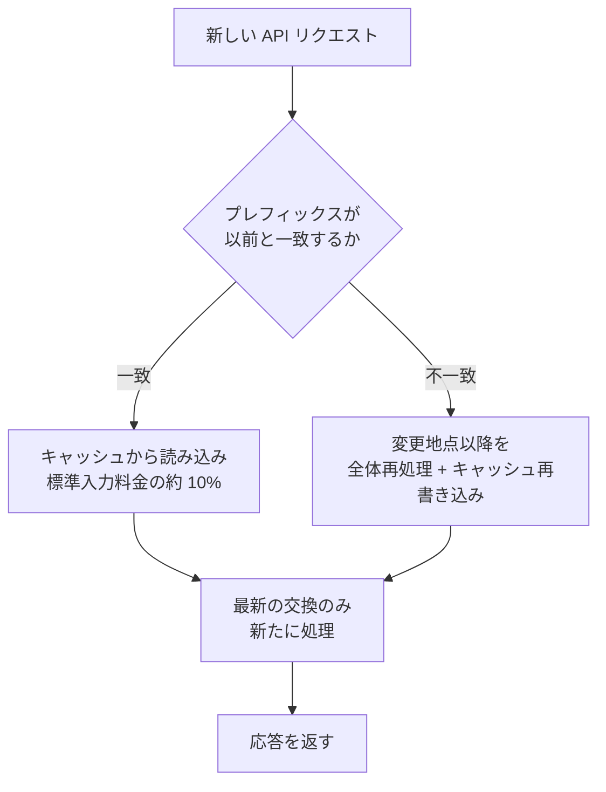

Claude Code は毎ターン会話全体を再処理するのではなく、すでに処理した部分を再利用するプロンプトキャッシュ (prompt caching) を自動的に管理します。


**ひとことで言うと**: 毎回変わらない前半部分（プレフィックス）をキャッシュからそのまま読み込み、同じ処理を二度行わずに、コストと応答時間を大幅に削減します。


## プロンプトキャッシュが必要な理由

モデルはリクエストとリクエストの間に何も記憶しません。そのため Claude Code はメッセージを送るたびに新しい API リクエストを作成し、**コンテキスト全体**（システムプロンプト、プロジェクトコンテキスト、すべての過去メッセージとツール結果、新しいメッセージ）を再送信します。

重要なのは、新しい内容が常に **末尾に追加される** という点です。したがって各リクエストの大部分は直前のリクエストと同一です。プロンプトキャッシュは、まさにこの「変わっていない部分」を再処理しないための仕組みです。

## キャッシュの動作方法

API は各リクエストの **先頭部分** を、最近処理した内容と比較します。この先頭部分を **プレフィックス** (prefix) と呼びます。一般的なターンでは直前のリクエスト全体がプレフィックスとなり、最も新しくやり取りした一回の交換だけが新しい内容です。

マッチングは **完全一致** 方式のため、プレフィックスのどこかが変わると、それ以降はすべて再計算されます。ファイル単位や区間単位のキャッシュはありません。



### キャッシュのための 3 層構造

プレフィックスマッチングの効率を高めるため、Claude Code は **ほとんど変わらない内容を前方に** 配置します。

| 層 | 含まれる内容 | 無効化されるタイミング |
|----|--------------|------------------------|
| システムプロンプト | コア指針、ツール定義、出力スタイル | MCP サーバーの接続/切断、Claude Code のアップグレード |
| プロジェクトコンテキスト | `CLAUDE.md`、自動メモリ、スコープなしのルール | セッション開始、`/clear` または `/compact` 以降 |
| 会話 | ユーザーメッセージ、Claude の応答、ツール結果 | 毎ターン |

会話層だけが変わる場合、システムプロンプトとプロジェクトコンテキストはキャッシュされたまま残ります。逆にシステムプロンプトが変わると、それ以降のすべての内容が異なるプレフィックスの後ろに置かれるため、**全体が無効化** されます。

プロンプトのテキストには含まれませんが、キャッシュキーの一部となるものがもう 2 つあります。

- **モデル**: モデルごとにキャッシュが分離されます。`/model` でモデルを変えると、内容が同じでも全体を再計算します。
- **努力レベル** (effort level): 同じモデルであっても、努力レベルごとにキャッシュは別です。`/effort` でセッションの途中に変えると全体が再計算され、Claude Code は適用前に確認を求めます。

## 何がキャッシュされるか

キャッシュされる対象は、結局のところ **頻繁に変わらない、リクエスト前方の大きな塊** です。

- **システムプロンプト**: コア指針と出力スタイル
- **ツール定義**: 組み込みツールと MCP ツールの定義全体
- **プロジェクトコンテキスト**: `CLAUDE.md`、自動メモリ、ルール
- **蓄積された会話履歴**: 過去メッセージ、Claude の応答、ツール結果、大きなコンテキスト（読み込んだ大規模コードベースファイルなど）

これらの塊は 1 ターンに 1 回処理されてキャッシュに記録され、以降のターンでは標準入力料金の約 10% だけを支払ってそのまま読み込みます。

## コストと遅延の削減効果（概念的に）

キャッシュの性能は、API が応答ごとに報告する 2 つのトークン数値で明らかになります。

| フィールド | 意味 |
|------------|------|
| `cache_creation_input_tokens` | このターンにキャッシュへ **記録** されたトークン。キャッシュ書き込み料金として課金 |
| `cache_read_input_tokens` | このターンにキャッシュから **読み込まれた** トークン。標準入力料金の約 10% で課金 |

- **コスト**: 読み込み (read) トークンは標準入力料金の約 10% 水準です。キャッシュ読み込みの比率が高いほど、同じ処理をより安く行えます。
- **遅延**: 変わっていないプレフィックスを再処理しないため、応答が速くなります。逆にキャッシュが無効化されたターンは、一度遅く・高くなります。

**読み込み対書き込み (read-to-creation) の比率が高いほど** キャッシュがうまく機能している証拠です。書き込みがターンごとに高いままなら、プレフィックスの何かが毎回変わっているというサインです。

## キャッシュを無効化する操作

次の操作は、次のリクエストでキャッシュの一部または全体をミスさせます。一度遅くて高いターンが発生した後、新しいプレフィックスが再びキャッシュされます。

| 操作 | 影響 |
|------|------|
| モデルの切り替え (`/model`、`opusplan` トグル) | 全体再計算（モデルごとにキャッシュ分離） |
| 努力レベルの変更 (`/effort`) | 全体再計算、適用前に確認を要求 |
| MCP サーバーの接続/切断 | システムプロンプト層の無効化 |
| ツール全体の拒否（`Bash`、`WebFetch` のような名前そのものの deny ルール） | システムプロンプト層の無効化 |
| 会話の圧縮 (`/compact`) | 会話層の無効化（意図された動作） |
| Claude Code のアップグレード | システムプロンプト/ツール定義の変更 → 全体再構築 |

> `Bash(rm *)` のような **スコープ指定** の deny ルールと、すべての allow/ask ルールは、Claude が見るツールセットを変えないため、プレフィックスはそのまま維持されます。

## キャッシュを維持する操作

逆に、次の操作は会話の末尾に追加するだけか、リクエスト自体に触れないため、キャッシュが生き続けます。

- リポジトリのファイル編集（Claude が再度読み込むと会話末尾に追加される）
- セッション途中の `CLAUDE.md` 編集（キャッシュは維持されるが、編集内容は次の `/clear`・`/compact`・再起動まで **適用されない**）
- 出力スタイルの変更（同様に次の `/clear`・再起動時に適用）
- 権限モードの変更（`opusplan` プランモードを除く）
- スキル・コマンドの呼び出し（指針がユーザーメッセージとして挿入される）
- `/recap` の実行、`/rewind` の巻き戻し

## Claude Code での自動活用

プロンプトキャッシュは **デフォルトでオンになっており**、Claude Code が自動的に管理します。別途オンにする設定は不要です。キャッシュヒット率を高めるベストプラクティス (best practices) はシンプルです。

- モデル・努力レベル・MCP サーバーは **セッション開始時点で** 決め、作業の途中で変えません。
- `/compact` は作業と作業の間の自然な区切りで実行します。
- 捨てる経路に入ってしまったら、`/compact` の代わりに `/rewind` で、すでにキャッシュされた以前のターンに戻します。

キャッシュは事実上 **1 マシン・1 ディレクトリ単位** でスコープが定まります。システムプロンプトが作業ディレクトリ、プラットフォーム、シェル、OS バージョン、自動メモリのパスを含むためです。同じリポジトリのワークツリーもディレクトリが異なるため、互いのキャッシュを共有しません。

### キャッシュ寿命 (TTL)

キャッシュされたプレフィックスは、一定時間活動がないと期限切れになります。キャッシュにヒットするリクエストごとにタイマーが初期化されるため、作業を続けている間はキャッシュが温かく保たれます。

| 認証方式 | デフォルト TTL | 調整用環境変数 |
|----------|----------------|----------------|
| Claude サブスクリプション | 1 時間（自動、追加コストなし） | 上限超過時は自動で 5 分 |
| API キー・サードパーティ | 5 分 | `ENABLE_PROMPT_CACHING_1H=1` で 1 時間に切り替え |
| （共通の強制） | — | `FORCE_PROMPT_CACHING_5M=1` で 5 分を強制 |

## モニタリング方法

キャッシュがうまく動作しているかを見るには、上記の 2 つのトークン数値（`cache_read_input_tokens`、`cache_creation_input_tokens`）を観察します。

- **statusline スクリプト**: `current_usage` オブジェクトを読むステータスラインスクリプトで、毎ターンのリアルタイム確認が可能です。
- **OpenTelemetry エクスポーター**: 組織全体の可視性が必要なとき、ユーザー・セッション別のキャッシュ読み込み/書き込みトークンを報告します。

キャッシュ書き込みトークンがターンごとに高いまま維持される場合は、「キャッシュを無効化する操作」の表で原因を探してください。

### キャッシュの無効化

キャッシュは、特定のモデル・プロバイダーの動作をデバッグするときくらいオフにすれば十分です。普段はオンにしたまま使います。

```bash
# すべてのモデルに対して無効化
export DISABLE_PROMPT_CACHING=1

# 特定のモデルのみ無効化
export DISABLE_PROMPT_CACHING_OPUS=1
```

## MoAI-ADK でさらに深く

MoAI-ADK は、SPEC ベースのワークフロー内で安定したプレフィックス（システムプロンプト、`CLAUDE.md`、ルール）を維持し、キャッシュヒット率を高めるよう設計されています。実際にキャッシュがコスト面でいつ得になるのかについての **損益分岐分析** は、下記のドキュメントで扱います。

## 関連ドキュメント

- [プロンプトキャッシュ — 損益分岐分析](/cost-optimization/prompt-caching)

## 参考資料

- [How Claude Code uses prompt caching](https://code.claude.com/docs/en/prompt-caching)


実践のヒント: セッションを始めるときにモデル・努力レベル・MCP サーバーをまず確定し、作業が終わるまで変えないでください。途中の変更が少ないほどキャッシュヒット率が上がり、応答が速くなります。

