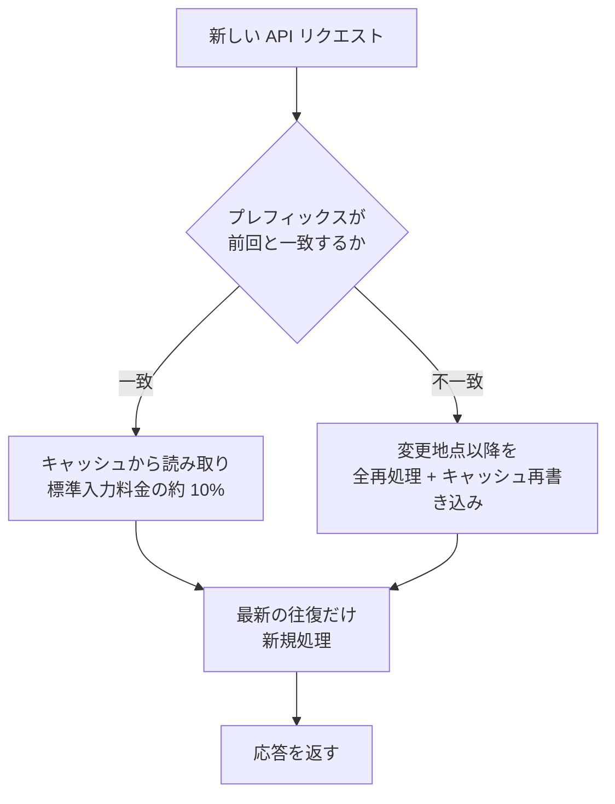

Claude Code は毎ターン会話全体を処理し直す代わりに、すでに処理した部分を再利用するプロンプトキャッシュ (prompt caching) を自動で管理します。


**ひとことで言うと**: 毎回変わらない前半部分 (プレフィックス) をキャッシュからそのまま読み込み、同じ作業を二度処理せず、コストと応答時間を大幅に減らします。



プロンプトキャッシュは本に挟んでおく **しおり**と同じです。毎リクエストは同じ前半部分 (システムプロンプト・プロジェクトコンテキスト・以前の対話) を再び載せて送りますが、前半が直前と同一なら最初から読み直さず、しおりが挟まれた地点まで飛ばします。だから前半が長くそのままであるほどキャッシュ効果が大きく、前半が変わればその地点から読み直すことになります。


## プロンプトキャッシュが必要な理由

モデルはリクエストとリクエストの間に何も記憶しません。そのため Claude Code はメッセージを送るたびに新しい API リクエストを作り、**コンテキスト全体** (システムプロンプト、プロジェクトコンテキスト、すべての過去メッセージとツール結果、新しいメッセージ) を再送信します。

重要なのは、新しい内容が常に **末尾に追記される** という点です。したがって各リクエストの大部分は直前のリクエストと同一です。プロンプトキャッシュは、まさにこの「変わらない部分」を再処理しないようにする仕組みです。

## キャッシュはどう動作するか

API は各リクエストの **先頭部分** を、最近処理した内容と比較します。この先頭部分を **プレフィックス** (prefix) と呼びます。通常のターンでは直前のリクエスト全体がプレフィックスとなり、最新の 1 往復だけが新しい内容です。

マッチングは **完全一致** 方式のため、プレフィックスのどこかが変わると、その後ろはすべて再計算されます。ファイル単位や区間単位のキャッシュはありません。


```mermaid
flowchart TD
    A[新しい API リクエスト] --> B{プレフィックスが<br>前回と一致するか}
    B -->|一致| C[キャッシュから読み取り<br>標準入力料金の約 10%]
    B -->|不一致| D[変更地点以降を<br>全再処理 + キャッシュ再書き込み]
    C --> E[最新の往復だけ<br>新規処理]
    D --> E
    E --> F[応答を返す]
```

### キャッシュのための 3 層構造

プレフィックスマッチングの効率を高めるため、Claude Code は **ほとんど変わらない内容を前に** 配置します。

| 層 | 含まれる内容 | 無効化されるタイミング |
|------|-----------|-----------------|
| システムプロンプト | 中核の指示、ツール定義、出力スタイル | MCP サーバーの接続/切断、Claude Code のアップグレード |
| プロジェクトコンテキスト | `CLAUDE.md`、自動メモリ、スコープなしのルール | セッション開始、`/clear` または `/compact` の後 |
| 会話 | ユーザーメッセージ、Claude の応答、ツール結果 | 毎ターン |

会話層だけが変われば、システムプロンプトとプロジェクトコンテキストはキャッシュされたまま残ります。逆にシステムプロンプトが変わると、それ以降のすべての内容が異なるプレフィックスの後ろに置かれるため、**全体が無効化** されます。

プロンプトテキストには含まれないものの、キャッシュキーの一部となるものが 2 つあります。

- **モデル**: モデルごとにキャッシュが分かれます。`/model` でモデルを変えると、内容が同じでも全体を再計算します。
- **エフォートレベル** (effort level): 同じモデルでもエフォートレベルごとにキャッシュは別です。`/effort` でセッション途中に変えると全体が再計算され、Claude Code が適用前に確認を求めます。

## 何がキャッシュされるか

キャッシュされる対象は、結局 **頻繁に変わらない、リクエスト前方の大きな塊** です。

- **システムプロンプト**: 中核の指示と出力スタイル
- **ツール定義**: 組み込みツールと MCP ツールの定義全体
- **プロジェクトコンテキスト**: `CLAUDE.md`、自動メモリ、ルール
- **蓄積された会話履歴**: 過去のメッセージ、Claude の応答、ツール結果、大きなコンテキスト (読み込んだ大規模コードベースのファイルなど)

これらの塊は 1 ターンで一度処理されてキャッシュに書き込まれ、以降のターンでは標準入力料金の約 10% だけを払ってそのまま読み込みます。

## コストと遅延の削減効果 (概念的に)

キャッシュのパフォーマンスは、API が毎応答で報告する 2 つのトークン数値に表れます。

| フィールド | 意味 |
|------|------|
| `cache_creation_input_tokens` | このターンでキャッシュに **書き込まれた** トークン、キャッシュ書き込み料金で請求 |
| `cache_read_input_tokens` | このターンでキャッシュから **読み込んだ** トークン、標準入力料金の約 10% で請求 |

- **コスト**: 読み取り (read) トークンは標準入力料金の約 10% 水準です。キャッシュ読み取りの比率が高いほど、同じ作業をより安く処理できます。
- **遅延**: 変わっていないプレフィックスを再処理しないため、応答が速くなります。逆にキャッシュが無効化されたターンは、一度だけ遅く高くなります。

**読み取り対書き込み (read-to-creation) 比率が高いほど** キャッシュがうまく機能している証拠です。書き込みがターンごとに高いままなら、プレフィックスの何かが毎回変わっているというサインです。

## キャッシュを無効化する行動

次の行動は、次のリクエストがキャッシュの一部または全体を外す原因になります。一度遅く高いターンが発生した後、新しいプレフィックスが再びキャッシュされます。

| 行動 | 影響 |
|------|------|
| モデル切り替え (`/model`、`opusplan` トグル) | 全体再計算 (モデルごとにキャッシュ分離) |
| エフォートレベル変更 (`/effort`) | 全体再計算、適用前に確認を要求 |
| MCP サーバーの接続/切断 | システムプロンプト層の無効化 |
| ツール全体の拒否 (`Bash`、`WebFetch` のような裸の名前の deny ルール) | システムプロンプト層の無効化 |
| 会話の圧縮 (`/compact`) | 会話層の無効化 (意図された動作) |
| Claude Code のアップグレード | システムプロンプト/ツール定義の変更 → 全体再構築 |

> `Bash(rm *)` のような **スコープ指定** の deny ルールと、すべての allow/ask ルールは、Claude が見るツール集合を変えないため、プレフィックスはそのまま維持されます。

## キャッシュを維持する行動

逆に、次の行動は会話の末尾に追記されるだけか、リクエスト自体に触れないため、キャッシュが生き続けます。

- リポジトリのファイル編集 (Claude が読み直すと会話の末尾に追記)
- セッション途中の `CLAUDE.md` 編集 (キャッシュは維持されるが、編集内容は次の `/clear`・`/compact`・再起動まで **適用されない**)
- 出力スタイルの変更 (同様に次の `/clear`・再起動時に適用)
- 権限モードの変更 (`opusplan` プランモードを除く)
- スキル・コマンドの呼び出し (指示がユーザーメッセージとして挿入される)
- `/recap` の実行、`/rewind` の巻き戻し

## Claude Code での自動活用

プロンプトキャッシュは **デフォルトで有効** で、Claude Code が自動的に管理します。別途有効化する設定は不要です。キャッシュヒット率を高めるベストプラクティス (best practices) はシンプルです。

- モデル・エフォートレベル・MCP サーバーは **セッション開始時点で** 決め、作業の途中で変えません。
- `/compact` は作業と作業の間の自然な区切りで実行します。
- 捨てるべき道筋に入ってしまったら、`/compact` の代わりに `/rewind` で、すでにキャッシュされた以前のターンへ戻します。

キャッシュは事実上 **1 マシン・1 ディレクトリ単位** でスコープが決まります。システムプロンプトが作業ディレクトリ、プラットフォーム、シェル、OS バージョン、自動メモリのパスを含むためです。同じリポジトリのワークツリーもディレクトリが異なるため、互いのキャッシュを共有しません。

### キャッシュの寿命 (TTL)

キャッシュされたプレフィックスは、一定時間アクティビティがないと期限切れになります。キャッシュにヒットするリクエストごとにタイマーがリセットされ、作業を続けている間はキャッシュが温かく保たれます。

| 認証方式 | デフォルト TTL | 調整用環境変数 |
|-----------|----------|----------------|
| Claude サブスクリプション | 1 時間 (自動、追加費用なし) | 上限超過時は自動で 5 分 |
| API キー・サードパーティ | 5 分 | `ENABLE_PROMPT_CACHING_1H=1` で 1 時間へ切り替え |
| (共通強制) | — | `FORCE_PROMPT_CACHING_5M=1` で 5 分を強制 |

## モニタリング方法

キャッシュがうまく動作しているかを見るには、上記の 2 つのトークン数値 (`cache_read_input_tokens`、`cache_creation_input_tokens`) を観察します。

- **statusline スクリプト**: `current_usage` オブジェクトを読むステータスラインスクリプトで、毎ターンのリアルタイム確認が可能です。
- **OpenTelemetry エクスポーター**: 組織全体の可視性が必要なとき、ユーザー・セッション別のキャッシュ読み取り/書き込みトークンを報告します。

キャッシュ書き込みトークンがターンごとに高いまま維持されるなら、「キャッシュを無効化する行動」の表から原因を探してみてください。

### キャッシュの無効化

キャッシュは、特定のモデル・プロバイダーの動作をデバッグするときくらいにだけオフにすれば十分です。普段は有効にしたまま使います。

```bash
# すべてのモデルで無効化
export DISABLE_PROMPT_CACHING=1

# 特定のモデルのみ無効化
export DISABLE_PROMPT_CACHING_OPUS=1
```

## MoAI-ADK でさらに深く — トークノミクスの測定可能な軸

プロンプトキャッシュは、MoAI-ADK の **トークノミクス** の柱の中で最も測定しやすい軸です。MoAI-ADK は 2 つの方向からキャッシュを活用します。

- **ヒット率を高める設計**: SPEC ベースのワークフローの中で安定したプレフィックス (システムプロンプト、`CLAUDE.md`、ルール) を維持し、常時ロードのコンテキストをダイエットして、キャッシュが生き残る前半部分を最大限大きく安定させます。
- **ヒット率を見せる計測**: statusline にキャッシュヒット率 (cache hit) のシグナルを表示し、コンテキストダイエットの効果をセッション中にすぐ確認できるようにします。GLM バックエンド (z.ai) では暗黙的なプロンプトキャッシュが自動適用されます。

キャッシュが実際にコスト面でいつ有利になるかの **損益分岐分析** は、以下のドキュメントで扱います。

## 関連ドキュメント

- [プロンプトキャッシュ — 損益分岐分析](/ja/cost-optimization/prompt-caching)

## 参考資料

- [How Claude Code uses prompt caching](https://code.claude.com/docs/en/prompt-caching)


実践のコツ: セッションを始めるときにモデル・エフォートレベル・MCP サーバーを先に確定し、作業が終わるまで変えないでください。途中の変更が少ないほどキャッシュヒット率が上がり、応答が速くなります。

