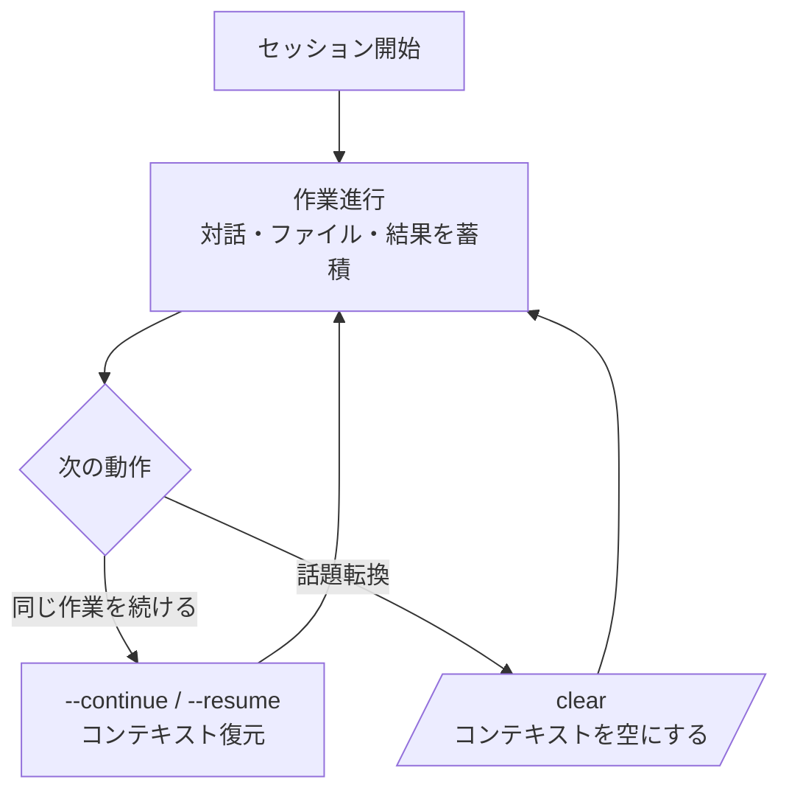

# セッション管理

Claude Code では 1 つの対話がそのまま 1 つのセッションです。このページでは、セッションを開始・再開・整理する方法と、セッションがチェックポイントやハンドオフとどうかみ合うかをまとめます。


**一言でいうと**: セッションは 1 つの **対話の単位**です。続けて作業するときは以前のセッションを呼び戻し (`--resume` / `--continue`)、話題が変わったら `/clear` できれいに空にします。セッションの流れを理解すれば、長い作業を何日にもわたって失わずに続けられます。


## セッションとは

セッションは、Claude Code と交わした 1 つの連続した対話です。その中には、やり取りしたメッセージ、読んだファイルの要約、実行結果が[コンテキストウィンドウ](/ja/claude-code/context-memory/context-window)に蓄積されます。セッションを閉じても記録は保存されるので、あとで再び開いて続けられます。

## 再開と整理

セッションを扱う中心的な動作は次のとおりです。

| コマンド / フラグ | 動作 |
|---------------|------|
| `claude --continue` | 直近のセッションを続けて開始 |
| `claude --resume` | 以前のセッション一覧から選んで続けて開始 |
| `/rename` | 現在のセッションに分かりやすい名前を付与 |
| `/clear` | 対話コンテキストをまるごと空にして新セッションのように開始 |

`--continue` と `--resume` は以前の対話のコンテキストをよみがえらせて作業を続ける用途で、`/clear` は逆にこれまでのコンテキストを捨ててきれいに始め直す用途です。続けてやることなら resume・continue、無関係な新しいことに移るときは `/clear` と覚えておけば十分です。

## セッションとチェックポイント

セッションと[チェックポインティング](/ja/claude-code/context-memory/checkpointing)は別の層を扱います。

| 概念 | 扱うもの | 戻す対象 |
|------|-----------|---------------|
| セッション | 対話全体の開始・再開・整理 | 対話コンテキスト |
| チェックポイント | セッション内で編集直前の状態のスナップショット | コード + 対話を以前の地点へ |

セッションが「どの対話を開いて続けるか」なら、チェックポイントは「この対話の中でついさっきに巻き戻すか」です。セッション内で作業がこじれたとき `/rewind` で以前のチェックポイントに戻す流れは、チェックポインティングのドキュメントで詳しく扱います。

## MoAI-ADK のセッションハンドオフ

セッションがいくら続いても、[コンテキストウィンドウ](/ja/claude-code/context-memory/context-window)には限界があり、`/clear` で空にしなければならない瞬間が来ます。このとき進行状況を失わないためには、セッション境界を越えて状態を引き渡す仕掛けが必要です。

MoAI-ADK はこれを **セッションハンドオフ** (session handoff) として提供します。コンテキスト使用量がモデル別のしきい値に近づくと、オーケストレーターが進行状態をディスクに保存し、次のセッションでそのまま貼り付けて続けられる貼り付け用の再開メッセージ (paste-ready resume message) を作ってくれます。`/clear` のあと、このメッセージ 1 つで新しいセッションが直前の作業を自給自足で引き継ぎます。

セッションハンドオフの 6 ブロック構造、しきい値ポリシー、自動メモリ連携などの詳細は[トークン予算管理](/ja/advanced/token-budget)で扱います。ここでは「セッションはいつでも空にされうるので、重要な状態はセッション境界を越えてファイルに引き渡す」という原則だけ覚えておけば十分です。

## 関連ドキュメント

- [コンテキストウィンドウ](/ja/claude-code/context-memory/context-window)
- [チェックポインティング](/ja/claude-code/context-memory/checkpointing)
- [トークン予算管理](/ja/advanced/token-budget)

## 参考資料

- [Claude Code Docs — Sessions](https://code.claude.com/docs/en/sessions)


長い作業を終えて席を立つときは、セッションをそのまま閉じてかまいません。あとで `claude --resume` で一覧から選んで続ければよく、複数のセッションを行き来するなら `/rename` で名前を付けておくと探し直しがずっと楽になります。

