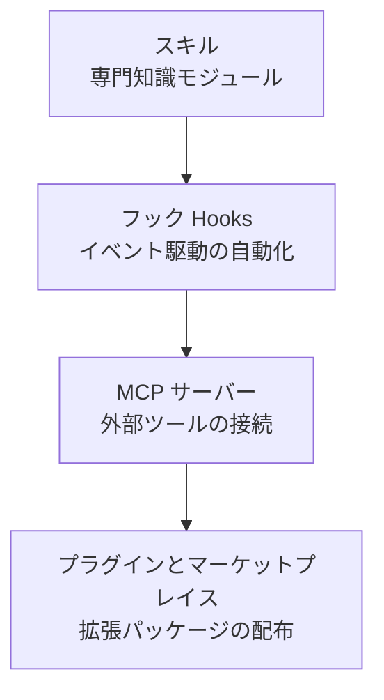

このグループでは、Claude Code の基本機能を超えて動作を拡張する 4 つの方法を扱います。スキルで専門知識をモジュール化し、フックでイベントに自動化を仕込み、MCP で外部ツールを接続し、プラグインでこれらすべてを 1 つのパッケージとして配布する流れを、概念中心に説明します。Claude Code を自分のワークフローに合わせて使いこなしたいエンジニアのためのグループです。


**ひとことで言うと**：スキル・フック・MCP・プラグインという 4 つの拡張ポイントを理解すれば、Claude Code をプロジェクト固有のツールに仕立て上げられます。


## 学習の流れ

もっとも軽量な拡張ポイントであるスキルから始め、自動化を仕込むフック、外部の世界とつなぐ MCP、そして最後にこれらをまとめて配布するプラグインの順に読むことをおすすめします。スキル・フック・MCP は MoAI-ADK の詳細ドキュメントへ深くつながっているので、概念をつかんだ後にさらに掘り下げていけます。

## 目次

| ドキュメント | 説明 |
|------|------|
| [スキル](/claude-code/extensibility/skills) | 専門知識モジュールと段階的開示 |
| [フック (Hooks)](/claude-code/extensibility/hooks) | イベント駆動の自動化 |
| [MCP サーバー](/claude-code/extensibility/mcp) | 外部ツール接続プロトコル |
| [プラグインとマーケットプレイス](/claude-code/extensibility/plugins) | 拡張パッケージとコードインテリジェンス |

4 つの拡張ポイントを習得したら、次のグループでこれらを実際の開発ワークフローに統合する方法を見ていきましょう。
