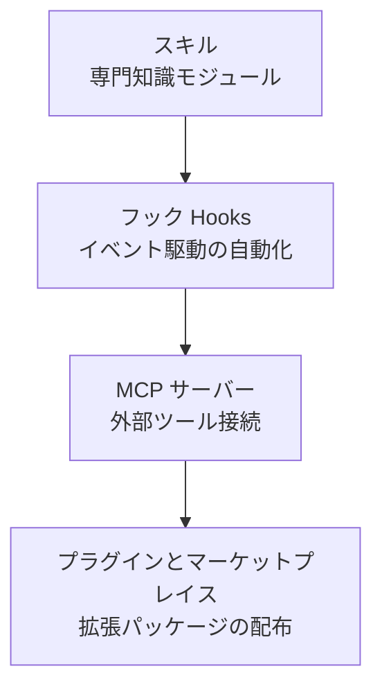

このグループは、Claude Code の基本機能を超えて動作を拡張する 4 つの方法を扱います。スキルで専門知識をモジュール化し、フックでイベントに自動化を仕掛け、MCP で外部ツールを接続し、プラグインでそれらすべてを 1 つのパッケージとして配布する流れを、概念中心に説明します。

この 4 つこそが **エージェンティックハーネス** (Agentic Harness) を組み立てる素材です。コードを直接書く代わりにエージェントがうまく働ける環境を設計するというハーネスエンジニアリングにおいて、スキルはエージェントの知識を、フックは決定論的な規律を、MCP は外部世界との接続を、プラグインはその組み合わせの配布単位を担います。MoAI-ADK が `moai init` 一発で配布するものも、`/moai project` がプロジェクト専用に生成するものも、結局はこれらの素材の組み合わせです。


**ひとことで言うと**: スキル・フック・MCP・プラグインという 4 つの拡張ポイントを理解すれば、Claude Code をプロジェクト固有のハーネスに仕立てられます。



4 つの拡張ポイントは、こう描いておくと混乱しません。**フック**は人が近づくと自動で開く **自動ドアのセンサー** — 特定のイベントが起きると決められた動作が自動で反応します。**スキル**は必要なときだけ取り出して読む **マニュアル** — 普段は表紙 (説明 1 行) だけが見え、その仕事が来たら本文を開きます。**MCP** は外部ツールを差し込む **標準コンセント**、**プラグイン**はこの 3 つを 1 つの箱に収めて配布する **パッケージ**です。


## 学習の流れ

```mermaid
flowchart TD
    A[スキル<br/>専門知識モジュール] --> B[フック Hooks<br/>イベント駆動の自動化]
    B --> C[MCP サーバー<br/>外部ツール接続]
    C --> D[プラグインとマーケットプレイス<br/>拡張パッケージの配布]
```

最も軽量な拡張ポイントであるスキルから始め、自動化を仕掛けるフック、外部世界とつなぐ MCP、最後にそれらを束ねて配布するプラグインの順で読むことを推奨します。スキル・フック・MCP は MoAI-ADK の応用ドキュメントへ深くつながっているので、概念をつかんでからさらに掘り下げるとよいでしょう。

## 目次

| ドキュメント | 説明 |
|------|------|
| [スキル](/ja/claude-code/extensibility/skills) | 専門知識モジュールと段階的開示 |
| [フック (Hooks)](/ja/claude-code/extensibility/hooks) | イベント駆動の自動化 |
| [MCP サーバー](/ja/claude-code/extensibility/mcp) | 外部ツール接続プロトコル |
| [プラグインとマーケットプレイス](/ja/claude-code/extensibility/plugins) | 拡張パッケージとコードインテリジェンス |

4 つの素材を身につけたら、次のグループ [エージェントと自動化](/ja/claude-code/agentic) で、これらの素材で組んだハーネスの上にエージェンティックループを回す方法を確認してください。
