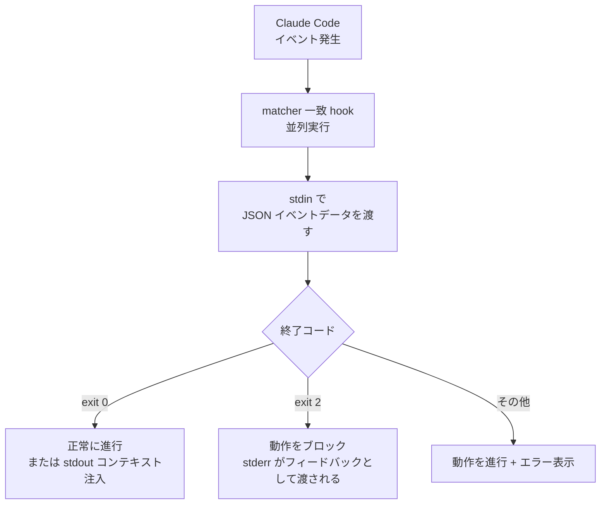

# フック (Hooks)

フック（hook）は Claude Code のライフサイクルの特定のタイミングで自動的に実行されるシェルコマンドで、モデルの判断に依存せず「必ず起きるべき動作」を決定論的に保証します。


**ひとことで言うと**: hook は Claude Code がファイルを編集したり作業を終えたりするたびに自動的に発動する「if-this-then-that」スクリプトで、フォーマット・リント・セキュリティブロックを人手なしで強制します。



このページは概念紹介に重点を置いています。MoAI-ADK が hook を実際にどのように登録・運用するか（シェルラッパーパターン、イベントごとの動作、品質ゲート連携）は、より掘り下げた MoAI-ADK ガイドで扱います。手を動かせる実践的な内容は [Hooks ガイド](/advanced/hooks-guide)と [Hooks イベントリファレンス](/advanced/hooks-reference)を参照してください。


## フックとは

フックは Claude Code がツールを呼び出したり、応答を終えたり、セッションを開始したりといった**イベント** (event) が発生したときに実行されるユーザー定義のシェルコマンドです。モデルが「リントを実行しよう」と判断するのを待つのではなく、hook は該当のイベントが発生するたびに**必ず**実行されます。この決定論的な実行が hook の核心的な価値です。

フックは `settings.json` の `hooks` ブロックに登録します。各項目は、どのイベントに反応するか、どのツールに絞るか（`matcher`）、何を実行するか（`command`）を定義します。

```json
{
  "hooks": {
    "PostToolUse": [
      {
        "matcher": "Edit|Write",
        "hooks": [
          { "type": "command", "command": "jq -r '.tool_input.file_path' | xargs npx prettier --write" }
        ]
      }
    ]
  }
}
```

上記の例は、`Edit` または `Write` ツールでファイルが修正されるたびに `prettier` を自動実行し、フォーマットを一貫して保ちます。

## 主要なイベント

フックが反応できるイベントは多岐にわたり、以下は最もよく使われるものです。

| イベント | 発動タイミング |
| :--- | :--- |
| `SessionStart` | セッションが開始または再開されたとき（コンテキスト注入に活用） |
| `UserPromptSubmit` | ユーザーがプロンプトを送信した直後、Claude が処理する前 |
| `PreToolUse` | ツール呼び出しが実行される直前（ブロック可能） |
| `PostToolUse` | ツール呼び出しが成功した直後（フォーマット・リントに活用） |
| `SubagentStop` | サブエージェントが作業を終えたとき |
| `Stop` | Claude が応答を終えたとき |
| `PreCompact` | コンテキストウィンドウ圧縮の直前 |
| `SessionEnd` | セッションが終了したとき |

全イベント一覧とイベントごとの入力スキーマは、公式の [Hooks リファレンス](https://code.claude.com/docs/en/hooks)に整理されています。

## フックが動作する仕組み

フックは標準入力（stdin）・標準出力（stdout）・標準エラー（stderr）・終了コード（exit code）で Claude Code と通信します。イベントが発生すると Claude Code がイベント情報を JSON で stdin に渡し、スクリプトはそのデータを読み取って処理した後、終了コードで次の動作を指示します。



終了コードの規約は次のとおりです。

| 終了コード | 意味 |
| :--- | :--- |
| `0` | 異議なし。動作が正常に進行します。`SessionStart`・`UserPromptSubmit` などでは stdout の内容が Claude のコンテキストに注入されます |
| `2` | 動作をブロック。stderr に書いた理由が Claude にフィードバックとして渡されます |
| その他 | 動作は進行しますが、トランスクリプトに hook エラーが表示されます |

より細かい制御が必要な場合は、終了コードの代わりに stdout に構造化された JSON を出力して、`permissionDecision`（`allow`/`deny`/`ask`）のような決定を下すことができます。

## どこに使うか

フックは次のような「必ず起きるべき」作業を自動化するときに真価を発揮します。

- **自動フォーマット** (auto-format): `PostToolUse` + `Edit|Write` matcher で編集直後に `prettier`・`gofmt` を実行
- **自動リント** (lint): 編集後にリンターを実行して、スタイル・静的解析の違反を即座に検出
- **セキュリティブロック** (security block): `PreToolUse` で `.env`・`.git/` のような保護ファイルの編集や `rm -rf`・`drop table` のような危険なコマンドを終了コード `2` でブロック
- **通知** (notification): `Notification` イベントで Claude が入力を待っているときにデスクトップ通知を送信
- **コンテキスト注入** (context injection): `SessionStart` または圧縮後にプロジェクトのルール・最近の作業を再注入

フックの登録場所（`~/.claude/settings.json` グローバル、`.claude/settings.json` プロジェクト、プラグイン・スキルのフロントマター）によって適用範囲が変わります。決定論的なルールではなく判断が必要な場合は、モデルで評価するプロンプトベース（`type: "prompt"`）またはエージェントベース（`type: "agent"`）の hook を使うこともできます。

## MoAI-ADK とフック

MoAI-ADK は、シェルスクリプトのラッパーが `moai hook <event>` バイナリを呼び出すパターンで hook を運用し、状態遷移の所有権・sync 段階の品質ゲート・エージェントチームの作業完了検証などを hook で強制します。この部分の実践的な登録方法とイベントごとの詳細な動作は、以下の掘り下げたガイドで扱います。

## 関連ドキュメント

- [Hooks ガイド](/advanced/hooks-guide)
- [Hooks イベントリファレンス](/advanced/hooks-reference)

## 参考資料

- [Automate workflows with hooks（公式ドキュメント）](https://code.claude.com/docs/en/hooks-guide)
- [Hooks reference（公式ドキュメント）](https://code.claude.com/docs/en/hooks)


hook が登録されているのに実行されない場合は、Claude Code で `/hooks` を入力して、該当イベントの下に hook が表示されているか、matcher がツール名と正確に（大文字小文字を区別して）一致しているかをまず確認してください。スクリプトには `chmod +x` で実行権限を付与することも忘れないでください。

