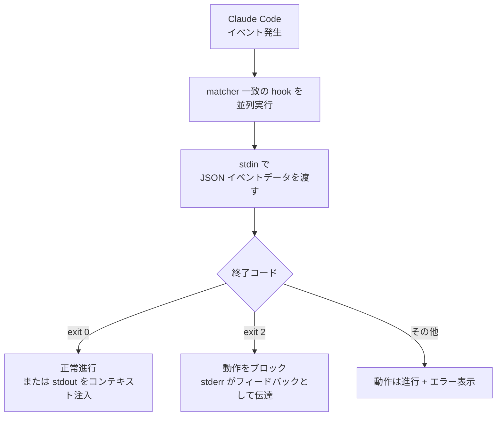

# フック (Hooks)

フック (hook) は、Claude Code のライフサイクルの特定地点で自動的に実行されるシェルコマンドで、モデルの判断に依存せず「常に起きるべき動作」を決定論的に保証します。


**ひとことで言うと**: hook は Claude Code がファイルを編集したり作業を終えたりするたびに自動発動する「if-this-then-that」スクリプトで、フォーマット・リント・セキュリティブロックを人手なしに強制します。



このページは概念紹介に集中します。MoAI-ADK が hook を実際にどう登録・運用するか (シェルラッパーのパターン、イベントごとの動作、品質ゲート連携) は、掘り下げた MoAI-ADK ガイドで扱います。手を動かす実践的な内容は [Hooks ガイド](/advanced/hooks-guide) と [Hooks イベントリファレンス](/advanced/hooks-reference) を参照してください。


## フックとは

フックは、Claude Code がツールを呼び出す、応答を終える、セッションを開始するなどの **イベント** (event) が発生したときに実行されるユーザー定義のシェルコマンドです。モデルが「リントを回すべきだ」と判断するのを待つ代わりに、hook は該当イベントが発生するたびに **必ず** 実行されます。この決定論的な実行こそが hook の中核的な価値です。

フックは `settings.json` の `hooks` ブロックに登録します。各エントリは、どのイベントに反応するか、どのツールに絞るか (`matcher`)、何を実行するか (`command`) を定義します。

```json
{
  "hooks": {
    "PostToolUse": [
      {
        "matcher": "Edit|Write",
        "hooks": [
          { "type": "command", "command": "jq -r '.tool_input.file_path' | xargs npx prettier --write" }
        ]
      }
    ]
  }
}
```

上の例は、`Edit` または `Write` ツールでファイルが修正されるたびに `prettier` を自動実行し、フォーマットを一貫して保ちます。

## 主要イベント

フックが反応できるイベントは 30 以上あり、以下は最もよく使われるものです。

| イベント | 発動タイミング |
| :--- | :--- |
| `SessionStart` | セッションが開始または再開されるとき (コンテキスト注入に活用) |
| `Setup` | `/init` または `--init` フラグで Claude Code を起動するとき |
| `UserPromptSubmit` | ユーザーがプロンプトを送信した直後、Claude が処理する前 |
| `UserPromptExpansion` | ユーザー入力のコマンドがプロンプトへ展開されるとき |
| `PreToolUse` | ツール呼び出しが実行される直前 (ブロック可能) |
| `PermissionRequest` | 権限ダイアログが表示されたとき |
| `PostToolUse` | ツール呼び出しが成功した直後 (フォーマット・リントに活用) |
| `PostToolUseFailure` | ツール呼び出しが失敗したとき |
| `SubagentStart` | サブエージェントが開始されるとき |
| `SubagentStop` | サブエージェントが作業を終えるとき |
| `TaskCreated` | タスクが作成されるとき |
| `TaskCompleted` | タスクが完了としてマークされるとき |
| `Stop` | Claude が応答を終えるとき |
| `PreCompact` | コンテキストウィンドウ圧縮の直前 |
| `PostCompact` | コンテキスト圧縮が完了した後 |
| `SessionEnd` | セッションが終了するとき |

イベントの全一覧とイベントごとの入力スキーマは、公式 [Hooks リファレンス](https://code.claude.com/docs/en/hooks) に整理されています。

## フックの動作方式

フックは標準入力 (stdin)・標準出力 (stdout)・標準エラー (stderr)・終了コード (exit code) で Claude Code と通信します。イベントが発生すると Claude Code がイベント情報を JSON として stdin に渡し、スクリプトはそのデータを読んで処理した後、終了コードで次の動作を指示します。


```mermaid
flowchart TD
  A[Claude Code<br>イベント発生] --> B[matcher 一致の hook を<br>並列実行]
  B --> C[stdin で<br>JSON イベントデータを渡す]
  C --> D{終了コード}
  D -->|exit 0| E[正常進行<br>または stdout をコンテキスト注入]
  D -->|exit 2| F[動作をブロック<br>stderr がフィードバックとして伝達]
  D -->|その他| G[動作は進行 + エラー表示]
```

終了コードの規約は次のとおりです。

| 終了コード | 意味 |
| :--- | :--- |
| `0` | 異議なし。動作が正常に進行します。`SessionStart`・`UserPromptSubmit` などでは stdout の内容が Claude のコンテキストに注入されます |
| `2` | 動作のブロック。stderr に書いた理由が Claude へフィードバックとして伝えられます |
| その他 | 動作は進行しますが、トランスクリプトに hook エラーが表示されます |

より細かい制御が必要なら、終了コードの代わりに stdout へ構造化された JSON を出力し、`permissionDecision` (`allow`/`deny`/`ask`) のような決定を下せます。

## どこに使うか

フックは、次のように「必ず起きるべき」作業を自動化するときに真価を発揮します。

- **自動フォーマット** (auto-format): `PostToolUse` + `Edit|Write` matcher で編集直後に `prettier`・`gofmt` を実行
- **自動リント** (lint): 編集後にリンターを回し、スタイル・静的解析の違反を即座に捕捉
- **セキュリティブロック** (security block): `PreToolUse` で `.env`・`.git/` のような保護ファイルの編集や `rm -rf`・`drop table` のような危険コマンドを終了コード `2` でブロック
- **通知** (notification): `Notification` イベントで Claude が入力を待つときにデスクトップ通知を送信
- **コンテキスト注入** (context injection): `SessionStart` または圧縮後にプロジェクトのルール・直近の作業を再注入

フックの登録場所 (`~/.claude/settings.json` グローバル、`.claude/settings.json` プロジェクト、プラグイン・スキルのフロントマター) によって適用範囲が変わります。決定論的なルールではなく判断が必要な場合は、モデルで評価するプロンプトベース (`type: "prompt"`) またはエージェントベース (`type: "agent"`) の hook も使えます。

## MoAI-ADK とフック

MoAI-ADK は、シェルスクリプトラッパーが `moai hook <event>` バイナリを呼び出すパターンで hook を運用し、状態遷移の所有権・sync フェーズの品質ゲート・エージェントチームのタスク完了検証などを hook で強制します。

ハーネスエンジニアリングの観点で、hook は「評価者と権限コントロールはエージェントの判断の外に置け」という原則の実装体です。モデルがルールを覚えていてくれることを願う代わりにランタイムがルールを執行するため、自律ループがどれだけ長く回っても品質ゲートは決定論的に機能します。MoAI-ADK の `/goal` 自律実行と自己進化ハーネスが安全でいられる理由も、Stop hook ベースの条件評価とユーザー承認ゲートがループの外側で hook として強制されているからです。実践的な登録方法とイベントごとの詳細な動作は、以下の掘り下げたガイドで扱います。

## 関連ドキュメント

- [Hooks ガイド](/advanced/hooks-guide)
- [Hooks イベントリファレンス](/advanced/hooks-reference)

## 参考資料

- [Automate workflows with hooks (公式ドキュメント)](https://code.claude.com/docs/en/hooks-guide)
- [Hooks reference (公式ドキュメント)](https://code.claude.com/docs/en/hooks)


hook を登録したのに実行されない場合は、Claude Code で `/hooks` と入力して該当イベントの下に hook が見えるか、matcher がツール名と正確に (大文字小文字を区別して) 一致しているかをまず確認してください。スクリプトには `chmod +x` で実行権限を与えるのも忘れずに。

