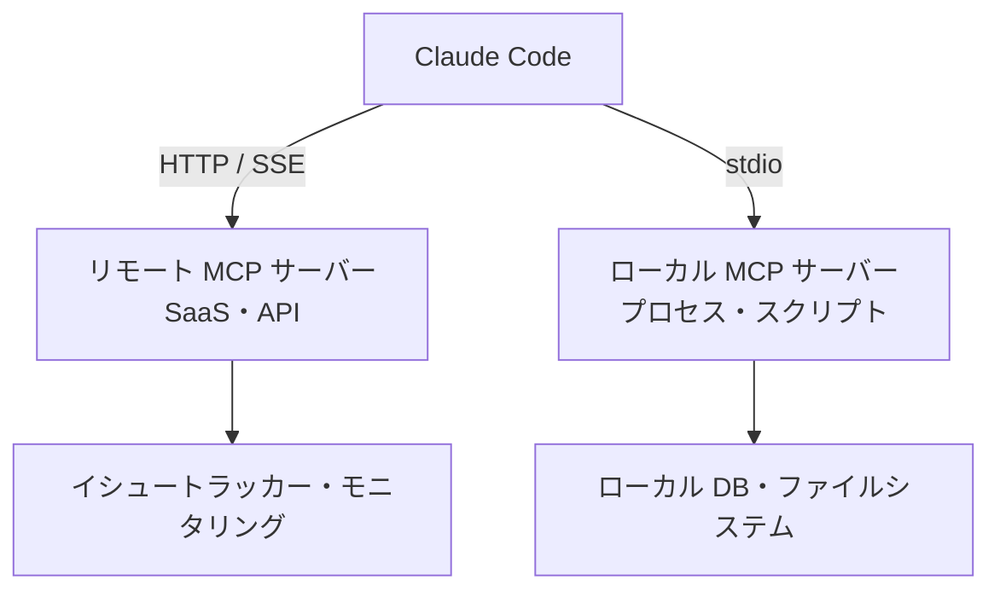

Claude Code は MCP を通じて、イシュートラッカー、データベース、モニタリングダッシュボードといった外部システムを標準化された方法で接続し、直接読み取り・操作できます。


**ひとことで言うと**: MCP は、他ツールのデータをコピー＆ペーストしていた作業をなくし、Claude Code に外部システムを直接扱わせる「AI とツールをつなぐ標準コンセント」です。



このページは概念の概要です。実際のサーバー登録、認証、MoAI-ADK ワークフローでの活用方法は、[MCP サーバー活用ガイド](/advanced/mcp-servers)で実践中心に詳しく扱います。


## MCP とは何か

MCP (Model Context Protocol) は、AI と外部ツールをつなぐ**オープンソースの標準プロトコル**です。モデルメーカーやツールの種類に関係なく同一の規約で接続できるため、一度作成した MCP サーバーは複数の AI クライアントで再利用できます。

MCP サーバーは Claude Code にツール・データ・API へのアクセス権を付与します。接続しておけば、Claude が次のような作業を直接処理します。

| シナリオ | MCP なし | MCP 接続後 |
| --- | --- | --- |
| イシュートラッカーに基づく機能実装 | イシューの内容をコピー＆ペースト | イシュートラッカーから直接読み取り、PR を作成 |
| モニタリング分析 | ダッシュボードのスクリーンショットを添付 | Sentry などからエラーを直接照会 |
| DB クエリ | クエリ結果を手動で渡す | PostgreSQL のスキーマ・データを直接照会 |

> 外部コンテンツを取得するサーバーにはプロンプトインジェクションのリスクがあるため、接続前に信頼できるサーバーかどうかを必ず確認してください。

## サーバーの種類 (トランスポート方式)

MCP サーバーは、Claude Code と通信する**トランスポート方式**によって分類されます。クラウドサービスには HTTP を、ローカルツールには stdio を使うのが一般的です。

| トランスポート方式 | 場所 | 適した用途 | 備考 |
| --- | --- | --- | --- |
| HTTP | リモート | クラウド SaaS 連携 | 推奨、OAuth 2.0 対応 |
| stdio | ローカルプロセス | システムアクセス・カスタムスクリプト | 自動再接続なし |
| SSE | リモート | レガシーなリモート接続 | 非推奨、HTTP で代替 |
| WebSocket | リモート | サーバーがイベントをプッシュする場合 | OAuth・`--transport` 非対応 |



### インストール概要

サーバーの追加は `claude mcp add` 系のコマンドで行います。すべてのオプションはサーバー名の**前**に置き、stdio の場合は `--` で実行コマンドを区切ります。

```bash
# リモート HTTP サーバーを追加
claude mcp add --transport http notion https://mcp.notion.com/mcp

# ローカル stdio サーバーを追加 (-- の後ろが実行コマンド)
claude mcp add --transport stdio --env API_KEY=YOUR_KEY airtable \
  -- npx -y airtable-mcp-server

# 登録状況の確認 / セッション内で状態を確認
claude mcp list
```

`--scope` フラグで設定の保存範囲を指定します。`local` (デフォルト、自分のみ・現在のプロジェクト)、`project` (`.mcp.json` でチーム共有)、`user` (すべてのプロジェクト) の 3 段階があり、同じ名前が複数の場所に存在する場合は local > project > user の順で優先されます。

## サーバーが公開するもの: ツール・リソース・プロンプト

MCP サーバーは 3 種類の機能を Claude Code に提供します。

| 公開対象 | 役割 | Claude Code での使い方 |
| --- | --- | --- |
| ツール (tools) | Claude が呼び出す動作・関数 | 作業中に自動で呼び出し |
| リソース (resources) | 参照可能なデータ・ドキュメント | `@サーバー:protocol://パス` でメンション |
| プロンプト (prompts) | 事前定義されたコマンド | `/mcp__サーバー名__プロンプト名` |

たとえばリソースは、ファイルのように `@` メンションで取り込めます。

```text
@github:issue://123 を分析して修正案を提案して
```

セッション内で `/mcp` コマンドを実行すると、接続済みサーバーの一覧、各サーバーのツール数、OAuth 認証状態を確認できます。認証が必要なリモートサーバーは、`/mcp` からブラウザの OAuth フローでログインします。

> ツール検索 (Tool Search) がデフォルトで有効になっており、MCP ツールの定義は必要になるまでコンテキストウィンドウに載りません。多くのサーバーを接続してもコンテキストの負担は小さく抑えられます。

## MoAI-ADK での活用

MoAI-ADK は `mcp__context7` のようなドキュメント照会 MCP をワークフローに統合して使用します。サーバー登録の手順、認証パターン、スコープの選択、そして MoAI エージェントが MCP ツールをどのように呼び出すかといった実践的な内容は、別途の応用ガイドにまとめられています。このページで概念をつかんだら、次のステップとしてそのガイドを参照してください。

## 関連ドキュメント

- [MCP サーバー活用ガイド](/advanced/mcp-servers)

## 参考資料

- [Connect Claude Code to tools via MCP](https://code.claude.com/docs/en/mcp)


最初は信頼できるサーバーを 1〜2 個だけ `local` スコープで追加して動作を確認し、チームと共有する価値が検証できたら `--scope project` に移して `.mcp.json` をバージョン管理に含めることを推奨します。

