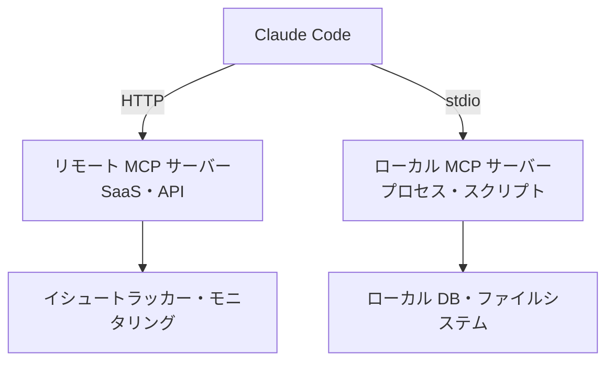

Claude Code は MCP を通じて、イシュートラッカー、データベース、モニタリングダッシュボードのような外部システムを標準化された方法で接続し、直接読み取り・操作できます。


**ひとことで言うと**: MCP は、他のツールのデータをコピー&ペーストしていた作業をなくし、Claude Code が外部システムを直接扱えるようにする「AI とツールをつなぐ標準コンセント」です。



このページは概念の概要です。実際のサーバー登録、認証、MoAI-ADK ワークフローでの活用方法は、[MCP サーバー活用ガイド](/advanced/mcp-servers) で実践中心に詳しく扱います。


## MCP とは何か

MCP (Model Context Protocol) は、AI と外部ツールをつなぐ **オープンソースの標準プロトコル** です。モデルの製造元やツールの種類に関係なく同じ規約で接続されるため、一度作った MCP サーバーは複数の AI クライアントで再利用できます。

MCP サーバーは Claude Code にツール・データ・API へのアクセス権を付与します。接続しておけば、Claude が次のようなことを直接処理します。

| シナリオ | MCP なし | MCP 接続後 |
| --- | --- | --- |
| イシューベースの機能実装 | イシュー内容をコピー&ペースト | イシュートラッカーから直接読んで PR を作成 |
| モニタリング分析 | ダッシュボードのスクリーンショットを添付 | Sentry などから直接エラーを照会 |
| DB クエリ | クエリ結果を手動で渡す | PostgreSQL のスキーマ・データを直接照会 |

> 外部コンテンツを取得するサーバーにはプロンプトインジェクションのリスクがあるため、接続前に信頼できるサーバーかどうかを必ず確認します。

## サーバーの種類 (トランスポート方式)

MCP サーバーは、Claude Code と通信する **トランスポート方式** によって分かれます。HTTP が推奨され、レガシーの SSE は廃止されました。

| トランスポート方式 | 場所 | 適した用途 | 備考 |
| --- | --- | --- | --- |
| HTTP | リモート | クラウド SaaS 連携 | 推奨 (OAuth 2.0 対応) |
| stdio | ローカルプロセス | システムアクセス・カスタムスクリプト | 自動再接続なし |
| SSE | リモート | レガシーのリモート接続 | 廃止、HTTP で代替 |
| WebSocket | リモート | サーバーがイベントをプッシュする場合 | HTTP または stdio を優先推奨 |


```mermaid
flowchart TD
    CC[Claude Code]
    CC -->|HTTP| Remote[リモート MCP サーバー<br>SaaS・API]
    CC -->|stdio| Local[ローカル MCP サーバー<br>プロセス・スクリプト]
    Remote --> Ext1[イシュートラッカー・モニタリング]
    Local --> Ext2[ローカル DB・ファイルシステム]
```

### インストール概要

サーバーの追加は `claude mcp add` 系のコマンドで行います。すべてのオプションはサーバー名の **前** に置き、stdio の場合は `--` で実行コマンドを区切ります。

```bash
# 원격 HTTP 서버 추가 (권장)
claude mcp add --transport http notion https://mcp.notion.com/mcp

# 로컬 stdio 서버 추가 (-- 뒤가 실행 명령)
claude mcp add --transport stdio --env API_KEY=YOUR_KEY airtable \
  -- npx -y airtable-mcp-server

# 등록 현황 확인
claude mcp list
```

`--scope` フラグで設定の保存範囲を指定します。`local` (デフォルト、自分のみ・現在のプロジェクト)、`project` (`.mcp.json` でチーム共有)、`user` (すべてのプロジェクト) の 3 段階があり、同じ名前が複数の場所にあれば local > project > user の順で優先されます。

## サーバーが公開するもの: ツール・リソース・プロンプト

MCP サーバーは 3 種類の機能を Claude Code に提供します。

| 公開対象 | 役割 | Claude Code での使い方 |
| --- | --- | --- |
| ツール (tools) | Claude が呼び出す動作・関数 | 作業中に自動呼び出し |
| リソース (resources) | 参照可能なデータ・ドキュメント | `@サーバー:protocol://パス` でメンション |
| プロンプト (prompts) | 事前定義されたコマンド | `/mcp__サーバー名__プロンプト名` |

たとえばリソースはファイルのように `@` メンションで取り込めます。

```text
@github:issue://123 을 분석하고 수정안을 제안해줘
```

セッション内で `/mcp` コマンドを実行すると、接続されたサーバーの一覧と各サーバーのツール数、OAuth 認証の状態を確認できます。認証が必要なリモートサーバーは `/mcp` からブラウザの OAuth フローでログインします。

> ツール検索 (Tool Search) がデフォルトで有効なため、MCP のツール定義は必要になるまでコンテキストウィンドウに載りません。サーバーを多く接続してもコンテキストの負担は小さくなります。

## MoAI-ADK での活用

MoAI-ADK は `mcp__context7` のようなドキュメント照会 MCP をワークフローに統合して使い、`/moai project` のハーネス自動構成ステップは、プロジェクトのドメインに合った MCP プロビジョニングまで含みます。

トークンの観点で注目すべきは、上記のツール検索 (Tool Search) による遅延ロードです。MCP のツール定義はコンテキストの中でかなり大きな塊ですが、必要なときだけロードされるため、サーバーを複数接続しても常時の負担はほとんどありません — MoAI-ADK のコンテキストダイエットが依拠するプラットフォームメカニズムの 1 つです。サーバー登録の手順、認証パターン、スコープの選択、そして MoAI エージェントが MCP ツールをどう呼び出すかといった実践的な内容は、別の応用ガイドに整理されています。このページで概念をつかんだら、次のステップとしてそのガイドを参照してください。

## 関連ドキュメント

- [MCP サーバー活用ガイド](/advanced/mcp-servers)

## 参考資料

- [Connect Claude Code to tools via MCP](https://code.claude.com/docs/en/mcp)


最初は信頼できるサーバー 1~2 個だけを `local` スコープで追加して動作を確認し、チームと共有する価値が検証できたら `--scope project` へ移し、`.mcp.json` をバージョン管理に含めることを推奨します。

