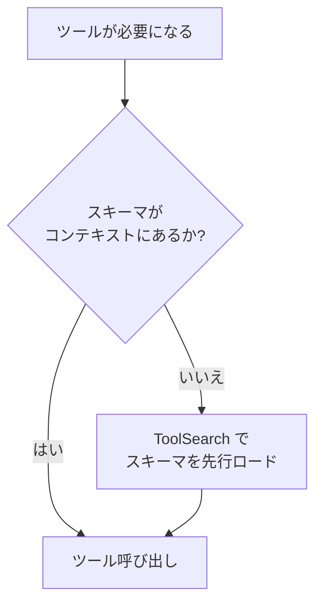

# MCP 統合

MCP (Model Context Protocol) は、外部ツールとデータソースを Claude に差し込んで使うための標準コネクタです。このページでは、その概念と登録方法を概要レベルでまとめます。


**一言でいうと**: MCP は AI のための **USB ポート**です。データベース、イシュートラッカー、ブラウザのようにそれぞれ異なる外部ツールを 1 つの標準規格で Claude につなげば、ツールごとに個別の統合コードを書かなくても、同じやり方で差し込んで使えます。


## MCP とは

MCP は、AI アプリケーションが外部システムに接続する方法を標準化したオープンプロトコルです。機器ごとに異なるケーブルの代わりに USB-C 1 本で複数の周辺機器をつなぐように、MCP は異なる外部ツールを **1 つの規格**で Claude につなぎます。

接続された MCP サーバーは、Claude に次の 3 つを提供できます。

| 提供物 | 説明 |
|--------|------|
| ツール (Tools) | Claude が呼び出せる動作 (例: クエリ実行、イシュー作成) |
| リソース (Resources) | Claude が読めるデータ (例: ファイル、レコード) |
| プロンプト (Prompts) | 再利用可能なプロンプトテンプレート |

この標準のおかげで、ツールを新しくつなぐたびに統合ロジックを書き直す必要がありません。 いちど標準に従えば、その標準をサポートするすべてのツールが同じ扉から入ってきます。

## サーバー登録

MCP サーバーは 2 つの方法で登録します。

- **CLI**: `claude mcp add <名前> <実行コマンド>` でサーバーを追加します。
- **設定ファイル**: プロジェクトルートの `.mcp.json` にサーバー定義を直接記述します。

```json
{
  "mcpServers": {
    "example": {
      "command": "npx",
      "args": ["-y", "@example/mcp-server"]
    }
  }
}
```

登録したサーバーの状態は、セッション内で `/mcp` コマンドから確認・認証できます。

### スコープ

同じサーバーでも、どこに登録するかによって適用範囲が変わります。

| スコープ | 適用範囲 |
|--------|-----------|
| `user` | 自分のすべてのプロジェクト |
| `project` | 現在のプロジェクト (チームと共有、バージョン管理に含む) |
| `local` | 現在のプロジェクトの自分のローカルセッション (共有されない) |

チームと分け合うサーバーは `project` スコープで、個人の資格情報が必要なサーバーは `local` スコープに置くのが一般的です。

### トランスポートタイプ

MCP サーバーは、Claude と通信する方式 (transport) によって分かれます。

| タイプ | 動作概要 |
|------|-----------|
| stdio | ローカルプロセスを起動し、標準入出力で通信 |
| HTTP | リモートエンドポイントにネットワークで接続 |

ローカルツールはたいてい stdio、リモート SaaS ツールは HTTP を使います。

## 遅延ロードと Tool Search

MCP サーバーを複数つなぐと、ツール定義もその分だけ増えます。ツール定義をすべてコンテキストに常時ロードすると、最初のプロンプトを送る前に[コンテキストウィンドウ](/ja/claude-code/context-memory/context-window)が埋まってしまいます。

そこで Claude Code は、ツール定義を **デフォルトで遅延ロード** (deferred load) します。ツールの完全なスキーマは実際にそのツールが必要になったときだけ読み込み、普段は短いメタデータだけをコンテキストに置きます。この遅延ツールを実際に呼び出すには、まずスキーマをアクティブコンテキストに読み込む先行ステップが必要です。

MoAI-ADK はこのメカニズムを HARD 規律に引き上げます。遅延ツール (例: `AskUserQuestion`) を呼び出す前には、必ず `ToolSearch` でスキーマを先に読み込む必要があり、この先行手順を飛ばすとツール呼び出しは検証エラーで拒否されます。詳しいルールは `.claude/rules/moai/core/askuser-protocol.md` の ToolSearch Preload 手順に定義されています。


```mermaid
flowchart TD
    A[ツールが必要になる] --> B{スキーマが<br/>コンテキストにあるか?}
    B -->|いいえ| C[ToolSearch で<br/>スキーマを先行ロード]
    B -->|はい| D[ツール呼び出し]
    C --> D
```

## キャッシュとの相互作用

MCP サーバーを接続したり切断したりすると、コンテキストの前部分 (プレフィックス) に置かれるツール定義の集合が変わります。プレフィックスが変わると[プロンプトキャッシング](/ja/claude-code/context-memory/prompt-caching)の再利用がその地点から無効になるため、サーバー構成はセッションの序盤で決めておくほうがキャッシュ効率に有利です。

## MoAI-ADK の MCP 運用

MoAI-ADK は MCP サーバーを **デフォルトではプロビジョニングしません**。代わりに外部資料が必要なときは、組み込みの `WebSearch` / `WebFetch` で公式ドキュメントとベストプラクティスを調べるフォールバック戦略を使います (`.claude/rules/moai/core/agent-common-protocol.md` § MCP Fallback Strategy)。アーキテクチャや分析の品質が MCP の可用性に依存しないようにする設計です。

一つの例外はバックエンドルーティングです。`moai glm` または `moai cg` の GLM パネルで実行するときは、Web 検索と Web 取得が組み込みツールの代わりに z.ai MCP ツールへルーティングされます (`.claude/rules/moai/core/glm-web-tooling.md`)。どのバックエンドでも検索・取得の能力自体は保たれ、経路だけが変わります。

## 関連ドキュメント

- [スキル](/ja/claude-code/extensibility/skills)
- [フック (Hooks)](/ja/claude-code/extensibility/hooks)
- [コンテキストウィンドウ](/ja/claude-code/context-memory/context-window)

## 参考資料

- [Claude Code Docs — MCP](https://code.claude.com/docs/en/mcp)


新しい MCP サーバーは、セッションを始めるときにまとめて決めておきましょう。セッションの途中でサーバーをつないだり外したりすると、ツール定義のプレフィックスが変わってその地点からプロンプトキャッシュが無効になり、以降のターンごとにプレフィックスを再処理することになります。

