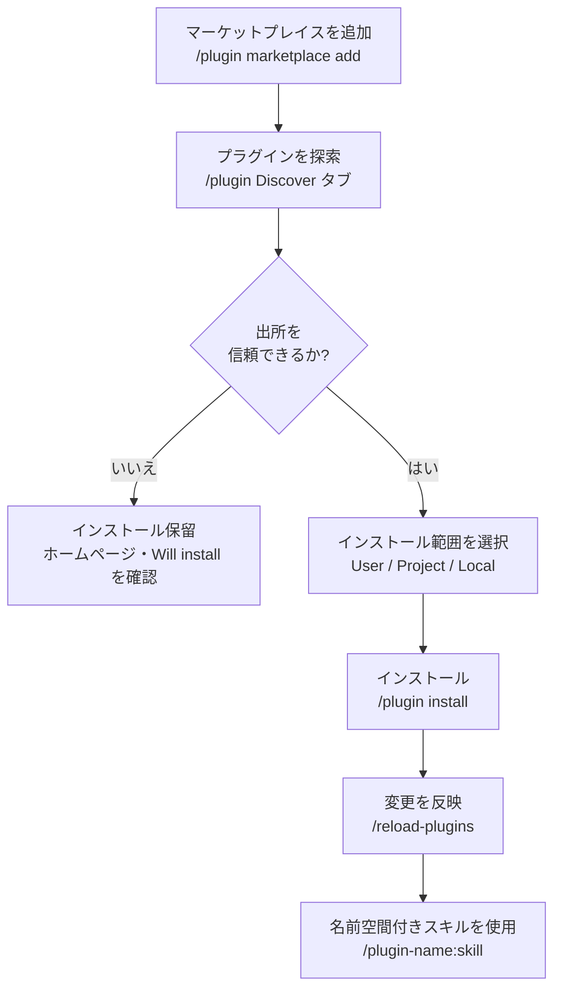

Claude Code プラグインは、散らばっていた拡張機能を 1 つのパッケージにまとめてチームやコミュニティに配布する単位であり、マーケットプレイスはそのパッケージを発見してインストールするカタログです。


**ひとことで言うと**: プラグインはコマンド・エージェント・スキル・hook・MCP を 1 つのフォルダに収めてバージョン管理しながら配布する「拡張バンドル」であり、マーケットプレイスはそのバンドルを選んで取得するアプリストアです。


## プラグインとは

プラグイン (plugin) は、Claude Code のさまざまな拡張要素を 1 つのディレクトリにまとめて **共有・再利用・バージョン管理** できるようにしたパッケージです。`.claude/` ディレクトリに直接置く単独設定とは異なり、プラグインはマニフェストファイルによって独自の識別子を持ち、マーケットプレイスを通じて他のプロジェクトやチームに配布されます。

単独設定とプラグインの違いは明確です。

| 区分 | 単独設定 (`.claude/`) | プラグイン |
|------|------------------------|----------|
| スキル名 | `/hello` | `/plugin-name:hello`（名前空間が適用される） |
| 適した状況 | 個人のワークフロー、プロジェクト限定の実験 | チーム・コミュニティ共有、バージョンリリース、複数プロジェクトでの再利用 |
| 配布 | 手動コピー | `/plugin install` でインストール |
| 衝突防止 | なし | プラグイン名による名前空間の自動分離 |

プラグインの中核は `.claude-plugin/plugin.json` **マニフェスト** です。このファイルがプラグインの名前・説明・バージョンを定義し、`name` フィールドはそのままスキルの名前空間の接頭辞になります。

```json
{
  "name": "my-first-plugin",
  "description": "A greeting plugin to learn the basics",
  "version": "1.0.0",
  "author": { "name": "Your Name" }
}
```

`version` は任意の値です。明示するとこの値を上げたときだけユーザーにアップデートが届き、省略したまま git で配布するとコミット SHA がバージョンの役割を果たすため、コミットごとに新しいバージョンとして扱われます。

> 開発中は `claude --plugin-dir ./my-plugin` でインストールせずにローカルプラグインを直接ロードしてテストし、変更後は `/reload-plugins` で再起動なしに反映します。

## プラグインに含められるもの

プラグインのルートには要素ごとのディレクトリを置きます。よくある間違いはこれらのディレクトリを `.claude-plugin/` の中に入れてしまうことですが、`.claude-plugin/` の中には `plugin.json` だけが入り、それ以外はすべて **プラグインのルート** に配置する必要があります。

| 要素 | 場所 | 含める内容 |
|------|------|-----------|
| スキル (skill) | `skills/<name>/SKILL.md` | モデルが文脈に応じて自動的に呼び出す能力 |
| コマンド (command) | `commands/*.md` | スラッシュコマンド（新規プラグインは `skills/` を推奨） |
| エージェント (agent) | `agents/` | カスタムサブエージェントの定義 |
| hook | `hooks/hooks.json` | イベントハンドラー（PostToolUse など） |
| MCP サーバー | `.mcp.json` | 外部ツール・サービスの接続設定 |
| LSP サーバー | `.lsp.json` | コードインテリジェンス（言語サーバー）の設定 |
| モニター (monitor) | `monitors/monitors.json` | ログ・ファイルをバックグラウンドで監視するバックグラウンドウォッチャー |
| 実行ファイル | `bin/` | プラグインが有効な間、Bash ツールの `PATH` に追加される実行ファイル |
| 既定設定 | `settings.json` | 有効化時に適用される既定の settings.json（現在は `agent`・`subagentStatusLine` キーのみサポート） |

このようにプラグイン 1 つがスキル・hook・MCP を同時に含められるため、「この作業に必要なすべての拡張」を一度のインストールで届けられます。たとえば `commit-commands` プラグインは commit・push・PR 作成スキルをまとめて提供し、`pr-review-toolkit` は PR レビュー専用のエージェント群を一緒に配布します。

## マーケットプレイス: 発見・インストール・管理

マーケットプレイス (marketplace) は、誰かが作ったプラグインの一覧を収めたカタログです。使い方は 2 段階です。まずカタログを **追加** して閲覧できるようにし、その後で目的のプラグインを **個別にインストール** します。アプリストアを登録することと、個別のアプリをダウンロードすることを分けて考えるとよいでしょう。

### マーケットプレイスの追加

`/plugin marketplace add` でさまざまな出所を登録できます。

```bash
# GitHub リポジトリ (owner/repo 形式)
/plugin marketplace add anthropics/claude-code

# 他の Git ホスト (.git サフィックス必須)
/plugin marketplace add https://gitlab.com/company/plugins.git

# 特定のブランチ・タグに固定
/plugin marketplace add https://gitlab.com/company/plugins.git#v1.0.0

# ローカルパス / リモートの marketplace.json
/plugin marketplace add ./my-marketplace
/plugin marketplace add https://example.com/marketplace.json
```

公式 Anthropic マーケットプレイス (`claude-plugins-official`) は Claude Code 起動時に自動的に利用可能です。コミュニティマーケットプレイスは手動で追加します。

```bash
# 公式マーケットプレイスからインストール
/plugin install github@claude-plugins-official

# コミュニティマーケットプレイスを追加してからインストール
/plugin marketplace add anthropics/claude-plugins-community
/plugin install <plugin-name>@claude-community
```

### インストールと管理

`/plugin` を実行すると、**Discover / Installed / Marketplaces / Errors** の 4 つのタブを持つプラグインマネージャーが開きます。Discover タブの詳細パネルでは、インストール前にコンテキストコスト (Context cost) の見積もり、最終更新日、そしてインストールされるコマンド・エージェント・スキル・hook・MCP・LSP の一覧を事前に確認できます。

インストール範囲 (scope) は 3 種類です。

| 範囲 | 適用対象 | 記録場所 |
|------|-----------|-----------|
| User | 自分のすべてのプロジェクト | ユーザー設定 |
| Project | このリポジトリのすべての共同作業者 | `.claude/settings.json` |
| Local | このリポジトリの自分だけ | 共同作業者とは共有しない |

インストール・有効化・無効化・削除は CLI でも可能です。

```bash
/plugin install plugin-name@marketplace-name   # インストール（既定の user 範囲）
/plugin disable plugin-name@marketplace-name    # 無効化（削除はしない）
/plugin enable  plugin-name@marketplace-name    # 再有効化
/plugin uninstall plugin-name@marketplace-name  # 完全に削除
/reload-plugins                                 # 再起動なしに変更を反映
```

チーム単位では、`.claude/settings.json` の `extraKnownMarketplaces` キーにマーケットプレイスを宣言しておくと、共同作業者がリポジトリフォルダを信頼したときに Claude Code がそのマーケットプレイスとプラグインのインストールを案内します。

## コードインテリジェンスプラグイン

コードインテリジェンス (code intelligence) プラグインは、LSP (Language Server Protocol) を通じて Claude Code 内蔵のコードインテリジェンスツールを有効化します。VS Code のコードナビゲーションを支えているまさにその技術です。言語別のプラグインをインストールし、対応する **言語サーバーのバイナリ** がシステムにあると動作します。

| 言語 | プラグイン | 必要なバイナリ |
|------|----------|-----------------|
| Go | `gopls-lsp` | `gopls` |
| Python | `pyright-lsp` | `pyright-langserver` |
| TypeScript | `typescript-lsp` | `typescript-language-server` |
| Rust | `rust-analyzer-lsp` | `rust-analyzer` |
| Java | `jdtls-lsp` | `jdtls` |

プラグインが有効になると、Claude は 2 つの能力を得ます。

- **自動診断 (diagnostics)**: Claude がファイルを編集するたびに、言語サーバーが変更を分析して型エラー・不足している import・構文エラーを自動的に報告します。コンパイラーやリンターを別途実行しなくても同じターンでエラーに気づき、すぐに修正します。「diagnostics found」の表示が出たら `Ctrl+O` を押すとインラインで確認できます。
- **コードナビゲーション (navigation)**: 定義への移動、参照の検索、ホバーによる型情報、シンボル一覧、実装の検索、呼び出し階層のトレースが可能です。grep ベースの検索よりもはるかに正確なナビゲーションを提供します。

> `Executable not found in $PATH` エラーが `/plugin` の Errors タブに表示されたら、上の表の言語サーバーのバイナリをインストールすればよいです。`rust-analyzer`・`pyright` などは大規模コードベース (large codebase) でメモリを多く消費する場合があるため、負担になるならそのプラグインを無効化して Claude 内蔵の検索に頼ってもかまいません。

## 信頼とセキュリティ

プラグインとマーケットプレイスは **非常に高い信頼が必要な構成要素** です。ユーザー権限で任意のコードを実行できるためです。信頼できる出所からのみインストールしてください。

- Anthropic はプラグインに含まれる MCP サーバー・ファイル・ソフトウェアを管理しておらず、意図どおりに動作するかを検証していません。サードパーティのプラグインは、インストール前にホームページと Discover タブの「Will install」一覧を自分で確認してください。
- コミュニティマーケットプレイスのプラグインは、Anthropic の自動検証・安全スクリーニングを通過したうえで特定のコミット SHA に固定されて配布されます。それでも最終的な信頼判断はインストールする側の責任です。
- 組織は管理設定 (managed settings) によって、ユーザーが追加できるマーケットプレイスを制限できます。

## プラグインのインストール・有効化フロー



## 関連ドキュメント

- [スキル](/claude-code/extensibility/skills)
- [フック (Hooks)](/claude-code/extensibility/hooks)
- [MCP サーバー](/claude-code/extensibility/mcp)

## 参考資料

- [Create plugins (code.claude.com)](https://code.claude.com/docs/en/plugins)
- [Discover and install plugins (code.claude.com)](https://code.claude.com/docs/en/discover-plugins)
- [What Claude gains from code intelligence plugins](https://code.claude.com/docs/en/discover-plugins#what-claude-gains-from-code-intelligence-plugins)


インストールしたいプラグインが表示されない場合、マーケットプレイスが古い可能性があります。`/plugin marketplace update <marketplace-name>` で一覧を更新してから、もう一度インストールを試してください。

