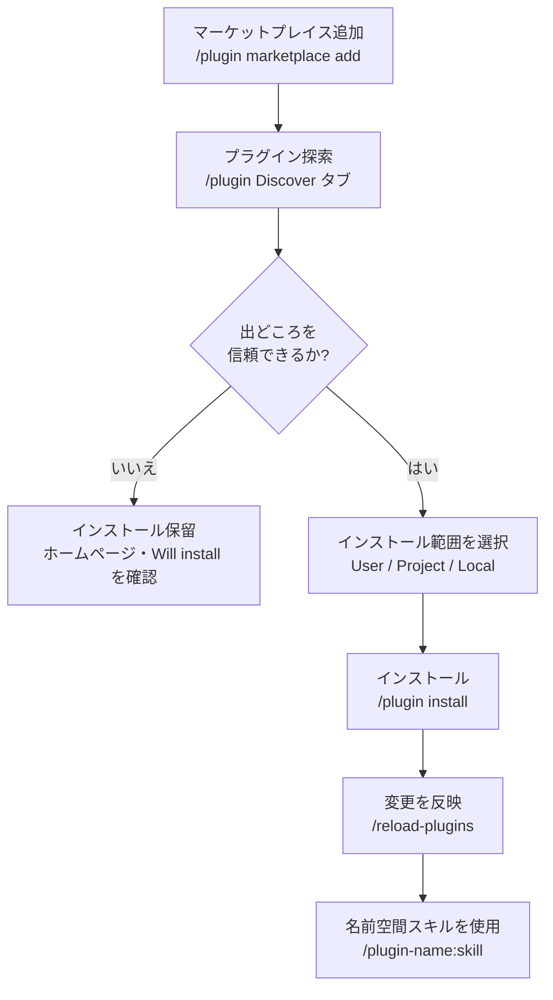

Claude Code プラグインは、散らばっていた拡張機能を 1 つのパッケージに束ねてチームやコミュニティへ配布する単位であり、マーケットプレイスはそのパッケージを発見しインストールするカタログです。ハーネスの観点から見れば、前の 3 つのドキュメントで学んだスキル・フック・MCP という素材を「1 つのインストール可能なハーネスの断片」として包む配布層です。


**ひとことで言うと**: プラグインはコマンド・エージェント・スキル・hook・MCP を 1 つのフォルダに収めてバージョン管理しながら配布する「拡張の束」で、マーケットプレイスはその束を選んで手に入れるアプリストアです。


## プラグインとは

プラグイン (plugin) は、Claude Code の複数の拡張要素を 1 つのディレクトリに束ね、**共有・再利用・バージョン管理** できるようにしたパッケージです。`.claude/` ディレクトリに直接置く単独設定と異なり、プラグインはマニフェストファイルでアイデンティティを持ち、マーケットプレイスを通じて他のプロジェクトやチームへ配布されます。

単独設定とプラグインの違いは明確です。

| 区分 | 単独設定 (`.claude/`) | プラグイン |
|------|------------------------|----------|
| スキル名 | `/hello` | `/plugin-name:hello` (名前空間を適用) |
| 適した状況 | 個人のワークフロー、プロジェクト限定の実験 | チーム・コミュニティ共有、バージョンリリース、複数プロジェクトでの再利用 |
| 配布 | 手動コピー | `/plugin install` でインストール |
| 衝突防止 | なし | プラグイン名で名前空間を自動分離 |

プラグインの核心は `.claude-plugin/plugin.json` の **マニフェスト** です。このファイルがプラグインの名前・説明・バージョンを定義し、`name` フィールドはそのままスキルの名前空間プレフィックスになります。マニフェストは任意で、なくてもプラグインは動作しますが、バージョン管理とマーケットプレイスでの配布はマニフェストがあるほうがはるかに容易です。

```json
{
  "name": "my-first-plugin",
  "description": "A greeting plugin to learn the basics",
  "version": "1.0.0",
  "author": { "name": "Your Name" }
}
```

`version` は任意の値です。明示するとこの値を上げたときだけユーザーに更新が届き、省略して git で配布するとコミット SHA がバージョンの役割を果たし、毎コミットが新バージョンとして扱われます。

> 開発中は `claude --plugin-dir ./my-plugin` でインストールなしにローカルプラグインを直接ロードしてテストし、変更後は `/reload-plugins` で再起動なしに反映します。

## プラグインに収められるもの

プラグインのルート (`.claude-plugin/plugin.json` ではなくプラグインディレクトリ自体) に要素ごとのディレクトリを置きます。**重要な注意:** `.claude-plugin/` の中には `plugin.json` **のみ** が入り、スキル・コマンド・エージェント・hook などすべての構成要素はプラグインのルートに置きます。

| 要素 | 場所 | 収める内容 |
|------|------|-----------|
| スキル (skill) | `skills/<name>/SKILL.md` | モデルが文脈に応じて自動呼び出しする能力 |
| コマンド (command) | `commands/*.md` | スラッシュコマンド (新規プラグインは `skills/` を推奨) |
| エージェント (agent) | `agents/` | カスタムサブエージェント定義 |
| hook | `hooks/hooks.json` | イベントハンドラー (PostToolUse など) |
| MCP サーバー | `.mcp.json` | 外部ツール・サービス接続の設定 |
| LSP サーバー | `.lsp.json` | コードインテリジェンス (言語サーバー) の設定 |
| モニター (monitor) | `monitors/monitors.json` | ログ・ファイルを背後で監視するバックグラウンドウォッチャー |
| 実行ファイル | `bin/` | プラグイン有効中に Bash ツールの `PATH` へ追加される実行ファイル |
| デフォルト設定 | `settings.json` | 有効化時に適用されるデフォルトの settings.json (現在 `agent`・`subagentStatusLine` キーのみ対応) |

このようにプラグイン 1 つがスキル・hook・MCP を同時に収められるため、「この作業に必要なすべての拡張」を 1 回のインストールで届けられます。たとえば `commit-commands` プラグインは commit・push・PR 作成のスキルを束ねて提供し、`pr-review-toolkit` は PR レビュー専用のエージェント群を一緒に配布します。

## マーケットプレイス: 発見・インストール・管理

マーケットプレイス (marketplace) は、誰かが作ったプラグインの一覧を収めたカタログです。使い方は 2 段階です。まずカタログを **追加** して閲覧できるようにし、次に目的のプラグインを **個別にインストール** します。アプリストアを登録することと、個別のアプリをダウンロードすることを分けて考えればよいでしょう。

### マーケットプレイスの追加

`/plugin marketplace add` でさまざまな出どころを登録できます。

```bash
# GitHub 저장소 (owner/repo 형식)
/plugin marketplace add anthropics/claude-plugins-official

# 다른 Git 호스트 (.git 접미사 필수)
/plugin marketplace add https://gitlab.com/company/plugins.git

# 특정 브랜치·태그 고정
/plugin marketplace add https://gitlab.com/company/plugins.git#v1.0.0

# 로컬 경로 / 원격 marketplace.json
/plugin marketplace add ./my-marketplace
/plugin marketplace add https://example.com/marketplace.json
```

公式の Anthropic マーケットプレイス (`claude-plugins-official`) は Claude Code の起動時に自動で利用可能です。コミュニティのマーケットプレイスは手動で追加します。

```bash
# 공식 마켓플레이스에서 설치
/plugin install hello@claude-plugins-official

# 커뮤니티 마켓플레이스 추가 후 설치
/plugin marketplace add anthropics/claude-plugins-community
/plugin install <plugin-name>@claude-plugins-community
```

### インストールと管理

`/plugin` を実行すると **Discover / Installed / Marketplaces / Errors** の 4 タブを持つプラグインマネージャーが開きます。Discover タブの詳細パネルでは、インストール前にコンテキストコスト (Context cost) の推定値、最終更新日、そしてインストールされるコマンド・エージェント・スキル・hook・MCP・LSP の一覧を事前に確認できます。

インストール範囲 (scope) は 3 つです。

| 範囲 | 適用対象 | 記録場所 |
|------|-----------|-----------|
| User | 自分のすべてのプロジェクト | ユーザー設定 |
| Project | このリポジトリのすべての協業者 | `.claude/settings.json` |
| Local | このリポジトリの自分だけ | 協業者と共有しない |

インストール・有効化・無効化・削除は CLI でも可能です。

```bash
/plugin install plugin-name@marketplace-name   # 설치 (기본 user 범위)
/plugin disable plugin-name@marketplace-name    # 비활성 (제거 안 함)
/plugin enable  plugin-name@marketplace-name    # 재활성
/plugin uninstall plugin-name@marketplace-name  # 완전 제거
/reload-plugins                                 # 재시작 없이 변경 반영
```

チーム単位では、`.claude/settings.json` の `extraKnownMarketplaces` キーにマーケットプレイスを宣言しておけば、協業者がリポジトリのフォルダを信頼した際に Claude Code がそのマーケットプレイスとプラグインのインストールを案内します。

## コードインテリジェンスプラグイン

コードインテリジェンス (code intelligence) プラグインは、LSP (Language Server Protocol) を通じて Claude Code 組み込みのコードインテリジェンスツールを有効化します。VS Code のコードナビゲーションを支えるまさにあの技術です。言語別のプラグインをインストールし、対応する **言語サーバーのバイナリ** がシステムにあって初めて動作します。

| 言語 | プラグイン | 必要なバイナリ |
|------|----------|-----------------|
| Go | `gopls-lsp` | `gopls` |
| Python | `pyright-lsp` | `pyright-langserver` |
| TypeScript | `typescript-lsp` | `typescript-language-server` |
| Rust | `rust-analyzer-lsp` | `rust-analyzer` |
| Java | `jdtls-lsp` | `jdtls` |

プラグインが有効になると、Claude は 2 つの能力を得ます。

- **自動診断 (diagnostics)**: Claude がファイルを編集するたびに言語サーバーが変更を分析し、型エラー・不足している import・構文エラーを自動で報告します。コンパイラやリンターを別途回さなくても、同じターンでエラーに気づきすぐに直します。「diagnostics found」の表示が出たときに `Ctrl+O` を押すとインラインで確認できます。
- **コードナビゲーション (navigation)**: 定義へ移動、参照検索、ホバーの型情報、シンボル一覧、実装検索、呼び出し階層の追跡が可能です。grep ベースの検索よりはるかに正確な探索を提供します。

> `Executable not found in $PATH` エラーが `/plugin` の Errors タブに見えたら、上の表の言語サーバーバイナリをインストールすれば解決します。`rust-analyzer`・`pyright` などは大規模コードベース (large codebase) でメモリを多く使うことがあるため、負担なら該当プラグインを無効化して Claude 組み込みの検索に頼っても構いません。

## 信頼とセキュリティ

プラグインとマーケットプレイスは **非常に高い信頼を要する構成要素** です。ユーザー権限で任意のコードを実行できるからです。信頼できる出どころからのみインストールしてください。

- Anthropic はプラグインに含まれる MCP サーバー・ファイル・ソフトウェアを統制せず、意図どおりに動作するかを検証しません。サードパーティのプラグインはインストール前にホームページと Discover タブの「Will install」一覧を自ら確認してください。
- コミュニティマーケットプレイスのプラグインは、Anthropic の自動検証・安全スクリーニングを通過した後、特定のコミット SHA に固定されて配布されます。それでも最終的な信頼の判断はインストールする側の責任です。
- 組織は管理設定 (managed settings) で、ユーザーが追加できるマーケットプレイスを制限できます。

## プラグインのインストール・有効化フロー


```mermaid
flowchart TD
    A[マーケットプレイス追加<br>/plugin marketplace add] --> B[プラグイン探索<br>/plugin Discover タブ]
    B --> C{出どころを<br>信頼できるか?}
    C -- いいえ --> D[インストール保留<br>ホームページ・Will install を確認]
    C -- はい --> E[インストール範囲を選択<br>User / Project / Local]
    E --> F[インストール<br>/plugin install]
    F --> G[変更を反映<br>/reload-plugins]
    G --> H[名前空間スキルを使用<br>/plugin-name:skill]
```

## MoAI-ADK とプラグイン

MoAI-ADK 自体はプラグインではなく、`moai init` が `.claude/` ディレクトリにハーネス資産 (スキル・エージェント・hook・設定) を直接配布する方式を使います。それでも、このページの 2 点は MoAI-ADK ユーザーにも直接関わります。第一に、Discover タブの **コンテキストコスト** (Context cost) 推定値は、トークノミクスの感覚をそのまま反映した指標です — 拡張を 1 つインストールするたびに常時コンテキストがどれだけ増えるかを見て判断してください。第二に、コードインテリジェンス (LSP) プラグインは MoAI-ADK の言語別品質ゲートが活用する診断シグナルと同系統なので、使用言語の LSP プラグインをインストールしておけば、編集直後の型エラーを同じターンで捕まえるループがはるかに緻密になります。

## 関連ドキュメント

- [スキル](/claude-code/extensibility/skills)
- [フック (Hooks)](/claude-code/extensibility/hooks)
- [MCP サーバー](/claude-code/extensibility/mcp)

## 参考資料

- [Create plugins (code.claude.com)](https://code.claude.com/docs/en/plugins)
- [Discover and install plugins (code.claude.com)](https://code.claude.com/docs/en/discover-plugins)
- [What Claude gains from code intelligence plugins](https://code.claude.com/docs/en/discover-plugins#what-claude-gains-from-code-intelligence-plugins)


インストールしたいプラグインが見つからないときは、マーケットプレイスが古くなっている可能性があります。`/plugin marketplace update <marketplace-name>` で一覧を更新してから、もう一度インストールを試してください。

