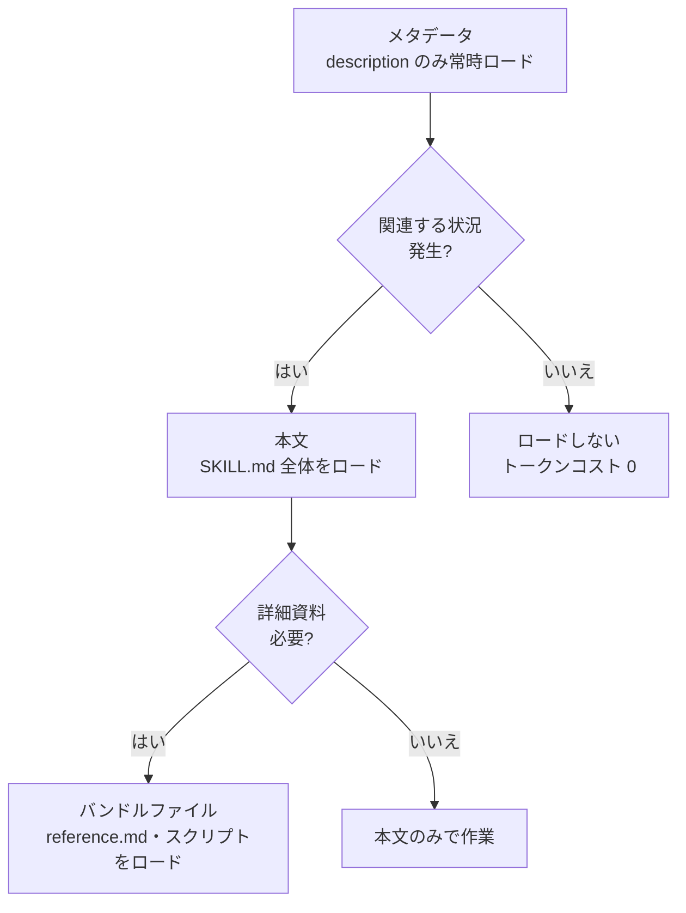

Claude Code のスキル（skill）は、繰り返される手順や専門知識を `SKILL.md` ファイル 1 枚にまとめて Claude のツール箱に追加する拡張メカニズムです。


**ひとことで言うと**: チャットに毎回貼り付けていたチェックリストや手順を `SKILL.md` 1 枚にまとめると、Claude が必要なときだけその内容を取り出して使う「ポケットの中の専門家」になります。



このドキュメントは Claude Code スキルの概念概要です。MoAI-ADK でスキルを直接作成し、ビルダーエージェントで自動生成する実践的な手順は、[スキルガイド](/advanced/skill-guide)と[ビルダーエージェントガイド](/advanced/builder-agents)で詳しく扱います。


## スキルとは

スキルは Claude が従うべき指針を記した `SKILL.md` ファイルです。ファイルを 1 つ作っておけば、Claude が関連する状況で自動的に呼び出して使ったり、ユーザーが `/スキル名` の形で直接呼び出したりできます。

次のような状況がスキルを作るシグナルです。

- 同じ指針やチェックリストをチャットに繰り返し貼り付けているとき
- CLAUDE.md のあるセクションが「事実情報」ではなく「複数ステップの手順」へと膨らんだとき

CLAUDE.md の内容は常にコンテキストに常駐しますが、スキル本文は実際に使用されるときだけロードされます。そのため、長く詳細な参照資料を置いておいても、必要になるまではトークンコストがほとんどかかりません。なお、ユーザー定義コマンド（`.claude/commands/`）はスキルに統合されており、既存のコマンドファイルもそのまま動作します。

### スキルの構造

各スキルは `SKILL.md` をエントリーポイントとするディレクトリです。本文は YAML フロントマターとマークダウンの指針で構成され、補助ファイルを一緒に置くことができます。

```text
my-skill/
├── SKILL.md       # 必須: 指針 + フロントマター
├── reference.md   # 任意: 詳細な参照 (必要なときにロード)
├── examples.md    # 任意: 出力例
└── scripts/
    └── helper.py  # 任意: Claude が実行するスクリプト
```

フロントマターはすべて任意項目ですが、Claude がいつこのスキルを使うべきか判断する `description` は事実上必須です。

```yaml
---
name: api-conventions
description: 이 코드베이스의 API 설계 패턴. 엔드포인트를 작성하거나 리뷰할 때 사용.
allowed-tools: Read Grep
---

API 엔드포인트를 작성할 때:
- RESTful 명명 규칙을 따른다
- 일관된 오류 형식을 반환한다
- 요청 검증을 포함한다
```

主なフロントマターのフィールドは次のとおりです。

| フィールド | 役割 |
| :--- | :--- |
| `description` | 何をして、いつ使うか。Claude の自動ロード判断基準 |
| `name` | スキル一覧に表示される名前 (デフォルト: ディレクトリ名) |
| `disable-model-invocation` | `true` ならユーザーのみ呼び出し可能、Claude の自動ロードを遮断 |
| `user-invocable` | `false` なら `/` メニューから非表示、Claude のみ使用 |
| `allowed-tools` | スキル有効化時に承認なしで使えるツール |
| `context` | `fork` を設定すると別のサブエージェントコンテキストで実行 |
| `paths` | 特定のファイルパターンを扱うときだけ自動ロード |

## Progressive Disclosure

スキルの中核となる設計は、必要な分だけ段階的に明らかにする **段階的開示**（Progressive Disclosure）です。コンテキストウィンドウを節約しながら深い知識を保管する方式です。



| 段階 | ロードのタイミング | 内容 |
| :--- | :--- | :--- |
| メタデータ | 常時 | `description` と名前のみコンテキストに常駐 |
| 本文 | 呼び出されたとき | `SKILL.md` 全体の指針がコンテキストに進入 |
| バンドル | 必要なとき | 参照ドキュメント・例・スクリプトをその都度参照 |

通常のセッションではすべてのスキルの `description` のみが常時ロードされ、Claude が「何があるか」を把握し、実際の本文は呼び出される瞬間にのみ入ってきます。補助ファイルは `SKILL.md` でリンクとして案内しておけば、Claude が必要なときだけ読みます。

## いつ自動ロードされるか

Claude は、ユーザーのリクエストがスキルの `description`（および任意の `when_to_use`）と合致したときに、そのスキルを自動的に呼び出します。つまり、トリガーは別途の設定ではなく **説明文のキーワードマッチング** です。

- ユーザーが自然に口にしそうなキーワードを `description` に盛り込むほど、うまくトリガーされます。
- 意図と無関係に頻繁にトリガーされすぎる場合は、説明をより具体的に絞り込むか、`disable-model-invocation: true` で手動呼び出しのみを許可します。
- 直接呼び出したいときは `/スキル名` の形で明示的に呼び出せばよいです。

スキルが保存されている場所が使用範囲を決定します。

| 場所 | パス | 適用範囲 |
| :--- | :--- | :--- |
| 個人 | `~/.claude/skills/<name>/SKILL.md` | 自分のすべてのプロジェクト |
| プロジェクト | `.claude/skills/<name>/SKILL.md` | このプロジェクトのみ |
| プラグイン | `<plugin>/skills/<name>/SKILL.md` | プラグインが有効な場所 |

名前が重複する場合は エンタープライズ > 個人 > プロジェクト の順で優先されます。プラグインスキルは `プラグイン名:スキル名` の形のネームスペースを使うことで衝突しません。

## 小さな例

次はコミットされていない変更を要約するスキルです。`` !`git diff HEAD` `` 構文は、Claude が見る前にコマンドを事前に実行して、結果を本文に挿入する動的なコンテキスト注入です。

```yaml
---
description: 커밋되지 않은 변경을 요약하고 위험 요소를 표시한다. 무엇이 바뀌었는지 물을 때 사용.
---

## 현재 변경 사항

!`git diff HEAD`

## 지침

위 변경을 두세 개의 불릿으로 요약한 뒤, 누락된 오류 처리나 하드코딩 같은 위험을 나열한다.
```

このスキルは、ユーザーが「自分は何を変更したっけ？」と尋ねると自動的に、または `/summarize-changes` で直接呼び出されます。

## MoAI-ADK でのスキル

MoAI-ADK はこのスキルメカニズムの上で動作します。`moai-foundation-core` や `moai-workflow-spec` といった汎用スキルが SPEC ワークフローと品質ゲートの知識を備えており、プロジェクトのドメインに合わせたスキルはビルダーエージェントが自動生成します。作成ルール・ネームスペース・段階的開示のトークン予算といった実践的な詳細は、以下の MoAI-ADK の応用ドキュメントを参照してください。

## 関連ドキュメント

- [スキルガイド](/advanced/skill-guide)
- [ビルダーエージェントガイド](/advanced/builder-agents)

## 参考資料

- [Claude Code 公式ドキュメント — Extend Claude with skills](https://code.claude.com/docs/en/skills)


スキルが期待どおりにトリガーされない場合は、`/doctor` で説明文の予算を超えていないか確認し、`description` にユーザーが実際に入力しそうなキーワードが含まれているか点検してみてください。

