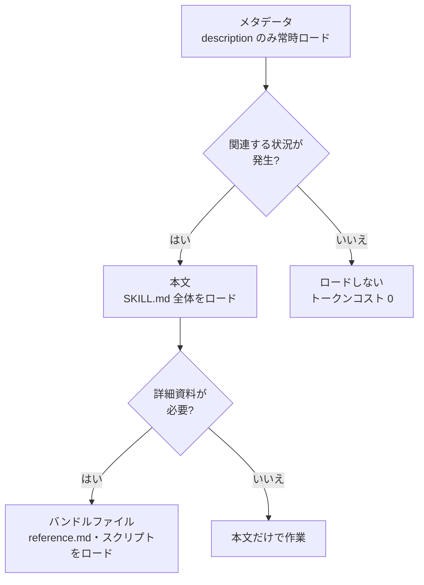

# スキル

Claude Code のスキル (skill) は、繰り返される手順や専門知識を `SKILL.md` ファイル 1 つに束ねて Claude のツールボックスへ追加する拡張メカニズムです。


**ひとことで言うと**: チャットに毎回貼り付けていたチェックリストや手順を `SKILL.md` 1 枚にすれば、Claude が必要なときだけその内容を取り出して使う「ポケットの中の専門家」になります。



このドキュメントは Claude Code スキルの概念概要です。MoAI-ADK でスキルを直接作成し、ビルダーエージェントで自動生成する実践手順は、[スキルガイド](/advanced/skill-guide) と [ビルダーエージェントガイド](/advanced/builder-agents) で詳しく扱います。


## スキルとは

スキルは、Claude が従うべき指示を収めた `SKILL.md` ファイルです。ファイルを 1 つ作っておけば、Claude が関連する状況で自動的に呼び出して使うか、ユーザーが `/スキル名` の形で直接呼び出せます。

次のような状況がスキルを作るサインです。

- 同じ指示やチェックリストをチャットに繰り返し貼り付けているとき
- CLAUDE.md のあるセクションが「事実情報」ではなく「複数段階の手順」に育ってしまったとき

CLAUDE.md の内容は常にコンテキストに常駐しますが、スキル本文は実際に使われるときだけロードされます。したがって長く詳細な参照資料を置いても、必要になるまでトークンコストはほとんどかかりません。

### スキルとカスタムコマンド

スキル以前は `.claude/commands/` ディレクトリにカスタムコマンドを置くのが一般的でした。現在は **スキルがコマンド機能を包含** するため、`.claude/commands/deploy.md` と `.claude/skills/deploy/SKILL.md` の両方があればスキルが優先されます。既存のコマンドファイルもそのまま動作しますが、新しい拡張はスキルとして書くことが推奨されます。

### スキルの構造

各スキルは `SKILL.md` をエントリーポイントとするディレクトリです。本文は YAML フロントマターとマークダウンの指示で構成され、補助ファイルを一緒に置けます。

```text
my-skill/
├── SKILL.md       # 필수: 지침 + 프론트매터
├── reference.md   # 선택: 상세 참조 (필요할 때 로드)
├── examples.md    # 선택: 예시 출력
└── scripts/
    └── helper.py  # 선택: Claude가 실행하는 스크립트
```

フロントマターの大半は任意項目ですが、Claude がいつこのスキルを使うべきかを判断する `description` は事実上必須です。

```yaml
---
name: api-conventions
description: 이 코드베이스의 API 설계 패턴. 엔드포인트를 작성하거나 리뷰할 때 사용.
allowed-tools: Read Grep
---

API 엔드포인트를 작성할 때:
- RESTful 명명 규칙을 따른다
- 일관된 오류 형식을 반환한다
- 요청 검증을 포함한다
```

主なフロントマターフィールドは次のとおりです。

| フィールド | 役割 |
| :--- | :--- |
| `description` | 何をして、いつ使うのか。Claude の自動ロード判断基準 |
| `name` | スキル一覧に表示される名前 (デフォルト: ディレクトリ名) |
| `disable-model-invocation` | `true` ならユーザーのみ呼び出し可能、Claude の自動ロードをブロック |
| `user-invocable` | `false` なら `/` メニューから非表示、Claude のみ使用 |
| `allowed-tools` | スキル有効時に承認なしで使えるツール |
| `context` | `fork` 設定時、別のサブエージェントコンテキストで実行 |
| `paths` | 特定のファイルパターンを扱うときのみ自動ロード |
| `shell` | 任意: shell コマンド実行時に使用するシェルを指定 |

## Progressive Disclosure

スキルの中核となる設計は、必要な分だけ段階的に見せる **段階的開示** (Progressive Disclosure) です。コンテキストウィンドウを節約しながらも、深い知識を保管する方式です。


```mermaid
flowchart TD
    A[メタデータ<br/>description のみ常時ロード] --> B{関連する状況が<br/>発生?}
    B -->|はい| C[本文<br/>SKILL.md 全体をロード]
    C --> D{詳細資料が<br/>必要?}
    D -->|はい| E[バンドルファイル<br/>reference.md・スクリプトをロード]
    D -->|いいえ| F[本文だけで作業]
    B -->|いいえ| G[ロードしない<br/>トークンコスト 0]
```

| 段階 | ロード時点 | 内容 |
| :--- | :--- | :--- |
| メタデータ | 常時 | `description` と名前だけがコンテキストに常駐 |
| 本文 | 呼び出されたとき | `SKILL.md` の指示全体がコンテキストに入る |
| バンドル | 必要なとき | 参照ドキュメント・例・スクリプトをその都度参照 |

通常のセッションではすべてのスキルの `description` だけが常時ロードされ、Claude は「何があるのか」を知っており、実際の本文は呼び出された瞬間にのみ入ります。補助ファイルは `SKILL.md` からリンクで案内しておけば、Claude が必要なときだけ読みます。

## いつ自動ロードされるか

Claude はユーザーのリクエストがスキルの `description` (および任意の `when_to_use`) と合致するとき、そのスキルを自動的に呼び出します。つまりトリガーは別の設定ではなく、**説明文のキーワードマッチング** です。

- ユーザーが自然に口にしそうなキーワードを `description` に含めるほど、うまくトリガーされます。
- 意図と無関係に頻繁にトリガーされすぎるなら、説明をより具体的に絞るか、`disable-model-invocation: true` で手動呼び出しのみを許可します。
- 直接呼び出したいときは `/スキル名` の形で明示的に呼べばよいのです。

スキルが保存された場所が、使用範囲を決めます。

| 場所 | パス | 適用範囲 |
| :--- | :--- | :--- |
| 個人 | `~/.claude/skills/<name>/SKILL.md` | 自分のすべてのプロジェクト |
| プロジェクト | `.claude/skills/<name>/SKILL.md` | このプロジェクトのみ |
| プラグイン | `<plugin>/skills/<name>/SKILL.md` | プラグインが有効な場所 |

名前が重複した場合は、エンタープライズ > 個人 > プロジェクトの順で優先されます。プラグインスキルは `プラグイン名:スキル名` 形式の名前空間を使うため衝突しません。

## 小さな例

以下は、未コミットの変更を要約するスキルです。`` !`git diff HEAD` `` 構文は、Claude が見る前にコマンドを先に実行し、結果を本文に埋め込む動的コンテキスト注入です。

```yaml
---
description: 커밋되지 않은 변경을 요약하고 위험 요소를 표시한다. 무엇이 바뀌었는지 물을 때 사용.
---

## 현재 변경 사항

!`git diff HEAD`

## 지침

위 변경을 두세 개의 불릿으로 요약한 뒤, 누락된 오류 처리나 하드코딩 같은 위험을 나열한다.
```

このスキルは、ユーザーが「何を変えたっけ?」と尋ねると自動的に、または `/summarize-changes` で直接呼び出されます。

## MoAI-ADK におけるスキル

MoAI-ADK はこのスキルメカニズムの上で動作します。`moai-foundation-core`、`moai-workflow-spec` のような汎用スキルが SPEC ワークフローと品質ゲートの知識を収めており、プロジェクトのドメインに合わせたスキルはビルダーエージェントが自動生成します。

スキルは MoAI-ADK の観点で 2 つの柱に同時にまたがっています。**トークノミクス** の面では、段階的開示はまさにトークン予算の設計です — 説明 1 行 (~100 トークン) だけを常時負担し、本文 (~5K トークン) は使用時点でのみ支払うため、知識を CLAUDE.md に常駐させるよりはるかに経済的です。**再帰的な自己学習** の面では、スキルはハーネス進化の編集対象です — ループが蓄積した観察をもとにハーネスがスキル指針をアップグレードすることが、MoAI-ADK の自己進化の中核経路です。作成ルール・名前空間・段階的開示のトークン予算といった実践的な詳細は、以下の MoAI-ADK 応用ドキュメントを参照してください。

## 関連ドキュメント

- [スキルガイド](/advanced/skill-guide)
- [ビルダーエージェントガイド](/advanced/builder-agents)

## 参考資料

- [Claude Code 公式ドキュメント — Extend Claude with skills](https://code.claude.com/docs/en/skills)


スキルが期待どおりにトリガーされないときは、`/doctor` で説明文の予算が超過していないか確認し、`description` にユーザーが実際に入力しそうなキーワードが入っているかを点検してみてください。

