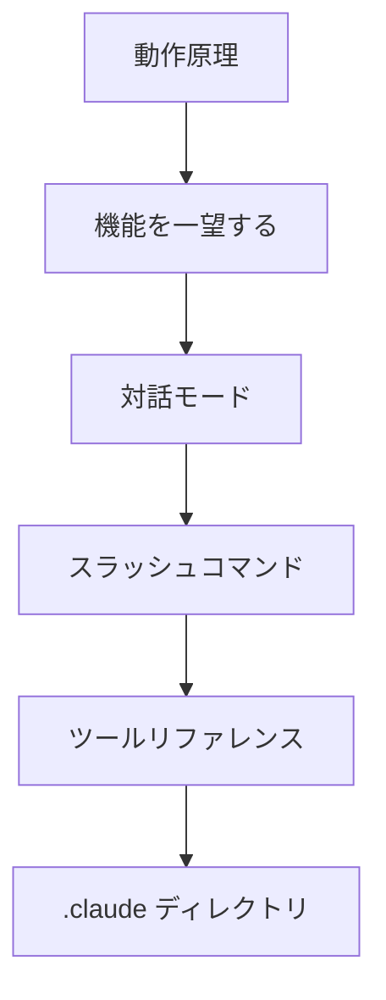

このグループでは、Claude Code を本格的に使い始める前に知っておくべき基礎を扱います。エージェンティックループがどのように動作するのか、どのような機能があるのか、対話モードでどのように入力するのか、スラッシュコマンドとツールをどのように活用するのか、設定がどこに保存されるのかを、順を追って学びたい開発者向けのドキュメントです。


**学習目標（ひとことで言うと）**: Claude Code の動作の仕組みと中心的な利用インターフェースを理解し、以降のワークフローのドキュメントを滞りなく追えるようにするための土台を整えます。


## 学習の流れ

まず動作原理で全体像をつかんだうえで、機能マップを見渡してどのようなツールがあるのかを把握します。続いて対話モードとスラッシュコマンドで実際の入力方法を身につけ、ツールリファレンスと設定ディレクトリで動作と環境を仕上げれば、基礎が完成します。

## 目次

| ドキュメント | 説明 |
|------|------|
| [動作原理](/claude-code/foundations/how-claude-code-works) | エージェンティックループと中心的な構成要素 |
| [機能を一望する](/claude-code/foundations/features-overview) | 機能カタログ全体と学習経路 |
| [対話モード](/claude-code/foundations/interactive-mode) | REPL・ショートカット・権限モード |
| [スラッシュコマンド](/claude-code/foundations/commands) | 組み込み・カスタムコマンドと /moai の関係 |
| [ツールリファレンス](/claude-code/foundations/tools-reference) | 組み込みツールと権限 |
| [.claude ディレクトリ](/claude-code/foundations/claude-directory) | 設定ディレクトリの構造とスコープ |

基礎が身についたら、次のグループで実際の開発ワークフローと MoAI-ADK の統合的な使い方へ進みます。
