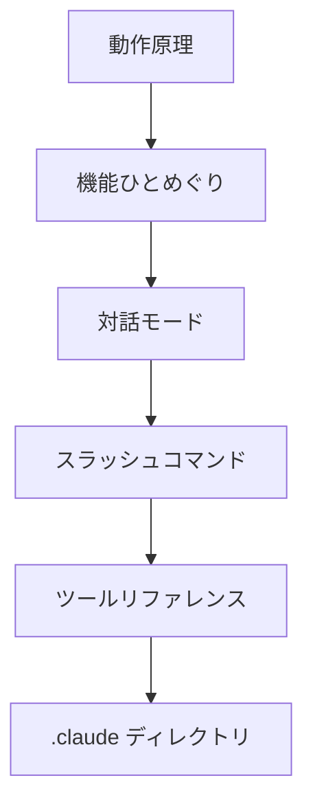

このグループは、Claude Code を本格的に使い始める前に知っておくべき基本を扱います。エージェンティックループがどう動作するのか、どんな機能があるのか、対話モードでどう入力するのか、スラッシュコマンドとツールをどう活用するのか、設定はどこに保存されるのかを順に学びます。ここで学ぶすべて — ループ、ツール、権限、設定ディレクトリ — こそが、MoAI-ADK がその上にハーネスを組み立てる素材です。




**学習目標 (ひとことで言うと)**: Claude Code の動作方式と主要な操作インターフェースを理解し、その後のワークフロードキュメントと MoAI-ADK のハーネス設計をつまずかずに追える土台を身につけます。


## 学習の流れ

```mermaid
flowchart TD
    A[動作原理] --> B[機能ひとめぐり]
    B --> C[対話モード]
    C --> D[スラッシュコマンド]
    D --> E[ツールリファレンス]
    E --> F[.claude ディレクトリ]
```

まず動作原理で全体像をつかみ、機能マップを眺めてどんなツールがあるのかを把握します。続いて対話モードとスラッシュコマンドで実際の入力方法を学び、ツールリファレンスと設定ディレクトリで動作と環境を押さえれば、基本は完成です。

## 目次

| ドキュメント | 説明 |
|------|------|
| [動作原理](/claude-code/foundations/how-claude-code-works) | エージェンティックループと主要コンポーネント |
| [機能ひとめぐり](/claude-code/foundations/features-overview) | 機能カタログ全体と学習パス |
| [対話モード](/claude-code/foundations/interactive-mode) | REPL・ショートカット・権限モード |
| [スラッシュコマンド](/claude-code/foundations/commands) | 組み込み・カスタムコマンドと /moai の関係 |
| [ツールリファレンス](/claude-code/foundations/tools-reference) | 組み込みツールと権限 |
| [.claude ディレクトリ](/claude-code/foundations/claude-directory) | 設定ディレクトリの構造とスコープ |

基本を身につけたら、次のグループ [コンテキストとメモリ](/claude-code/context-memory) で、トークンコストの扱い方 — MoAI-ADK トークノミクスの出発点 — へ進みます。
