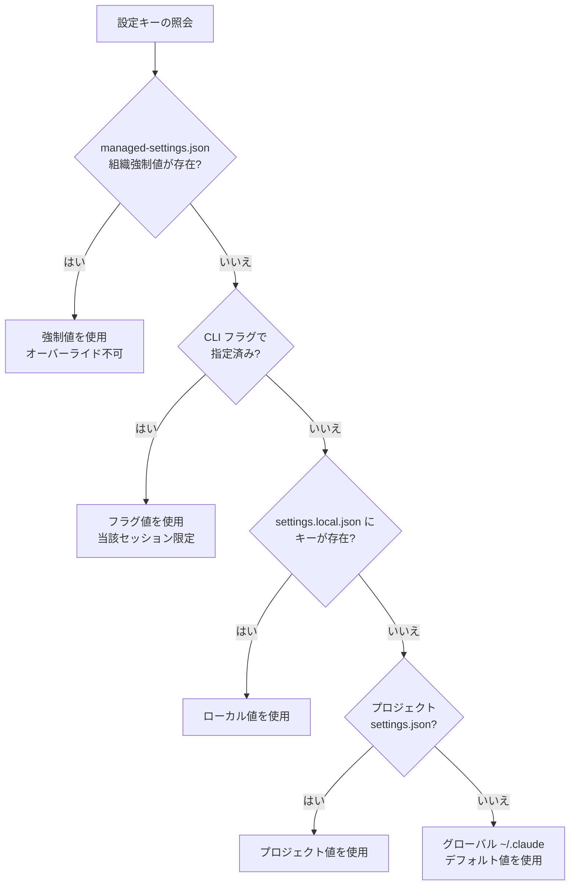

# .claude ディレクトリ

`.claude` ディレクトリは、Claude Code がプロジェクトごとに指示文、設定、拡張機能を読み込む単一の設定ルートです。


**ひとことで言うと**: `.claude` は Claude Code がセッション開始のたびに参照するプロジェクト専用の「操作パネル」であり、大部分は git にコミットしてチームと共有し、個人用ファイルだけを別途隔離します。


ほとんどのユーザーは `CLAUDE.md` と `settings.json` の 2 つのファイルを編集するだけで十分です。残りのスキル、rules、サブエージェントは必要に応じて 1 つずつ追加していけば構いません。

## .claude ディレクトリの役割

Claude Code は 2 か所から設定を読み込みます。1 つは作業中のプロジェクトの `.claude/` ディレクトリ、もう 1 つはホームディレクトリの `~/.claude/` です。プロジェクト内のファイルは git にコミットしてチームと共有し、`~/.claude/` のファイルはすべてのプロジェクトに適用される個人設定として残します。

- **プロジェクトコンテキストの伝達**: `CLAUDE.md` のように Claude が「読んで従う」指示
- **動作の強制**: `settings.json` の権限 (permissions) や hook のように、Claude が守るかどうかに関係なく「執行される」設定
- **拡張機能の保管**: スキル、サブエージェント、ダイナミックワークフローなど、再利用可能なアセット

ここでの重要な区別は **指針 (guidance)** と **設定 (configuration)** です。`CLAUDE.md` や rules は Claude が参照する案内文なので常に守られる保証はありませんが、hook と permissions はランタイムが直接執行するため決定的です。確実な動作が必要なら、指針ではなく hook または permissions で実装すべきです。

## プロジェクト .claude/ ディレクトリ構造

| 項目 | 場所 | コミット | 役割 |
| --- | --- | --- | --- |
| `CLAUDE.md` | プロジェクトルートまたは `.claude/` | ✓ | セッションごとにコンテキストとして読み込まれるプロジェクト指示 |
| `settings.json` | `.claude/` | ✓ | 権限、hook、環境変数、デフォルトモデルなど、執行される設定 |
| `settings.local.json` | `.claude/` | - | 個人用設定オーバーライド (自動 gitignore) |
| `rules/` | `.claude/` | ✓ | トピック別に分割した指示、ファイルパスで条件付きロード可能 |
| `skills/` | `.claude/` | ✓ | `/name` で呼び出す、または Claude が自動呼び出しするスキル |
| `commands/` | `.claude/` | ✓ | 単一ファイルのプロンプト (スキルと同一のメカニズム) |
| `agents/` | `.claude/` | ✓ | 独立したコンテキストウィンドウを持つサブエージェント定義 |
| `workflows/` | `.claude/` | ✓ | 複数のサブエージェントを調整するダイナミックワークフロースクリプト |
| `hooks/` | `.claude/` | ✓ | hook が実行するスクリプト (settings.json で登録) |
| `agent-memory/` | `.claude/` | ✓ | サブエージェント専用の永続メモリ |
| `.mcp.json` | プロジェクトルート | ✓ | チーム共有の MCP サーバー構成 |
| `.worktreeinclude` | プロジェクトルート | ✓ | worktree 作成時にコピーする gitignore パターン |

### 指針ファイル (Claude が読むもの)

- **`CLAUDE.md`**: プロジェクトのルール、よく使うコマンド、アーキテクチャの文脈を記載します。セッションごとに全体がコンテキストとして読み込まれるため 200 行以下を推奨し、長くなったら rules に分離します。
- **`rules/*.md`**: `paths:` フロントマターがなければセッション開始時に読み込まれ、`paths:` グロブがあればそのファイルがコンテキストに入るときにのみ読み込まれます。`CLAUDE.md` が 200 行に近づいたら、トピック別の rule に分割するのがベストプラクティスです。

### 執行設定 (Claude Code が強制するもの)

- **`settings.json`**: `permissions` (ツール・コマンドの許可/拒否)、`hooks` (イベント時点でのスクリプト実行)、`statusLine`、`model`、`env`、`outputStyle` のキーを記載します。
- **`settings.local.json`**: 同一のスキーマですが個人用であり、コミットしません。チームのデフォルトと異なる権限が必要なときに使用します。

### 拡張アセット

- **`skills/<name>/SKILL.md`**: フォルダ単位のスキルで、参考ドキュメント・テンプレート・スクリプトを一緒にバンドルできます。
- **`commands/*.md`**: 単一ファイルのプロンプトです。公式にはスキルと同一のメカニズムであり、新規ワークフローはスキルとして作成することが推奨されます。
- **`agents/*.md`**: 独自のシステムプロンプトとツールアクセス権を持つサブエージェントです。新しいコンテキストウィンドウで実行され、メイン会話をクリーンに保ちます。
- **`workflows/*.js`**: 複数のサブエージェントをスポーン・調整するダイナミックワークフロースクリプトです。

## グローバル ~/.claude/ ディレクトリ構造

| 項目 | 場所 | 役割 |
| --- | --- | --- |
| `CLAUDE.md` | `~/.claude/` | すべてのプロジェクトに適用される個人指示 |
| `settings.json` | `~/.claude/` | すべてのプロジェクトのデフォルト設定（プロジェクト設定でオーバーライド） |
| `keybindings.json` | `~/.claude/` | カスタムキーボードショートカット |
| `skills/` | `~/.claude/` | すべてのプロジェクトで使用可能な個人スキル |
| `commands/` | `~/.claude/` | すべてのプロジェクトで使用可能な個人コマンド |
| `agents/` | `~/.claude/` | すべてのプロジェクトで使用可能な個人サブエージェント |
| `workflows/` | `~/.claude/` | すべてのプロジェクトで使用可能な個人ワークフロー |
| `output-styles/` | `~/.claude/` | 個人出力スタイル |
| `projects/` | `~/.claude/` | プロジェクト別セッション記録、会話トランスクリプト、自動メモリ |

## 設定スコープと優先順位

同じ設定が複数の場所に存在することがあり、より具体的なスコープが優先されます。スコープはエンタープライズ、ユーザー、プロジェクトの 3 段階に分かれます。

| スコープ | 場所 | 適用範囲 | 備考 |
| --- | --- | --- | --- |
| エンタープライズ | `managed-settings.json` (OS 別のシステムパス) | 組織全体 | ユーザーはオーバーライド不可、最優先 |
| ユーザー (グローバル) | `~/.claude/` | すべてのプロジェクト | 個人デフォルト、コミットしない |
| プロジェクト | `.claude/` | 現在のプロジェクト | チーム共有、コミット対象 |
| プロジェクトローカル | `.claude/settings.local.json` | 現在のプロジェクト、個人 | ユーザー編集ファイルの中で最優先 |

`settings.json` の優先順位は次のように適用されます。

- **組織の managed-settings.json** がすべてを圧倒します。
- **CLI フラグ** (`--permission-mode`、`--settings` など) は、そのセッションの `settings.json` をオーバーライドします。
- **`settings.local.json`** はユーザー編集ファイルの中で最も優先され、プロジェクトの `settings.json` を上書きします。
- プロジェクトの `settings.json` はグローバルの `~/.claude/settings.json` を上書きします。

マージ方式には重要な違いがあります。

- **配列型の設定** (`permissions.allow` など) は、すべてのスコープの値が **結合されます (combine)**。
- **スカラー型の設定** (`model` など) は、最も具体的なスコープの **単一の値を使用します**。
- `CLAUDE.md` はキー単位のマージではなく、グローバルとプロジェクトのファイルが **両方ともコンテキストに読み込まれ**、指示が衝突した場合はプロジェクト側が優先されます。

> Windows では `~/.claude` は `%USERPROFILE%\.claude` に解決されます。`CLAUDE_CONFIG_DIR` 環境変数を設定すると、すべての `~/.claude` パスがそのディレクトリ配下に移されます。

## バージョン管理対象 vs 除外

`.claude/` 内のファイルは、チーム共有かどうかでコミット対象が分かれます。チームが一緒に使うアセットはコミットし、個人用・マシン別の値は git から除外します。

| ファイル | コミット | 理由 |
| --- | --- | --- |
| `CLAUDE.md`、`rules/`、`settings.json` | ✓ | チームが共有するコンテキストとポリシー |
| `skills/`、`commands/`、`agents/`、`workflows/` | ✓ | チームが共有する拡張アセット |
| `.mcp.json` | ✓ | チーム共有の MCP サーバー構成 |
| `settings.local.json` | - | 個人オーバーライド (自動 gitignore) |
| `~/.claude/` 全体 | - | すべてのプロジェクトに適用される個人設定、絶対にコミットしない |
| `CLAUDE.local.md` | - | プロジェクト別の個人指示、手動作成後 `.gitignore` に追加 |

Claude Code は `settings.local.json` を初めて作成するとき、`~/.config/git/ignore` に自動的に追加します。カスタムの `core.excludesFile` を使う場合や、無視ルールをチームと共有したい場合は、プロジェクトの `.gitignore` にも直接パターンを入れる必要があります。

Claude Code は `settings.local.json` を初めて作成するとき、`.gitignore` に自動的に追加します。

## 関連ドキュメント

- [settings.json ガイド](/advanced/settings-json)
- [CLAUDE.md ガイド](/advanced/claude-md-guide)
- [Statusline システム](/advanced/statusline)

## 参考資料

- [Explore the .claude directory (Claude Code 公式ドキュメント)](https://code.claude.com/docs/en/claude-directory)


新規プロジェクトであれば `CLAUDE.md` と `settings.json` の 2 つのファイルだけをまず埋め、チーム権限・hook はプロジェクト `settings.json` に、本人だけが使う権限は `settings.local.json` に置けば、git 競合なくスマートに始められます。

