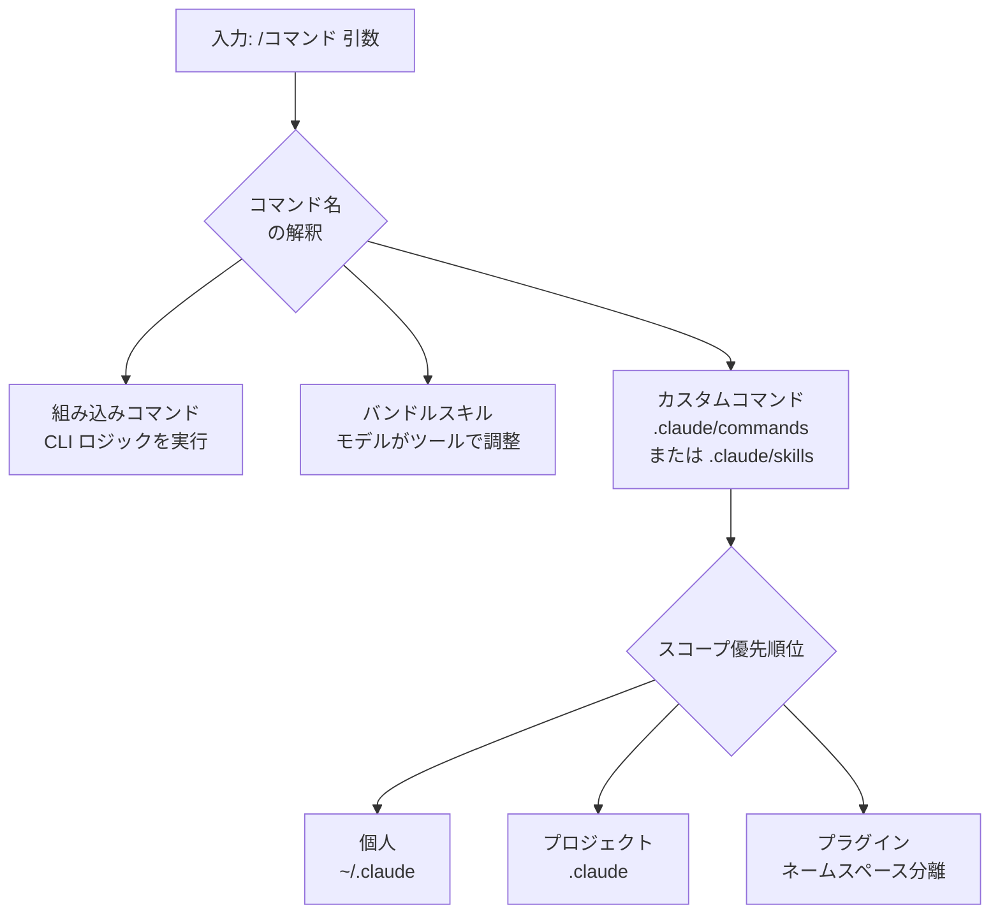

スラッシュコマンド (slash command) は、セッション内で `/` から始まる 1 行で Claude Code を直接操作する最速の方法です。


**ひとことで言うと**: `/` から始まる入力 1 行で、モデルの切り替えからコンテキストの整理、さらには自分で作ったワークフローの実行まで、セッションを手元で制御できます。


## スラッシュコマンドとは何か

スラッシュコマンドは、セッション内部で Claude Code を制御します。モデルを変えたり、権限を管理したり、コンテキストを空にしたり、ワークフローを実行したりといった作業を 1 行で処理します。入力欄に `/` を入力するだけで利用可能なすべてのコマンドが一覧表示され、`/` の後に文字を続けて入力するとフィルタリングされます。

中心となるルールはたった 1 つです。**コマンドはメッセージの先頭でのみ**認識されます。コマンド名の後に続くテキストは、そのコマンドに引数 (argument) として渡されます。

コマンドは大きく 3 種類に分かれます。

| 種類 | 定義場所 | 動作方式 |
| :--- | :--- | :--- |
| 組み込みコマンド | CLI にコードとして組み込み | 固定されたロジックを直接実行 |
| バンドルスキル (bundled skill) | Claude Code に同梱されたスキル | モデルに指示を渡し、モデルがツールで作業を調整 |
| カスタムコマンド | `.claude/commands/` または `.claude/skills/` | ユーザーが Markdown で直接定義 |

## 組み込みスラッシュコマンドの例

よく使う組み込みコマンドとバンドルスキルを整理すると、次のとおりです。全リストは入力欄で `/` を確認するか、公式コマンドリファレンスを参照してください。

| コマンド | 用途 |
| :--- | :--- |
| `/help` | ヘルプと利用可能なコマンド一覧を表示 |
| `/clear` | コンテキストを空にして新しい会話を開始 (以前の会話は `/resume` に保存) |
| `/compact` | 同じ会話を維持したまま、これまでの内容を要約してコンテキストを確保 |
| `/context` | 現在のコンテキストウィンドウ使用量をカラーグリッドで可視化 |
| `/cost` | セッションのコストとプラン使用量を表示 (`/usage`、`/stats` の別名) |
| `/model` | AI モデルの切り替えと既定モデルの保存 |
| `/effort` | モデルの推論の深さ (effort レベル) を設定 |
| `/config` | テーマ、モデル、出力スタイルなどの設定画面を開く (`/settings` の別名) |
| `/agents` | サブエージェント構成を管理 |
| `/skills` | 利用可能なスキル一覧を表示 |
| `/mcp` | MCP サーバーの接続と認証を管理 |
| `/hooks` | ツールイベントごとの hook 構成を確認 |
| `/permissions` | ツール権限の allow/ask/deny ルールを管理 (`/allowed-tools` の別名) |
| `/init` | プロジェクトに開始用の `CLAUDE.md` を生成 |
| `/memory` | `CLAUDE.md` メモリファイルを編集 |
| `/plan` | 大きな変更の前にプランモードへ移行 |
| `/rewind` | コードと会話を以前のチェックポイントへ戻す (チェックポインティング) |
| `/resume` | ID や名前で会話を再開 (`/continue` の別名) |
| `/doctor` | インストールと設定を診断 |

`/cost` と `/stats` が `/usage` の別名であるように、同じ機能を複数の名前で呼べる場合が多くあります。また、一部のコマンドはプラットフォーム、プラン、環境によって表示の有無が変わります。

## カスタムスラッシュコマンド

自分で書くコマンドは Markdown ファイルで定義します。`.claude/commands/deploy.md` ファイルは `/deploy` コマンドを作り、同じ作業を `.claude/skills/deploy/SKILL.md` スキルとして作ることもできます。どちらの方式も同じコマンドを作り、同じように動作します。既存の `.claude/commands/` ファイルはそのまま動作し、同じ名前のスキルとコマンドが衝突した場合はスキルが優先されます。

> カスタムコマンドはスキルに統合されました。新しいコマンドを作るなら、補助ファイルを一緒に置けるスキル形式が推奨されますが、単純な 1 ファイルだけのコマンドであれば `.claude/commands/` でも十分です。

### frontmatter フィールド

Markdown ファイル先頭の YAML frontmatter で動作を調整します。すべてのフィールドは任意ですが、モデルが自動呼び出しのタイミングを判断できるよう、`description` だけは推奨されます。

| フィールド | 説明 |
| :--- | :--- |
| `description` | コマンドが行うことと使用時点。モデルが自動呼び出しの可否を判断するのに使用 |
| `allowed-tools` | コマンド有効中に承認なしで使えるツール。空白/カンマ区切りの文字列または YAML リスト |
| `argument-hint` | 自動補完時に表示する引数ヒント。例: `[issue-number]` |
| `disable-model-invocation` | `true` の場合、モデルの自動呼び出しを防ぎ、ユーザーのみ `/name` で実行 |
| `model` | コマンド実行中に使用するモデル (現在のターン限定) |

```yaml
---
description: GitHub イシューを私たちのコーディング標準に従って修正します
argument-hint: [issue-number]
disable-model-invocation: true
allowed-tools: Bash(git add *) Bash(git commit *)
---

GitHub イシュー $ARGUMENTS を私たちのコーディング標準に従って修正してください。

1. イシューの説明を読みます
2. 修正を実装します
3. テストを作成します
4. コミットを生成します
```

`disable-model-invocation: true` は、デプロイやコミットのように副作用があり、タイミングを自分で制御したいワークフローに有用です。コードが準備できているように見えるという理由で、モデルが勝手にデプロイしないように防いでくれます。

### $ARGUMENTS 置換

コマンド名の後に入力したテキストは、`$ARGUMENTS` の位置に置換されます。上の例で `/fix-issue 123` を実行すると、`$ARGUMENTS` が `123` に変わります。コマンド本文に `$ARGUMENTS` がない場合、入力した内容は本文の末尾に `ARGUMENTS: <入力値>` の形で追加されます。

位置ごとの引数も使えます。

| 表記 | 意味 |
| :--- | :--- |
| `$ARGUMENTS` | 入力した引数文字列全体 |
| `$ARGUMENTS[N]` | 0 から始まる N 番目の引数 |
| `$N` | `$ARGUMENTS[N]` の省略形 (`$0` が最初) |

例えば本文に `$0 コンポーネントを $1 から $2 へマイグレーション` と書いて `/migrate-component SearchBar React Vue` を実行すると、`$0` は `SearchBar`、`$1` は `React`、`$2` は `Vue` に置換されます。空白を含む値は引用符で囲んで 1 つの引数として渡します。

### 動的コンテキスト注入

本文での `` !`<コマンド>` `` 構文は、コマンドの内容がモデルに渡される**前に**シェルコマンドを実行し、その出力で位置を埋めます。モデルはコマンドではなく実際のデータを受け取ります。

```markdown
## 現在の変更点

!`git diff HEAD`

## 指示

上記の変更点を 2〜3 個の項目に要約し、リスク要素を列挙してください。
```

このインライン形式は、`!` が行の先頭または空白の直後に来るときのみ認識されます。複数行のコマンドは `` ```! `` フェンスブロックを使用します。また、`@ファイルパス` の形でファイルの内容を本文に参照して入れることもできます。

## スコープ: プロジェクト vs 個人

コマンドとスキルをどこに置くかが、使用範囲を決定します。

| スコープ | パス | 適用範囲 |
| :--- | :--- | :--- |
| 個人 | `~/.claude/commands/` または `~/.claude/skills/` | 自分のすべてのプロジェクト |
| プロジェクト | `.claude/commands/` または `.claude/skills/` | そのプロジェクトのみ |
| プラグイン | `<plugin>/skills/` | プラグインが有効な場所 |

同じ名前が複数のレベルにある場合、個人がプロジェクトを上書きします (組織単位の enterprise 設定があれば、それが最優先)。プロジェクトスコープのコマンドの `allowed-tools` は、該当フォルダのワークスペース信頼 (workspace trust) ダイアログを受け入れた後に適用されます。信頼できないリポジトリのコマンドは、自分自身に広いツール権限を付与できるため、使用前に確認してください。

サブディレクトリを置くと、自然にネームスペースが生まれます。また、プロジェクトスキルは開始ディレクトリからリポジトリルートまでの上位パスの `.claude/skills/` をすべて探索するため、サブフォルダで Claude Code を開始しても、ルートのコマンドをそのまま認識します。



## プラグインが提供するコマンド

プラグイン (plugin) は、自身の `skills/` ディレクトリにコマンドを格納して配布できます。プラグインスキルは `プラグイン名:スキル名` のネームスペースを使用するため、他のレベルのコマンドと名前が衝突しません。例えば `my-plugin/skills/review/SKILL.md` は `/my-plugin:review` で呼び出されます。プラグイン自体は `/plugin` コマンドで管理します。

## MoAI-ADK の /moai コマンドとの関係

MoAI-ADK が提供する `/moai` とそのサブコマンド (`/moai plan`、`/moai run`、`/moai sync` など) は、まさにこのスラッシュコマンドのメカニズム上にスキルとして実装されています。つまり MoAI-ADK は、Claude Code のカスタムコマンド標準をそのまま使って、SPEC ベースのワークフローを 1 行のコマンドとして公開しています。

| 区分 | Claude Code スラッシュコマンド | MoAI-ADK `/moai` コマンド |
| :--- | :--- | :--- |
| 正体 | セッション制御メカニズム | そのメカニズムで実装されたスキル群 |
| 定義場所 | `.claude/commands` または `.claude/skills` | MoAI-ADK が配布するスキル |
| 役割 | モデルの切り替え、コンテキスト管理など | エージェントオーケストレーションのワークフロー |

`/moai` コマンド自体の動作とサブコマンドは、別のドキュメントで扱います。

## 関連ドキュメント

- [/moai コマンド](/utility-commands/moai)
- [ワークフローコマンド](/workflow-commands)
- [対話モード](/claude-code/foundations/interactive-mode)

## 参考資料

- [Claude Code Commands (公式ドキュメント)](https://code.claude.com/docs/en/commands)
- [Extend Claude with skills (公式ドキュメント)](https://code.claude.com/docs/en/skills)


副作用があるコマンド (デプロイ、コミット、外部送信など) には `disable-model-invocation: true` を入れて、モデルが任意に実行できないようにし、実行のタイミングを自分の手に握ってください。

