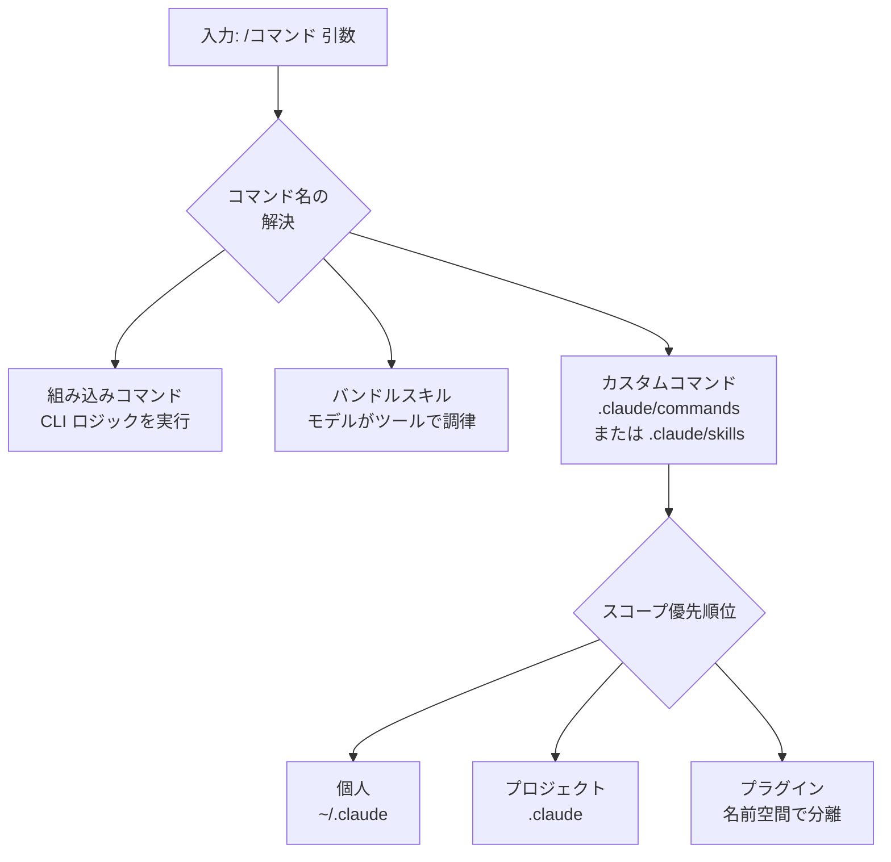

# スラッシュコマンド

スラッシュコマンド (slash command) は、セッション内で `/` から始まる 1 行によって Claude Code を直接操作する、最も速い方法です。



**ひとことで言うと**: `/` で始まる 1 行の入力が、モデル切り替えからコンテキスト整理、そして自作ワークフローの実行まで、セッションを指先でコントロールします。


## スラッシュコマンドとは何か

スラッシュコマンドはセッション内部で Claude Code を制御します。モデルを切り替える、権限を管理する、コンテキストをクリアする、ワークフローを実行する — こうしたことを 1 行で処理します。入力欄に `/` だけを入力すると使用可能なすべてのコマンドが列挙され、`/` の後に文字を続けるとフィルタリングされます。

核心のルールはただ 1 つです。**コマンドはメッセージの先頭でのみ** 認識されます。コマンド名の後に続くテキストは、そのコマンドへ引数 (argument) として渡されます。

コマンドは大きく 3 種類に分かれます。

| 種類 | 定義場所 | 動作方式 |
| :--- | :--- | :--- |
| 組み込みコマンド | CLI にコードとして内蔵 | 固定ロジックを直接実行 |
| バンドルスキル (bundled skill) | Claude Code に同梱されたスキル | モデルへ指示を渡し、モデルがツールで作業を調律 |
| カスタムコマンド | `.claude/commands/` または `.claude/skills/` | ユーザーがマークダウンで直接定義 |

## 組み込みスラッシュコマンドとスキル一覧

スラッシュコマンドは 3 つの種類で構成されます。よく使うコマンドを整理すると次のとおりです。全一覧は入力欄で `/` を打てば確認でき、公式コマンドリファレンスは [code.claude.com/docs/en/commands](https://code.claude.com/docs/en/commands) を参照します。

### 組み込みコマンド (Built-in)

| コマンド | 用途 | バージョン |
| :--- | :--- | :--- |
| `/goal <condition>` | 完了条件を設定し、複数ターンにわたって自律進行 (Haiku が定期的に確認) | v2.1.139+ |
| `/workflows` | ダイナミックワークフローの実行一覧管理 UI | v2.1.139+ |
| `/rewind` (別名: `/checkpoint`, `/undo`) | コードと会話を以前のチェックポイントへ巻き戻す | v2.1.191+ |
| `/context [all]` | 現在のコンテキストウィンドウ使用量を分析 | 標準 |
| `/memory` | `CLAUDE.md` + 自動メモリのロード一覧/トグル | v2.1.59+ |
| `/compact` | 同じ会話を維持したままこれまでの内容を要約してコンテキストを確保 | 標準 |
| `/clear` (別名: `/reset`, `/new`) | コンテキストをクリアして新しい会話を開始 | 標準 |
| `/agents` | サブエージェント管理 UI（v2.1.198 で作成ウィザードが削除 — Claude に依頼するか `.claude/agents/` を直接編集。公式ドキュメントには 2026-07 時点でタブ UI がまだ残存） | v2.1.139+ |
| `/mcp` | MCP サーバー接続と OAuth 認証の管理 | v2.1.186+ |
| `/plugin` | プラグイン管理 | 標準 |
| `/effort [low\|medium\|high\|xhigh\|max\|ultracode\|auto]` | モデルの推論強度またはオーケストレーション設定 | 標準 |
| `/model` | AI モデルの選択 | 標準 |
| `/background` (別名: `/bg`) | バックグラウンド実行 | v2.1.139+ |
| `/fork <directive>` | 会話を継承したフォークサブエージェント | v2.1.161+ |
| `/recap` | セッション要約 | 標準 |
| `/btw` | サイド質問 | v2.1.187+ |
| `/cd` | セッションの作業ディレクトリ変更、プロンプトキャッシュ保持 | v2.1.169+ |
| `/schedule` (別名: `/routines`) | スケジュールタスク | v2.1.72+ |
| `/branch`, `/tasks`, `/plan`, `/doctor`, `/skills`, `/reload-skills`, `/reload-plugins` | その他の管理コマンド | 標準 |

### スキルコマンド `[Skill]`

| コマンド | 用途 |
| :--- | :--- |
| `/loop` (別名: `/proactive`) | 反復ループ実行 (Ralph/interval ベース) |
| `/batch` | バッチ実行 |
| `/simplify` | コード単純化 (v2.1.154+) |
| `/code-review` | コードレビュー |
| `/dataviz` | データから可視化を生成 (v2.1.198+) |

### ワークフローコマンド `[Workflow]`

| コマンド | 用途 |
| :--- | :--- |
| `/deep-research` | ウェブ検索を並列実行し結果を相互検証するリサーチ (WebSearch が必要) |

### コマンドの可用性に関する補足

- 同じ機能を複数の名前で呼べる場合が多くあります (別名)。
- 一部のコマンドはプラットフォーム、プラン、環境によって表示されるかどうかが変わります。
- `ultracode` は現在ワークフローのトリガーキーワード (v2.1.160 より前は `workflow` でした) であると同時に、`/effort` のレベルでもあります。

## カスタムスラッシュコマンド

自作のコマンドはマークダウンファイルで定義します。`.claude/commands/deploy.md` ファイルは `/deploy` コマンドを作り、同じ作業を `.claude/skills/deploy/SKILL.md` のスキルとしても作れます。2 つの方式は同じコマンドを作り、同じように動作します。既存の `.claude/commands/` ファイルはそのまま動作し、同名のスキルとコマンドが衝突した場合はスキルが優先されます。

> カスタムコマンドはスキルへ統合されました。新しいコマンドを作るなら、補助ファイルを同梱できるスキル形式が推奨されますが、シンプルな 1 ファイルのコマンドなら `.claude/commands/` でも十分です。

### frontmatter フィールド

マークダウンファイル冒頭の YAML frontmatter で動作を調整します。すべてのフィールドは任意ですが、モデルが自動呼び出しの判断をできるよう `description` だけは推奨されます。

| フィールド | 説明 |
| :--- | :--- |
| `description` | コマンドがすることと使いどき。モデルが自動呼び出しの可否を判断するのに使用 |
| `allowed-tools` | コマンド有効中に承認なしで使えるツール。空白/カンマ区切り文字列または YAML リスト |
| `argument-hint` | 補完時に表示する引数ヒント。例: `[issue-number]` |
| `disable-model-invocation` | `true` ならモデルの自動呼び出しを防ぎ、ユーザーのみが `/name` で実行 |
| `model` | コマンド実行中に使用するモデル (現在のターン限定) |

```yaml
---
description: GitHub イシューを私たちのコーディング標準に従って修正します
argument-hint: [issue-number]
disable-model-invocation: true
allowed-tools: Bash(git add *) Bash(git commit *)
---

GitHub イシュー $ARGUMENTS を私たちのコーディング標準に従って修正してください。

1. イシューの説明を読みます
2. 修正を実装します
3. テストを作成します
4. コミットを生成します
```

`disable-model-invocation: true` は、デプロイやコミットのように副作用がありタイミングを自分で制御したいワークフローに有用です。コードが準備できたように見えるという理由でモデルが勝手にデプロイしないよう防いでくれます。

### $ARGUMENTS 置換

コマンド名の後に入力したテキストは `$ARGUMENTS` の位置に置換されます。上の例で `/fix-issue 123` を実行すると `$ARGUMENTS` が `123` に変わります。コマンド本文に `$ARGUMENTS` がなければ、入力した内容が本文末尾に `ARGUMENTS: <入力値>` の形で追記されます。

位置引数も使えます。

| 表記 | 意味 |
| :--- | :--- |
| `$ARGUMENTS` | 入力した引数文字列の全体 |
| `$ARGUMENTS[N]` | 0 始まりの N 番目の引数 |
| `$N` | `$ARGUMENTS[N]` の省略形 (`$0` が最初) |

たとえば本文に `$0 コンポーネントを $1 から $2 へマイグレーション` と書き、`/migrate-component SearchBar React Vue` を実行すると、`$0` は `SearchBar`、`$1` は `React`、`$2` は `Vue` に置換されます。空白を含む値は引用符で囲んで 1 つの引数として渡します。

### 動的コンテキスト注入

本文中の `` !`<コマンド>` `` 構文は、コマンド内容がモデルへ渡される **前に** シェルコマンドを実行し、その出力で位置を埋めます。モデルはコマンドではなく実際のデータを受け取ります。

```markdown
## 現在の変更内容

!`git diff HEAD`

## 指示

上記の変更内容を 2〜3 個の項目で要約し、リスク要素を列挙してください。
```

このインライン形式は、`!` が行頭または空白の直後に来るときにのみ認識されます。複数行のコマンドは `` ```! `` フェンスブロックを使います。また `@ファイルパス` の形式でファイル内容を本文へ参照として取り込めます。

## スコープ: プロジェクト vs 個人

コマンドとスキルをどこに置くかが、使用範囲を決めます。

| スコープ | パス | 適用範囲 |
| :--- | :--- | :--- |
| 個人 | `~/.claude/commands/` または `~/.claude/skills/` | 自分のすべてのプロジェクト |
| プロジェクト | `.claude/commands/` または `.claude/skills/` | 該当プロジェクトのみ |
| プラグイン | `<plugin>/skills/` | プラグインが有効な場所 |

同じ名前が複数レベルにある場合、個人がプロジェクトを上書きします (組織単位の enterprise 設定があればそれが最優先)。プロジェクトスコープのコマンドの `allowed-tools` は、そのフォルダのワークスペース信頼 (workspace trust) ダイアログを受け入れた後に適用されます。信頼できないリポジトリのコマンドは自らに広範なツール権限を与えられるため、使用前にレビューしましょう。

サブディレクトリを置けば自然に名前空間が生まれます。またプロジェクトスキルは、開始ディレクトリからリポジトリのルートまで上位パスの `.claude/skills/` をすべて探索するため、サブフォルダから Claude Code を起動してもルートのコマンドをそのまま認識します。


```mermaid
flowchart TD
    A["入力: /コマンド 引数"] --> B{"コマンド名の<br/>解決"}
    B --> C["組み込みコマンド<br/>CLI ロジックを実行"]
    B --> D["バンドルスキル<br/>モデルがツールで調律"]
    B --> E["カスタムコマンド<br/>.claude/commands<br/>または .claude/skills"]
    E --> F{"スコープ優先順位"}
    F --> G["個人<br/>~/.claude"]
    F --> H["プロジェクト<br/>.claude"]
    F --> I["プラグイン<br/>名前空間で分離"]
```

## プラグインが提供するコマンド

プラグイン (plugin) は、自身の `skills/` ディレクトリにコマンドを収めて配布できます。プラグインスキルは `プラグイン名:スキル名` の名前空間を使うため、他のレベルのコマンドと名前が衝突しません。たとえば `my-plugin/skills/review/SKILL.md` は `/my-plugin:review` で呼び出します。プラグイン自体は `/plugin` コマンドで管理します。

## MoAI-ADK の /moai コマンドとの関係

MoAI-ADK が提供する `/moai` とそのサブコマンド (`/moai plan`、`/moai run`、`/moai sync` など) は、まさにこのスラッシュコマンドの仕組みの上にスキルとして実装されています。つまり MoAI-ADK は Claude Code のカスタムコマンド標準をそのまま使い、SPEC ベースのワークフローを 1 行のコマンドとして公開しています。サブコマンドなしで自然言語で `/moai "ログインバグを直して"` のように依頼すると、意図分析 (Analyze-First) を経て適切なワークフローへルーティングされます — 言語に依存しない意味ベースの分類です。

| 区分 | Claude Code スラッシュコマンド | MoAI-ADK `/moai` コマンド |
| :--- | :--- | :--- |
| 正体 | セッション制御の仕組み | その仕組みで実装されたスキルの束 |
| 定義場所 | `.claude/commands` または `.claude/skills` | MoAI-ADK が配布するスキル |
| 役割 | モデル切り替え、コンテキスト管理など | エージェントオーケストレーションのワークフロー |

`/moai` コマンド自体の動作とサブコマンドは別のドキュメントで扱います。

## 関連ドキュメント

- [/moai コマンド](/ja/utility-commands/moai)
- [ワークフローコマンド](/ja/workflow-commands)
- [対話モード](/ja/claude-code/foundations/interactive-mode)

## 参考資料

- [Claude Code Commands (公式ドキュメント)](https://code.claude.com/docs/en/commands)
- [Extend Claude with skills (公式ドキュメント)](https://code.claude.com/docs/en/skills)


副作用のあるコマンド (デプロイ、コミット、外部送信など) には `disable-model-invocation: true` を入れて、モデルが勝手に実行できないようにし、実行タイミングを自分の手に握っておきましょう。

