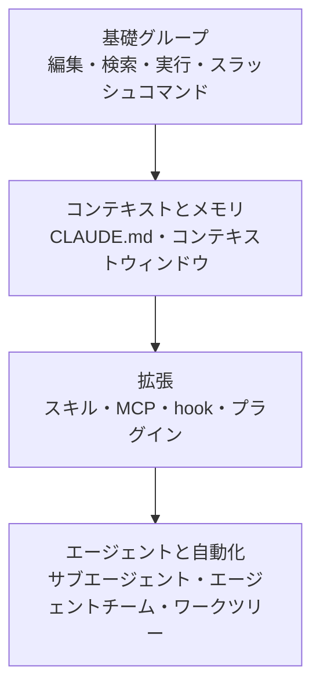

このページは、Claude Code が提供する機能全体を一目で見渡し、各機能が具体的にどの問題を解決するのかを素早く把握できるようにするためのハブです。


**ひとことで言うと**: Claude Code は、コードを推論するモデルにファイル編集・検索・実行といった組み込みツールが備わっており、その上にコンテキスト・拡張・自動化のレイヤーが層状に重なる構造です。


## このページの役割

Claude Code の機能は大きく2つの系統に分かれます。1つはモデルがコードを扱うために常に使う **組み込みツール** (built-in tools) で、もう1つはユーザーが必要に応じて追加する **拡張レイヤー** (extension layer) です。このページは両系統をすべて並べて広げ、各機能の一行説明とともに掘り下げた詳細ドキュメントへの道筋を案内します。

MoAI-ADK は、まさにこの Claude Code の上で動作するワークフローツールです。したがって、ここで紹介する機能の概念を押さえておけば、MoAI-ADK がサブエージェント・スキル・hook をどのようにオーケストレーションするのかを、はるかに速く理解できます。

## 機能カタログ

以下の表は、Claude Code の主要機能を一行説明とともにまとめたものです。最後の列のリンクをたどると、各機能の詳細ドキュメントへ移動します。

| 機能 | 一行説明 | 詳しく見る |
| --- | --- | --- |
| コード編集 | モデルがファイルを直接読み取り修正する中核の組み込み機能です。 | [基礎グループ](/claude-code/foundations) |
| 検索 | コードベース内でパターン・ファイル・シンボルを探す組み込みツールです。 | [基礎グループ](/claude-code/foundations) |
| コマンド実行 | シェルコマンドを実行してビルド・テスト・git 作業を行います。 | [基礎グループ](/claude-code/foundations) |
| スラッシュコマンド | `/` で始まるコマンドで、スキルや組み込み動作を即座に呼び出します。 | [基礎グループ](/claude-code/foundations) |
| 対話モード | 権限の処理方式や作業スタイルを変えるセッションモードです。 | [基礎グループ](/claude-code/foundations) |
| CLAUDE.md / メモリ | 毎セッション自動で読み込まれる永続コンテキストを保管します。 | [コンテキストとメモリ](/claude-code/context-memory) |
| コンテキストウィンドウ | 1セッションが収められるトークンの上限と、その管理戦略です。 | [コンテキストとメモリ](/claude-code/context-memory) |
| スキル | 再利用可能な知識・ワークフローを収めたマークダウン単位です。 | [拡張](/claude-code/extensibility) |
| MCP | 外部サービス・ツールをモデルに接続するプロトコルです。 | [拡張](/claude-code/extensibility) |
| hook | ライフサイクルイベントにスクリプト・リクエスト・プロンプトを自動実行します。 | [拡張](/claude-code/extensibility) |
| 成果物ストア | Claudeが生成したHTML・マークダウン・スニペットを構造化して共有します。 | [拡張](/claude-code/extensibility) |
| プラグイン | スキル・hook・サブエージェント・MCP を束ねて配布するパッケージング単位です。 | [拡張](/claude-code/extensibility) |
| サブエージェント | 隔離されたコンテキストで独立実行し、要約だけを返す作業者です。 | [エージェントと自動化](/claude-code/agentic) |
| エージェントチーム | 複数の独立セッションがタスクとメッセージを共有しながら協働します。 | [エージェントと自動化](/claude-code/agentic) |
| ワークツリー | 同一リポジトリを分離した作業ディレクトリで並列開発します。 | [エージェントと自動化](/claude-code/agentic) |
| チェックポイント | 作業途中の状態を保存し、戻れるようにします。 | [エージェントと自動化](/claude-code/agentic) |

### 組み込みツール系

組み込みツールは別途の設定なしに常に動作し、ほとんどのコーディング作業はこのツールだけで処理されます。

- **コード編集**: モデルがファイルを開いて直接読み取り、修正する最も基本的な機能です。
- **検索**: コードベース全体からテキストパターンやファイルを見つけ出します。型付き言語や大規模なコードベース (large codebase) では、言語サーバーベースのコードインテリジェンスがシンボル単位の探索をより正確にしてくれます。
- **コマンド実行**: ビルド・テスト・リント・git といったシェルコマンドを実行します。
- **スラッシュコマンド**: `/code-review`、`/debug` のようにバンドルで提供されるコマンドや、自作のスキルを即座に呼び出します。
- **対話モード**: 編集の自動承認や権限のバイパスといったセッションの動作方式を切り替えます。

### コンテキストとメモリ系

- **CLAUDE.md / メモリ**: 毎セッション開始時に全内容が自動で読み込まれる永続コンテキストです。コーディング規則や「常に X せよ」といった指針を置きます。公式ドキュメントは `CLAUDE.md` を200行以内に保ち、増えていく参照資料はスキルや `.claude/rules/` に分離することを推奨しています。
- **コンテキストウィンドウ**: 1セッションが収められる入力・出力トークンの上限です。各機能がコンテキストをどれだけ占有するかを理解することが、効率的な設定の鍵です。

### 拡張レイヤー

拡張レイヤーは、モデルが知っていることを増やしたり、外部サービスに接続したり、ワークフローを自動化したりします。

- **スキル** (skill): 知識・ワークフロー・指針を収めたマークダウンファイルです。`/<name>` で直接呼び出すか、関連性が高いときにモデルが自動で読み込みます。拡張のなかで最も柔軟な手段です。
- **MCP**: データベース照会、Slack 投稿、ブラウザ制御のように、外部サービスとデータをモデルに接続するプロトコルです。
- **hook**: `PostToolUse`、`SessionStart` といったライフサイクルイベントにスクリプト・HTTP リクエスト・プロンプト・サブエージェントを実行します。毎回同じように起こるべき自動化 (例: 編集後のリント) に適しています。
- **プラグイン** (plugin): スキル・hook・サブエージェント・MCP サーバーを1つのインストール単位に束ねます。同じ設定を複数のリポジトリで再利用したり、他の人に配布したりするときに使います。

### エージェントと自動化系

- **サブエージェント**: 自分専用のコンテキストウィンドウで作業を処理したのち、要約結果だけをメインの会話に返します。数十個のファイルを読む調査作業のように、中間成果物がメインコンテキストを乱してはならないときに有用です。
- **エージェントチーム** (agent team): 互いに独立した複数の Claude Code セッションが、共有タスクリストとメッセージで協働します。競合する仮説を検証する調査や並列のコードレビューに適しており、実験的機能でデフォルトは無効状態です。
- **ワークツリー**: 同一リポジトリを分離した作業ディレクトリに置き、複数ブランチの作業を衝突なく並列で進めます。
- **チェックポイント**: 作業進行中の状態を記録しておき、変更を巻き戻したり安全な地点へ復帰したりできるようにします。

## スキルとサブエージェントの違い

拡張機能のなかで最も混同しやすい2つを押さえておきます。核心は **コンテキスト** (context) の処理方式です。

| 区分 | スキル | サブエージェント |
| --- | --- | --- |
| 正体 | 再利用可能な指針・知識・ワークフロー | 自分のコンテキストを持つ隔離された作業者 |
| 強み | どのコンテキストでも共有 | 作業が分離され、要約だけを返す |
| コンテキストへの影響 | メインウィンドウに加算される | 別ウィンドウを使用 |
| 適した仕事 | 参照資料、呼び出し型ワークフロー | 多数のファイル読み取り、並列・専門作業 |

スキルは呼び出し型の動作 (`/deploy`) でもあり得るし、参照知識 (API スタイルガイド) でもあり得ます。コンテキストウィンドウが満ちてきたり、途中の作業を見せる必要がなかったりするときはサブエージェントが適しています。両者は結合も可能で、サブエージェントが特定のスキルを事前に読み込んだり、スキルが隔離コンテキストで実行されたりできます。

## どこから読むか

このセクションのドキュメントは、学習順序を考慮して4つのグループにまとめられています。以下の流れをたどれば、無理なく全体像を掴めます。

| 順序 | グループ | 何が得られるか |
| --- | --- | --- |
| 1 | [基礎グループ](/claude-code/foundations) | 編集・検索・実行など毎日使う中核動作 |
| 2 | [コンテキストとメモリ](/claude-code/context-memory) | CLAUDE.md で規則を固定し、コンテキストを節約する方法 |
| 3 | [拡張](/claude-code/extensibility) | スキル・MCP・hook・プラグインで能力を増やす方法 |
| 4 | [エージェントと自動化](/claude-code/agentic) | サブエージェント・エージェントチームで作業を並列化する方法 |

公式ドキュメントが勧める **モデルケース** (best practice) は、最初からすべての機能を設定しないことです。同じ過ちを2回したら CLAUDE.md に規則を加え、同じプロンプトを繰り返したらスキルとして保存し、毎回自動で起こるべき動作が生じたら hook を書く、といった具合に、必要が現れるたびに1つずつ積み上げていく流れです。

## 関連ドキュメント

- [基礎グループ](/claude-code/foundations)
- [コンテキストとメモリ](/claude-code/context-memory)
- [拡張](/claude-code/extensibility)
- [エージェントと自動化](/claude-code/agentic)
- [クイックスタート](/getting-started/quickstart)

## 参考資料

- [Extend Claude Code — Features overview](https://code.claude.com/docs/en/features-overview)


初めて Claude Code を扱うなら、機能を一度に有効化せず、まず基礎グループから習得したうえで、実際の作業で「またこれを繰り返しているな」と思う瞬間ごとに CLAUDE.md → スキル → hook の順で1つずつ追加してみてください。

