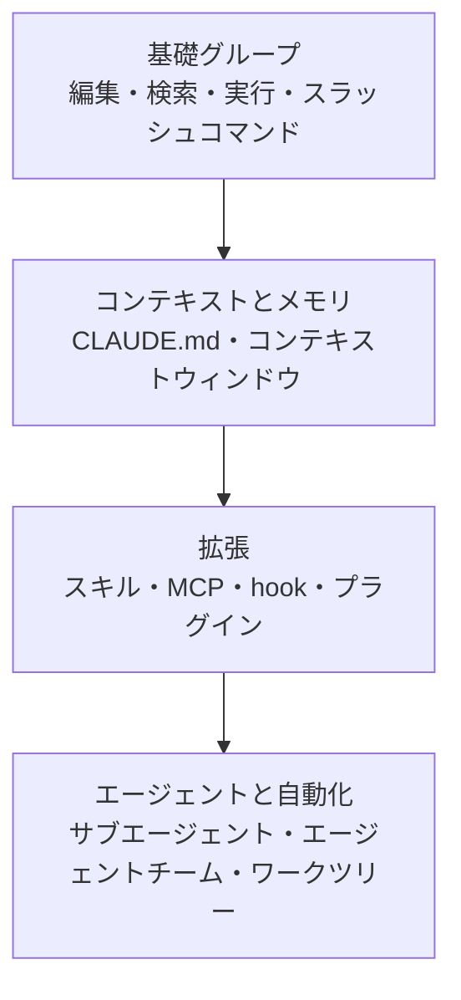

# 機能ひとめぐり

このページは、Claude Code が提供する機能全体を一望し、各機能が正確にどんな問題を解決するのかを素早く把握できるようにするハブです。


**ひとことで言うと**: Claude Code は、コードを推論するモデルにファイル編集・検索・実行といった組み込みツールが付き、その上にコンテキスト・拡張・自動化のレイヤーが層をなして載る構造です。


## このページの役割

Claude Code の機能は大きく 2 系統に分かれます。1 つはモデルがコードを扱うために常に使う **組み込みツール** (built-in tools)、もう 1 つはユーザーが必要に応じて付け足す **拡張レイヤー** (extension layer) です。このページは両系統をすべて広げ、各機能の一行説明とともに、深掘りできる詳細ドキュメントへの道筋を案内します。

MoAI-ADK は、まさにこの Claude Code の上で動作するエージェンティック開発キットです。ここに並ぶ機能は MoAI-ADK 三本柱の原材料でもあります — コンテキストウィンドウとキャッシュは **トークノミクス** の、サブエージェント・チーム・ワークツリーは **エージェンティックループエンジニアリング** の、スキル・フック・MCP・プラグインは **エージェンティックハーネス** の素材です。ここで概念を押さえておけば、MoAI-ADK がこれらをどうオーケストレーションするのかをはるかに速く理解できます。

## 機能カタログ

下の表は、Claude Code の主要機能を一行説明とともに整理したものです。最後の列のリンクをたどると各機能の詳細ドキュメントへ移動します。

| 機能 | 一行説明 | 詳しく見る |
| --- | --- | --- |
| コード編集 | モデルがファイルを直接読み書きする中核の組み込み機能です。 | [基礎グループ](/ja/claude-code/foundations) |
| 検索 | コードベース内でパターン・ファイル・シンボルを探す組み込みツールです。 | [基礎グループ](/ja/claude-code/foundations) |
| コマンド実行 | シェルコマンドを実行してビルド・テスト・git 作業を行います。 | [基礎グループ](/ja/claude-code/foundations) |
| スラッシュコマンド | `/` で始まるコマンドでスキルや組み込み動作を即座に呼び出します。 | [基礎グループ](/ja/claude-code/foundations) |
| 対話モード | 権限の扱い方や作業スタイルを切り替えるセッションモードです。 | [基礎グループ](/ja/claude-code/foundations) |
| CLAUDE.md / メモリ | 毎セッション自動でロードされる永続コンテキストを保管します。 | [コンテキストとメモリ](/ja/claude-code/context-memory) |
| コンテキストウィンドウ | 1 セッションが収容できるトークンの上限とその管理戦略です。 | [コンテキストとメモリ](/ja/claude-code/context-memory) |
| スキル | 再利用可能な知識・ワークフローを収めたマークダウン単位です。 | [拡張](/ja/claude-code/extensibility) |
| MCP | 外部サービス・ツールをモデルに接続するプロトコルです。 | [拡張](/ja/claude-code/extensibility) |
| hook | ライフサイクルイベントにスクリプト・リクエスト・プロンプトを自動実行します。 | [拡張](/ja/claude-code/extensibility) |
| 成果物ストレージ | Claude が生成した HTML・マークダウン・スニペットを構造化して共有します。 | [拡張](/ja/claude-code/extensibility) |
| プラグイン | スキル・hook・サブエージェント・MCP を束ねて配布するパッケージング単位です。 | [拡張](/ja/claude-code/extensibility) |
| サブエージェント | 分離コンテキストで独立実行し要約だけを返すワーカーです。 | [エージェントと自動化](/ja/claude-code/agentic) |
| エージェントチーム | 複数の独立セッションがタスクとメッセージを共有して協働します。 | [エージェントと自動化](/ja/claude-code/agentic) |
| ワークツリー | 同じリポジトリを分離した作業ディレクトリで並行開発します。 | [エージェントと自動化](/ja/claude-code/agentic) |
| チェックポイント | 作業途中の状態を保存して後から戻れるようにします。 | [エージェントと自動化](/ja/claude-code/agentic) |

### 組み込みツール系

組み込みツールは追加設定なしで常に動作し、大半のコーディング作業はこのツールだけで処理できます。

- **コード編集**: モデルがファイルを開いて直接読み、直す最も基本的な機能です。
- **検索**: コードベース全体からテキストパターンやファイルを見つけ出します。型付き言語や大規模コードベース (large codebase) では、言語サーバーベースのコードインテリジェンスがシンボル単位の探索をより正確にしてくれます。
- **コマンド実行**: ビルド・テスト・リント・git のようなシェルコマンドを実行します。
- **スラッシュコマンド**: `/code-review`、`/debug` のようにバンドルで提供されるコマンドや自作のスキルを即座に呼び出します。
- **対話モード**: 編集の自動承認や権限バイパスといったセッションの動作方式を切り替えます。

### コンテキストとメモリ系

- **CLAUDE.md / メモリ**: 毎セッション開始時に全文が自動ロードされる永続コンテキストです。コーディング規約や「常に X せよ」といった指針を置きます。公式ドキュメントは `CLAUDE.md` を 200 行以内に保ち、増えていく参照資料はスキルや `.claude/rules/` へ分離することを推奨しています。
- **コンテキストウィンドウ**: 1 セッションが収容できる入力・出力トークンの上限です。各機能がコンテキストをどれだけ占めるかを理解することが、効率的な設定の鍵です。

### 拡張レイヤー

拡張レイヤーは、モデルの知識を増やしたり、外部サービスに接続したり、ワークフローを自動化したりします。

- **スキル** (skill): 知識・ワークフロー・指針を収めたマークダウンファイルです。`/<name>` で直接呼び出すか、関連性が高いときにモデルが自動でロードします。拡張の中で最も柔軟な手段です。
- **MCP**: データベース照会、Slack への投稿、ブラウザ制御のように、外部サービスとデータをモデルに接続するプロトコルです。
- **hook**: `PostToolUse`、`SessionStart` のようなライフサイクルイベントにスクリプト・HTTP リクエスト・プロンプト・サブエージェントを実行します。毎回同じように起きるべき自動化 (例: 編集後のリント) に適しています。
- **プラグイン** (plugin): スキル・hook・サブエージェント・MCP サーバーを 1 つのインストール単位に束ねます。同じ設定を複数リポジトリで再利用したり、他の人に配布したりするときに使います。

### エージェントと自動化系

- **サブエージェント**: 自分専用のコンテキストウィンドウで作業を処理し、要約結果だけをメイン会話へ返します。数十のファイルを読む調査作業のように、中間成果物がメインコンテキストを散らかしてはいけないときに有用です。
- **エージェントチーム** (agent team): 互いに独立した複数の Claude Code セッションが、共有タスクリストとメッセージで協働します。競合仮説を検証する調査や並行コードレビューに適しており、実験的機能としてデフォルトでは無効です。
- **ワークツリー**: 同じリポジトリを分離した作業ディレクトリに置き、複数ブランチの作業を衝突なく並行して進めます。
- **チェックポイント**: 作業の途中状態を記録しておき、変更を元に戻したり安全な地点へ復帰したりできるようにします。

## スキルとサブエージェントの違い

拡張機能の中で最も混同されやすい 2 つを押さえておきます。核心は **コンテキスト** (context) の扱い方です。

| 区分 | スキル | サブエージェント |
| --- | --- | --- |
| 正体 | 再利用可能な指針・知識・ワークフロー | 自分のコンテキストを持つ分離されたワーカー |
| 強み | どんなコンテキストでも共有できる | 作業が分離され要約だけが返る |
| コンテキストへの影響 | メインウィンドウに追加される | 別のウィンドウを使用 |
| 向いている仕事 | 参照資料、呼び出し型ワークフロー | 大量のファイル読解、並行・専門作業 |

スキルは呼び出し型の動作 (`/deploy`) の場合もあれば、参照知識 (API スタイルガイド) の場合もあります。コンテキストウィンドウが満ちてきたときや、中間作業を見せる必要がないときはサブエージェントが適しています。両者は組み合わせも可能で、サブエージェントが特定のスキルを事前ロードしたり、スキルが分離コンテキストで実行されたりします。

## どこから読むか

このセクションのドキュメントは、学習順序を考慮して 4 グループにまとめられています。以下の流れに沿えば、無理なく全体像をつかめます。

```mermaid
flowchart TD
    A[基礎グループ<br>編集・検索・実行・スラッシュコマンド] --> B[コンテキストとメモリ<br>CLAUDE.md・コンテキストウィンドウ]
    B --> C[拡張<br>スキル・MCP・hook・プラグイン]
    C --> D[エージェントと自動化<br>サブエージェント・エージェントチーム・ワークツリー]
```

| 順序 | グループ | 何が得られるか |
| --- | --- | --- |
| 1 | [基礎グループ](/ja/claude-code/foundations) | 編集・検索・実行など毎日使う中核動作 |
| 2 | [コンテキストとメモリ](/ja/claude-code/context-memory) | CLAUDE.md でルールを固定しコンテキストを節約する方法 |
| 3 | [拡張](/ja/claude-code/extensibility) | スキル・MCP・hook・プラグインで能力を広げる方法 |
| 4 | [エージェントと自動化](/ja/claude-code/agentic) | サブエージェント・エージェントチームで作業を並列化する方法 |

公式ドキュメントが勧める **ベストプラクティス** (best practice) は、最初からすべての機能を設定しないことです。同じミスを 2 回したら CLAUDE.md にルールを足し、同じプロンプトを繰り返すならスキルとして保存し、毎回自動で起きるべき動作が生まれたら hook を書く — というように、必要が見えるたびに 1 つずつ積み上げていく流れです。この「必要なときに 1 つずつ」という原則は、トークンの観点でも正しい判断です — 使わない拡張はコンテキストを占めるだけで、コンテキストはすなわちコストだからです。

## 関連ドキュメント

- [基礎グループ](/ja/claude-code/foundations)
- [コンテキストとメモリ](/ja/claude-code/context-memory)
- [拡張](/ja/claude-code/extensibility)
- [エージェントと自動化](/ja/claude-code/agentic)
- [クイックスタート](/ja/getting-started/quickstart)

## 参考資料

- [Extend Claude Code — Features overview](https://code.claude.com/docs/en/features-overview)


初めて Claude Code を扱うなら機能を一気に有効化せず、基礎グループから習得したうえで、実作業で「またこれを繰り返している」と感じた瞬間ごとに CLAUDE.md → スキル → hook の順で 1 つずつ追加してみてください。

