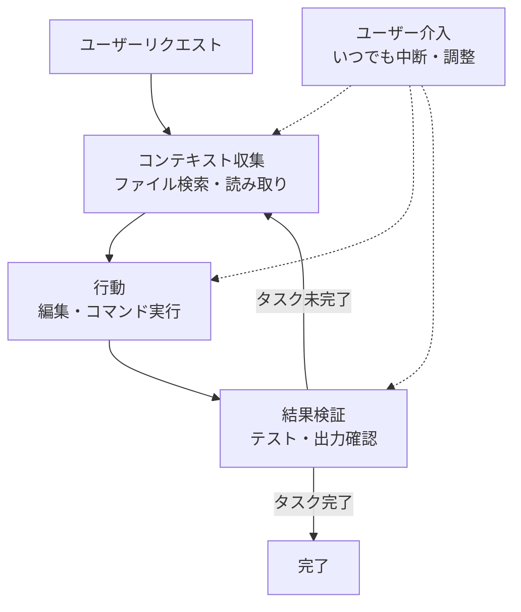

# 動作原理

Claude Code がコードを理解し、ツールを直接実行しながらタスクを完成させるエージェンティックループの動作原理を説明します。


**ひとことで言うと**: Claude Code は、推論するモデルと行動するツールを組み合わせ、「コンテキスト収集 → 行動 → 結果検証」を自ら繰り返すターミナルネイティブなコーディングエージェントです。


## Claude Code とは

Claude Code は **ターミナル** (terminal) で動作するエージェンティックなアシスタントです。コーディングに特に強いですが、コマンドラインでできることであれば、ドキュメント作成、ビルド実行、ファイル検索、トピックの調査まで幅広く手助けします。

中核となる概念は **エージェンティックハーネス** (agentic harness) です。Claude Code はモデルである Claude を包み込み、ツール、コンテキスト管理、実行環境を提供します。つまり、テキストを生成するだけだった言語モデルを、実際にコードベースを扱える有能なコーディングエージェントへと変える殻なのです。

## エージェンティックループ

タスクを任せると、Claude は 3 つの段階を経ます。これらの段階は明確に分かれているというより、互いに混ざり合いながら進みます。

```text
リクエスト → コンテキスト収集(gather context) → 行動(take action) → 結果検証(verify results) → 繰り返し
```

| 段階 | 行うこと |
|------|----------|
| **コンテキスト収集** (gather context) | ファイルを検索・読み取り、コード構造を把握する |
| **行動** (take action) | ファイルを修正したりコマンドを実行したりして変更を加える |
| **結果検証** (verify results) | テストを実行したり出力を確認したりして、作業が正しいか点検する |

ループはリクエストの性質に合わせて適応します。コードベースに関する質問はコンテキスト収集だけで終わることもあり、バグ修正は 3 つの段階を何度も循環し、リファクタリングは検証に大きな比重を置くことがあります。Claude は直前の段階で学んだことをもとに次の行動を決定し、数十もの動作をつなぎ合わせながら自ら方向を修正します。



ユーザーもこのループの一部です。いつでも作業を中断 (`Esc`) したり、止めずに修正メッセージを送って (`Enter`) 方向を変えたりできます。Claude は自律的に働きながらも、入力に反応し続けます。

## コア構成要素

エージェンティックループは、**推論するモデル** (model) と **行動するツール** (tools) という 2 つの軸で回ります。そこに、対話とファイルが収まるコンテキスト、そして行動を制御する権限が加わります。

### モデル

Claude Code は Claude モデルでコードを理解し、タスクを推論します。どの言語のコードでも読み取り、構成要素がどのように連結しているかを把握し、複雑なタスクは段階に分解して実行します。

| モデル | 特徴 |
|--------|------|
| Sonnet | ほとんどのコーディングタスクを無難にこなす |
| Opus | 複雑なアーキテクチャ判断に強い推論を提供する |

セッション中は `/model` コマンドで、起動時は `claude --model <name>` でモデルを切り替えます。

### ツール

ツールがあってこそ、Claude はテキスト応答を超えて実際に行動できます。標準ツールは大きく 5 つのカテゴリーに分かれます。

| カテゴリー | Claude ができること |
|------------|---------------------|
| **ファイル操作** (file operations) | ファイル読み取り、コード編集、新規ファイル作成、名前変更・再構成 |
| **検索** (search) | パターンでファイルを探す、正規表現で内容を検索、コードベースの探索 |
| **実行** (execution) | シェルコマンド実行、サーバー起動、テスト実行、git の利用 |
| **ウェブ** (web) | ウェブ検索、ドキュメント取得、エラーメッセージの参照 |
| **コードインテリジェンス** (code intelligence) | 編集後の型エラー・警告の確認、定義へのジャンプ、参照の検索 |

このほかにも、サブエージェントの生成やユーザーへの質問といったオーケストレーションツールがあります。各ツールの使用は新しい情報を返し、その情報が次の判断へとつながることこそがエージェンティックループです。

### コンテキスト

Claude は、ディレクトリで `claude` を実行した瞬間に次へアクセスします。

- **プロジェクト**: 現在のディレクトリとサブディレクトリのファイル (権限があればそれ以外のファイルも)
- **ターミナル**: ビルドツール、git、パッケージマネージャーなど、コマンドラインでできるすべての作業
- **git の状態**: 現在のブランチ、コミットされていない変更、最近のコミット履歴
- **`CLAUDE.md`**: 毎セッションで知っておくべきプロジェクト固有のルールと規約を記載するマークダウンファイル
- **自動メモリ** (auto memory): 作業しながら学習したパターンや好みを自動保存 (`MEMORY.md` の冒頭部分がセッション開始時にロードされる)
- **拡張機能**: 設定した MCP サーバー、スキル、サブエージェントなど

コンテキストウィンドウが満杯になった場合、Claude は自動的にコンテキストを圧縮します。圧縮時には、まず初期のツール呼び出し結果を整理し、次に残りの情報を要約する順序で進めます。また、MCP ツールの定義は明示的に要求されるまで遅延ロードされ、必要なツールのみが必要な時点でロードされます。

### 権限

行動を制御する権限モデルは、以下の [権限モデル](#権限-モデル) 節で扱います。

## 実行場所とインターフェース

エージェンティックループ、ツール、機能は、どこで使っても同じです。変わるのは **コードが実行される場所** と **やり取りする方法** です。

### 実行環境

| 環境 | コードの実行場所 | 用途 |
|------|------------------|------|
| **ローカル** (local) | 自分のコンピューター | デフォルト。ファイル・ツール・環境に完全アクセス |
| **クラウド** (cloud) | Anthropic 管理の VM | 作業の委任、ローカルにないリポジトリの作業 |
| **リモート制御** (remote control) | 自分のコンピューター、ブラウザから制御 | ウェブ UI を使いつつ、すべてをローカルに保持 |

### インターフェース

ターミナル、デスクトップアプリ、IDE 拡張機能 (VS Code・JetBrains)、`claude.ai/code` ウェブ、リモート制御、Slack、CI/CD パイプラインを通じてアクセスできます。インターフェースは見て扱う方法を変えるだけで、その下のエージェンティックループは同じです。

## セッションとコンテキストウィンドウ

Claude Code は作業中、対話を `~/.claude/projects/` 配下の JSONL ファイルとしてローカル保存します。おかげでセッションを巻き戻したり (rewind)、再開したり (resume)、分岐させたり (fork) できます。

- **セッションは独立**: 新しいセッションは空のコンテキストウィンドウで始まり、以前の対話履歴を引き継ぎません。セッションを越えて保持するには、自動メモリと `CLAUDE.md` を使います。
- **再開・分岐**: `claude --continue` や `claude --resume` は同じセッション ID で続け、`--fork-session` や `/branch` は履歴を新しいセッション ID にコピーします。

**コンテキストウィンドウ** (context window) には、対話履歴、ファイル内容、コマンド出力、`CLAUDE.md`、自動メモリ、ロード済みスキル、システム指示が収まります。作業が進んでコンテキストが埋まると、Claude は自動で圧縮 (compaction) しますが、このとき序盤の指示が消えることがあります。常に守るべきルールは対話履歴ではなく `CLAUDE.md` に置き、`/context` で何が場所を占めているかを確認します。

## チェックポイントと権限

Claude には 2 つの安全装置があります。ファイル変更を元に戻すチェックポイントと、確認なしに行える行動の範囲を定める権限です。

### チェックポイントで元に戻す

**すべてのファイル編集は元に戻せます。** Claude はファイルを編集する前に、現在の内容をスナップショットとして保存します。問題が起きたら `Esc` を 2 回押して以前の状態に巻き戻すか、元に戻すよう依頼すればよいだけです。

チェックポイントはセッションに限定され、git とは別物であり、扱うのはファイル変更だけです。データベース・API・デプロイのようにリモートに影響を与える行動は元に戻せないため、Claude は外部副作用のあるコマンドを実行する前に確認します。

### 権限モデル

`Shift+Tab` を押して権限モードを循環させます。

| モード | 動作 |
|--------|------|
| **デフォルト** (default) | ファイル編集とシェルコマンドの前に毎回確認 |
| **自動承認編集** (auto-accept edits) | `mkdir`・`mv` のような一般的なファイルコマンドと編集は確認せず実行し、残りのコマンドは確認 |
| **計画** (plan mode) | 読み取り専用ツールのみを使い、実行前に承認用の計画を作成 |
| **自動** (auto mode) | バックグラウンドの安全点検とともに、すべての行動を評価 (リサーチプレビュー) |

`.claude/settings.json` で特定のコマンドをあらかじめ許可しておけば、毎回確認されません。`npm test` や `git status` のような信頼するコマンドに便利で、設定は組織全体のポリシーから個人の好みまで範囲を定められます。

## 他のツールとの違い

Claude Code がインラインのコードアシスタントと異なる点は 2 つです。

- **ターミナルネイティブ** (terminal-native): コマンドラインでできるすべての作業、すなわちビルド・テスト・git・パッケージマネージャーを直接扱います。
- **大規模コードベース全体の認識**: 現在のファイルだけを見るのではなく、プロジェクト全体を見ます。「認証バグを直して」と言えば、関連するファイルを検索し、複数のファイルを読んでコンテキストを把握し、ファイルをまたいだ一貫した編集を行い、テストで検証し、依頼すればコミットまで行います。

## 関連ドキュメント

- [機能を一目で見る](/claude-code/foundations/features-overview)
- [MoAI-ADK とは?](/core-concepts/what-is-moai-adk)

## 参考資料

- [How Claude Code works](https://code.claude.com/docs/en/how-claude-code-works)
- [Extend Claude Code (Features overview)](https://code.claude.com/docs/en/features-overview)


複雑なタスクは、すぐにコードへ入るのではなく `Shift+Tab` を 2 回押して計画モードにし、まずコードベースを分析させましょう。計画を検討して整えてから実装させれば、最初の試みからより正確な結果が得られます。

