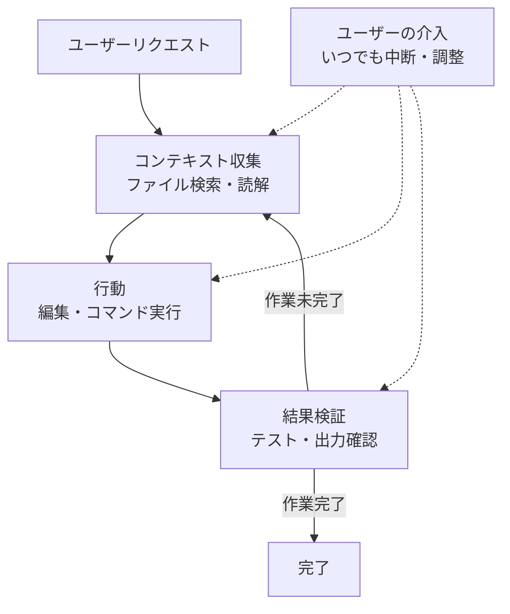

# 動作原理

Claude Code がコードを理解し、自らツールを実行しながら作業を完成させるエージェンティックループの動作原理を説明します。




**ひとことで言うと**: Claude Code は、推論するモデルと行動するツールを束ね、「コンテキスト収集 → 行動 → 結果検証」を自ら繰り返すターミナルネイティブのコーディングエージェントであり、MoAI-ADK の三本柱はすべてこのループの上に立っています。


## Claude Code とは何か

Claude Code は **ターミナル** (terminal) で動作するエージェンティックアシスタントです。コーディングに特に強いものの、コマンドラインでできることであれば、ドキュメント作成、ビルド実行、ファイル検索、トピック調査まで幅広く支援します。

中心となる概念は **エージェンティックハーネス** (agentic harness) です。ハーネスとは、基盤モデルを取り囲み実行を調律するシステム — モデルがどう考え計画するか、どのツールを呼ぶか、コンテキストをどう管理するか、成果物をどこに保存し結果をどう評価するかを決める層です。Claude Code はモデルである Claude を包み込み、ツール、コンテキスト管理、実行環境を提供することで、テキストを生成するだけだった言語モデルを、実際にコードベースを扱える有能なコーディングエージェントへと変えます。MoAI-ADK の言う「コードを直接書く代わりにエージェントがうまく働ける環境を設計する」というハーネスエンジニアリングは、まさにこの概念の延長線上にあります。

## エージェンティックループ

作業を任せると、Claude は 3 つの段階を経ます。これらの段階は明確に分かれるというより、互いに混ざり合いながら流れます。

```text
リクエスト → コンテキスト収集 (gather context) → 行動 (take action) → 結果検証 (verify results) → 繰り返し
```

| 段階 | すること |
|------|---------|
| **コンテキスト収集** (gather context) | ファイルを検索・読解してコード構造を把握 |
| **行動** (take action) | ファイルを修正したりコマンドを実行して変更を加える |
| **結果検証** (verify results) | テストを回したり出力を確認して作業が正しいか点検 |

ループはリクエストの性質に合わせて適応します。コードベースへの質問はコンテキスト収集だけで終わることもあり、バグ修正は 3 段階を何度も巡回し、リファクタリングは検証に多くの比重を置くこともあります。Claude は直前の段階で学んだことをもとに次の行動を決め、数十のアクションをつなぎながら自ら方向を補正します。


```mermaid
flowchart TD
    A[ユーザーリクエスト] --> B[コンテキスト収集<br/>ファイル検索・読解]
    B --> C[行動<br/>編集・コマンド実行]
    C --> D[結果検証<br/>テスト・出力確認]
    D -->|作業未完了| B
    D -->|作業完了| E[完了]
    F[ユーザーの介入<br/>いつでも中断・調整] -.-> B
    F -.-> C
    F -.-> D
```

ユーザーもこのループの一部です。いつでも作業を中断 (`Esc`) したり、止めずに修正メッセージを送って (`Enter`) 方向を変えられます。Claude は自律的に働きながらも、入力に反応し続けます。

## 主要コンポーネント

エージェンティックループは、**推論するモデル** (model) と **行動するツール** (tools) という 2 つの軸で回ります。ここに、会話とファイルが収まるコンテキスト、そして行動を統制する権限が加わります。

### モデル

Claude Code は Claude モデルでコードを理解し、作業を推論します。どの言語のコードでも読み取り、構成要素がどうつながっているかを把握し、複雑な作業は段階に分割して実行します。

| モデル | 特徴 |
|------|------|
| Sonnet | 大半のコーディング作業を無理なく処理 |
| Opus | 複雑なアーキテクチャ決定に強い推論を提供 |

セッション中は `/model` コマンドで、起動時は `claude --model <name>` でモデルを切り替えます。

### ツール

ツールがあってこそ、Claude はテキスト応答を超えて実際に行動できます。基本ツールは大きく 5 つのカテゴリに分かれます。

| カテゴリ | Claude ができること |
|------|------------------------|
| **ファイル操作** (file operations) | ファイル読み取り、コード編集、新規ファイル作成、リネーム・再構成 |
| **検索** (search) | パターンでファイルを探す、正規表現で内容を検索、コードベースを探索 |
| **実行** (execution) | シェルコマンド実行、サーバー起動、テスト実行、git の使用 |
| **ウェブ** (web) | ウェブ検索、ドキュメント取得、エラーメッセージの調査 |
| **コードインテリジェンス** (code intelligence) | 編集後の型エラー・警告確認、定義へ移動、参照検索 |

このほかにも、サブエージェント生成やユーザーへの質問といったオーケストレーションツールがあります。各ツールの使用は新しい情報を返し、その情報が次の決定につながる — これこそがエージェンティックループです。

### コンテキスト

ディレクトリで `claude` を実行した瞬間、Claude は次にアクセスします。

- **プロジェクト**: カレントディレクトリと配下のファイル (権限があればその外のファイルも)
- **ターミナル**: ビルドツール、git、パッケージマネージャなど、コマンドラインでできるすべての作業
- **git の状態**: 現在のブランチ、未コミットの変更、直近のコミット履歴
- **`CLAUDE.md`**: 毎セッション知っておくべきプロジェクト固有のルールと慣習を収めるマークダウンファイル
- **自動メモリ** (auto memory): 作業しながら学んだパターンや好みを自動保存 (`MEMORY.md` の冒頭部分がセッション開始時にロード)
- **拡張機能**: 設定した MCP サーバー、スキル、サブエージェントなど

コンテキストウィンドウが満杯になると、Claude は自動的にコンテキストを圧縮します。圧縮時は、まず序盤のツール呼び出しの結果を整理し、次に残りの情報を要約する順で進みます。また MCP のツール定義は明示的に要求されるまで遅延され、必要なツールだけが必要なタイミングでロードされます。

### 権限

行動を統制する権限モデルは、下の [権限モデル](#権限モデル) 節で扱います。

## 実行場所とインターフェース

エージェンティックループとツール、機能はどこで使っても同じです。変わるのは **コードが実行される場所** と **対話する方法** です。

### 実行環境

| 環境 | コードの実行場所 | 用途 |
|------|----------------|------|
| **ローカル** (local) | 自分のコンピュータ | デフォルト。ファイル・ツール・環境へ完全アクセス |
| **クラウド** (cloud) | Anthropic 管理の VM | 作業の委任、ローカルにないリポジトリの作業 |
| **リモートコントロール** (remote control) | 自分のコンピュータ、ブラウザから制御 | Web UI を使いつつすべてをローカルに保持 |

### インターフェース

ターミナル、デスクトップアプリ、IDE 拡張 (VS Code・JetBrains)、`claude.ai/code` ウェブ、リモートコントロール、Slack、CI/CD パイプラインからアクセスできます。インターフェースは見え方と操作方法を変えるだけで、その下のエージェンティックループは同じです。

## セッションとコンテキストウィンドウ

Claude Code は作業中の会話を `~/.claude/projects/` 配下の JSONL ファイルとしてローカル保存します。そのおかげで、セッションを巻き戻したり (rewind)、続けたり (resume)、分岐 (fork) できます。

- **セッションは独立**: 新しいセッションは空のコンテキストウィンドウで始まり、以前の会話履歴を引き継ぎません。セッションを越えて維持するには、自動メモリと `CLAUDE.md` を使います。
- **継続・分岐**: `claude --continue` や `claude --resume` は同じセッション ID でつなぎ、`--fork-session` や `/branch` は履歴を新しいセッション ID へコピーします。

**コンテキストウィンドウ** (context window) には、会話履歴、ファイル内容、コマンド出力、`CLAUDE.md`、自動メモリ、ロードされたスキル、システム指示が収まります。作業が進みコンテキストが満ちてくると Claude が自動的に圧縮 (compaction) しますが、その際に序盤の指示が失われることがあります。常に守るべきルールは会話履歴ではなく `CLAUDE.md` に置き、`/context` で何が場所を占めているかを確認します。

## チェックポインティングと権限

Claude には 2 つの安全装置があります。ファイル変更を元に戻すチェックポインティングと、確認なしで実行できる行動の範囲を定める権限です。

### チェックポインティングで元に戻す

**すべてのファイル編集は元に戻せます。** Claude はファイルを編集する前に現在の内容をスナップショットとして保存します。問題が起きたら `Esc` を 2 回押して以前の状態へ巻き戻すか、元に戻すよう依頼すればよいのです。

チェックポインティングはセッション内に限定され、git とは別物で、扱うのはファイル変更のみです。データベース・API・デプロイのようにリモートへ影響する行動は元に戻せないため、Claude は外部副作用のあるコマンドを実行する前に確認を求めます。

### 権限モデル

`Shift+Tab` を押して権限モードを循環させます。

| モード | 動作 |
|------|------|
| **デフォルト** (default) | ファイル編集とシェルコマンドの前に毎回確認 |
| **編集の自動承認** (auto-accept edits) | `mkdir`・`mv` のようなよくあるファイルコマンドと編集は確認なしで実行、その他のコマンドは確認 |
| **プランモード** (plan mode) | 読み取り専用ツールのみを使い、実行前に承認すべき計画を作成 |
| **オートモード** (auto mode) | バックグラウンドの安全チェックとともにすべての行動を評価 (リサーチプレビュー) |

`.claude/settings.json` で特定のコマンドを事前に許可すれば、毎回確認されません。`npm test` や `git status` のように信頼するコマンドに有用で、設定は組織全体のポリシーから個人の好みまでスコープを定められます。

## 他のツールとの違い

Claude Code がインラインのコードアシスタントと異なる点は 2 つです。

- **ターミナルネイティブ** (terminal-native): コマンドラインでできるすべての作業、つまりビルド・テスト・git・パッケージマネージャを直接扱います。
- **大規模コードベース全体の認識**: 現在のファイルだけでなくプロジェクト全体を見ます。「認証バグを直して」と言えば、関連ファイルを検索し、複数ファイルを読んでコンテキストを把握し、ファイルをまたぐ一貫した編集を行い、テストで検証し、依頼すればコミットまで行います。

## MoAI-ADK とのつながり — ループの上に立つ三本柱

このページで見たエージェンティックループは、MoAI-ADK の三本柱の共通土台です。

- **トークノミクス**: ループが回るたびにコンテキストとトークンが消費されます。MoAI-ADK は作業段階ごとに適したモデルと推論の深さを割り当て、コンテキストをダイエットし、予算をシステムに守らせることで、同じループをより少ないコストで回します。
- **エージェンティックループエンジニアリング**: 「コンテキスト収集 → 行動 → 結果検証」の繰り返しを人が毎回見守る代わりに、完了条件 (`/goal`) と診断ループ (`/moai loop`) でループ自体を設計対象にします。
- **エージェンティックハーネス**: 権限モデル、CLAUDE.md、ツール構成といったこのページの要素こそがハーネスの部品です。MoAI-ADK はこの部品の上に SPEC ワークフローとエージェントカタログを載せます。

## 関連ドキュメント

- [機能ひとめぐり](/claude-code/foundations/features-overview)
- [MoAI-ADK とは?](/core-concepts/what-is-moai-adk)

## 参考資料

- [How Claude Code works](https://code.claude.com/docs/en/how-claude-code-works)
- [Extend Claude Code (Features overview)](https://code.claude.com/docs/en/features-overview)


複雑な作業はいきなりコードに入るのではなく、`Shift+Tab` を 2 回押してプランモードで先にコードベースを分析させましょう。計画をレビューして磨いてから実装させると、最初の試行からより正確な結果が得られます。

